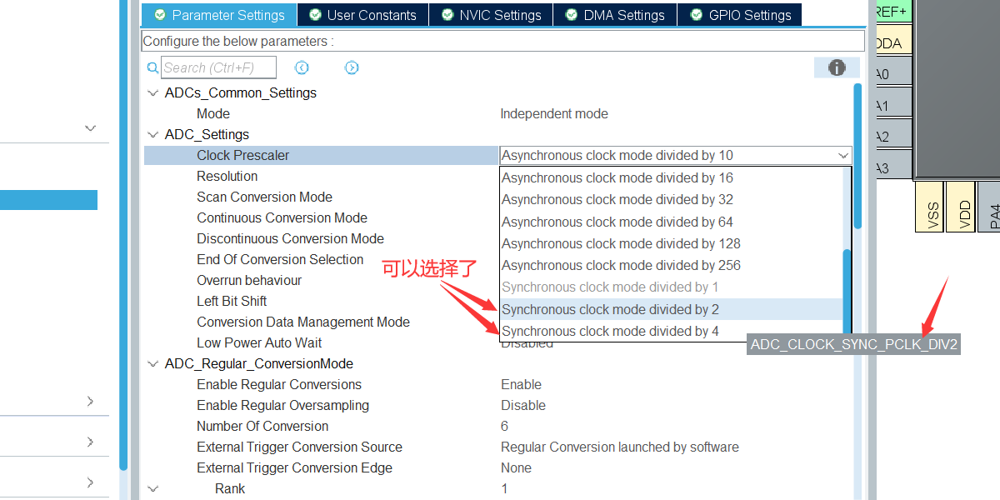
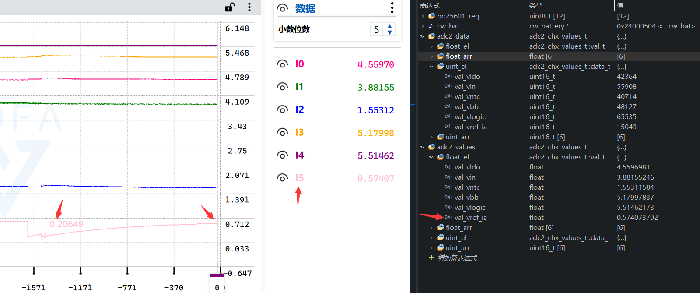
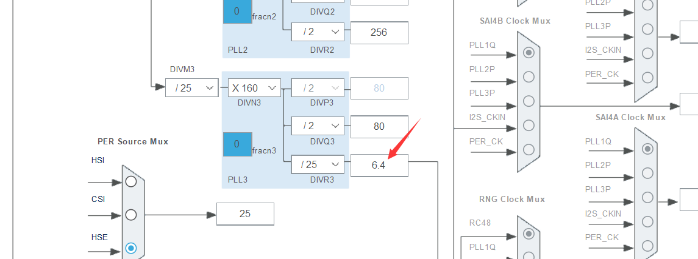
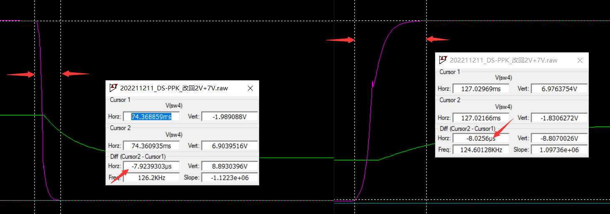
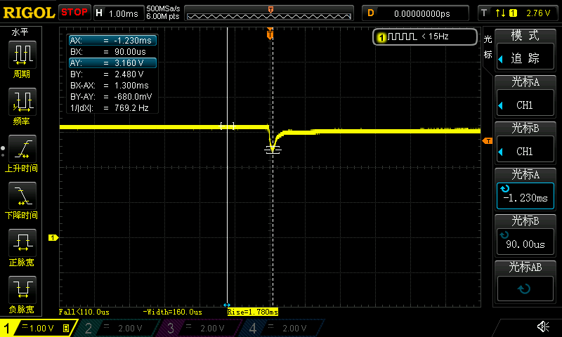
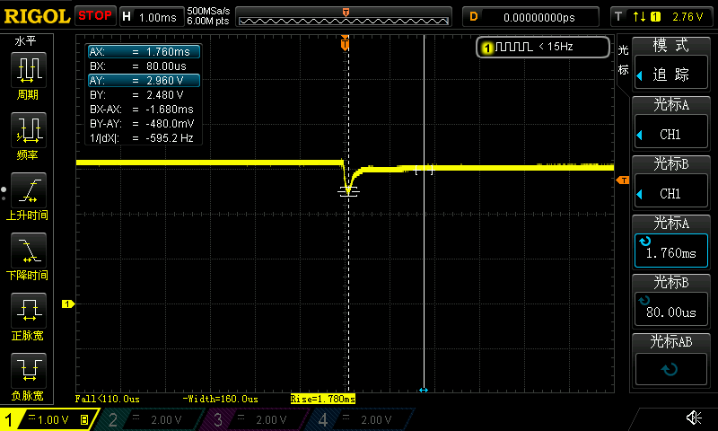
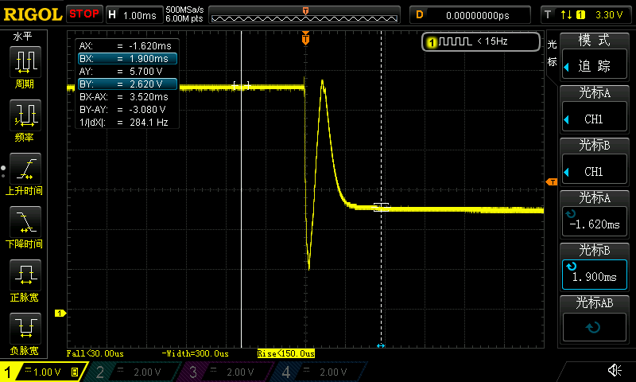
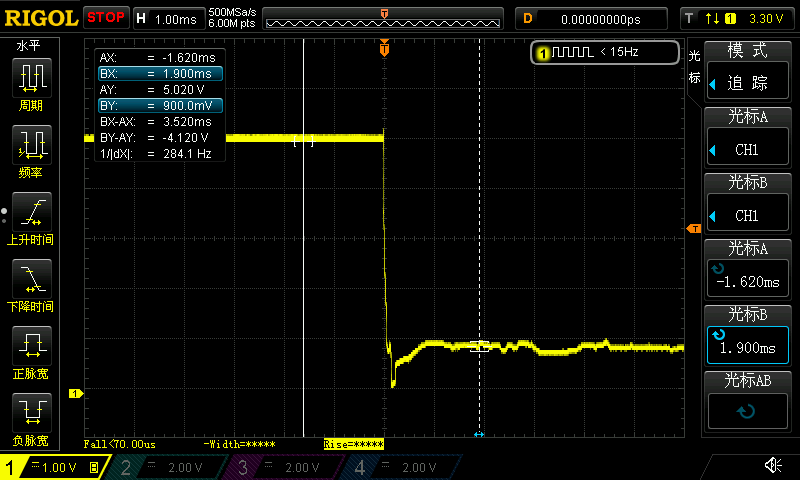

## DS-PPK_ANALOG_01

在 DS-PPK_CW2015_01 基础上修改

>已支持的：USB VCP、HC4051、BQ25601、CW2015
>
>待加入的：HC138按键读取，ADC+DAC+PID 闭环控制VLOGIC 和 VLDO 的输出电压，自动量程换挡

## SMU

### 命令开关

USB发送命令 A+SMU_TURN_ON 或 A+SMU_TURN_OFF 来打开或关闭 TPS65131、TPS63020、TPS7A8300电源芯片，上电默认关闭

## VREF+

使用外部2.5V基准REF5025，CubeMX 里 VREFBUF 选择External voltage reference 后就OK

## ADC2

### 参考

- armfly v7 BSP 第44章 STM32H7 的ADC基础知识和HAL 库 API

  > 

- armfly v7 BSP 第46章 STM32H7 的ADC应用之DMA方式多通道采样

  > 配置 PLL2 时钟为的 72MHz，方便分频产生 ADC 最高时钟 36MHz
  >
  > >  25 / 25 * 504 / 7 = 72

- [梳理STM32H743的ADC在CubeMX上的配置](https://bbs.21ic.com/icview-3161602-1-1.html)

  > ### 同步时钟 异步时钟？
  >
  > 4.1.1、Clock Prescaler（时钟预分频）
  > 目的是让ADC的工作频率达到36M（ADC工作频率超过36M会不稳定）。异步时钟模式（基于PLL2P时钟）可以选择Asynchronous clock mode divided by 1，2，4，6，8，10，12，16，32，64，128，256，同步时钟模式（基于AHB时钟）可以选择Synchronous clock mode divided by 1，2，4。在上面的时钟配置上，adc_ker_ck的时钟频率为70M，所以使用Asynchronous clock mode divided by 2就能让ADC的工作频率为36M。
  >
  > 配置ADC的时钟源adc_ker_ck的频率为72M。有了72M的时钟源，ADC1，ADC2，ADC3就能经过异步时钟模式2分频得到36M的最高的工作频率
  >
  > *ADC*的*时钟*分频：通过对AHB总线的*时钟*信号进行分频得到的*时钟*即为*同步时钟*，直接对系统*时钟*进行分频得到*ADC时钟*即为异步*时钟*
  >
  > 同步时钟模式任何选项都会让ADC的工作频率超过36M。STM32H743的时钟频率是480M，所以AHB时钟频率是240M。就算选择Synchronous clock mode divided by 4， ADC的工作频率也超过36M（240M/4 = 60M）。那么同步时钟模式就那么没有使用的价值吗？查看官方手册，同步模式的优点在于ADC与定时器都基于AHB时钟，那么定时器触发定时器时，ADC的同步触发能更加精确。
  >
  > CubeMX实测ADC2要用同步时钟代价好大啊，除CPU，所有外设时钟都得一起降低。。。
  >
  > |  |  |
  > | ----------------------------------------- | ---------------------------------------------- |
  >
  > 算了还是用异步时钟

### 配置

仅6个规则通道循环采集 + DMA循环，无注入通道

以下几个参数要配置CubeMX时要特别注意一下，出处：第44章 STM32H7 的ADC基础知识和HAL 库 API

> ```c
> AdcHandle.Init.ConversionDataManagement = ADC_CONVERSIONDATA_DMA_CIRCULAR; /* DMA 循环模式接收 ADC 转换的数据 */
> AdcHandle.Init.BoostMode = ENABLE; /* ADC 时钟超过 20MHz 的话，使能 boost */ 
> AdcHandle.Init.Overrun = ADC_OVR_DATA_OVERWRITTEN; /* ADC 转换溢出的话，覆盖 ADC 的数据寄存器 */
> ```
>
> ## ConversionDataManagement
>
> 此参数成员用于ADC采集数据的管理，具体支持的参数如下：
>
> ```c
> /** @defgroup ADC_ConversionDataManagement ADC Conversion Data Management
>   * @{
>   */
> #define ADC_CONVERSIONDATA_DR    ((uint32_t)0x00000000)  					  // 可以存到ADC的DR寄存器
> #define ADC_CONVERSIONDATA_DFSDM               ((uint32_t)ADC_CFGR_DMNGT_1)    	//传输给DFSDM                 
> #define ADC_CONVERSIONDATA_DMA_ONESHOT         ((uint32_t)ADC_CFGR_DMNGT_0)     // DMA单次传输数据到指定地址
> #define ADC_CONVERSIONDATA_DMA_CIRCULAR        ((uint32_t)(ADC_CFGR_DMNGT_0 | ADC_CFGR_DMNGT_1)) //DMA循环模式传输数据到指定地址
> ```
>
> 使用此参数成员注意以下问题：
>
> 如果参数成员ContinuousConvMode配置为连续转换模式（即 ADC_CONVERSIONDATA_DMA_CIRCULAR），那么DMA必须配置为循环模式，否则会造成DMA传输溢出
>
> 运行时修改：仅当规则通道上没有后续的转换时才可以修改此参数（即ADC禁止的情况下或者ADC单次转换模式，又或者无外部触发）
>
> ## BoostMode
>
> 用于设置ADC的BOOST模式，当ADC的时钟**高于20MHz**时，必须使能此位
>
> ## Overrun
>
> 用于配置ADC转换数据未及时读取，造成溢出时的处理，可以选择继续保留上次转换的数据，也可以选择新转换的数据覆盖，具体支持的参数如下：
>
> ```c
> #define ADC_OVR_DATA_PRESERVED        ((uint32_t)0x00000000)      
> #define ADC_OVR_DATA_OVERWRITTEN       ((uint32_t)ADC_CFGR_OVRMOD)  
> ```
>
>
> 使用此参数成员注意以下问题：
>
>  此参数**仅可用于规则通道**。
>
>  如果此参数设置为保留上次转换的数据（即 ADC_OVR_DATA_PRESERVED ），并在HAL_ADC_Start_IT()的中断服务程序里面去的清除转换结束标志，会导致保存的数据被释放。针对这种情况，用户可以在中断服务程序的回调函数HAL_ADC_ConvCpltCallback里面保存转换的数据（此回调函数是在清除转换结束标志前调用）。
>
> 如果ADC转换采用查询或者中断方式且此参数被设置为保留上次转换的数据，会产生错误报告。此参数设置为覆盖方式，那么用户不读取数据时，不会被视为溢出错误
>
> **如果ADC转换采用DMA方式，不管此参数配置为何种方式，都会报告溢出错误**（因为**DMA需要处理所有转换的数据**）
>
> > 备注：CubeMX 默认OversamplingMode 是 ADC_OVR_DATA_PRESERVED，若使用DMA，则此参数不用管
>
> ## LeftBitShift
>
> 用于设置ADC转换结果的左移位数，使用或者没有使用过采样的情况下，都可以使用此参数，支持1-15位左移
>
> > 备注：DS-PPK合成数据帧时可以设置12bit模式下左移4位，即 aaaa,aaaa,aaaa,0000，这样H7将其与自动量程的 0000,vvvv合成16bit数据帧时，就不用CPU进行移位运算，直接&运算就行，得到 aaaa,aaaa,aaaa,vvvv

### 时钟

DS-PPK ADC2负责轮询采集多个通道数据，这些通道的RC滤波器带宽 350Hz 左右，配置 ADC采样频率为 5倍以上带宽，即2KHz，采样时间给最大的810.5cycles，转换时间 = 采样时间 + 逐次逼近时间 = 810.5 + 8.5(16bit) = 820cycles，那么ADC2时钟 = 820 x 2KHz = 1.640MHz，时钟源钟不取72MHz，取64MHz方便二进制：

```c
64 MHz / 6 PSC / 820 Cycles / 6 CHx = 2.168KHz（因为有6个通道所以除以6）
```

### 测试

万用表测量DAC后VREF_IA会降低到0.2V，之后慢慢升到0.5V以上，推测是IA_OFFSET对应 DAC_OUT1 引脚还未使能处于开漏，导致DAC输出接的100nF电容慢慢充电所致，万用表测量的瞬间从100nF电容汲取电流，电容放电，VREF_IA 降低



## ADC1、ADC3

各采集一路差分通道，需要用同一个定时器触发ADC1和ADC2的转换

ADC采样频率不再与其自身循环采集相关（即 配置参数自动转换 ContinuousConvMode 由 ADC2 的ENABLE 变为 DISABLE），而是由定时器事件控制，这里选择 LPTIM2

### 参考

- armfly v7 BSP 第45章 STM32H7 的ADC应用之定时器触发配 合DMA双缓冲

### 配置

ADC转换时间需要小于 LPTIM2_OUT 周期，这样 DMA 搬运数据的频率才能和 LPTIM2_OUT 一样，保持同步

> ~~看一个数据从TIM信号产生到DMA传输完成的周期，即LPTIM->ADC转换->DMA搬运，TIM信号产生到DMA传输完成有滞后时间，如果用DMA半满或满中断的时间戳去反推缓冲区内某一ADC数据的时间戳，那么计算出的时间戳与控制该数据采集的TIM信号的时间戳有滞后，最大是滞后时间小于LPTIM2_OUT 周期（在1Gsa/s的示波器上搞信号触发对齐时基线时这个滞后时间在对齐信号时可能是需要补偿的？）~~
>
> 对于DS-PPK，只有100Ksa/s，最大滞后时间只有10us，问题不大，暂不考虑滞后补偿，考虑的话得再记录一下LPTIM OUT 事件开始，半满，完成DMA，对应的时间戳，当然这个时间戳不能用systick，1ms的粒度太粗糙了，得再开一个32bit定时器做 0.1us时间步进做时间戳，32bit是0 到+ 4 294 967 29.4us，429.4秒就溢出，约1.19小时，H7进出中断最快12.5MHz，周期0.08us

ADC1

> 64 MHz / 8 DIV / 100 KHz = 80cycles
>
> ADC空转周期 = 90 - 64.5 - 8.5 = 7cycles
>
> （差分模式只是输入为差分双端，转换速度按照1个通道计算）
>
> ```c
> AdcHandle.Init.ScanConvMode      = ADC_SCAN_DISABLE;         /* 禁止扫描，因为仅开了一个通道 */
> AdcHandle.Init.ContinuousConvMode  = DISABLE;               /* 禁止自动转换，采用的定时器触发转换 */
> ```
>
> DMA优先级：very high

ADC3

> 与ADC1一样，除了DMA优先级改为：high

LPTIM

> 将USB时钟源从PLL3Q 改为 RC48，PLL3提供1.28MHz PLL3R 给LPTIM1 做时钟源
>
> 
>
> LPTIM 的 PSC 和 ARR 的乘积要等于时钟源，PSC只支持3bit分频（1、2、4、8、16、32、64、128），ARR范围 0~65535，那么最慢的采样频率上下限：
>
> - 最慢取整：6.4MHz / 128PSC / 50000ARR = 1Hz
>
> - 最快：6.4MHz / 1PSC / 2ARR = 3.2MHz
>
> - 标准：6.4MHz / 1PSC / 64ARR = 100KHz
>
> - 其他：
>
>   > | PSC  | ARR  | Hz    |
>   > | ---- | ---- | ----- |
>   > | 1    | 64   | 100K  |
>   > | 1    | 80   | 80K   |
>   > | 1    | 100  | 64K   |
>   > | 1    | 125  | 51.2K |
>   > | 1    | 1250 | 5.12K |

### 测试

DMA缓冲区开 1000 个样本，，ADC1和ADC3共用触发源LPTIM定时器频率 1000KHz

```c
[12:28:22.447] VDOUT: 4.391199		//ADC3
[12:28:22.447] IA_SE_OUT: 0.547756	//ADC1
```

## SW1~4

PA0、PA1、PA2、PA3 配置 EXTI0、EXTI1、EXTI2、EXTI3，触发边沿都是双沿触发，中断优先级配置为一样的优先级1，在其中断函数内不使用FreeRTOS API

自动量程切换速度下降和上升时间仿真8us左右 vs H750 进出中断速度 12.5MHz 80ns，H74的进出中断速度比换挡快100倍，绰绰有余



## DAC

### 配置

触发参数为 SOFTWARE，即软件触发模式，但要注意每次 HAL_DAC_SetValue() 还要调用 HAL_DAC_Start() 使能才能反映到DAC输出 

参考：[ADC和DAC——跟我一起写STM32第九期](https://zhuanlan.zhihu.com/p/599754496)

> software不等于None： 如果是None, 那么不需要其他任何的触发源，直接`HAL_DAC_SetValue()`设置DAC的值,就可以设定输出电压的大小。如果使用了软件触发，那么，每次在使用`HAL_DAC_SetValue()`修改输出电压后，还需要调用使能,目的是使能软件触发。由于：软件触发是硬件在一个APB1时钟周期后自动关断的，于是，每次修改输出电压的值后，都要调用软件使能的方法，才能生效。
>
> 可以参考： [DAC 使用软件触发，无电压输出](https://link.zhihu.com/?target=https%3A//shequ.stmicroelectronics.cn/thread-619723-1-1.html) [STM32_DAC之软件触发（Trigger）](https://link.zhihu.com/?target=https%3A//www.cnblogs.com/cjyc/p/6656853.html)

## INA

增益

由于DS-PPK2电路的仪放输入端接采样电阻两端，且仅支持单向电流检测，那么仪放测量的是单端V+信号，根据仪放的电阻网络，可以算出增益为：


注意差分放大器的两侧电阻上下两两相等，但左右不是两两相等，所以输出级的增益是2（即20K/10K)，则总增益为
$$
\\G=(1+\frac{40kΩ}{4.12kΩ})\cdot(\frac{20K}{10K})≈21.41776
$$
21.41776

## 校准量程 | 粗算

校准测试，5.0V下，VDOUT处于全程满偏：5.000226，MUX_FUN_CAL_RES_500mR禁用，因为5V下直接10A短路了


$$
测量电路的MOS内阻+PPTC = NMOS_{CJAE2002} + PMOS_{YJQ1216} + NMOS_{SI2302} \\= 5mR + 20mR + 85mR + 75mR \\ = 185mR
$$
简化计算取 200mR，G = 21.41776

| MUX_FUN                                                      | RES_50R     | RES_500R    | RES_5KR     | RES_50KR    | RES_500KR   |
| ------------------------------------------------------------ | ----------- | ----------- | ----------- | ----------- | ----------- |
| VLDO                                                         | 5.009~5.019 | 5.008~5.016 | 5.009~5.016 | 5.007~5.018 | 5.008~5.019 |
| SW1                                                          | 1           | 1           | 1           | 1           | 0           |
| SW2                                                          | 1           | 1           | 1           | 0           | 0           |
| SW3                                                          | 1           | 1           | 0           | 0           | 0           |
| SW4                                                          | 1           | 0           | 0           | 0           | 0           |
| VREF_IA                                                      | 0.0125      | 0.0125      | 0.0125      | 0.0125      | 0.0125      |
| IA_SE_OUT 差分模式<br />（误差较大暂不清除原因，以下采用单端计算） | 0.1663      | 0.2324      | 0.2297      | 0.2302      | 0.2310      |
| IA_SE_OUT 单端模式                                           | 0.1383      | 0.2249      | 0.2216      | 0.2223      | 0.2232      |
| IA_SE_OUT 万用表实测                                         | 134         | 226         | 222         | 223         | 224         |
| IA_SE_OUT  - VREF_IA                                         | 0.1258      | 0.2124      | 0.2091      | 0.2098      | 0.2107      |
| 采样电阻mV压降：(IA_SE_OUT - VREF_IA)/G x 1000               | 5.8736      | 9.9170      | 9.7630      | 9.7956      | 9.8376      |
| 采样电阻mV压降：万用表实测                                   | 5.7         | 10.0        | 9.9         | 9.9         | 9.9         |
| 采样电阻并联值                                               | 0.048R      | 0.908R      | 9.901R      | 99.099R     | 1.000KR     |
| 校准电流 ADC测的                                             | 122.4mA     | 10.92mA     | 0.986mA     | 98.84uA     | 9.838uA     |
| 回路电阻值 ADC测的                                           | 40.850      | 457.88      | 5071.0      | 50587       | 508233      |
| 回路电阻值 理论计算                                          | 50.248      | 501.11      | 5010.1      | 50099       | 501000      |
| 校准电流 理论计算                                            | 99.5mA      | 9.977mA     | 0.998mA     | 99.8uA      | 9.98uA      |

DS-PPK 并联等效采样电阻表

| 采样电阻 | 自动开关状态             | 并联等效电阻 | 电流档位     | 采样电阻压降 | 仪放最大输出电压 |
| -------- | ------------------------ | ------------ | ------------ | ------------ | ---------------- |
| 1K       | SW1-SW4关闭              | 1.000KR      | 0uA - 100uA  | 100.0mV      | 2.005V           |
| 110R     | SW1打开，SW2-SW4关闭     | 99.099R      | 100uA - 1mA  | 99.1mV       | 1.987V           |
| 11R      | SW1-SW2打开，SW3-SW4关闭 | 9.901R       | 1mA - 10mA   | 99.0mV       | 1.985V           |
| 1.1R     | SW1-SW3打开，SW4关闭     | 0.908R       | 10mA - 100mA | 90.8mV       | 1.820V           |
| 0.05R    | SW1-SW4打开              | 0.048R       | 10mA - 2A    | 96mV         | 1.925V           |

## 0~100uA档误差 | 粗算

这是DS-PPK能测量的最低电流挡位，说实话写到这里我心里很没底，不知道切换到这档时测量电路自身漏电流导致的电流初始误差是多少，可以说这个档位的误差决定了电路的成败

打开输出MOS

```
IA_SE_OUT: 0.022381
IA_SE_OUT: 0.022278
```

取 0.0223

关闭输出MOS

```
IA_SE_OUT: 0.023144
IA_SE_OUT: 0.023125
```

取 0.0231

| 0.0223 - 0.0231 | = 0.0008 V = 0.8mV

0~100uA档是 1KR 采样电阻 ，输出MOS 后的 opa2141 等电路漏电流引起的测量电流误差 = 0.8mV / 21.41776 / 1000R = **0.037uA**

0~100uA不接负载，测量电路自身的漏电流 = ( IA_SE_OUT -  vref_ia ) / Gain  / R = 0.022591V - 0.012321V ) /  21.41776 / 1K = 0.01027V / 21.41776 / 1K = **0.479uA**

预计0~100uA测负载对象时的有效精度可以控制在1uA，电路的漏电流控制还算很成功，长舒一口气

## 测电阻

输出 5V

### 1.01MR

理论：4.95uA

0~100uA 档位测量：( IA_SE_OUT - 100uA空载IA_SE_OUT - VREF_IA ) / G / R = ( 0.120417 - 0.02234V - 0.0130V ) / 21.41776 / 1K = 0.085078 / 21.41776 / 1K = 3.97uA

误差：0.98uA

### 672R

理论：7.44mA

0~10mA档位 测量：( IA_SE_OUT - VREF_IA ) / G / (R采样+R回路)= ( 1.561V - 0.013V ) / 21.41776 / (9.901+0.2R)  = 7.16mA

可以看出需要差值校准

## 输出短路

输出短路后保持短路DVDD3V3的电压波动

|  |  |
| ---------------------------------------------------- | ---------------------------------------------------- |

此 500us 不到的波动最低使 DVDD_3V3 拉低到2.48V，会使USB断连，但1ms不到就能被 TPS7A8001调节回 2.96V

VBB和VLDO的VLDO电压波动

|  |  |
| ----------------------------------------------- | ------------------------------------------------ |

H750 不会触发复位，短路后保持短路可以继续连上 USB，DAC、ADC的值都是和短路前一样

设置VLDO 5V时

保持短路的输出数据：可以看到 VLDO = 0.254V， VBB = 1.883V，输入共模 0.254V 低于仪放正常工作范围，此时由仪放输出电压计算的mA无参考意义

```c
[11:59:42.910] [adc2 values] 0.758156, 3.199219, 0.965881, 1.883443, 5.488199, 0.004845
[11:59:42.910] [VDOUT] 0.254661
[11:59:42.939] [IA_SE_OUT] 1.524968
[11:59:42.939] mA: 1491.213867
```

取消短路后：可以看到 VLDO =5.000V， VBB = 5.550V

```c
[12:00:22.909] [adc2 values] 5.006261, 3.994303, 1.357040, 5.550446, 5.489041, 0.009727
[12:00:22.909] [VDOUT] 5.000153
[12:00:22.938] [IA_SE_OUT] 0.022580
[12:00:22.938] mA: 0.000600
```

## 内部外部供电切换

开机默认是 MUX_FUN_NC，使用内部锂电池

```c
[12:30:58.839] [adc2 values] 5.014764, 3.887454, 1.456146, 5.550876, 5.488620, 0.009727
[12:30:58.839] [VDOUT] 5.000153
[12:30:58.868] [IA_SE_OUT] 0.140715
[12:30:58.868] mA: 128.496353
```

发送切换命令，MUX_FUN_DPDT_7222_S

```c
[12:30:58.953] MUX_FUN_DPDT_7222_S
[12:30:58.954] Set mux sLinesCode: 2
```

切换外部锂电池

```c
[12:31:12.838] [adc2 values] 5.004108, 3.912934, 1.464844, 5.550768, 5.490892, 0.009727
[12:31:12.838] [VDOUT] 3.676870
[12:31:12.868] [IA_SE_OUT] 1.629000
[12:31:12.868] mA: 76.368103
```

