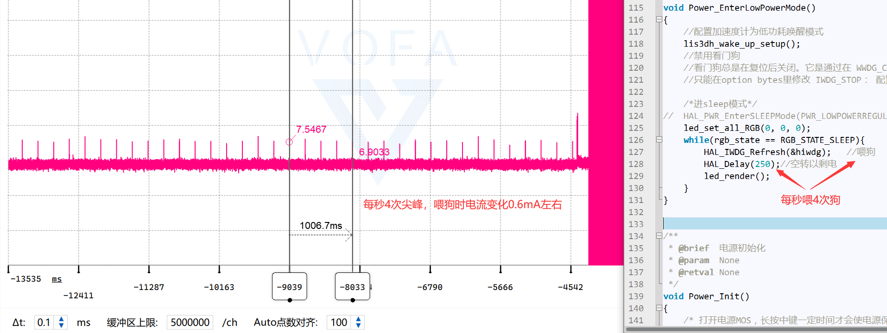
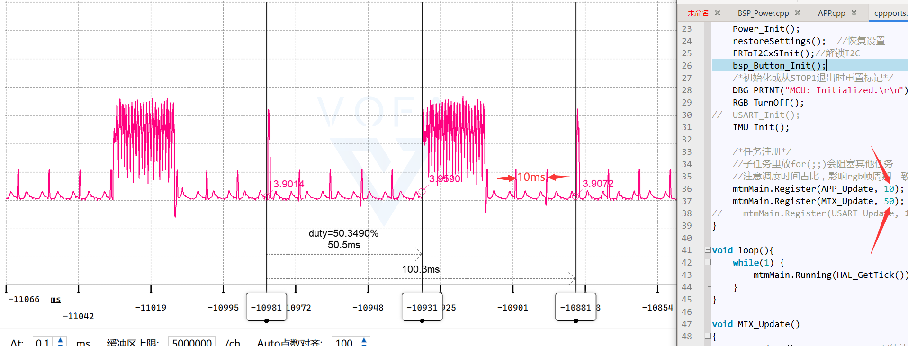
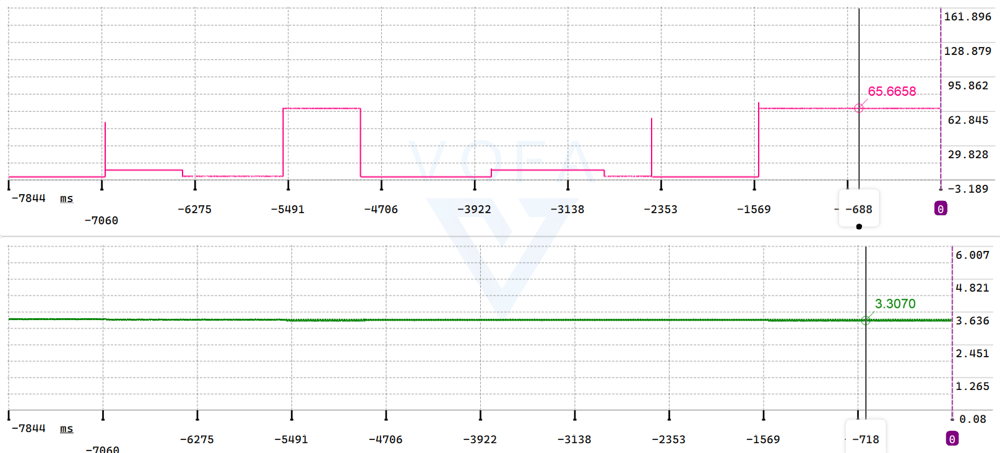
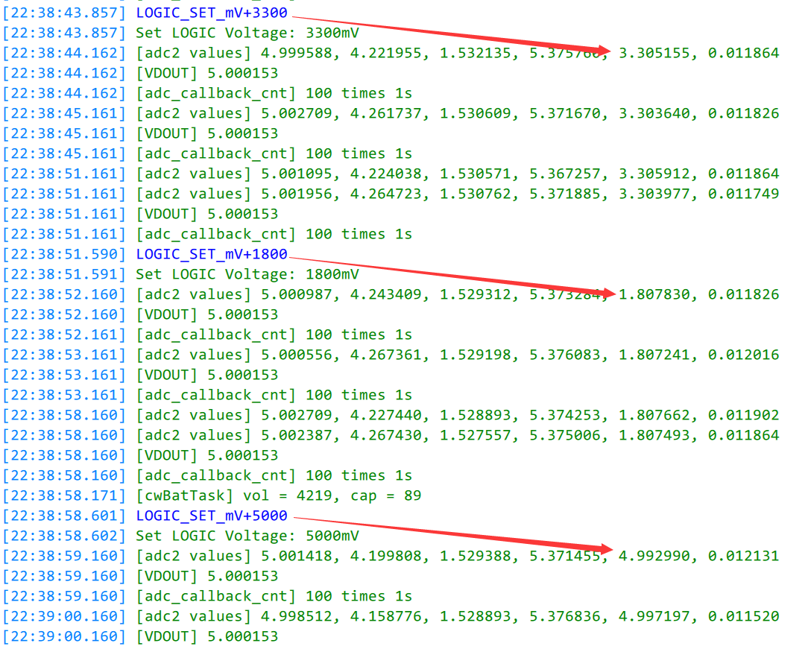
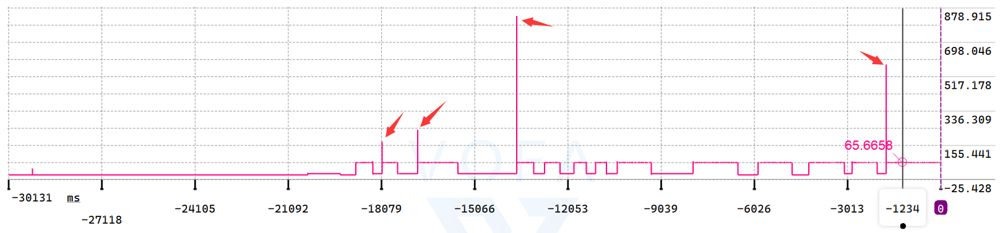

## DS-PPK_ANALOG_02

## 关于

在 DS-PPK_ANALOG_01 基础上修改

>目标：每秒合成 100K 32bit 协议数据帧

## 时间戳

### 预防时间戳的概念混淆

[wikipedia：Timestamp](https://en.wikipedia.org/wiki/Timestamp)

> **时间戳**是标识特定事件发生时间的字符序列或编码信息，通常给出日期和时间，有时精确到秒的一小部分。然而，**时间戳不必基于一些绝对的时间概念。它们可以有任何纪元，可以相对于任何任意时间，例如系统的开机时间，或过去的某个任意时间。**

### 通过时间戳对齐双缓冲区数据

在DS-PPK源码中，ADC采样率为100KHz，为了保证CPU处理ADC的数据时不会被新的采样数据篡改，使用DMA双缓冲模式，但该模式也带来了问题：

> 比如处理ADC缓冲区的任务正在处理ADC的前一半缓冲区，与此同时，DMA正在将ADC采样的数据填充到后一半缓冲区，与此同时，自动换挡中断随时可能发生，一旦发生自动换挡，CPU进入GPIO外部中断回调函数记录量程，可这个量程对应的却是ADC后一半缓冲区数据中的某段数据，而CPU正在处理ADC的前一半缓冲区，所以，这就需要对量程数据也开双缓冲

仅仅对量程数据开双缓冲还不够，为了知道某个量程数据究竟对应ADC缓冲区数据的哪一个数据，还需要引入时间戳：

> - 量程时间戳：
>
>   > 换挡触发GPIO外部中断的回调函数，除了记录量程时，还要记录该量程对应的时间戳
>
> - ADC传输中断时间戳
>
>   > ADC DMA半传输中断和传输完成中断的回调函数，除了通知处理ADC缓冲区的任务应该处理前半还是后半，还要记录该回调函数对应缓冲区的时间戳

注意：量程时间戳、ADC传输中断时间戳，都需要开双缓冲

那么处理ADC缓冲区的任务就可以通过双缓冲时间戳对齐量程和ADC的双缓冲数据，具体实现请见`frame_processor.cpp`（这代码写起来真让人头大，看起来也头大）

### 从高精度定时器获取时间戳

因为ADC的采样率为100KHz，换挡频率也在100KHz左右，而RTOS的time_base或者HAL库的systick只有1KHz，所以需要一个更高精度的节拍，每秒计数 100K 次

stm32 h7 的定时器分为 16bit 或 32bit，若使用 16bit 定时器，那么 0~65535 约 6秒溢出。虽然程序访问定时器16位CNT寄存器可将其值视为uint16_t 类型，相减运算不存在计算结果错乱，但考虑到debug阶段观察变量变化的方便性，还是使用32bit定时器

定时器选择好了，那么计数值的更新有两种方式：

1. 使用一个uint32_t 全局计数变量，在定时器中断回调函数中 +1，每秒进出中断 100K 次，需要时间戳时，访问计数变量的值
2. 需要时间戳时，直接访问定时器32位CNT寄存器，将其值视为uint32_t 类型的值

第一种在需要系统节拍时才会使用，DS-PPK的情况使用后者就行，每秒无需进出中断100K次

## 测试：每秒10K次打印

### 电流波形显示

帧处理器任务调度频率100Hz，每次调度打印100点


细节出来了


继续放大


意外的发现，电流信号的耦合


### 换挡速度测试


| 正向换3挡                                                    | 反向换3挡                                                    |
| ------------------------------------------------------------ | ------------------------------------------------------------ |
|  |  |

换3挡的时间小于1点时间，即100us，不过仿真速度是1次换挡8us，3次预计24us，目前还是10K打印数据所以看不出来

### 追踪喂狗时电流

注意调整Vofa+左下角的 Δt为0.1ms，即1000ms/0.1ms = 10K，等于每秒打印10K点，放置标签后分别双击两个标签即可测量时间间隔，双击三个标签可测量占空比



### 追踪任务调度时电流



### 电流和电压同时显示



## 测试：PWM DAC

使用线性校准修正 pwm dac 控制DCDC的输出电压



## 测试：数字滤波器

快速换挡时可以偶尔可见很明显的尖峰，哪怕打印频率只有10KHz



使用 DSP 库的 FIR 低通滤波器 进行实时滤波

待实现

## 测试：CPU 占用率

> 发送 $CPU_INFO 即可

### 帧处理器只处理数据，每秒不打印10K次

H750在睡大觉

```c
[11:56:43.048] ---------------------------------------------
[11:56:43.048] 任务名 运行计数 使用率
[11:56:43.048] UsbServerTask                  	9		<1%
[11:56:43.048] IDLE                           	1275023		98%
[11:56:43.048] cwBatTask                      	596		<1%
[11:56:43.048] commTask                       	0		<1%
[11:56:43.048] ledTask                        	1944		<1%
[11:56:43.049] frameProcessorTask             	19455		1%
[11:56:43.049] usbIrqTask                     	0		<1%
[11:56:43.049] Tmr Svc                        	0		<1%
```

### 帧处理器处理数据，并且每秒打印10K次

运行几分肿后统计如下：CPU利用率一下就飙升上去了，所以需要做用大缓冲区通信，一次发个2~4KB，降低通信次数

```c
[12:11:50.104] 任务名 运行计数 使用率
[12:11:50.104] UsbServerTask                  	10		<1%
[12:11:50.104] IDLE                           	6108501		72%
[12:11:50.104] cwBatTask                      	1126		<1%
[12:11:50.104] commTask                       	1		<1%
[12:11:50.104] ledTask                        	12692		<1%
[12:11:50.104] frameProcessorTask             	2273472		27%
[12:11:50.104] usbIrqTask                     	0		<1%
[12:11:50.105] Tmr Svc                        	0		<1%
[12:11:50.105] ---------------------------------------------
```

待补充

## BUG

> 参考：[实战--根据hard fault打印的PC和LR寄存器信息分析代码异常地址](https://blog.csdn.net/fhqlongteng/article/details/112954059)

断电后上电第一次debug时进入hardfault，程序发生异常的点是PC=0x080忘了， 返回寄存器LR= 0x080忘了，打开CubeIDE的故障分析器，分别双击PC和LR的地址，可定位到一下运行位置：

pc指针在

```c
static void frameProcessorTask(void* argument)
{
  ...
  for (;;)
  {
    ...
    /* 合成数据帧 */
    for(uint32_t j = adc_data_proc_begin; j < adc_data_proc_end; j++){
      ...//进hardfault中断前最后一次运行的地方
    }
...
```

lr在 return pdPASS，未发现会引起错误的信息

```c
BaseType_t xQueueSemaphoreTake( QueueHandle_t xQueue, TickType_t xTicksToWait )
{
  ...
			/* Is there data in the queue now?  To be running the calling task
			must be the highest priority task wanting to access the queue. */
			if( uxSemaphoreCount > ( UBaseType_t ) 0 )
			{
                ...
				taskEXIT_CRITICAL();
				return pdPASS;				// lr
			}
  ...
```

解决方法，frameProcessorTask 中合成数据帧之前加入大小检查：

```c
/* 检查 adc_data_proc_end 范围，防止越界访问 */
if(adc_data_proc_end < adc1_adc3_buffer_size / 2) {
  /* 合成数据帧 */
  for(uint32_t j = adc_data_proc_begin; j < adc_data_proc_end; j++){
  ...	
  }
}
```

