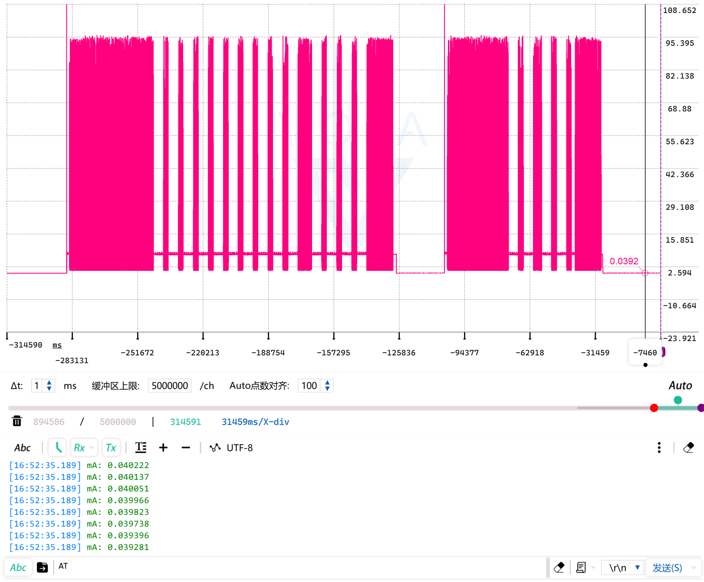
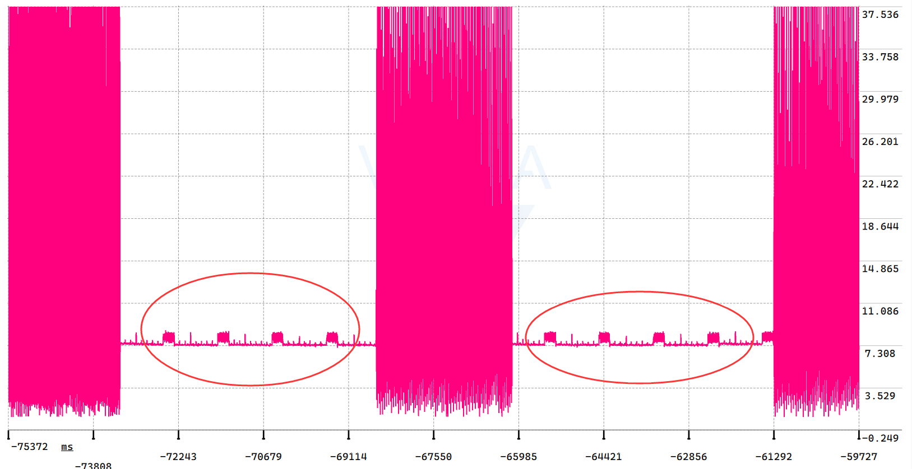
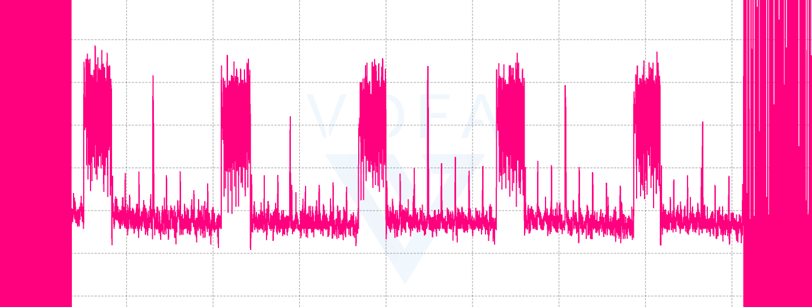
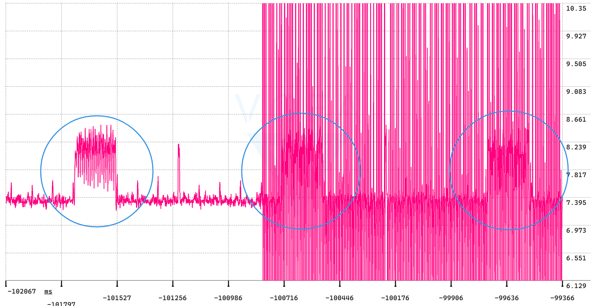
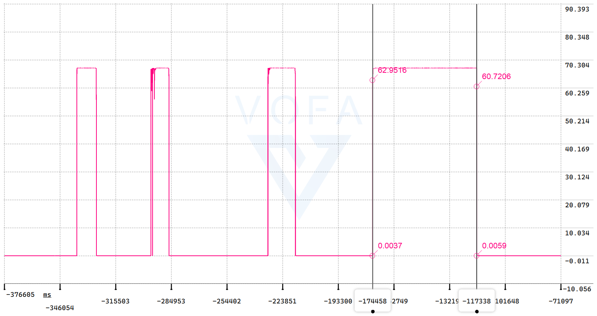
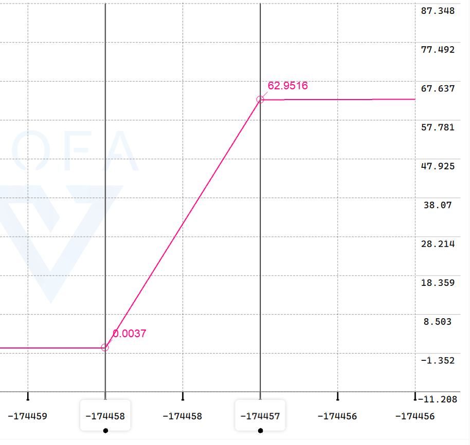
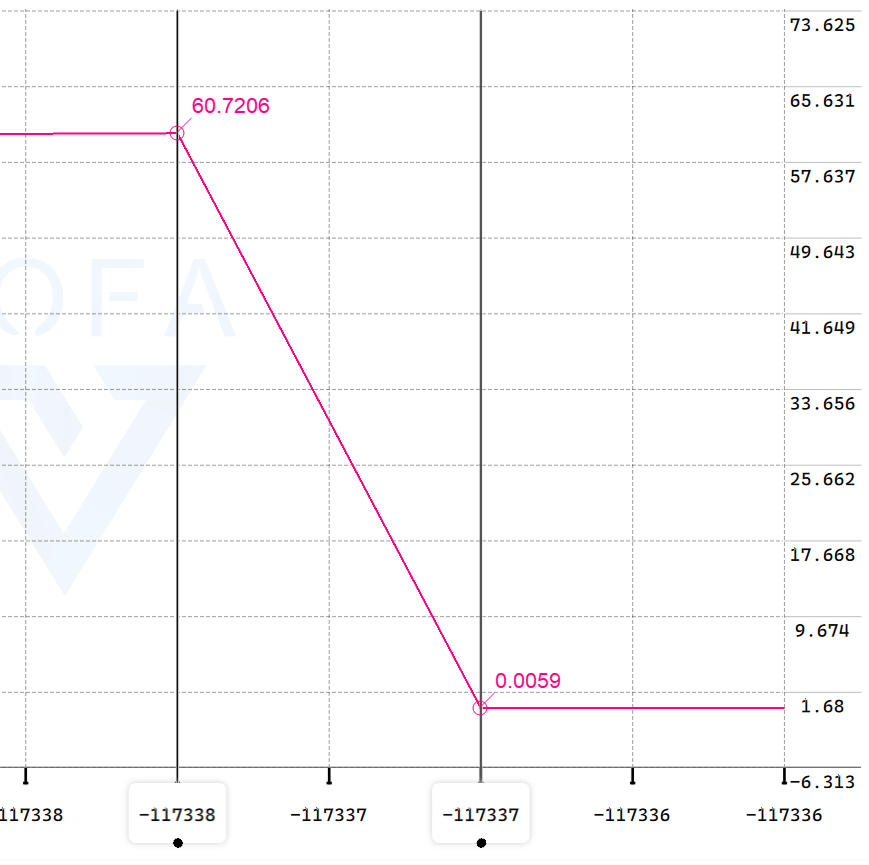

## DS-PPK_ANALOG_02

## 关于

在 DS-PPK_ANALOG_01 基础上修改

>目标：每秒合成 100K 32bit 协议数据帧

## 时间戳

### 预防时间戳的概念混淆

[wikipedia：Timestamp](https://en.wikipedia.org/wiki/Timestamp)

> **时间戳**是标识特定事件发生时间的字符序列或编码信息，通常给出日期和时间，有时精确到秒的一小部分。然而，**时间戳不必基于一些绝对的时间概念。它们可以有任何纪元，可以相对于任何任意时间，例如系统的开机时间，或过去的某个任意时间。**

### 通过时间戳对齐双缓冲区数据

在DS-PPK源码中，ADC采样率为100KHz，为了保证CPU处理ADC的数据时不会被新的采样数据篡改，使用DMA双缓冲模式，但该模式也带来了问题：

> 比如处理ADC缓冲区的任务正在处理ADC的前一半缓冲区，与此同时，DMA正在将ADC采样的数据填充到后一半缓冲区，与此同时，自动换挡中断随时可能发生，一旦发生自动换挡，CPU进入GPIO外部中断回调函数记录量程，可这个量程对应的却是ADC后一半缓冲区数据中的某段数据，而CPU正在处理ADC的前一半缓冲区，所以，这就需要对量程数据也开双缓冲

仅仅对量程数据开双缓冲还不够，为了知道某个量程数据究竟对应ADC缓冲区数据的哪一个数据，还需要引入时间戳：

> - 量程时间戳：
>
>   > 换挡触发GPIO外部中断的回调函数，除了记录量程时，还要记录该量程对应的时间戳
>
> - ADC传输中断时间戳
>
>   > ADC DMA半传输中断和传输完成中断的回调函数，除了通知处理ADC缓冲区的任务应该处理前半还是后半，还要记录该回调函数对应缓冲区的时间戳

注意：量程时间戳、ADC传输中断时间戳，都需要开双缓冲

那么处理ADC缓冲区的任务就可以通过双缓冲时间戳对齐量程和ADC的双缓冲数据，具体实现请见`frame_processor.cpp`（这代码写起来真让人头大，看起来也头大）

### 从高精度定时器获取时间戳

因为ADC的采样率为100KHz，换挡频率也在100KHz左右，而RTOS的time_base或者HAL库的systick只有1KHz，所以需要一个更高精度的节拍，每秒计数 100K 次

stm32 h7 的定时器分为 16bit 或 32bit，若使用 16bit 定时器，那么 0~65535 约 6秒溢出。虽然程序访问定时器16位CNT寄存器可将其值视为uint16_t 类型，相减运算不存在计算结果错乱，但考虑到debug阶段观察变量变化的方便性，还是使用32bit定时器

定时器选择好了，那么计数值的更新有两种方式：

1. 使用一个uint32_t 全局计数变量，在定时器中断回调函数中 +1，每秒进出中断 100K 次，需要时间戳时，访问计数变量的值
2. 需要时间戳时，直接访问定时器32位CNT寄存器，将其值视为uint32_t 类型的值

第一种在需要系统节拍时才会使用，DS-PPK的情况使用后者就行，每秒无需进出中断100K次

## 测试

### 每秒打印10K点，波形显示

帧处理器任务调度频率100Hz，每次调度打印100点

细节出来了

继续放大

意外的发现，电流信号的耦合

### 每秒打印10K点，换挡速度测试

| 正向换3挡                                                    | 反向换3挡                                                    |
| ------------------------------------------------------------ | ------------------------------------------------------------ |
|  |  |

换3挡的时间小于1点时间，即100us，不过仿真速度是1次换挡8us，3次预计24us，目前还是10K打印数据所以看不出来
