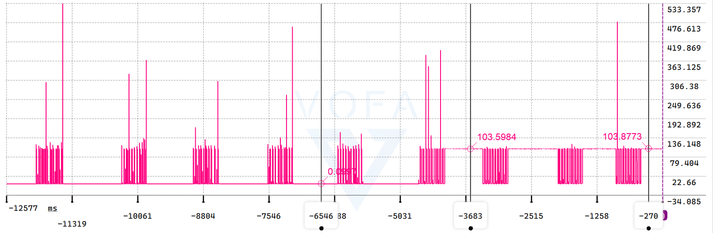
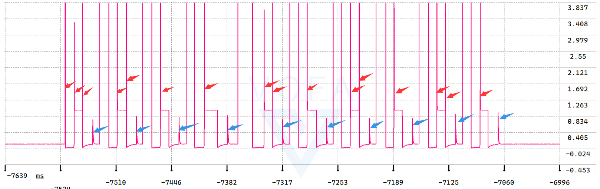
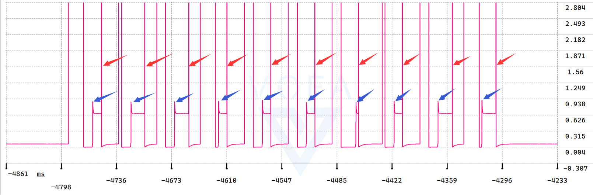
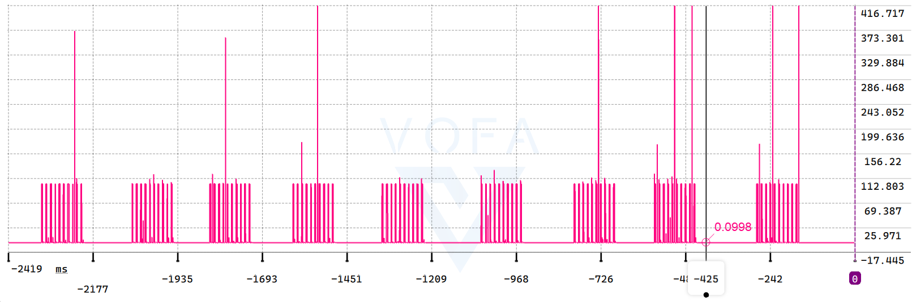
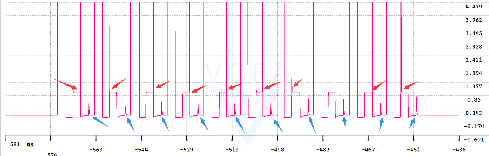

## DS-PPK_ANALOG_03

## 关于

在 DS-PPK_ANALOG_02 基础上修改

>目标：实现实时尖峰滤波器

## 尖峰测试

200Hz 调度频率

感觉没好多少，还新增了蓝色的诡异尖峰

之前使用信号量的情况

50Hz调度频率，加大缓冲区为8000点

取其中最差的一段数据，感觉没好多少

## 异步时钟导致的对齐错位问题

当前程序 ADC的触发时钟LPTIM1 100KHz的频率，LPTIM1 从 PLL3P取时钟，但时间戳时钟 TIM2 从APB1 TImer Clock取时钟，计数频率也是 100KHz，但 PLL时钟相对APB1 是异步时钟，这就回导致 LPTIM1 和 TIM2 计数器存在相位差，导致对齐错位

ADC从异步时钟改用同步时钟源
