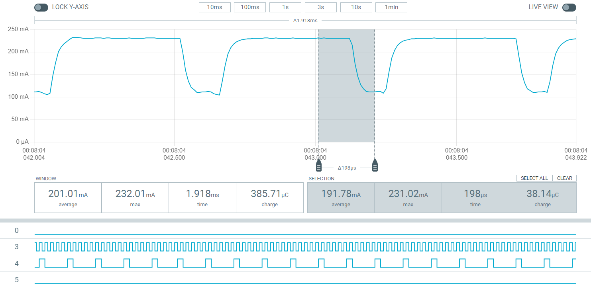
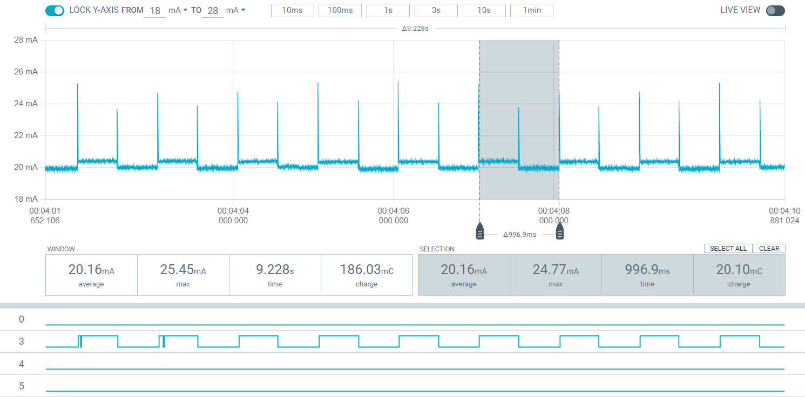

## DS-PPK_ANALOG_04

## 关于

本工程实现与 [pc-nrfconnect-ppk](https://github.com/NordicSemiconductor/pc-nrfconnect-ppk) 的USB通信协议，支持部分基础命令，支持采样数据以 100Ksps 32bit协议帧 传输

## 支持的命令

| 支持状态      | 命令                                                         | 16进制值 | 十进制值 | 被使用的函数                                     | 获取下位机的返回值？ |
| ------------- | ------------------------------------------------------------ | -------- | -------- | ------------------------------------------------ | -------------------- |
| :green_heart: | AverageStart                                                 | 0x06     | 6        | ppkAverageStart、sendCommand（仅判断是否是该值） | 快速发回的采样数据   |
| :green_heart: | AverageStop                                                  | 0x07     | 7        | ppkAverageStop                                   | 无                   |
|               | DeviceRunningSet + 变长参数 该参数从ppkDeviceRunning传入 | 0x0c     | 12       | ppkDeviceRunning                                 |                      |
|               | RegulatorSet + vdd的2个值 该vdd参数从ppkUpdateRegulator传入 | 0x0d     | 13       | ppkUpdateRegulator                               | 无                   |
|               | SetPowerMode + isSmuMode参数 该参数从ppkSetPowerMode传入，指定是否开启内部对外的供电 | 0x11     | 17       | ppkSetPowerMode                                  | 无                   |
| :green_heart: | GetMetadata                                                  | 0x19     | 25       | getMetadata                                      | EEPROM元数据         |
|               | SetUserGains + range + gain 参数 该参数从ppkSetUserGains传入，应该是用作校准时，range 指定校准电阻导致量程变化，gain指定 仪放的vref变化 | 0x25     | 37       | ppkSetUserGains                                  | 需要该设定下的电流值 |

## 测试

逻辑通道3和4采样50KHz正弦波和10KHz占空比20%方波

逻辑通道4采样1Hz F411开发板LED引脚信号，并以100KHz采样被测开发板电流

