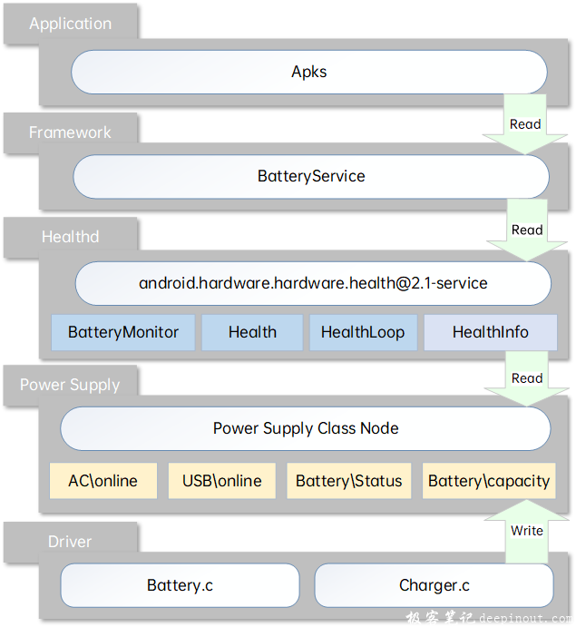
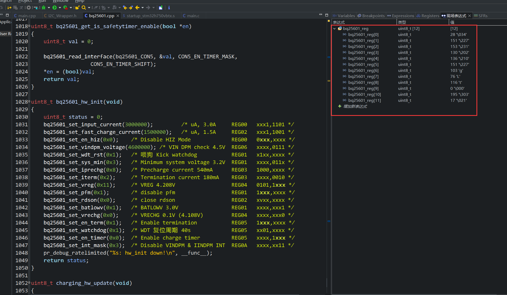

## DS-PPK_BQ25601_01

## 简介

DS-PPK v1.0 项目的BQ25601驱动demo

## 地址扫描

总线上哟个24C64，返回的7bit地址在0x58响应了一次，应该是BUG，因为 24C64的内部地址寻址是16bit，这样7bit 地址0x50相当于 10100000 8bit地址，就是写命令，然后 扫描 i2c 后面的 0x51、0x52 看作写模式的 EEPROM内部寻址地址，后面的 0x53 7bit 是 1010011，8bit是 10100110，看作单次写入...有点头晕，算了不分析了，反正三个设备地址都扫得到：

```c
MCU: i2c2 scan...
addr: 0x50 is ok	1010000	// BL24C64A-NTR，引脚A0~A2都是GND
addr: 0x58 is ok	1011000	// ???
addr: 0x62 is ok	1100010	// CW2015
addr: 0x6B is ok	1101011	// BQ25601
```

## i2c读写API

BQ25601挂在i2c2上，i2c2上还有cw2015和24c64，一共三个设备，可能存在多个优先级不同或相同的任务分别访问一路I2C的多个设备，因此i2c访问需要加入互斥锁，本id使用魔改的I2C_Wrapper库处理

[STM32的HAL库中硬件IIC，HAL_I2C_Master_Receive函数与HAL_I2C_Mem_Read函数的区别](https://blog.csdn.net/z12345654/article/details/123284178)

> 如果从某从设备读数据，则用HAL_I2C_Master_Receive()
> 如果是外设有子地址，例如EEPROM，有从机地址和寄存器地址，则用HAL_I2C_Mem_Read()
> Mem_Read是2个地址，Master_Receive只有从机地址
>
> 如果写数据到某从设备，则用HAL_I2C_Master_Transmit()
> 如果是外设有子地址，例如EEPROM，有从机地址和寄存器地址，则用HAL_I2C_Mem_Write()
> Mem_Write是2个地址，Master_Transmit只有从机地址

## 驱动需求

初始化，关机（写BATFET寄存器），没有分配IRQ引脚，不需要中断线程处理中断引脚，但需要 HC138 的轮询事件 检测 **STAT引脚** 以获取充电状态，设置充电电流，获取电流，电压

## 现成驱动

> BQ25601可配置的功能过多，而以单片机为主控的中低端的产品一般不会考虑（TP4056完事），所以网上找到的库几乎都是Linux的驱动

### Linux主线内核驱动路径

`linux/drivers/power/supply/bq256xx_charger.c`

其中，电源管理芯片 后缀 叫 charger，电量计后缀叫 battery

该文件为德州仪器官方对 BQ256xx 编写的兼容驱动，对后缀为 BQ256xx的所有系列都进行适配，捆绑 Linux Power supply 子系统的API，移植需要裁剪的工作量很大

驱动分层参考：[深入浅出理解Power Supply](https://deepinout.com/android-system-analysis/android-performance-power-related/easy-to-understand-power-supply.html)

> 梗概：
>
> Android供电系统框架 
>
> 
>
> power supply(以下简称psy)是Linux中从供电驱动抽象出来的子系统，是Linux电源管理的重要组成部分。psy是一个中间层，在kernel中是属于设备驱动的一部分，psy的作用主要是向用户空间汇总各类供电的状态信息。抽象出来的各类信息称为property，比如供电设备是否连接就对应着POWER_SUPPLY_PROP_ONLINE。
>
> 在驱动层分两大模块，与电池相关的驱动和与充放电管理相关的驱动（对应图中的battery.c和charger.c）,这两大模块主要处理硬件相关的逻辑，在硬件状态发生变化时，会触发相关的中断，驱动层会调用相应的中断函数，并更新修改相应的 psy节点值。驱动负责更新psy节点的状态，HAL层会去读这些节点，驱动在检测硬件、传感器信息变化会去更新节点值
>
> ...

### MediaTek 联发科驱动

在 github 上搜索 BQ25601，有 8K Code，其中很大一部分都是 联发科 2016 年编写Linux的开源驱动

[kernel_xiaomi_mt6768/drivers/power/supply/mediatek/charger/bq25601.c](https://github.com/dotOS-Devices/kernel_xiaomi_mt6768/blob/3e2496d807ae09f10b0ee2db996f8e829b89f537/drivers/power/supply/mediatek/charger/bq25601.c)

该驱动很好懂，API与内核封装层的东西捆绑得最少，很方便移植到STM32上

### 小米驱动

红米5A 使用 BQ25601 做电源管理，在小米内核的开源仓库内的此分支可以找到

https://github.com/MiCode/Xiaomi_Kernel_OpenSource/tree/riva-n-oss/drivers/power

分   bq2560x.h、bq2560x_charger.c、bq2560x_reg.h，兼容BQ25600、BQ25601，该驱动所有功能都实现了

### mikrosdk_click_v2：charge6

[mikrosdk_click_v2/tree/master/clicks/charger6](https://github.com/MikroElektronika/mikrosdk_click_v2/tree/master/clicks/charger6)

这个驱动有点简陋了，很多功能没有写成API

## 驱动比较

那么我该选择哪个驱动移植到H750的FreeRTOS呢？

比较后，选择联发科和小米的驱动移植到STM32环境，分别创建 DS-PPK_BQ25601_01 和 DS-PPK_BQ25601_02 工程

## 测试

### 打印所有寄存器



### VCP解析命令控制BATFET的开关

> BQ25601实现关机只能写寄存器控制BATFET关闭，对应的功能是不充电下的关机，“不充电下的关机” 是什么鬼？手机插电是无法完全关机的，不信你试试~

在ascii_protocol.cpp中插入以下命令：

```C++
void OnAsciiCmd(const char* _cmd, size_t _len, StreamSink &_responseChannel)
{
	...
	else if (_cmd[0] == '^')
    {
        std::string s(_cmd);
        if (s.find("BATFET_TURN_OFF_FAST") != std::string::npos)
        {
            Respond(_responseChannel, false, "Turn off BATFET immediately");
            bq25601_set_batfet_delay(0);
            bq25601_set_batfet_disable(1);
        }
        else if (s.find("BATFET_TURN_OFF_SLOW") != std::string::npos)
        {
            Respond(_responseChannel, false, "Turn off BATFET after t(BATFET_DLY) (typ. 10 s)");
            bq25601_set_batfet_delay(1);
            bq25601_set_batfet_disable(1);
        }
        else if (s.find("BATFET_TURN_ON") != std::string::npos)
        {
            Respond(_responseChannel, false, "Turn on BATFET");
            bq25601_set_batfet_disable(0);
        }
    }
...
}
```

然后接通BQ25601的电源，接一个电压小于4.0V的锂电池，可以发送以下命令测试

立即关闭BATFET

```shell
^BATFET_TURN_ON
^BATFET_TURN_OFF_FAST
```

延时10s左右关闭BATFET

```
^BATFET_TURN_ON
^BATFET_TURN_OFF_SLOW
```

使用万用表测量锂电池电压，即可确认BATFET是否打开，打开锂电池电压4.2V左右处于充电状态，关闭即停止充电电压小于4.0V

延时关机的10s典型时间，本id手头的片子实测是12s左右

### DS-PPK v1.0 关机状态锂电池电流

断开USB的VBUS，仅USB和GND连接DS-PPK，锂电池串联电流表，测得运行时锂电池电流200mA左右，BQ25601关断BATFET下锂电池电流**37uA**，此时锂电池还在给BQ25601关机模式，CW2015上电默认模式，加速度上电默认模式计休眠模式，H750的VBAT直供电流，说明DS-PPK的关机电流控制还算成功

关机下，短接 BQ25601 的 QON 引脚到 GND，可正常打开BATFET开机，此状态电脑能识别USB VCP，可继续发送测试命令关机
