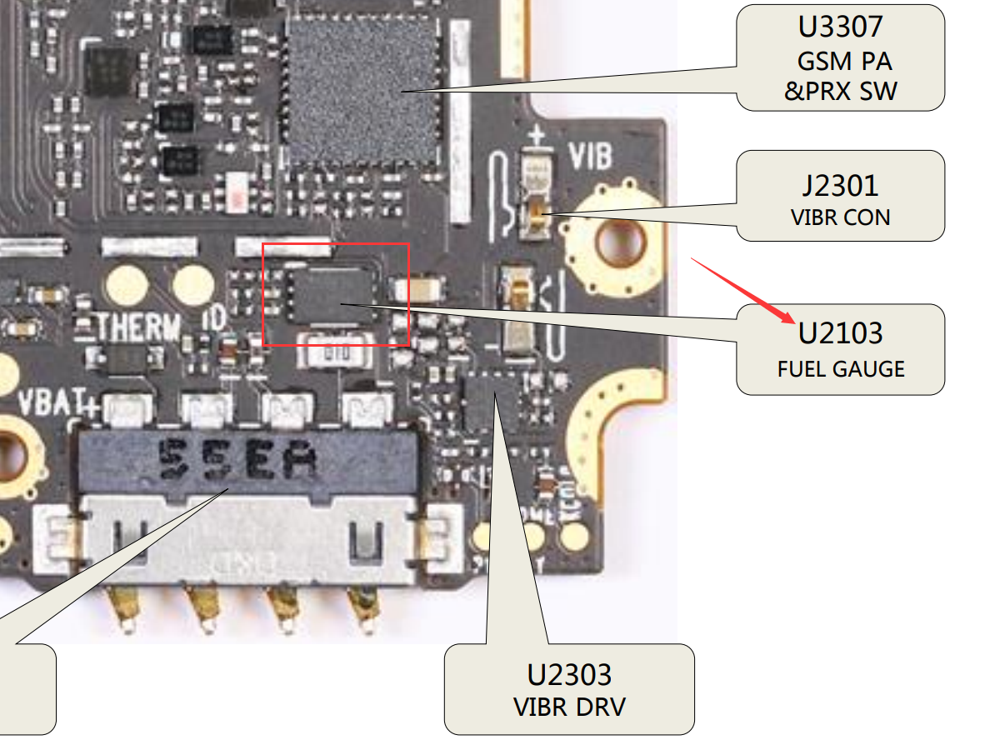
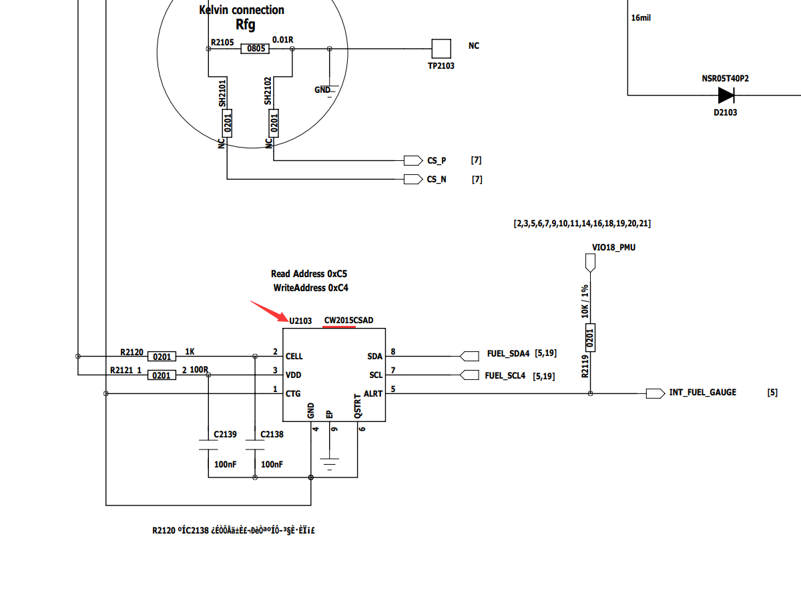
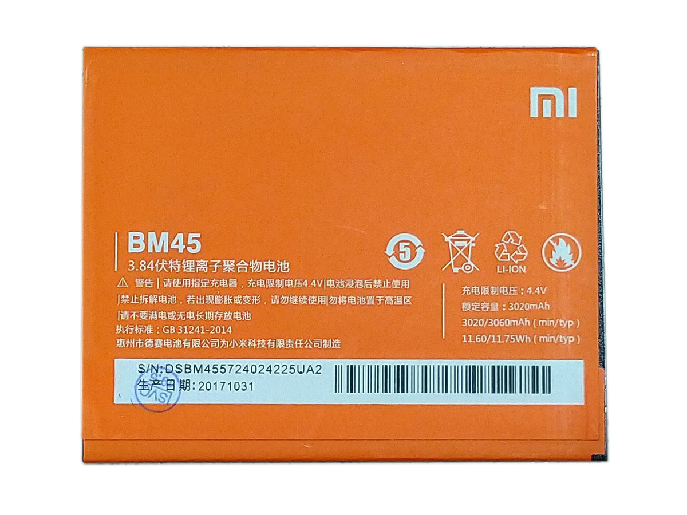
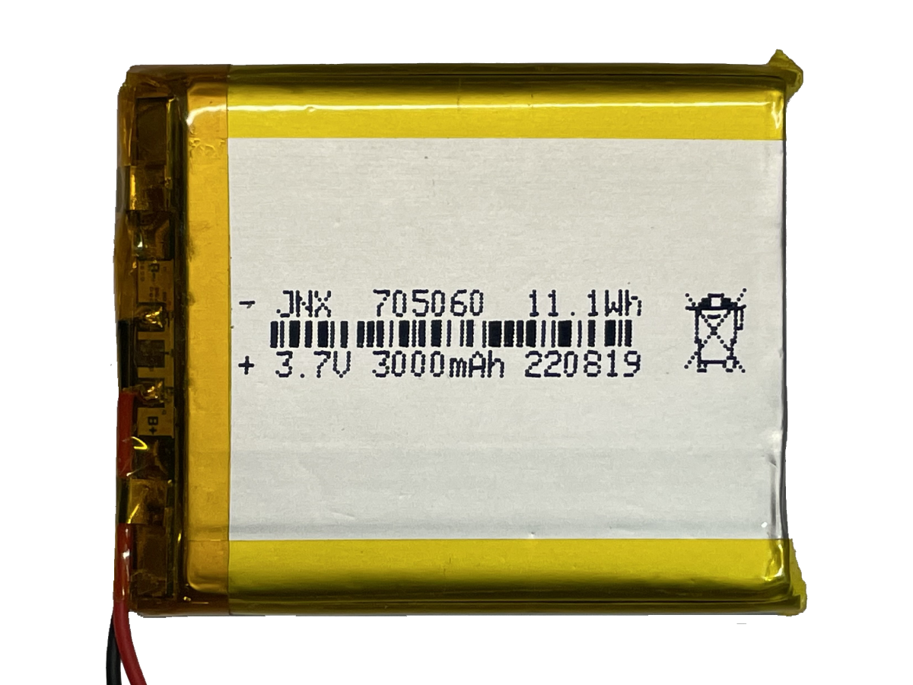
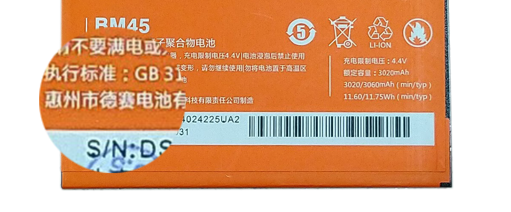
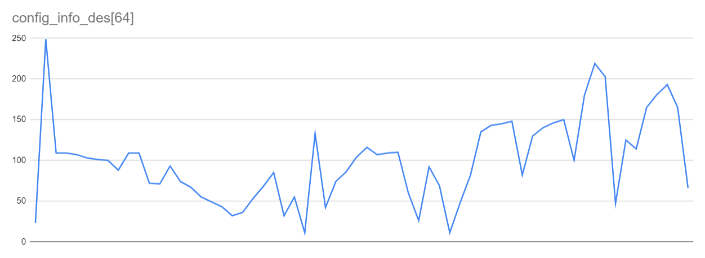
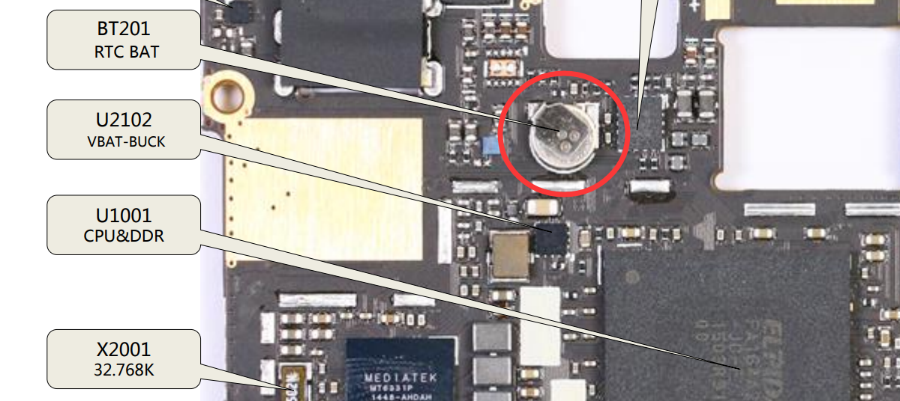
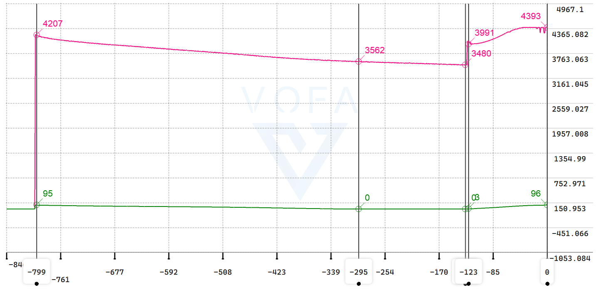
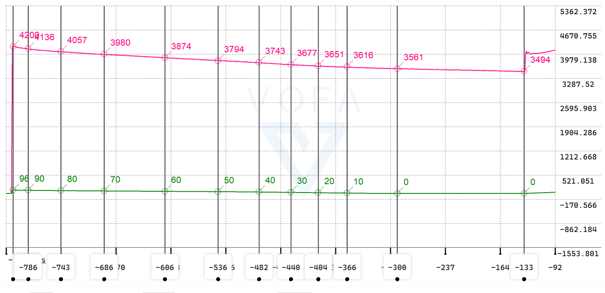
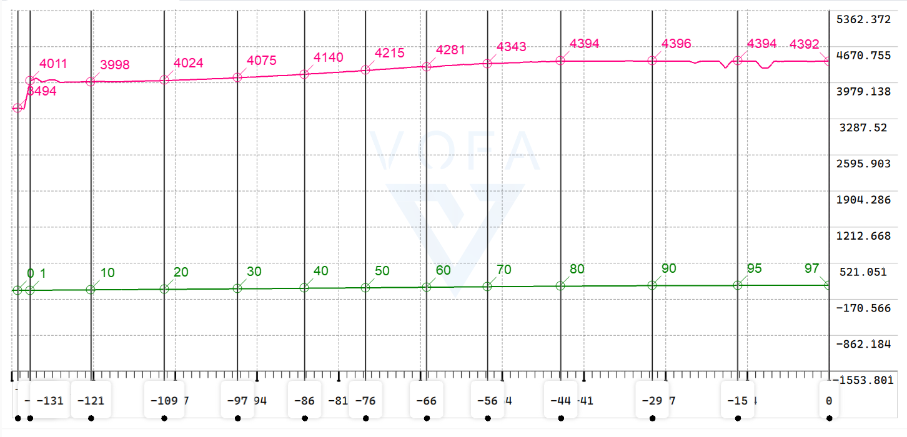

## DS-PPK_CW2015_01

## cw2015手册没有写的寄存器

从 0x10开始，还有64个8bit寄存器，可写可读，存放电池建模信息

## 电池建模

### 随便找找？

网上找了找有这么一个出现频率很高的模型：

```c
static unsigned char config_info[SIZE_BATINFO] = {
    0x17, 0x67, 0x66, 0x6C, 0x6A, 0x69, 0x64, 0x5E, 
    0x65, 0x6B, 0x4E, 0x52, 0x4F, 0x4F, 0x46, 0x3C, 
    0x35, 0x2B, 0x24, 0x20, 0x21, 0x2F, 0x42, 0x4C, 
    0x24, 0x4A, 0x0B, 0x85, 0x31, 0x51, 0x57, 0x6D, 
    0x77, 0x6B, 0x6A, 0x6F, 0x40, 0x1C, 0x7C, 0x42, 
    0x0F, 0x31, 0x1E, 0x50, 0x86, 0x95, 0x97, 0x27, 
    0x57, 0x73, 0x95, 0xC3, 0x80, 0xD8, 0xFF, 0xCB, 
    0x2F, 0x7D, 0x72, 0xA5, 0xB5, 0xC1, 0x73, 0x09, 
};
```

算了先放在这里

### 红米Note2

翻了好久的机子，终于锁定了红米Note2

拆解帖：[同級下幾乎無敵手，紅米 Note 2 拆解完成](https://news.xfastest.com/xiaomi/10151/redmi-note-2-tear-down-08182015/)

电路图：[吾阅图纸：红米Note2维修电路图纸及三级维修指导](https://www.wuyuetuzhi.com/1962.html)

|  |  |
| ---------------------------------------------------- | ---------------------------------------------------- |

红米Note 2 的 BM45电池建模信息，该电池平均工作电压为 3.84V，充电截止电压4.4V，容量3020mAh-3060mAh，11.60-11.75Wh（3.84V * 3020mAh = 11.60Wh），是高压锂电池（标称电压是3.8V和3.85V，对应的充电截止电压分别是4.35V和4.4V）

|  |  |
| -------------------------------------------------- | ------------------------------------------------------ |

而DS-PPK使用的是3.7V锂电池，充电截止电压4.2V，3000mAh，11.1Wh（3.7V * 3000mAh = 11.1Wh）

误差：电压3.78%，能量4.5%，如果使用红米电池的建模信息，能测到5%误差我已经很满意了

接下来到小米官方的红米Note2的内核源码里找：

| hennessy-l-oss | Redmi Note3,Redmi Note2,Redmi Note2 Pro | Android L | MTK  | [hennessy-l-oss](https://github.com/MiCode/Xiaomi_Kernel_OpenSource/tree/hennessy-l-oss) |
| -------------- | --------------------------------------- | --------- | ---- | ------------------------------------------------------------ |

[Xiaomi_Kernel_OpenSource，分支：hennessy-l-oss](https://github.com/MiCode/Xiaomi_Kernel_OpenSource/tree/hennessy-l-oss)

但是这里面居然没有cw2015的驱动...

又刨了一遍github，居然真的找到一个：

 [ibilux/android_kernel_xiaomi_hermes](https://github.com/ibilux/android_kernel_xiaomi_hermes)

> ## About
>
> Android kernel source for **Xiaomi Redmi Note 2** (Hermes) - MT6795

其中，cw2015驱动文件是：

- [android_kernel_xiaomi_hermes/include/mach/cw2015_battery.h](https://github.com/ibilux/android_kernel_xiaomi_hermes/blob/44c688bdf8303ba4f35a141267c3dcce41f8467a/include/mach/cw2015_battery.h)
- [android_kernel_xiaomi_hermes/drivers/misc/mediatek/battery_fual/cw2015_battery.c](https://github.com/ibilux/android_kernel_xiaomi_hermes/blob/44c688bdf8303ba4f35a141267c3dcce41f8467a/drivers/misc/mediatek/battery_fual/cw2015_battery.c)

其中电池模型的型号居然有这么多，据说同一型号小米手机的电池可能会被不同厂家代工，看来稳了：

```c
#ifdef CONFIG_CM865_MAINBOARD
static u8 config_info_cos[SIZE_BATINFO] = { //guangyu coslight 180mv
0x17,0xF6,0x6A,0x6A,0x6D,0x66,0x67,0x63,0x5E,0x63,0x60,0x54,0x5B,0x5A,0x49,0x41,
0x36,0x2E,0x2B,0x20,0x21,0x2E,0x41,0x4E,0x34,0x1D,0x0C,0xCD,0x2C,0x4C,0x4E,0x5D,
0x69,0x65,0x67,0x68,0x3D,0x1A,0x6B,0x40,0x03,0x2B,0x38,0x71,0x84,0x95,0x9F,0x09,
0x36,0x6D,0x96,0xA2,0x5E,0xB3,0xE0,0x70,0x2F,0x7D,0x72,0xA5,0xB5,0xC1,0x46,0xAE
};
static u8 config_info_sun[SIZE_BATINFO] = {//xinwangda Sunwoda 600mv
0x17,0xEC,0x62,0x6B,0x6A,0x6B,0x67,0x64,0x60,0x63,0x60,0x56,0x5A,0x54,0x49,0x43,
0x36,0x31,0x2B,0x27,0x24,0x2E,0x43,0x4A,0x35,0x20,0x0C,0xCD,0x3C,0x5C,0x56,0x64,
0x6C,0x65,0x66,0x66,0x3E,0x1A,0x64,0x3D,0x04,0x2B,0x2D,0x52,0x83,0x96,0x98,0x13,
0x5F,0x8A,0x92,0xBF,0x46,0xA9,0xD9,0x70,0x2F,0x7D,0x72,0xA5,0xB5,0xC1,0x46,0xAE
};
static u8 config_info_scud[SIZE_BATINFO] = {//feimaotui Scud   900mV
0x17,0xF0,0x60,0x68,0x6C,0x6A,0x66,0x63,0x60,0x62,0x69,0x50,0x59,0x5B,0x4B,0x42,
0x3B,0x31,0x2B,0x24,0x20,0x32,0x49,0x59,0x17,0x17,0x0C,0xCD,0x2D,0x4D,0x53,0x62,
0x6D,0x60,0x5F,0x61,0x3C,0x1B,0x8E,0x2E,0x02,0x42,0x41,0x4F,0x84,0x96,0x96,0x2C,
0x4E,0x71,0x96,0xC1,0x4C,0xAC,0xE3,0xCB,0x2F,0x7D,0x72,0xA5,0xB5,0xC1,0x46,0xAE
};
#else
static u8 config_info_cos[SIZE_BATINFO] = {	// guangyu coslight
0x17,0xF3,0x63,0x6A,0x6A,0x68,0x68,0x65,0x63,0x60,0x5B,0x59,0x65,0x5B,0x46,0x41,
0x36,0x31,0x28,0x27,0x31,0x35,0x43,0x51,0x1C,0x3B,0x0B,0x85,0x22,0x42,0x5B,0x82,
0x99,0x92,0x98,0x96,0x3D,0x1A,0x66,0x45,0x0B,0x29,0x52,0x87,0x8F,0x91,0x94,0x52,
0x82,0x8C,0x92,0x96,0x54,0xC2,0xBA,0xCB,0x2F,0x7D,0x72,0xA5,0xB5,0xC1,0xA5,0x49
};
static u8 config_info_des[SIZE_BATINFO] = { //desay
0x17,0xF9,0x6D,0x6D,0x6B,0x67,0x65,0x64,0x58,0x6D,0x6D,0x48,0x57,0x5D,0x4A,0x43,
0x37,0x31,0x2B,0x20,0x24,0x35,0x44,0x55,0x20,0x37,0x0B,0x85,0x2A,0x4A,0x56,0x68,
0x74,0x6B,0x6D,0x6E,0x3C,0x1A,0x5C,0x45,0x0B,0x30,0x52,0x87,0x8F,0x91,0x94,0x52,
0x82,0x8C,0x92,0x96,0x64,0xB4,0xDB,0xCB,0x2F,0x7D,0x72,0xA5,0xB5,0xC1,0xA5,0x42
};
#endif
```

眼熟的好像只有飞毛腿，但马上锁定了最后一个，desay：就是德赛，我超真稳了

```c
static u8 config_info_des[SIZE_BATINFO] = { //desay
0x17,0xF9,0x6D,0x6D,0x6B,0x67,0x65,0x64,0x58,0x6D,0x6D,0x48,0x57,0x5D,0x4A,0x43,
0x37,0x31,0x2B,0x20,0x24,0x35,0x44,0x55,0x20,0x37,0x0B,0x85,0x2A,0x4A,0x56,0x68,
0x74,0x6B,0x6D,0x6E,0x3C,0x1A,0x5C,0x45,0x0B,0x30,0x52,0x87,0x8F,0x91,0x94,0x52,
0x82,0x8C,0x92,0x96,0x64,0xB4,0xDB,0xCB,0x2F,0x7D,0x72,0xA5,0xB5,0xC1,0xA5,0x42
};
```



看看64个数据分布情况，没有发现规律，寄



config_info_des 和 config_info_cos 在一个 `#else`里，源码中是这么选择版本的：

```c
	if(hmi_battery_version==2)
		FG_CW2015_LOG("test cw_bat_config_info = 0x%x",config_info_des[0]);//liuchao
	else
		FG_CW2015_LOG("test cw_bat_config_info = 0x%x",config_info_cos[0]);//liuchao
```

hmi_battery_version 定义：

```c
int hmi_battery_version=0;
void hmi_get_battery_version(void)
{
	char *ptr;
	ptr =strstr(saved_command_line,"batversion=");
	ptr +=strlen("batversion=");
	hmi_battery_version=simple_strtol(ptr,NULL,10);
	printk("liuchao_test_hmi_battery_version=%d\n",hmi_battery_version);
}
```

根据 saved_command_line 确认红米电池版本，应该是读电池ID自动确认

## SOC修正算法？

源码中有以下的构的成员带有SOC变量名：

```c
#ifdef BAT_CHANGE_ALGORITHM
struct cw_store{
	long bts; 		// timestamp 时间戳？
	int OldSOC;		// 旧SOC？
	int DetSOC;		//detection 检测SOC？
	int AlRunFlag;   
};
#endif
```

然后软件算法很明显在

```c
static int cw_algorithm(struct cw_battery *cw_bat,int real_capacity);
```

此张牙舞爪的函数里在内核里创建文件读写`struct cw_store st;`数据，并计算很多时间变量

```c
...
	get_monotonic_boottime(&ts);				//获取系统启动以来所经过的时间，包含休眠时间
	ktime_get_ts(&ktime_ts);					//获取系统启动以来所经过的c时间，不包含休眠时间，返回timespec结构
	suspend_time = ts.tv_sec - ktime_ts.tv_sec;	//休眠时间 = 时间戳 - 内核时间戳
	if(timeNow_last != -1 && ts.tv_sec > DEVICE_RUN_TIME_FIX_VALUE)
	{
		/* 龟龟？*/
		//暂停时间变化量 = 暂停时间 - 上一次暂停时间
		//时间变化rtc 	 = 当前时间 - 上一次当前时间
		//时间变化 		 = 当前时间 - 上一次当前时间 - 暂停时间变化量
		suspend_time_changed = suspend_time - suspend_time_last;					
		timeChanged_rtc 	 = timeNow 		- timeNow_last;							
		timeChanged 		 = timeNow 		- timeNow_last - suspend_time_changed; 	

		printk(KERN_INFO "[FW_2015]suspend_time_changed = \t%ld,timeChanged_rtc = \t%ld, timeChanged = \t%ld\n",
				suspend_time_changed, timeChanged_rtc, timeChanged);

		if(timeChanged < -60 || timeChanged > 60)
		{
			st.bts = st.bts + timeChanged_rtc; // 时间戳加上RTC记录的充电时间
#if FG_CW2015_DEBUG
			FG_CW2015_ERR(" 1 st.bts = \t%ld\n", st.bts);
#endif
		}
	}
	timeNow_last = timeNow;				//上一次当前时间 = 当前时间
	suspend_time_last = suspend_time;	//上一次暂停时间 = 暂停时间
...
```

`cw_algorithm()`被`cw_bat_work()`调用，后者又被工作quene几秒调用一次

在 [**锂电池放电曲线全面解析**](http://m.cbea.com/qyjs/201806/440445.html) 中找到了 SOC 术语的解释（我居然以为是SOC封装？？）

SOC(State of Charge )为荷电状态，表示在一定的放电倍率下，电池使用一段时间或长期搁置后剩余容量与其完全充电状态的容量的比值，理想情况下的公式如下
$$
SOC=（ 剩余电量/额定电量）\cdot 100\%
$$
但实际应用中，额定电量会随着锂电池老化而衰减，剩余电量这个值又无法直接获得的，所以实际SOC需要要用其他算法估算：

估算SOC常见以下三种算法：[MPS：BMS电池管理系统SOC的三种算法](https://www.ednchina.com/technews/15014.html)

1. 基于内阻补偿的开路电压

   > 开路电压法（OCV）是最早的电池容量测试方法之一，开路电压法是根据电池的开路电压与电池内部锂离子浓度之间的变化关系，间接地拟合出它与电池 SOC 之间的一一对应关系。
   >
   > 开路电压法简单便捷，但是估算的精度并不高。该方法只能在电池长时间静置状态下估算 SOC，当电池有电流通过时，电池内阻产生的压降会影响 SOC 估算精度。同时电池存在电压平台，特别是磷酸铁锂电池，在 SOC30%-80% 期间，端电压和 SOC 曲线近似为直线，这种情况下 SOC 的估算误差会放大。
   >
   > 基于以上问题，设计人员对开路电压法做了补充，引入了电池内阻进行校正，准确估算 OCV。当电池通过电流时，通过将实际测得的电池端电压减去 I*R 来校正负载下的电压，然后使用校正电压来获得当前的 SOC。
   >
   > V = OCV-I*R(SOC,T）
   >
   > 基于内阻补偿的开路电压法提升了 SOC 的估算精度，但是实际应用时由于其复杂的电化学特性，电池电压不会立即对负载的变化作出反应，而是有一定延迟。该延迟与电池电压响应的时间常数相关联，范围从毫秒到数千秒。同时电池的内部阻抗在不同条件下变化较大，因此 SOC 的精准估算依赖于阻抗的精准估算。

2. 安时法（库伦计数法）

   > 经典的 SOC 估算一般采用安时积分法（也叫电流积分法或者库仑计数法）。即电池充放电过程中，通过累积充进和放出的电量来估算 SOC。充电时，进入电池的库仑全部留在电池中，放电时全部流出的电量导致 SOC 的下降。
   >
   > SOCnow = SOCpast-(Inow*t)/Qmax
   >
   > 安时积分法 SOC 估算精度高于开路电压法，但是该算法只是单纯的从外部记录流入和流出的电池电量，忽略了电池内部状态的变化。由于不同的电池模型有不同的自放电率，这也取决于电池的 SOC、温度和循环历史，准确的自放电建模需要花费大量的时间收集数据，而且仍然相当不精确。同时电流测量不准，造成 SOC 计算误差会不断累积，需要定期不断校准。而且在电池长时间不活动或放电电流变化很大的应用中，库伦积分法会产生一定误差。

3. 电压电流混合算法，典型的是 开路电压+安时积分法

   > “开路电压 + 安时积分”法利用开路电压法估算出电池初始状态荷电容量SOC0，然后利用安时积分法求得电池运行消耗的电量，消耗电量为放电电流与放电时间的乘积，则剩余电量等于初始电量与消耗电量的差值。
   >
   > 开路电压+安时积分结合估算SOC 数学表达式为：
   > $$
   > SOC(T)=SOC_0(T)-\frac{1}{C_N(T)}\int_{0}^{t}η(T)Idt
   > $$
   > 其中
   >
   > - $$C_N$$：额定容量
   > - $$η$$ ：充放电效率
   > - $$T$$：电池使用温度
   > - $$I$$ ：电池电流
   > - $$t$$ ：电池放电时间

DOD(Depth of Discharge )为放电深度，表示放电程度的一种量度，为放电容量与总放电容量的百分比。放电深度的高低和电池的寿命有很大的关系：放电深度越深，其寿命就越短。两者关系为
$$
SOC = 100\%- DOD
$$
后面还有一个术语叫 "电压-SOC曲线"，结合 cw_algorithm() 函数的内一长串的：

```c
...
	if(PowerResetFlag == 1)
	{
		PowerResetFlag = -1;
#ifdef USE_MTK_INIT_VOL

		/**
		 * mtk_init_vol 是全局变量 g_mtk_init_vol 的值，
		 * battery_meter.c 中 
		 * g_mtk_init_vol = gFG_voltage;
		 * ret = battery_meter_ctrl(BATTERY_METER_CMD_GET_ADC_V_BAT_SENSE, &g_booting_vbat);
		 * gFG_voltage = g_booting_vbat;
		 * 推测 mtk_init_vol 记录了开机时的电池电压，且仅开机时被赋值一次
		 * 以下if-else应该是按照“电压-SOC曲线”写的
		 */
		if(mtk_init_vol > 4372){				// mtk_init_vol 锂电池 4.372V
			st.DetSOC = 100 - real_capacity;
		}else if(mtk_init_vol > 4349){
			st.DetSOC = 98 - real_capacity;
		}else if(mtk_init_vol > 4325){
			st.DetSOC = 96 - real_capacity;
		}else if(mtk_init_vol > 4302){
...
		}else if(mtk_init_vol > 3673){
			st.DetSOC = 4 - real_capacity;
		}else if(mtk_init_vol > 3660){		// mtk_init_vol 锂电池 3.660V
			st.DetSOC = 3 - real_capacity;
		}else{
			st.DetSOC = 1;
		}
#else 
		/**
		 * 以下if-else应该是按照“容量-SOC曲线”写的
		 * 根据cw2015计算的“real_capacity实际容量”设置DetSOC
		 */
		if(hmi_battery_version==2){			//德赛电池
			if(real_capacity == 0){
				st.DetSOC = 1;
			}else if(real_capacity == 1){
				st.DetSOC = 3;
			}else if(real_capacity == 2){
				st.DetSOC = 10;
			}else if(real_capacity == 3){
				st.DetSOC = 19;
...
			}else if(real_capacity < 81){
				st.DetSOC = 8;
			}else if(real_capacity < 88){
				st.DetSOC = 9;
			}else if(real_capacity < 94){
				st.DetSOC = 6;
			}else if(real_capacity <= 100){		//若 94% <= 实际容量 <= 100%
				vmSOC = 100;
				st.DetSOC = 100 - real_capacity;
			}
		}
#endif

		//只有旧电池才需要算法
		if(AlgNeed(
				cw_bat,
				st.DetSOC + real_capacity,		// SOC_NEW
				st.OldSOC						// SOC_OLD
				) == 2)
		{
			st.DetSOC = st.OldSOC - real_capacity + 1;
#if FG_CW2015_DEBUG
			FG_CW2015_ERR("st.DetDoc=%d\n", st.DetSOC);
#endif
		}
...
```

可以确认实现的应该是某种SOC有关的算法，但没使用到电流和温度，继续分析，cw2015自身跑一个SOC实现，可以直接读寄存器得到电量百分比，但是cw2015不能跟踪电池衰减，cw2015只能以全新的电池模型作为参考，所以小米工程师又软件实现了跟踪电池衰减的修正cw2015的SOC算法，用到了RTC时间，考虑了系统休眠或断电唤醒的时间，在  `cw_algorithm()` 实现

备注：红米Note2这块主板上还有很小一块RTC电池：



先写这些，若有精力再研究

## 修改思路

该驱动几个主要的结构体变量都是动态内存分配的，需要改为静态

去掉Linux子系统相关的代码，不使用小米实现的电池衰减的SOC修正算法

任务quene 调度的 `cw_bat_work()` 改为一个时间片轮调任务 `threadCwBatUpdate()`

在 DS-PPK_BQ25601_01工程 基础上 加入 cw2015 的部分，以控制充电开关

## 测试

> 使用小米Note2的德赛3.84V电池建模，config_info_des，测试电池3.7V电池，横流区充电电流1.5A，放电由开发板自身耗电放电大约200mA

### 充电时容量跟踪

| 时间  | CW测得电压 | CW测得容量 | 操作                                                         |
| ----- | ---------- | ---------- | ------------------------------------------------------------ |
|       | 3.612      | 3          |                                                              |
| 17:55 | 3.715      | 14         | 完断电后接入电池开机，未充电                                 |
| 17:56 | 4.059      | 15         | 接入5V2A电源 9.8W                                            |
| 17:57 | 4.091      | 16         |                                                              |
| 17:57 | 4.105      | 17         |                                                              |
|       | 4.120      | 18         |                                                              |
|       | 4.127      | 19         |                                                              |
| 18:00 | 4.152      | 21         |                                                              |
| 18:03 | 4.182      | 25         | 10.24W                                                       |
| 18:09 | 4.242      | 35         |                                                              |
| 18.12 | 4.262      | 40         | 10.38W                                                       |
| 18:15 | 4297       | 45         | 10.33W                                                       |
| 18:18 | 4319       | 50         |                                                              |
| 18:22 | 4341       | 55         |                                                              |
| 18:24 | **4050**   | 59         | BATFET_TURN_OFF_SLOW                                         |
| 18:25 | 4323       | 59         | BATFET_TURN_ON                                               |
| 18:26 | 4332       | 60         |                                                              |
| 18:29 | 4350       | 65         | 9.55W                                                        |
| 18:33 | 4383       | 70         |                                                              |
| 18:37 | 4394       | 75         | 8.54W                                                        |
| 18:42 | 4394       | 80         | 7.34W                                                        |
| 18:46 | **4185**   | 83%        | ^BATFET_TURN_OFF_FAST                                        |
| 18:47 | 4391       | 83%        | ^BATFET_TURN_ON                                              |
| 18:49 | 4392       | 85         |                                                              |
| 18:57 | 4391       | 90         | 5.43W                                                        |
| 18:58 | **4233**   | 90         | ^BATFET_TURN_OFF_FAST                                        |
|       | 4390       | 90         | ^BATFET_TURN_ON                                              |
| 19:16 | 4390       | 95         | 3.95W 2.01W                                                  |
| 19:17 | **4243**   | 95         | ^BATFET_TURN_OFF_FAST                                        |
| 19:18 | 4242       | 94         |                                                              |
| 19:19 | 4251`4390  | 95         | ^BATFET_TURN_ON                                              |
|       |            | 100        |                                                              |
| 20:18 | 4201       | 94         | BATFET 关机一段时间后打开，期间CW2015仍然被VBAT供电，状态：未充电 |

```c
[18:18:53.233] [cwBatTask] vol = 4319, cap = 50
[18:22:04.226] [cwBatTask] vol = 4341, cap = 55
[18:26:12.217] [cwBatTask] vol = 4332, cap = 60
[18:29:52.208] [cwBatTask] vol = 4350, cap = 65
[18:33:39.200] [cwBatTask] vol = 4383, cap = 70
[18:37:54.190] [cwBatTask] vol = 4394, cap = 75
[18:42:49.179] [cwBatTask] vol = 4394, cap = 80
[18:49:34.164] [cwBatTask] vol = 4392, cap = 85	//84->85
[18:55:31.150] [cwBatTask] vol = 4393, cap = 89 //88->89
[18:57:27.145] [cwBatTask] vol = 4391, cap = 90 //89->90
[19:06:28.125] [cwBatTask] vol = 4250/4390跳动, cap = 93 //92->93
[19:10:35.115] [cwBatTask] vol = 4390, cap = 94 //93->94 //1.85W~4.24W跳动
[19:16:00.103] [cwBatTask] vol = 4390, cap = 95 //94->95
[19:18:21.097] [cwBatTask] vol = 4242, cap = 94
[19:24:55.082] [cwBatTask] vol = 4376, cap = 96 //95->96 //1.89W~2.79W跳动
[19:36:14.056] [cwBatTask] vol = 4389, cap = 97 //96->97 //1.71~2.97W
//BATFET OFF 关机一段时间，但CW2015仍然被VBAT供电
[20:18:34.226] [cwBatTask] vol = 4201, cap = 94
```

整理一下

| 时间  | CW测得电压 | CW测得容量 | 充电时电池自身电压                     |
| ----- | ---------- | ---------- | -------------------------------------- |
| 17:53 | 3.620      | 4          | 3.620 （完断电后接入电池开机，未充电） |
| 17:55 | 3.715      | 14         | 3.715                                  |
| 17:56 | 4.059      | 15         | （接入5V2A电源 9.8W）                  |
| 18:00 | 4.152      | 21         |                                        |
| 18:03 | 4.182      | 25         |                                        |
| 18:09 | 4.242      | 35         |                                        |
| 18.12 | 4.262      | 40         |                                        |
| 18:18 | 4.319      | 50         |                                        |
| 18:26 | 4.332      | 60         | 4.060                                  |
| 18:33 | 4.383      | 70         |                                        |
| 18:42 | 4.394      | 80         | 4.185                                  |
| 18:57 | 4.391      | 90         | 4.233                                  |
| 19:16 | 4.390      | 95         | 4.243                                  |
| 19:53 | 4.389      | 97         | 4.272                                  |

SOC误差问题

我使用的电池与德赛3.84V的容量相差4.5%（11.1Wh vs 11.6Wh），但平均工作 电压3.7V 低于后者的 3.84V，4.2V充电截止电压低于后者的4.4V，可以看到cw2015对容量的估计最高到95%相差不多，但电压慢慢降到3.7V CW2015估计的容量会偏小，3.7V电池放电到3.715V估计的14%，正常是30%左右，由5%误差慢慢增大到15%，这个要么需要寄给赛微电池样品，要么使用拙劣的软件补偿一下，问题不大

### cw命令修改任务周期

范围 0~65535ms

```c
cw10000
set cw_work_freq: 10000 ms
```

### 放电+再次充电容量跟踪

从 95%开始放电，开发板大约200mA电流

```c
[22:20:31.111] [cwBatTask] vol = 4278, cap = 95 // 94->95%
[22:38:05.059] [cwBatTask] vol & cap : 4391, 96
```

之后每60秒查询一次，使用Vofa+ FireWter协议格式绘制曲线，经过十几个小时记录了约800个样本：

### 

仅看放电区间



仅看充电区间


