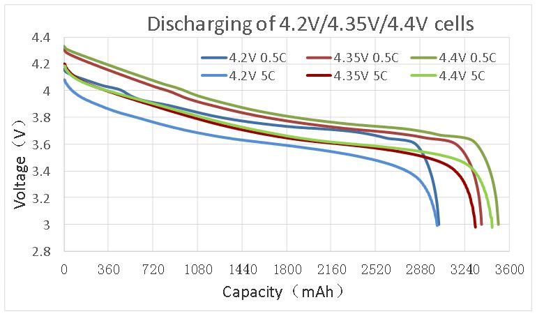
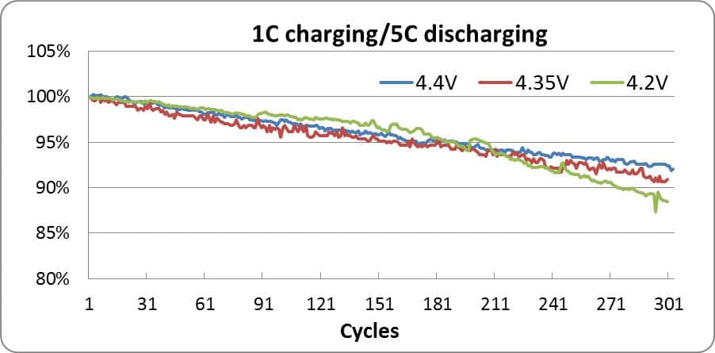

# Why High Voltage Batteries?

Editorial： Issue Date：2020-04-12 Views：742

Drones are being used more and more widely in all our lives, so the batteries that power these devices are increasingly advancing and being pushed to their limits. One of the biggest challenges to these batteries is endurance; more and more users need the power to last longer. One such example is with an agricultural drone. Let’s say that the drone carries 10kg of pesticide with two ordinary Lithium Polymer (LiPo) batteries that have a capacity of 16000mAh in 6S (22.2V). This drone will only be able to last about ten minutes with these batteries, which farmers generally find to be too short. However, the use of [high-voltage batteries](http://bit.ly/GRPhv) with the same capacity and C rating can increase this flight time by 15-25%, which will increase the efficiency and operations. We will explore why high-voltage batteries can improve flight duration and also look at the advantages of such batteries.

## 1. Weight

Without an increase in weight, high-voltage batteries provide better performance.  This is key for UAVs since each drone has a specific payload that it cannot go over.

## 2. Higher Voltage

If we compare ordinary LiPo batteries to that of those with high voltage, we see a subtle change in voltage. Through this little voltage increase, users are able to get increased performance in their products.

### Ordinary\ \LiPo Batteries

The nominal voltage for a single LiPo cell is 3.7V. A 6S battery pack has a nominal voltage of 22.2V, and a 12S has 44.4V. A single LiPo cell that is fully charged has 4.2V while a 6S has 25.2V and a 12S 50.4V.

### High-Voltage LiPo Batteries

The nominal voltage of a single high-voltage LiPo cell is 3.8V, a 6S pack has 22.8V, and a 12S has 45.6V. A single LiPo cell that is fully charged has 4.35V while a 6S has 26.1V and a 12S 52.2V.

## 3. Better Cycle Life

 

In the chart above, we can follow the discharge rate of several batteries. The high-voltage 4.4V batteries (shown in green) demonstrate a higher discharge rate and discharge capacity. 

 

The above chart shows that, under the same discharge currents and cycles, the 4.4V (in blue) has a longer cycle life than the other batteries at 4.35V or 4.2V.

## 4. Increased Efficiency

Similar to the example offered at the beginning, we put two drones together for a simple test.  Both drones carried 15kg of water with two batteries of 25C and 22000mAh in 6S. The drone with the non-high-voltage batteries (22.2V) lasted 17 minutes and 50 seconds. The drone with the high-voltage batteries (22.8V) lasted longer for 22 minutes and 10 seconds, lasting 4 minutes longer than the ordinary batteries.

## Conclusion

According to the above data, the advantages of [high-voltage UAV batteries](http://bit.ly/GRPUAV) are obvious. [Grepow](http://bit.ly/GRP321) products high-quality and high-voltage batteries under its different brands, GensAce and Tattu.  We are able to custom, high-voltage cells and offer a one-stop service for your battery designs and solutions. More details can be found at our website at [www.grepow.com](http://www.grepow.com/) or https://www.grepow.com/page/lipo-battery.html.  We can be reached at [info@grepow.com](mailto:info@grepow.com) for more information.