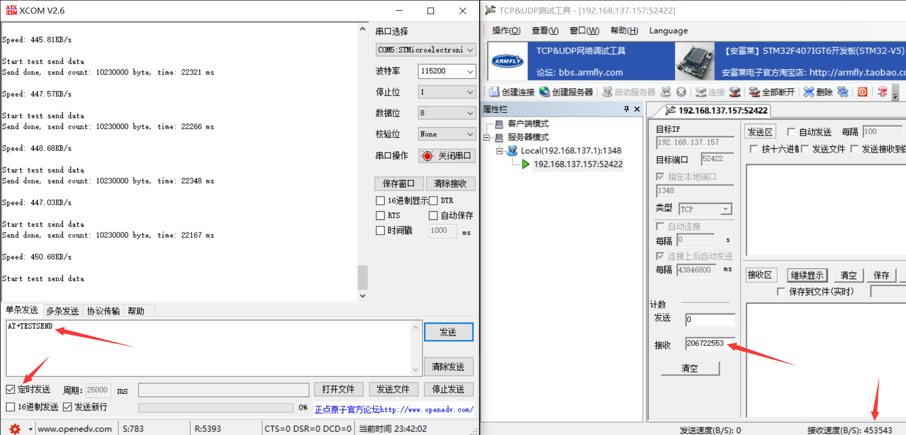

## DS-PPK_esp-at_01

## 关于

### SPI 发送方式

短的SPI-AT协议的数据帧使用轮询传输，其中传输数据at_spi_master_send_data() 和 at_spi_master_recv_data() 的 data 段 数据量可能较大，即可使用轮询传输也可使用DMA传输，在后文有对比测试

备注：SPI CLK 40MHz，一次发送 4092 bytes 耗时比 0.8184ms 多一点

### AT指令

USB发送AT指令即可，命令解析使用 H750VBT6_ST_USB_CDC_01 工程的实现

###  TCP 透传发送速度测试指令

```
AT+TESTSEND
```

前提条件：需要在电脑上创建一个TCP服务端，并将ESP32-C3设置为TCP客户端透传模式，例如：

```
AT+CWMODE=1
AT+CWJAP="WIFI_NAME","1234567890"
AT+CIPSTA?
AT+CIPSTART="TCP","192.168.101.229",1347
AT+CIPMODE=1
AT+CIPSEND
```

退出透传单独发送 `+++` 即可，发送后 H750 USB会打印：

```c
Exit transparent transmission, please wait at least 1000ms.
```

## 测试

### SPI-AT默认设置

**TCP透传速度：发送**

> SPI 全部使用轮询传输

台式机7260AC无线网卡开热点，天线距离从 10cm 加到 1米5，发送10240000byte数据耗时33秒以内，吞吐量全程稳定 300KB/s


### SPI-AT 高性能配置

> SPI全部使用轮询传输

在本工程目录的 esp-at_buid_sdkconfig 文件夹下有配置好的 sdkconfig 文件，编译 SPI-AT 时使用此配置文件替换掉默认的

> 1. 编译器优化等级：O2
>
> 2. CONFIG_LWIP_IRAM_OPTIMIZATION 默认没有使能，改为`CONFIG_LWIP_IRAM_OPTIMIZATION=y`
>
> 
>
> 3. 其他按照 [如何提高 ESP-AT 吞吐性能](https://docs.espressif.com/projects/esp-at/zh_CN/latest/esp32c3/Compile_and_Develop/How_to_optimize_throughput.html) 选择性配置
>
> 4. 隐患：压力测试一段时间后，退出透传，使用 AT+SYSRAM? 查询 IRAM
>
>    ```c
>    [13:36:34.027] ESP (404562) SPI AT Master: +SYSRA
>    [13:36:34.027] M:137936,272
>    ```
>
>    堆空间历史最少可用 272byte，不过好在压力测试 100次后依旧稳定

**TCP透传速度：发送**

压力测试，每次约10MB，发送100次后稳定，全程在450KB/s


at_spi_master_send_data() 和 at_spi_master_recv_data() 的 data 段 数据由轮询传输改为DMA传输，测试200MB数据：速度与阻塞模式几乎一样



## BUG

### 发任何AT指令ESP32-C3无响应（1）

上电开机时，打印如下信息

```
ESP (37093) SPI AT Master: now direct:255
```

之后发任何AT指令ESP32-C3无响应

**解决方法：**

控制ESP32-C3复位后，强行发送一次：

```c
at_spi_rddma_done();
```

### 压力测试时usbServerTask()强行被挂起

压力测试时，发送 AT+TESTSEND 命令 H750 的协议解析函数打断点也无反应，但是ESP32-C3没有死机，查看发现H750的 usbServerTask()强行被挂起，无法回到阻塞态


解决方法：在ASCII命令解析函数内加入 osDelay(xxx)，具体时间需要根据实际需求配置

```c
    else if(_cmd[0] == 'A' && _cmd[1] == 'T')
    {
    	std::string s(_cmd);
        if (s.find("AT+TESTSEND") != std::string::npos)
        {
...
			const uint16_t cnt = 2500;
			for(int i=0;i< cnt;i++) {
				// send data to spi task
				write_data_to_spi_task_tx_ring_buf(send_buffer, WRITE_BUFFER_LEN);
				notify_slave_to_recv();
...
				/*
				 * 配置 WRITE_BUFFER_LEN    4092
				 * 10230000Byte数据分2500次数据发完约22.4S，每8.96ms进行一次SPI传输
				 * 在实际使用场景下，为了不阻塞其他低优先级轮询任务，
				 * 这里设为8ms调度间隔，实测全程稳定440KB/s以上
				 */
				osDelay(8);
			}
...
    }
```

### 发送和接收大量数据的函数 改为 DMA 模式后，发送 AT命令失败

是 esp_at.cpp 中的以下两个函数

```
static void at_spi_master_send_data(uint8_t* data, uint16_t len)
static void at_spi_master_recv_data(uint8_t* data, uint16_t len)
```

data_transfer_mode 都改为 TRANSFER_MODE_DMA

```
	.data_transfer_mode = TRANSFER_MODE_DMA,	/* 数据量可能较大，使用DMA传输 */
```

之后发送 AT 命令无反应，检查后DMA中断使能正常，但就是进不到`void HAL_SPI_TxRxCpltCallback(SPI_HandleTypeDef *hspi)`中断，

**解决方法：**

经检查是 CubeMX自动生成代码的顺序BUG！！`MX_DMA_Init();` 必须要在 ` MX_SPI2_Init();` 之前调用，否则SPI DMA传输无法进入 HAL_SPI_TxRxCpltCallback()！！！重新调整 main()函数中的顺序如下后解决

```c
  /*
   * Warning! the CubeMX call the initializations of the elments in the wrong order
   * first:  MX_USART1_UART_Init(); next: MX_DMA_Init(); then DMA trans RX buffer can't work
   * https://github.com/MaJerle/stm32-usart-uart-dma-rx-tx/issues/21
   */
  MX_DMA_Init();
  MX_SPI2_Init();				// SPI Init After DMA Init
```