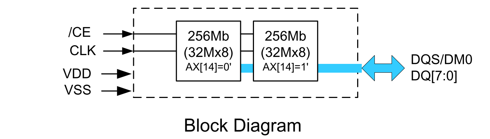
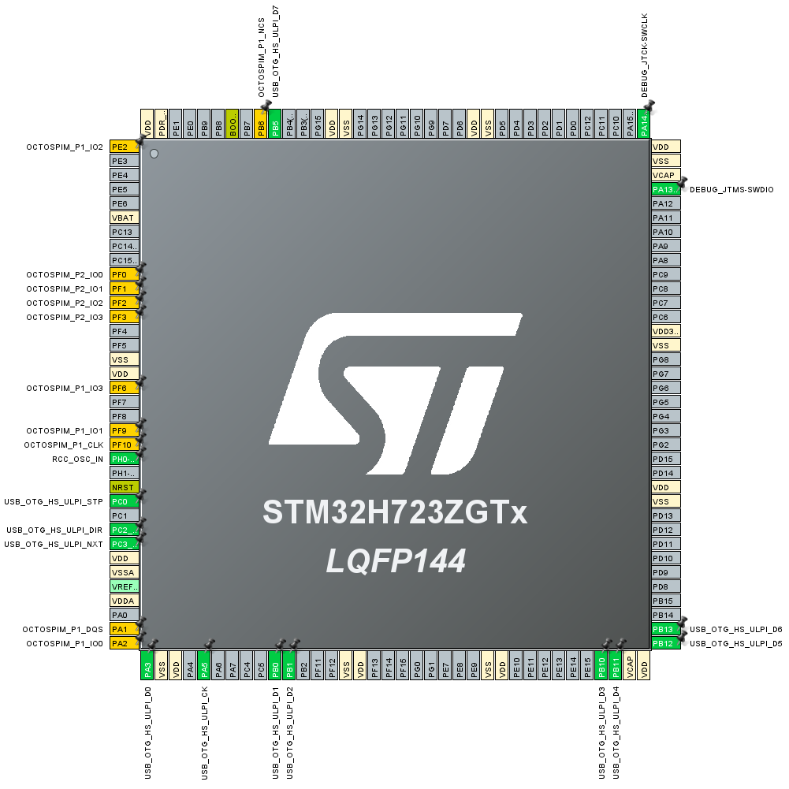
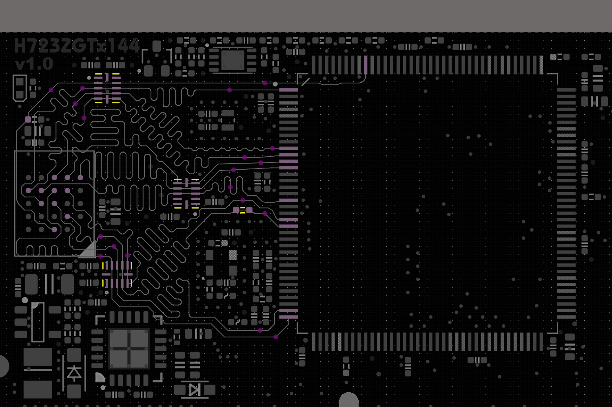

## H750IBK6_SDRAM_01

在 H750IBK6_ST_USB_CDC_FS_01 工程的基础上加入 SDRAM 性能测试 Demo

## 参考

- [H750IBK6_SDRAM_01](https://github.com/oldgerman/workspace_H7/tree/master/H750IBK6_SDRAM_01)：使用其内存读写测速算法

- H723ZGx144_ST_USB_HS_CDC_01：在此工程基础上进一步配置本工程

- [STM32H7S78-DK](https://www.st.com.cn/zh/evaluation-tools/stm32h7s78-dk.html#overview)：[STM32CudeH7RS](https://github.com/STMicroelectronics/STM32CubeH7RS)

  > CubeMX配置：[XSPI_PSRAM_MemoryMapped.ioc](https://github.com/STMicroelectronics/STM32CubeH7RS/blob/ccf5970b1722483e6798b48e106267d6997de375/Projects/STM32H7S78-DK/Examples/XSPI/XSPI_PSRAM_MemoryMapped/XSPI_PSRAM_MemoryMapped.ioc#L183)

- [RM0468：STM32H723_733-STM32725_735_STM32H730-value-line-advanced-armbased-32bit-mcus-stmicroelectronics.pdf](https://www.st.com/resource/en/reference_manual/rm0468-stm32h723733-stm32h725735-and-stm32h730-value-line-advanced-armbased-32bit-mcus-stmicroelectronics.pdf)

  > **25.4.10 OCTOSPI Memory-mapped mode**
  >
  > > No more than 256 Mbytes can be addressed even if the external device capacity is larger
  > >
  > > 可寻址256MB，本工程使用APS512XXN-OBRx容量为64MB
  >
  > **25.4.14 OCTOSPI Regular-command mode configuration**
  >
  > > Memory-mapped mode configuration
  
- [AN5050：getting-started-with-octospi-hexadecaspi-and-xspi-interface-on-stm32-mcus-stmicroelectronics.pdf]()

  > **5.2 OCTOSPI/HSPI/XSPI configuration for Regular-command protocol** 
  >
  > > 用于后续CubeMX配置参考
  >
  > **Table 2. OCTOSPI main features**
  >
  > > H723在DTR模式最大OCTOSPI时钟速率为100MHz
  > >
  > > Max OCTOSPI speed (MHz)：Regularcommand DTR mode with DQS HyperBus protocol with single-ended clock (3.3 V)：**100**
  >
  > **Table 8. STM32CubeMX - Configuration of OCTOSPI parameters (continued)**
  >
  > > 需要参考此表格配置CubeMX！！！
  > >
  > > 不要参考 XSPI_PSRAM_MemoryMapped.ioc，因为这个只配置的一些参数不是直接用的，STM32CudeH7RS里有BSP库会重新配置

- [APS512XXN-OBRx DDR Octal SPI PSRAM.pdf](https://www.mouser.com/datasheet/2/1127/APMemoryTechnology_PSRAM_OPI_Xccela_512Mb-2949655.pdf?srsltid=AfmBOor4EruDLGH66vL61IW1UU-ASaQj8ZJVCwmXzOOpWG5ya3ZSKWmD)

  > 该芯片内部合封两个256Mb的die
  >
  > > x8使用时需要注意：**RA[14] boundary cross is NOT supported between 2 dies.**
  > >
  > > Organization: 
  > >
  > > 512Mb in X8 mode (default) 
  > >
  > > - 64M x 8bits with 2048 bytes per page
  > >
  > > - Column address: AY0 to AY10
  > >
  > > - Row address: AX0 to AX14
  > >
  > >   > 通过 AX[14]=0和AX[14]=1对合封两个256Mb的die进行分别访问
  > >   >
  > >   > 
  >
  > Table 4: Read Latency Type
  >
  > Table 5: Read Latency Codes MR0[5:2]
  >
  > > MR0[4:2]：用于限制最大输入时钟、延迟值
  >
  > Table 17: PASR MR4[2:0]
  >
  > > 给出512Mb X8、512Mb X16模式下，刷新策略的命令配置
  >
  > Table 19: IO X8/X16 Mode MR8 [6]
  >
  > > 默认上电8线模式，随时可通过命令进入或退出16线模式
  > >
  > > **Device powers up in X8 mode**, MR8[6]=0. After power up device can be configured to X16 mode by setting MR8[6]=1 via mode register write command. Host can switch in and out of X16 mode any time after power up.
  >
  > 7.7 AC Characteristics 
  >
  > > Table 30: READ/WRITE Timing
  > >
  > > 普通时序表，主要注意 tCEM（CE# low pulse width）最小值是3倍tCLK，我参考XSPI_PSRAM_MemoryMapped.ioc配置为5
  > >
  > > Table 31: DDR timing parameters
  > >
  > > DDR模式时序表：主要是DQS

- 

## PSRAM 配置

按照核心板的PSRAM焊盘，在CubeMX中进行PSRAM管脚配置，橙色引脚即是

|  |  |
| ------------------------------------------------ | ------------------------------------------- |

- Fifo Threshold：范围 [1,32]，本工程配置为 4

  > [如何配置 OCTOSPI 的 FIFO 阈值](https://community.st.com/t5/stm32-mcus-products/how-to-config-the-fifo-threshold-of-octospi/td-p/118241)
  > 
  >> ...FIFO 级别可以控制 IRQ 或 DMA 的节奏/调节，这样它们就不会因为每个字节而持续受到冲击，而且您可以在单个事务中塞入大量数据
  > >
  >> ...FIFO 级别是触发中断的阈值。如果将其设置为 1 字节，则会每传输一个字节就触发一次中断。通常，您需要根据应用程序来配置该级别。例如，如果您知道要传输图像（例如 RGB888 格式），则可以将 FIFO 设置为 3 之类的值。
  > 
  > STM32H7S78-DK 官方示例的 [XSPI_PSRAM_MemoryMapped.ioc](https://github.com/STMicroelectronics/STM32CubeH7RS/blob/ccf5970b1722483e6798b48e106267d6997de375/Projects/STM32H7S78-DK/Examples/XSPI/XSPI_PSRAM_MemoryMapped/XSPI_PSRAM_MemoryMapped.ioc#L183) 配置为 4 
  
- Dual Quad mode：没有对OSPI1和OSPI2复用数据线，此项默认Disable

- Memory Type：配置为 AP Memory

- Device Size：范围 [1,32]

  > *Device Size* defines the memory *size* in number of bytes = $2^{[DEVSIZE+1]}$
  >
  > 本工程使用APS512XXN-OBRx容量为64MB，配置为$log_2(64 \cdot 1024 \cdot 1024)=26$

- Chip Select High Time：2

  > APS512XXN-OBRx DDR Octal SPI PSRAM.pdf 的 7.7 AC Characteristics 表格中 tCPH（CE# HIGH between subsequent burst operations）在133MHz下最小值是15ns，我跑在100MHz下时钟周期是10ns，配置为2
  >
  > AN5050：
  >
  > 1. Switching duration clock number (REQ2ACK_TIME) defining, in Multiplexed mode, the time between two transactions. The value is the number of the OCTOSPI clock cycles.

- Free Running Clock：Disable

  > AN5050：
  >
  > 调谐过程中必须使用 free-running clock
  >
  > During the tuning process, the free-running clock must be enabled.
  >
  > **Table 8. STM32CubeMX - Configuration of OCTOSPI parameters (continued)**
  >
  > Free running clock：Disable

- Clock Mode：Low

- Wrap Size

- Clock Prescaler：STR模式下范围[,255]，DTR模式下范围[1,256]，配置为1

  > 本工程直接使用时钟树的200MHz时钟，DTR模式下默认分频1，OCTOSPI时钟100MHz
  >
  > AN5050：
  >
  > **Clock configuration**
  >
  > $OCTOSPIx/HSPI/XSPIx\_CLK = F_{Clock_source} / (PRESCALER + 1)$

- Sample Shifting：用DTR模式，禁用

  > AN5050：
  >
  > Sample shifting (SSHT) recommended to be **enabled in STR** mode and **disabled in DTR mode**

- Delay Hold Quarter Cycle：用DTR模式，启用

  > AN5050：
  >
  > 7.Delay hold quarter cycle (DHQC) **enabled in DTR** mode and **disabled in STR** mode.
  >
  >  DTR模式下需要使能

- Chip Select Boundary：配置为11

  > AN5050：
  >
  > CSBOUND: can be used to limit a transaction of aligned addresses in order to respect some memory page boundary crossing.
  >
  > Chip select boundary (CSBOUND) configured depending on the memory datasheet. The chip select must go high when crossing the page boundary ($2^{CSBOUND}$ bytes defines the page size).
  >
  > > 片选边界 (CSBOUND) 的配置取决于存储器数据手册，并且是 RAM 存储器所必需的。当跨越页边界时，片选信号必须变为高电平（$2^{CSBOUND}$ bytes定义页大小）。
  >
  > 这个暂时不知道怎么配置，PSRAM数据表：Table 21: Row Boundary Crossing Read Enable MR8[3]：In X8 mode column address range is 2K (CA=’h000 -> ‘h7FF) and it is 1K (CA=’h000 -> ‘h3FF) in X16 mode，暂且配置为$log_2(2 \cdot 1024)=11$，
  >
  > 但XSPI_PSRAM_MemoryMapped.ioc 配置的8KBytes，这个为什么不配置为1K等后续研究一下

- Delay Block：配置为Enable

  > AN5050：
  >
  > For Octo-SPI AP Memory device configuration, the delay block must be enabled to compensate the DQS skew. For detailed examples, refer to Section 7.
  >
  > 对于 Octo-SPI AP 存储器设备配置，必须启用延迟模块以补偿 DQS 偏移。详细示例请参见第 7 节。

- Maximum Transfer：对于AP Memory是 N/A，随便配置一个0

- Refresh Rate：计算出是200，需留1的余量，配置为201

  > AN5050
  >
  > > **Table 8. STM32CubeMX - Configuration of OCTOSPI parameters (continued)**
  > >
  > >  241 (4 μs)
  > >
  > > 9. Refresh rate (REFRESH) required for PSRAMs memories. The chip select must go high each (REFRESH x OCTOSPI clock cycles), configured depending on the memory datasheet.
  >
  > [octospi 配置 cubemx](http://community.st.com/t5/stm32cubemx-mcus/octospi-configuration-cubemx/td-p/142361)
  >
  > > 刷新率的值可以在数据手册中找到，对于APMemory来说，它是参数tCEM（CE#低脉冲宽度），对于我的内存来说，它的值为4µs
  > >
  > > $1/104MHZ = 9.62ns = octospi clock cycle$
  > >
  > > $Refresh = Refresh rate/ octospi clock cycle  = 4µs/9.62ns = 4µs/(1/(104MHZ)) = 416$
  > > 选择刷新值 417 或 418，别问我为什么。
  >
  > APS512XXN手册
  >
  > > 7.7 AC Characteristics 
  > >
  > > tCEM：2us
  > >
  > > 那么可根据上面的参考帖子公式计算为200，再参考AN5050 的 Table 8留1的余量，取201

