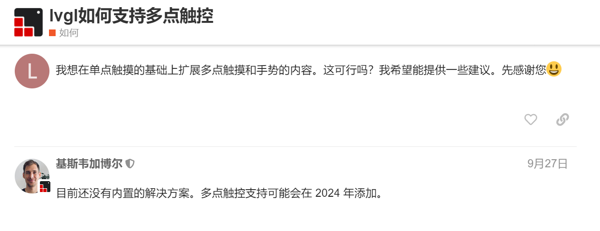
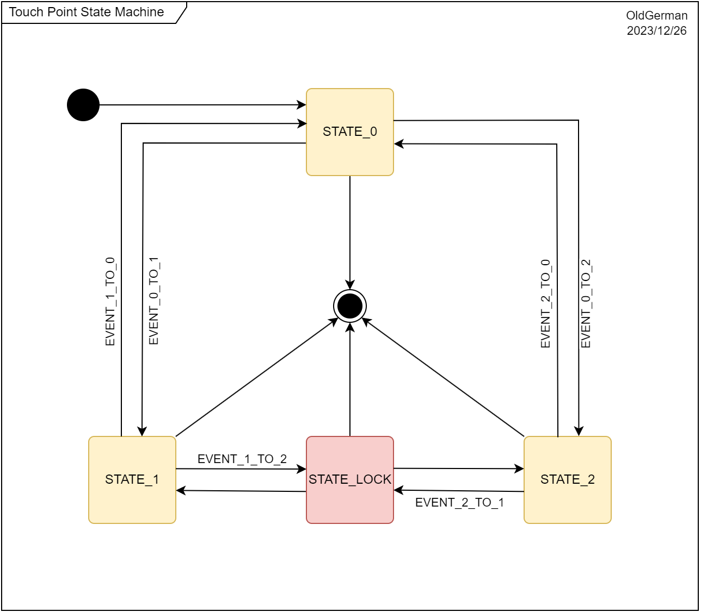
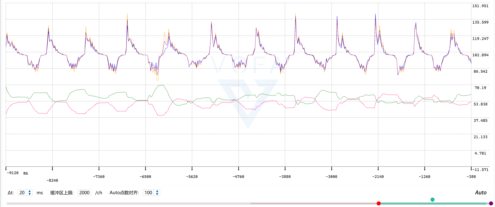
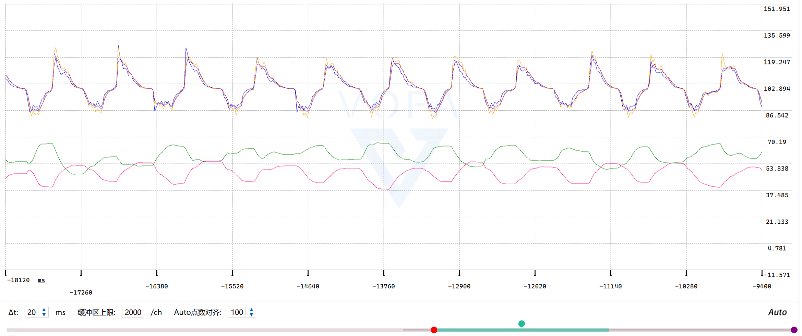
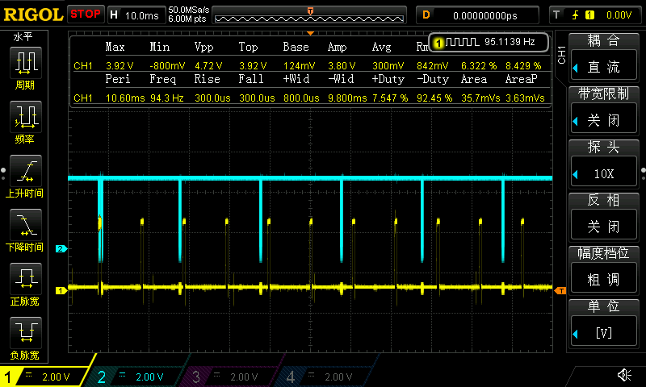
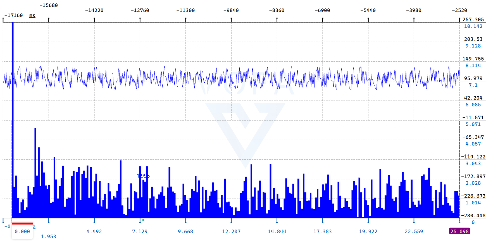
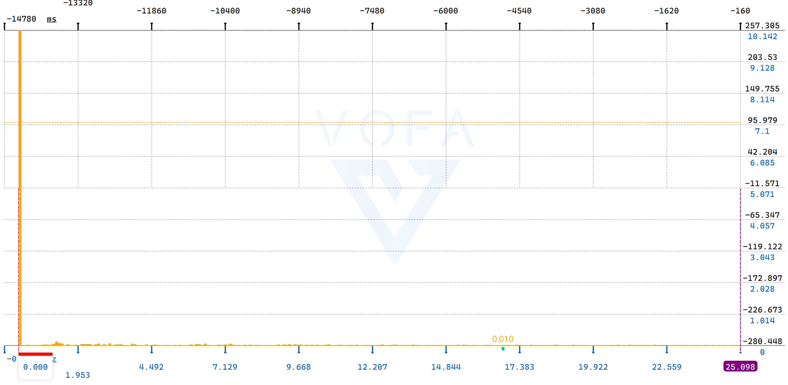
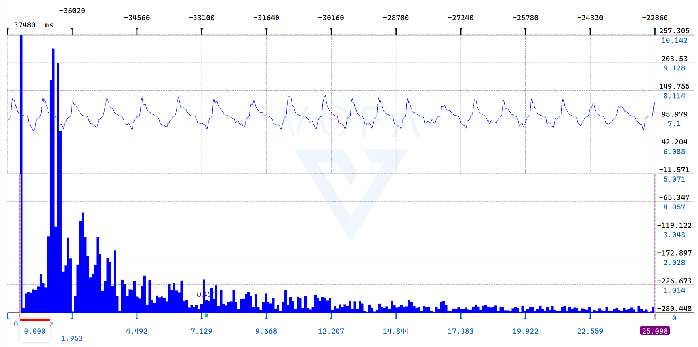
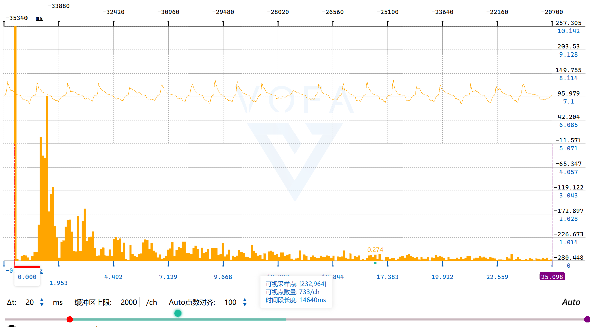

## H750IBK6_LCD_RGB_SPI_720x720_HD395004C40_02

> 2023/12/19 - 2023/12/26 OldGerman

## 关于

原因：

- LVGL 8.3 的 [Chart 控件](https://docs.lvgl.io/8.3/widgets/extra/chart.html#overview) 比较强大，我想用触屏多点缩放来控制它

目前有啥可以借鉴的：

- 截止于2023年12月26日，LVGL 官方版本仍然不支持多点触控，我未在公开网络上搜到使用 LVGL 多点触控缩放的展示
- 

定个小目标：

- 实现任意焦点的两点触摸缩放 LVGL 的 Chart 控件，不能修改 LVGL 8.3 库的任何代码

实现迭代：

- 第一版：用 if-else写了一版发现嵌套太深，逻辑比较混乱
- 第二版：改用有限状态机重写，分为4种状态，7种事件，并加了好像没啥卵用的滤波器，这些代码打包到 [TouchPointFSM](https://github.com/oldgerman/workspace_H7/tree/master/H750IBK6_LCD_RGB_SPI_720x720_HD395004C40_02/Algorithms/TouchPointFSM)

## 触摸点状态机模型



源文件：[TouchPointFSM.drawio](https://github.com/oldgerman/workspace_H7/tree/master/H750IBK6_LCD_RGB_SPI_720x720_HD395004C40_02/Images/TouchPointFSM.drawio)

## 滤波器

对两点的数据使用卡尔曼滤波器处理，以对角线缩放测试：

滤波前



滤波后



## GT911 检测手指持续按下？

GT911没有检测手持续按在屏幕上的寄存器，取而代之，只要手指放在屏幕上，GT911 的中断引脚就会产生 10ms 周期的短脉冲信号，若 H750 响应此中断后立即读取 GT911 ，坐标可读数却可能是 0~5，因此由坐标可读数量判断手持续放在屏幕是行不通的，得用一定深度的消息队列，在中断中写消息，在触摸驱动回调函数中取消息，当消息队列为空时判定手指离开屏幕

波形：

黄色波形：GT911 的中断脉冲信号，蓝色波形，H750 读 GT9111 的 I2C时钟信号



[touchpad.cpp](https://github.com/oldgerman/workspace_H7/blob/master/H750IBK6_LCD_RGB_SPI_720x720_HD395004C40_02/Bsp/hal_stm_lvgl/touchpad/touchpad.cpp) 节选代码：

```c
void HAL_GPIO_EXTI_Callback(uint16_t GPIO_Pin)
{
    if (GPIO_Pin == EXTI11_Pin)
    {
        /* 向消息队列写消息，通知写事件 */
        static const uEventTouched_t msg = true;
        osMessageQueuePut(
            xMsgQueueTouched,
            &msg, // 指向消息的指针，会使用 memcpy 拷贝消息地址上的数据，不是直接传递地址
            0U,   // 消息优先级 0
            0U);  // 写阻塞时间
    }
}

static void touchpad_read(lv_indev_drv_t *indev, lv_indev_data_t *data)
{
    uEventTouched_t msg;
    osStatus_t osStatus;
    osStatus = osMessageQueueGet(xMsgQueueTouched, &msg, 0U, 0); // wait for message
    /* 消息队列有消息，判定为手指触摸屏幕 */
    if (osStatus == osOK)
    { 
        /* 两次取到消息后读 GT911 的间隔时间可能小于 10ms，小于 GT911 数据更新周期，会读出异常的数据 */
        static TickType_t xLastWakeTime = xTaskGetTickCount();
        /**
         * 参数2是20ms，该延时时间必须大于GT911的更新中断脉冲周期10ms，
         * 若设为 10ms 则消息队列可能为 0，会使本实现失败（根据消息队列有消息来判断手持续放在屏幕上）
         */
        if (waitTimeOS(&xLastWakeTime, 20))
        {
            tp.read();
        }
        ...
    }
    /* 消息队列为空，判定为手指离开屏幕 */
    else
    {
        ...
    }
}
```

## 测试视频

[Demo_LVGL_Chart_multi_touch_zoom.mp4](https://github.com/oldgerman/workspace_H7/tree/master/H750IBK6_LCD_RGB_SPI_720x720_HD395004C40_02/Images/Demo_LVGL_Chart_multi_touch_zoom.mp4)

## 待改进

手指两点保持缩放比大致不变，拖移时，沿拖移方向的缩放高频噪声较大，例如x方向水平拖移

x方向缩放倍率波形：



此时 y方向缩放倍率波形：



如果是45度对角线缩放，x和y方向的高频噪声都较小：




