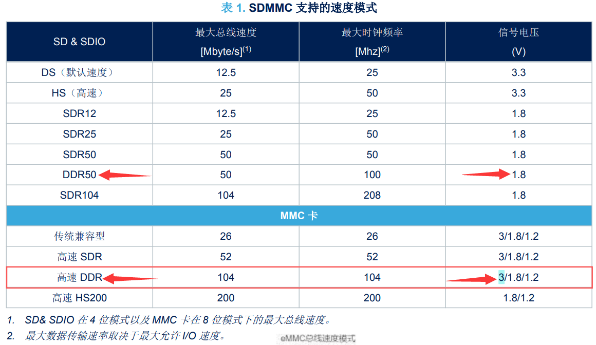

## 2024-01-09

eMMC 读写测试，200MHz SDMMC2 时钟，分频 4，eMMC时钟50MHz，SDR模式

```shell
$eMMC_TEST:8-bit
【测试 eMMC 读写速度】位宽：8-bit 
####################################################### 
#        eMMC Example: Write Read with DMA mode       # 
####################################################### 
 ****************** Start Write test ******************* 
 - Buffer size to write: 100 MB   
 - Write Time(ms): 4836  -  Write Speed: 21.17 MB/s  
 ******************* Start Read test ******************* 
 - Buffer size to read: 100 MB   
 - Read Time(ms): 4471  -  Read Speed: 22.90 MB/s  
 ********************* Check data ********************** 
 - Check data OK  

$eMMC_TEST:4-bit
【测试 eMMC 读写速度】位宽：4-bit 
####################################################### 
#        eMMC Example: Write Read with DMA mode       # 
####################################################### 
 ****************** Start Write test ******************* 
 - Buffer size to write: 100 MB   
 - Write Time(ms): 9015  -  Write Speed: 11.36 MB/s  
 ******************* Start Read test ******************* 
 - Buffer size to read: 100 MB   
 - Read Time(ms): 8657  -  Read Speed: 11.83 MB/s  
 ********************* Check data ********************** 
 - Check data OK  

$eMMC_TEST:1-bit
【测试 eMMC 读写速度】位宽：1-bit 
####################################################### 
#        eMMC Example: Write Read with DMA mode       # 
####################################################### 
 ****************** Start Write test ******************* 
 - Buffer size to write: 100 MB   
 - Write Time(ms): 34157  -  Write Speed: 3.00 MB/s  
 ******************* Start Read test ******************* 
 - Buffer size to read: 100 MB   
 - Read Time(ms): 33863  -  Read Speed: 3.02 MB/s  
 ********************* Check data ********************** 
 - Check data OK  
 

```

eMMC 读写测试，200MHz SDMMC2 时钟，分频 2，eMMC时钟100MHz，DDR模式

```shell
$eMMC_TEST:8+0
【测试 eMMC 读写速度】位宽：8-bit 
####################################################### 
#        eMMC Example: Write Read with IT mode       # 
####################################################### 
 ****************** Start Write test ******************* 
 - Buffer size to write: 100 MB   
 - Write Time(ms): 2600  -  Write Speed: 39.38 MB/s  
 ******************* Start Read test ******************* 
 - Buffer size to read: 100 MB   
 - Read Time(ms): 2280  -  Read Speed: 44.91 MB/s  
 ********************* Check data ********************** 
 - Check data OK  
```

## eMMC参考资料

[2019-12-12：STM32H7的SDIO驱动eMMC，有个DDR双时钟，实际库配置怎么没双时钟参数](https://www.armbbs.cn/forum.php?mod=viewthread&tid=95927)

> 后续：
>
> [2020-1-13：测试下eMMC的DDR双时钟沿模式是否修正了（经测试可以使用DDR了）](https://www.armbbs.cn/forum.php?mod=viewthread&tid=96258&highlight=DDR)
>
> > 可以使用**DDR**了，但是无法在50MHz，8线SDIO DMA情况下使用DDR。
> >
> > 只有 50MHz 1线 SDIO之类，降低速度的配置，可以使用DDR，也是修正DDR了

[2019-12-14：H7的8线SDIO DMA驱动eMMC的裸机性能，读43MB/S，写18.8MB/S](http://www.armbbs.cn/forum.php?mod=viewthread&tid=95953)

> 注意：
> **对于写操作，每次DMA的block不要太大，太大反而慢。**

[2019-12-14：【普及贴】各个厂家eMMC读写速度，镁光，东芝，三星，ISSI和旺宏](http://www.armbbs.cn/forum.php?mod=viewthread&tid=95954&)

> 这几个厂家里面4GB容量的情况下，写速度最快的就是镁光和东芝，都是14MB/S。
>
> 我们使用H7-TOOL驱动东芝的4GB容量型号，写速度是18.8MB/S，完全拿得出手。

CubeMX SDMMC配置硬件流控的作用

> ## AN5200：
>
> SDMMC 主机接口和硬件流控
>
> 硬件流控制功能用于避免 FIFO 下溢（发送模式）和上溢（接收模式）错误。
>
> SDMMC_hclk 必须遵循以下关系： 	
>
> SDMMC_hclk >（（3x 总线宽度/ 32）x SDMMC_CK（CK是引脚的速率，比如50MHz））。 
> **启用硬件流控时，SDMMC_hclk 会略微减小，此操作不会导致数据错误，但是会降低 SDMMC 数据传输速度**。 
> 以 CPU 时钟频率 = SDMMC_hclk = 37.5 Mhz 的 DMA 模式下的数据传输为例，启用硬件流控时，CPU 时钟频率 可达到 SDMMC_hclk = 20 MHz，但是数据传输速度会降低 33%。 
> 提示 仅当 SDMMC_Dn 数据与 SDMMC_CK 循环对齐时，才应使用硬件流控。只要使用来自 DLYB 延迟模块的 sdmmc_fb_ck（如在 tOP 和 DtOP 延迟 > 1 个周期的 SDR104 模式下），便不能使用硬件流控。有关更多信息， 请参阅设备数据表。

[SDMMC1主频设置为100M，读87MB/s](https://www.armbbs.cn/forum.php?mod=viewthread&tid=95953&highlight=eMMC)

eMMC 具有 8 位的优势，并且 DDR 不需要 1.8V 运行



[H750-DK eMMC 8 位 DDR测试](https://community.st.com/t5/stm32-mcus-products/stm32h753vit6-sd-card-sdr104/td-p/614777)

> 还可以使用 8 位 eMMC DDR，在 SDR 模式下使用 52 MHz 时钟时读取速度可能接近 40 MBps
>
> 这是我去年为客户编写的子系统/基准应用程序。我也构建了 4 位和 8 位 DDR 版本，但这不是我的硬件，因此没有这些版本的工作台。但它是一个设计精良的系统，具有快速/高性能的 eMMC 部件和可靠的信号完整性。
>
> ```shell
> H75x eMMC Demo
> 
> Core=415000000, 415.00 MHz
> CPUID 411FC271 DEVID 450 REVID 2003
> Cortex M7 r1p1
> C0000038 2000B458 00000000
> 10110221 12000011 00000040
> FPU-D Single-precision and Double-precision
> STM32H7xx
> HCLK=207500000
> APB1=103750000
> APB2=103750000
> PLL1_P_CK=415000000, 415.00 MHz
> PLL1_Q_CK=207500000, 207.50 MHz
> PLL2_P_CK=0,   0.00 MHz
> PLL2_R_CK=0,   0.00 MHz
> FatFs Testing (68300)
> SystemCoreClock: 415000000
> APB1=103750000
> APB2=103750000
>    32.0 MB used
> Display Directory
> ----   32768000 /COUNTER.002
> CRC32 A534026F Memory Image
> 32768000 Bytes, 606929249 Cycles
> 22.41 MBps Write (FatFs)
> 1463 ms run time
> 22.40 MBps (Sanity Check)
> 20008618 20008620  2048 COUNTER.002
> ................................
> CRC32 A534026F PKZIP 5ACBFD90 COUNTER.002
> 32768000 Bytes, 611379494 Cycles
> 22.24 MBps Write (FatFs)
> 1473 ms run time
> 22.25 MBps (Sanity Check)
> 20008618 20008620  2048 COUNTER.002
> ................................
> CRC32 A534026F PKZIP 5ACBFD90 COUNTER.002
> COUNTER.002
> 32768000 Bytes, 342069216 Cycles
> 39.75 MBps Read (FatFs)
> 824 ms run time
> 39.77 MBps (Sanity Check)
> 32768000 Bytes, 342132698 Cycles
> 39.75 MBps Read (FatFs)
> 825 ms run time
> 39.72 MBps (Sanity Check)
> Done!
> PLL1_Q_CK=207500000, 207.50 MHz
> PLL2_R_CK=        0,   0.00 MHz
> SDMMC1_CK         2,  51.88 MHz
>  8-bit
> Infinite Loop...
> ```
>
> 好吧，更努力地挖掘，找到了 8 位 DDR。我认为这可能是金士顿设备，H750-DK 是一个物理速度较慢的部件（上限约为 33MBps）。使用 DWT CYCCNT 测量时间，交叉检查为毫秒 SysTick，以防循环计数器缠绕。
>
> ```c
> ..
> CRC32 A534026F Memory Image
> 32768000 Bytes, 477729376 Cycles
> 27.44 MBps Write (FatFs)
> 1194 ms run time
> 27.44 MBps (Sanity Check)
> 24008628 24008640  2048 COUNTER.002
> ................................
> CRC32 A534026F PKZIP 5ACBFD90 COUNTER.002
> 32768000 Bytes, 487373292 Cycles
> 26.89 MBps Write (FatFs)
> 1219 ms run time
> 26.88 MBps (Sanity Check)
> 24008628 24008640  2048 COUNTER.002
> ................................
> CRC32 A534026F PKZIP 5ACBFD90 COUNTER.002
> COUNTER.002
> 32768000 Bytes, 210764901 Cycles
> 62.19 MBps Read (FatFs)
> 527 ms run time
> 62.18 MBps (Sanity Check)
> 32768000 Bytes, 210747061 Cycles
> 62.19 MBps Read (FatFs)
> 527 ms run time
> 62.18 MBps (Sanity Check)
> Done!
> PLL1_Q_CK=200000000, 200.00 MHz
> PLL2_R_CK=        0,   0.00 MHz
> SDMMC1_CK         2,  50.00 MHz
>  8-bit DDR
> Infinite Loop...  Press R to Restart
> ```

H750 -DK -4位 DDR可以：

> [**In stm32h7 issue with SDMMC speed**](https://community.st.com/t5/stm32-mcus-products/in-stm32h7-issue-with-sdmmc-speed/td-p/276650)
>
> STM32H745I-DISCO 4GB (THGBMDG5D1LBAIL) 上的 eMMC
>
> ```shell
> 10.28 MBps Write (FatFs)
> 27.04 MBps Read (FatFs)
> PLL1_Q_CK=200000000, 200.00 MHz
> SDMMC1_CK     2, 50.00 MHz
>  8-bit 
> ```
>
> 我的 4 位 DDR 可以工作，8 位 DDR 则不能。
>
> [https://www.glynshop.com/erp/owweb/Daten/Datenblaetter/DRAM_FLASH_MEDIEN/10_Nand%20solution/05_Toshiba/01_Datenblaetter/01_Original/eMMC/eMMC_15nm/THGBMDG5D1LBAIL_20151201_1.00.pdf](https://www.glynshop.com/erp/owweb/Daten/Datenblaetter/DRAM_FLASH_MEDIEN/10_Nand solution/05_Toshiba/01_Datenblaetter/01_Original/eMMC/eMMC_15nm/THGBMDG5D1LBAIL_20151201_1.00.pdf)
>
> 提示，请给我一杯咖啡，或者三杯咖啡。[PayPal ](https://paypal.me/cliveone)[Venmo](https://www.venmo.com/u/cliveone) Up 对您认为有帮助的任何帖子进行投票，它会显示哪些内容有效。

[有人在 STM32L4P5G-DK 上获得 eMMC 读取速度超过 33 MBps（8 位 DDR）吗？](https://community.st.com/t5/stm32-mcus-products/anyone-got-the-emmc-on-the-stm32l4p5g-dk-reading-over-33-mbps-8/td-p/319051)

大佬的示例工程：

> [**使用板载 eMMC 作为可通过 USB 访问的大容量存储设备？**](https://community.st.com/t5/stm32-mcus-embedded-software/using-onboard-emmc-as-mass-storage-device-available-over-usb/td-p/61520)
>
> 
>
>  
>
> [特斯拉德罗宁](https://community.st.com/t5/user/viewprofilepage/user-id/33216)
>
> ‎2022-02-27 07:03 PM
>
> 这些是使用我在 Keil 中的 HAL H7 eMMC 端口完成的，而不是使用 CubeMX 样板代码生成器。
>
> https://github.com/cturvey/RandomNinjaChef/tree/main/STM32H745I_DISCO_eMMC
>
> > H745I-DISCO eMMC 演示
> >
> > 我在为客户端试验 8 位 DMA 和 DDR 以及基准测试/验证 eMMC 支持时制作的自定义构建。
> >
> > 通过 VCP 在 115200 8N1 进行串行调试
> >
> > MSC DEVICE 是 H747I-DISCO 的实验端口，带有从演示板合并的 MMC 代码，通过 ST-LINK 供电/调试，通过 USB-FS 连接器使用 MSC USB
> >
> > 还获得了在 H743ZI-NUCLEO（通过 Clam-Shell）、H750-DK 上运行的其他 eMMC 代码
> >
> > [sourcer32@gmail.com](mailto:sourcer32@gmail.com)
>
> MSC 设备可能需要更多工作，但应该说明概念验证
>
> 