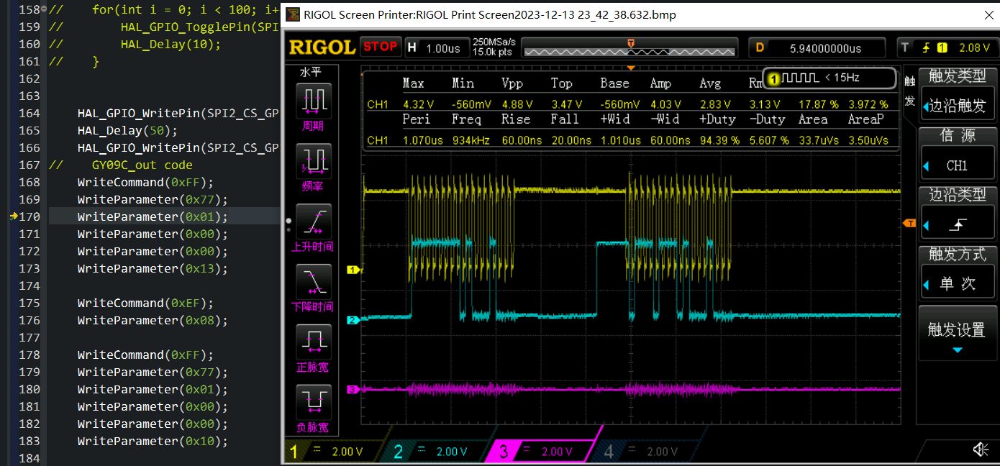
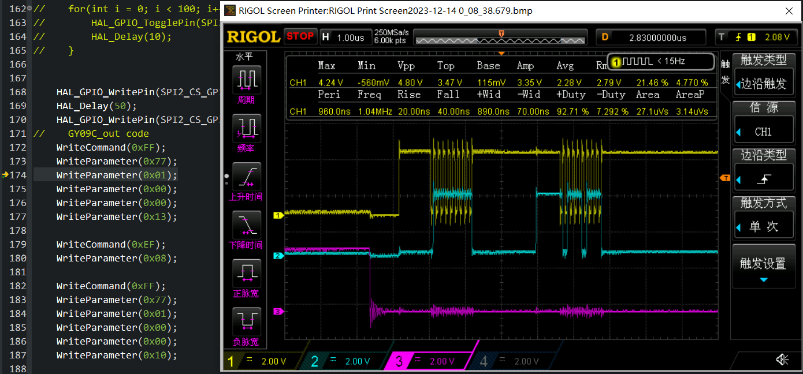

## H750IBK6_LCD_RGB_TL034WVS05_01

在 H750IBK6_SDRAM_01 工程的基础上加入冠显光电RGB屏 [TL034WVS05-B1477A](https://www.adafruit.com/product/5825) 测试 Demo

## 参考

- [Adafruit：Square RGB TTL TFT Display - 3.4" 480x480 No Touchscreen - TL034WVS05-B1477A](https://www.adafruit.com/product/5825)

  > ## Technical Details
  >
  > - [Display Init Code Listing](https://cdn-shop.adafruit.com/product-files/5825/C19625-001+1477_code.txt)
  > - [Display Spec Sheet](https://cdn-shop.adafruit.com/product-files/5825/Specification_TL034WVS05-B1477A.pdf)
  > - [ST7701 Datasheet](https://cdn-shop.adafruit.com/product-files/5825/ST7701+Datasheet.pdf)
  
- [ST7701芯片820*320屏幕移植stemwin](https://blog.csdn.net/qq_40831436/article/details/125770221)

- [捡屏幕第一弹——5寸480x854 ST7701屏](https://www.nxpic.org.cn/module/forum/thread-622198-1-1.html)

  > 该文中提到的 Github ST7701s 初始化代码的 仓库应该是 [yd03/sdk/driver/itp/itp_screen.c](https://github.com/tomyqg/yd03/blob/f471fceec1f7ea7ff51633583bbc0fb4e8583ae2/sdk/driver/itp/itp_screen.c#L278)

## ST7701 配置

### 9bit SPI

厂家屏幕模组的手册时序图就是坑爹的，得看 ST7701S 芯片的时序图，这货是 9bit SPI，比 8bit 多的一个位表示读写，0是命令，1是数据

> ST7701被配置为9位SPI。第一位区分命令与数据，CPOL、CPHA都是1

开始体现 H7 SPI 的强大之处，支持 4bit 到 32bit (1bit 步进)任意长度的 SPI，配置成 9bit 即可

实现写命令和写数据的两个函数：

```c
void WriteCommand(uint16_t data)
{
    data = data | 0x000; // bit[8]: 0 表示写命令

    if(HAL_SPI_Transmit(&hspi2, (uint8_t *)(&data), 1, HAL_MAX_DELAY) != HAL_OK)
    //                                              ^ 对于 9bit 硬件 SPI 传输长度取 1 ，不要写 2
    {
        Error_Handler();
    }
}

void WriteParameter(uint16_t data)
{
    data = data | 0x100; // bit[8]: 1 表示写数据

    if(HAL_SPI_Transmit(&hspi2, (uint8_t *)(&data), 1, HAL_MAX_DELAY) != HAL_OK)
    //                                              ^ 对于 9bit 硬件 SPI 传输长度取 1 ，不要写 2
    {
        Error_Handler();
    }
}
```

这里有个坑爹点，HAL_SPI_Transmit 的参数3 ——Size：给 1，而不是 2

> 抓下波试试，黄色波形是 SPI2_SCK，蓝色波形是 SPI2_MOSI
>
> ### Size 给 2 
>
> 断点处写命令0xFF、写数据0x77 的两段波形
>
> 可以看到每段 SCK 信号周期数为 18，每段波形的前9bit是想要产生的信号，后9bit是没有意义的信号
>
> 
>
> ### Size 给 1 
>
> 断点处写命令0xFF、写数据0x77 的两段波形
>
> 可以看到每段 SCK 信号周期数为 9
>
> 这个就是想要的 9bit 硬件 SPI :happy:
>
> 

### CS片选信号

每次发命令或参数时，都得拉低拉高一次

测试下面这种仅在那一长串初始化命令代码最前面和最后面拉低和拉高，不能正常亮屏：

> 参考： [yd03/sdk/driver/itp/itp_screen.c](https://github.com/tomyqg/yd03/blob/f471fceec1f7ea7ff51633583bbc0fb4e8583ae2/sdk/driver/itp/itp_screen.c#L278) 的 ST7701_PanelInitialCode() 函数：片选拉低后，发送命令和数据中途有几次调用延迟函数
>
> ```c
> void ST7701_PanelInitialCode(void)
> {
> 
>     // 控制复位引脚
>     LCD_Nreset (1);
>     usleep (10000);           //!< 延迟函数 100us
>     LCD_Nreset (0);
>     usleep (10000);           //!< 延迟函数 100us
>     LCD_Nreset (1);
>     usleep (120*1100);           //!< 延迟函数 120ms，复位后必须等待至少120ms
>     
>     // 片选拉低
>     ithGpioClear(CFG_GPIO_LCD_CS);
>     
>     // 写命令和数据
>     St7701_WriteCommand(0x11);
>     usleep (120*1000);           //!< 延迟函数
>     St7701_WriteCommand(0xFF);
>     St7701_WriteData(0x77);
>     St7701_WriteData(0x01);
>     St7701_WriteData(0x00);
> ......
>     St7701_WriteCommand(0xD0);
>     St7701_WriteData(0x88);
>     usleep(120*1000);             //!< 延迟函数
>     St7701_WriteCommand(0xEF);
>     St7701_WriteData(0x08);
>     St7701_WriteData(0x08);
>     St7701_WriteData(0x08);
>     St7701_WriteData(0x45);
>     St7701_WriteData(0x3F);
>     St7701_WriteData(0x54);
>     usleep(100*1000);           //!< 延迟函数
>     St7701_WriteCommand(0xE0);
>     St7701_WriteData(0x00);
>     St7701_WriteData(0x00);
>     St7701_WriteData(0x02);
> ......
>     St7701_WriteCommand(0xFF);
>     St7701_WriteData(0x77);
>     St7701_WriteData(0x01);
>     St7701_WriteData(0x00);
>     St7701_WriteData(0x00);
>     St7701_WriteData(0x00);
>     usleep(120*1000);           //!< 延迟函数
>     St7701_WriteCommand(0x29);
>     usleep(30*1000);            //!< 延迟函数
> 
>     // 片选拉低高
>     ithGpioSet(CFG_GPIO_LCD_CS);
> 
> }
> ```
>
