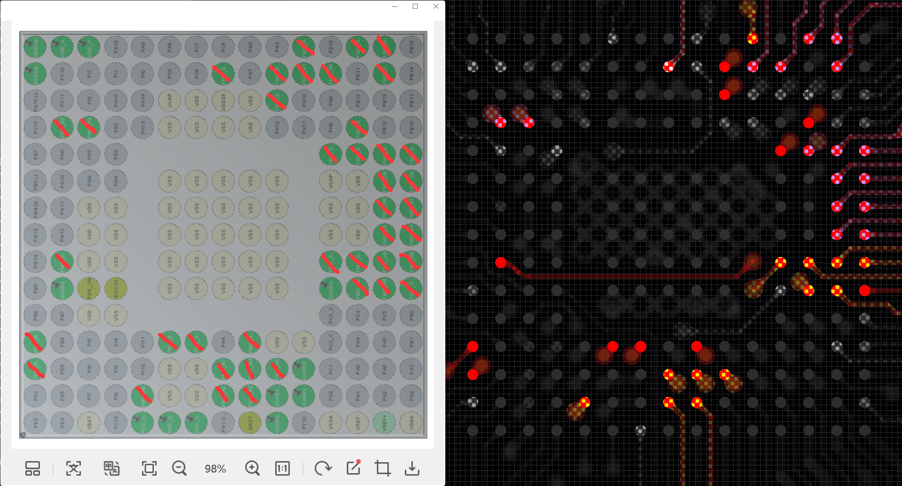
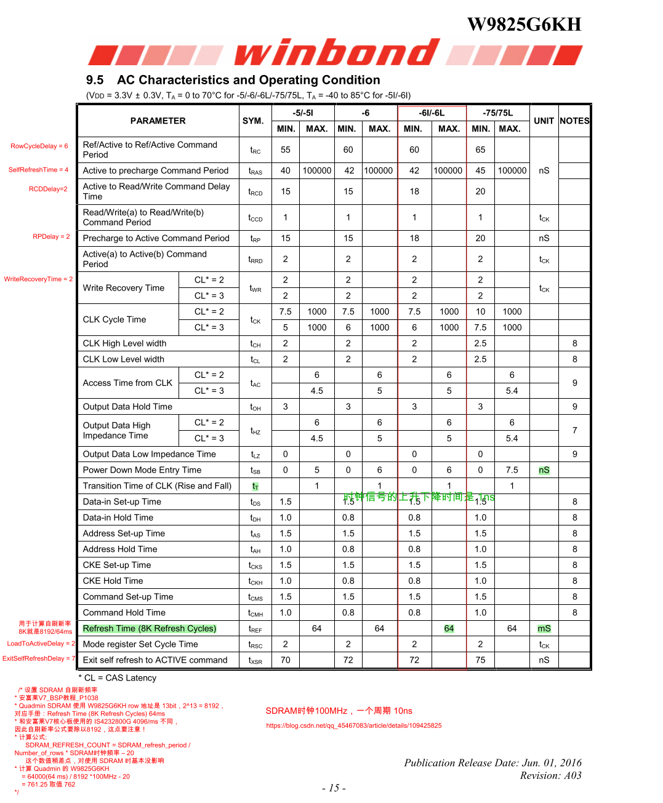
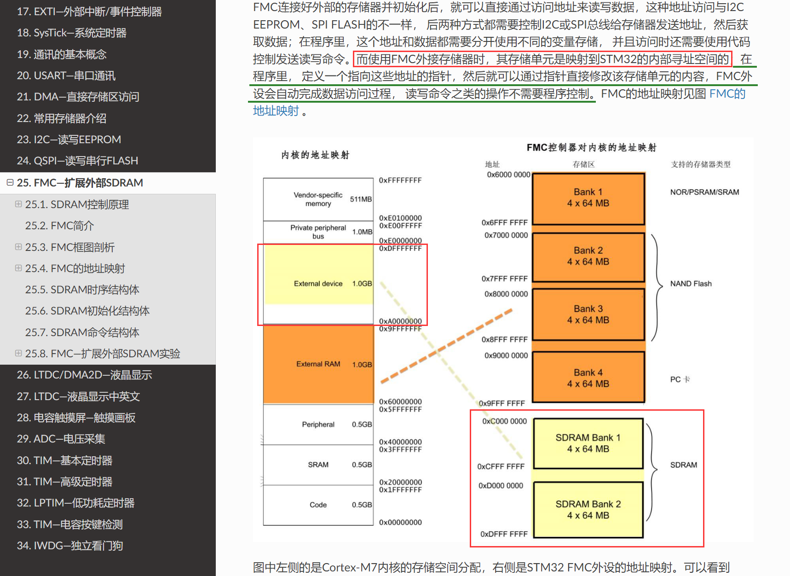

## H750IBK6_SDRAM_01

在 H750IBK6_ST_USB_CDC_FS_01 工程的基础上加入 SDRAM 性能测试 Demo

## 参考

- 安富莱STM32-V7示例工程：V7-023_外设32位带宽SDRAM性能测试（写每秒376MB，读每秒189MB）
- [反客STM32H750XBH6核心板（型号FK750M5-XBH6带SDRAM）](https://pan.baidu.com/s/1TfWv7UBd-s93Fam2EOGqKg?pwd=6666)
- [Github开源仓库：STM32_Nucleo144_Memory_Shield（这个扩展版简直了）](https://github.com/meerstern/STM32_Nucleo144_Memory_Shield/tree/master)
- [stm32cubemx读写SDRAM-W9825G6KH](https://blog.csdn.net/qq_45467083/article/details/109425825)

## SDRAM 配置

按照核心板的SDRAM焊盘，在CubeMX中进行SDRAM管脚配置



CPU主频400MHz，SDRAM时钟100MHz，一个周期就是10ns，根据W9825G6KH手册在CubeMX配置SDRAM的时序参数，两片SDRAM配置相同



然后得写对两片SDRAM写两个初始化函数，路径`H750IBK6_SDRAM_01\Bsp\sdram\sdram.c`

```c
void SDRAM_Initialization_sequence1(SDRAM_HandleTypeDef  *sdramHandle, uint32_t RefreshCount)
void SDRAM_Initialization_sequence2(SDRAM_HandleTypeDef  *sdramHandle, uint32_t RefreshCount)
```

其中参数2，是SDRAM自刷新率，计算公式：

```c
/* 设置 SDRAM 自刷新频率
 * 安富莱V7_BSP教程_P1038
 * Quadmin SDRAM 使用 W9825G6KH row 地址是 13bit，2^13 = 8192，对应手册：Refresh Time (8K Refresh Cycles) 64ms
 * 和安富莱V7核心板使用的 IS4232800G 4096/ms 不同，因此自刷新率公式要除以8192，这点要注意！
 * 计算公式:
      SDRAM_REFRESH_COUNT = SDRAM_refresh_period / Number_of_rows * SDRAM时钟频率 – 20
      这个数值稍差点，对使用 SDRAM 时基本没影响
 * 计算 Quadmin 的 W9825G6KH
    = 64000(64 ms) / 8192 *100MHz - 20
    = 761.25 取值 762
*/
```

MPU 对 两块 SDRAM 的地址空间也配置一下：



根据野火教程的图示，得配置 0xC0000000 和 0xD0000000 开始的 32MB 地址空间：

```c

void MPU_Config(void)
{
  ......
  /** Initializes and configures the Region and the memory to be protected
  */
  MPU_InitStruct.Number = MPU_REGION_NUMBER7;
  MPU_InitStruct.BaseAddress = SDRAM_BANK1_ADDR;
  MPU_InitStruct.TypeExtField = MPU_TEX_LEVEL0;
  MPU_InitStruct.IsBufferable = MPU_ACCESS_NOT_BUFFERABLE;

  HAL_MPU_ConfigRegion(&MPU_InitStruct);

  /** Initializes and configures the Region and the memory to be protected
  */
  MPU_InitStruct.Number = MPU_REGION_NUMBER8;
  MPU_InitStruct.BaseAddress = SDRAM_BANK2_ADDR;

  HAL_MPU_ConfigRegion(&MPU_InitStruct);
  /* Enables the MPU */
  HAL_MPU_Enable(MPU_PRIVILEGED_DEFAULT);

}
```

链接脚本可加入SDRAM段：

```c

/* Specify the memory areas */
MEMORY
{
......
  SDRAM1(rw)       : ORIGIN = 0xC0000000, LENGTH = 32M
  SDRAM2(rw)       : ORIGIN = 0xD0000000, LENGTH = 32M
}

/* Define output sections */
SECTIONS
{
......
  .sdram1 (NOLOAD) :
  {
    . = ALIGN(8);
    *(.sdram1)
    *(.sdram1.*)
    . = ALIGN(8);
  } >SDRAM1
  
  .sdram2 (NOLOAD) :
  {
    . = ALIGN(8);
    *(.sdram2)
    *(.sdram2.*)
    . = ALIGN(8);
  } >SDRAM2
......
}

```

## 测试SDRAM

使用反客科技H750XBH6板子的测试示例代码：示例程序\FMC—SDRAM测试\Core\Src\main.c

TIM7 产生 20KHz 的中断用于统计FreeRTOS CPU利用率，对SDRAM读写测速有细微影响

### SDRAM 时钟 100MHz

关闭统计CPU利用率的TIM7，编译开-O0优化

```shell
[15:16:23.980] $SDRAM_TEST
[15:16:23.980] 
[15:16:23.980] 测试SDRAM1: 
[15:16:23.980] *****************************************************************************************************
[15:16:23.980] 进行速度测试>>>
[15:16:24.358] 以16位数据宽度写入数据，大小：32 MB，耗时: 378 ms, 写入速度：84.66 MB/s
[15:16:24.952] 读取数据完毕，大小：32 MB，耗时: 593 ms, 读取速度：53.96 MB/s
[15:16:24.952] *****************************************************************************************************
[15:16:24.952] 进行数据校验>>>
[15:16:25.756] 16位数据宽度读写通过，以8位数据宽度写入数据
[15:16:25.756] 写入完毕，读取数据并比较...
[15:16:25.756] 8位数据宽度读写通过
[15:16:25.756] SDRAM读写测试通过，系统正常
[15:16:25.756] 
[15:16:25.756] 测试SDRAM2: 
[15:16:25.756] *****************************************************************************************************
[15:16:25.756] 进行速度测试>>>
[15:16:26.134] 以16位数据宽度写入数据，大小：32 MB，耗时: 378 ms, 写入速度：84.66 MB/s
[15:16:26.727] 读取数据完毕，大小：32 MB，耗时: 594 ms, 读取速度：53.87 MB/s
[15:16:26.727] *****************************************************************************************************
[15:16:26.727] 进行数据校验>>>
[15:16:27.531] 16位数据宽度读写通过，以8位数据宽度写入数据
[15:16:27.531] 写入完毕，读取数据并比较...
[15:16:27.531] 8位数据宽度读写通过
[15:16:27.532] SDRAM读写测试通过，系统正常
```

关闭统计CPU利用率的TIM7，编译开-O3优化

```shell
[12:55:03.256] $SDRAM_TEST
[12:55:03.256] 
[12:55:03.256] 测试SDRAM1: 
[12:55:03.256] *****************************************************************************************************
[12:55:03.256] 进行速度测试>>>
[12:55:03.428] 以16位数据宽度写入数据，大小：32 MB，耗时: 172 ms, 写入速度：186.05 MB/s
[12:55:03.705] 读取数据完毕，大小：32 MB，耗时: 276 ms, 读取速度：115.94 MB/s
[12:55:03.705] *****************************************************************************************************
[12:55:03.705] 进行数据校验>>>
[12:55:04.089] 16位数据宽度读写通过，以8位数据宽度写入数据
[12:55:04.089] 写入完毕，读取数据并比较...
[12:55:04.089] 8位数据宽度读写通过
[12:55:04.089] SDRAM读写测试通过，系统正常
[12:55:04.089] 
[12:55:04.089] 测试SDRAM2: 
[12:55:04.090] *****************************************************************************************************
[12:55:04.090] 进行速度测试>>>
[12:55:04.261] 以16位数据宽度写入数据，大小：32 MB，耗时: 172 ms, 写入速度：186.05 MB/s
[12:55:04.537] 读取数据完毕，大小：32 MB，耗时: 276 ms, 读取速度：115.94 MB/s
[12:55:04.538] *****************************************************************************************************
[12:55:04.538] 进行数据校验>>>
[12:55:04.921] 16位数据宽度读写通过，以8位数据宽度写入数据
[12:55:04.921] 写入完毕，读取数据并比较...
[12:55:04.921] 8位数据宽度读写通过
[12:55:04.921] SDRAM读写测试通过，系统正常
```

打开统计CPU利用率的TIM7，编译开-O3优化

```shell
[16:53:55.899] $SDRAM_TEST
[16:53:55.899] 
[16:53:55.899] 测试SDRAM1: 
[16:53:55.899] *****************************************************************************************************
[16:53:55.899] 进行速度测试>>>
[16:53:56.073] 以16位数据宽度写入数据，大小：32 MB，耗时: 173 ms, 写入速度：184.97 MB/s
[16:53:56.353] 读取数据完毕，大小：32 MB，耗时: 280 ms, 读取速度：114.29 MB/s
[16:53:56.353] *****************************************************************************************************
[16:53:56.353] 进行数据校验>>>
[16:53:56.740] 16位数据宽度读写通过，以8位数据宽度写入数据
[16:53:56.740] 写入完毕，读取数据并比较...
[16:53:56.740] 8位数据宽度读写通过
[16:53:56.740] SDRAM读写测试通过，系统正常
[16:53:56.740] 
[16:53:56.740] 测试SDRAM2: 
[16:53:56.740] *****************************************************************************************************
[16:53:56.740] 进行速度测试>>>
[16:53:56.913] 以16位数据宽度写入数据，大小：32 MB，耗时: 173 ms, 写入速度：184.97 MB/s
[16:53:57.193] 读取数据完毕，大小：32 MB，耗时: 280 ms, 读取速度：114.29 MB/s
[16:53:57.193] *****************************************************************************************************
[16:53:57.193] 进行数据校验>>>
[16:53:57.580] 16位数据宽度读写通过，以8位数据宽度写入数据
[16:53:57.580] 写入完毕，读取数据并比较...
[16:53:57.580] 8位数据宽度读写通过
[16:53:57.580] SDRAM读写测试通过，系统正常
```

