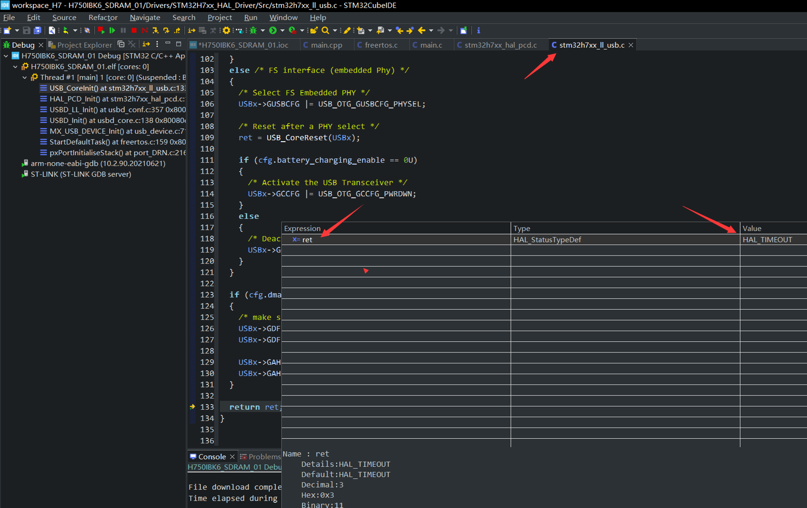
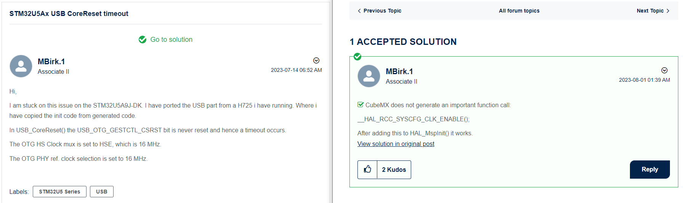
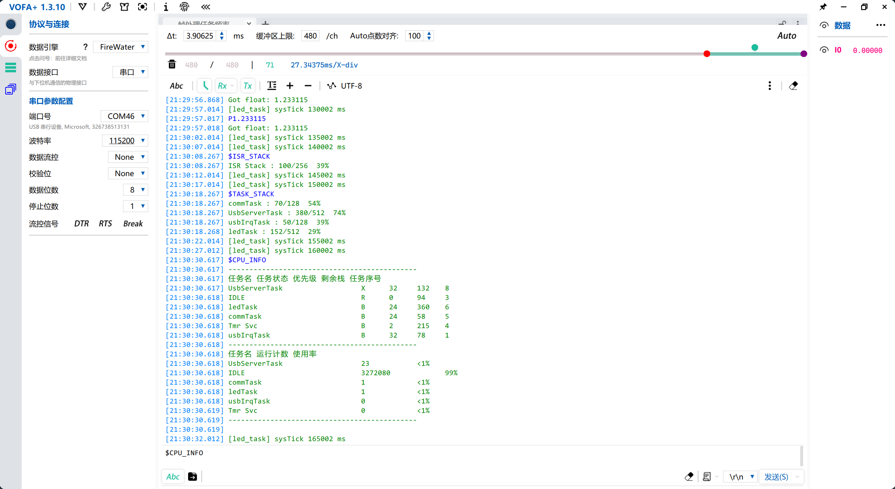

## USBCoreReset_HAL_TIMEOUT

Quadmin核心板运行 STUSB_CDC_01 fibre协议，在 USBCoreReset，返回 HAL_TIMEOUT，导致USB初始化失败



零时解决方案：将USB的时钟源从PLL3Q改用RC48


网上找了下，有检查硬件，USB3300的晶振忘记并联1M电阻不起振的，经测量我的USB3300晶振24MHz正常震荡。但我没有用USB3300，只用的内置的USB-FS，因为我切换USB时钟源后正常了，所以应该是PLL3Q时钟出了问题，可能正确的解决方案：

> [STM32U5Ax USB CoreReset timeout](https://community.st.com/t5/stm32-mcus-products/stm32u5ax-usb-corereset-timeout/td-p/574611)
>
> 
>
> ```c
> //CubeMX does not generate an important function call:
> 
> __HAL_RCC_SYSCFG_CLK_ENABLE();
> 
> //After adding this to HAL_MspInit() it works.
> ```

## USB使用HC48时钟测试：

fibre通信框架正常



```
[21:29:56.867] P1.233115
[21:29:56.868] Got float: 1.233115
[21:29:57.014] [led_task] sysTick 130002 ms
[21:29:57.017] P1.233115
[21:29:57.018] Got float: 1.233115
[21:30:02.014] [led_task] sysTick 135002 ms
[21:30:07.014] [led_task] sysTick 140002 ms
[21:30:08.267] $ISR_STACK
[21:30:08.267] ISR Stack : 100/256  39%
[21:30:12.014] [led_task] sysTick 145002 ms
[21:30:17.014] [led_task] sysTick 150002 ms
[21:30:18.267] $TASK_STACK
[21:30:18.267] commTask : 70/128  54%
[21:30:18.267] UsbServerTask : 380/512  74%
[21:30:18.267] usbIrqTask : 50/128  39%
[21:30:18.268] ledTask : 152/512  29%
[21:30:22.014] [led_task] sysTick 155002 ms
[21:30:27.012] [led_task] sysTick 160002 ms
[21:30:30.617] $CPU_INFO
[21:30:30.617] ---------------------------------------------
[21:30:30.617] 任务名 任务状态 优先级 剩余栈 任务序号
[21:30:30.617] UsbServerTask                  	X	32	132	8
[21:30:30.618] IDLE                           	R	0	94	3
[21:30:30.618] ledTask                        	B	24	360	6
[21:30:30.618] commTask                       	B	24	58	5
[21:30:30.618] Tmr Svc                        	B	2	215	4
[21:30:30.618] usbIrqTask                     	B	32	78	1
[21:30:30.618] ---------------------------------------------
[21:30:30.618] 任务名 运行计数 使用率
[21:30:30.618] UsbServerTask                  	23		<1%
[21:30:30.618] IDLE                           	3272080		99%
[21:30:30.618] commTask                       	1		<1%
[21:30:30.618] ledTask                        	1		<1%
[21:30:30.618] usbIrqTask                     	0		<1%
[21:30:30.619] Tmr Svc                        	0		<1%
[21:30:30.619] ---------------------------------------------
[21:30:30.619] 
[21:30:32.012] [led_task] sysTick 165002 ms
```

