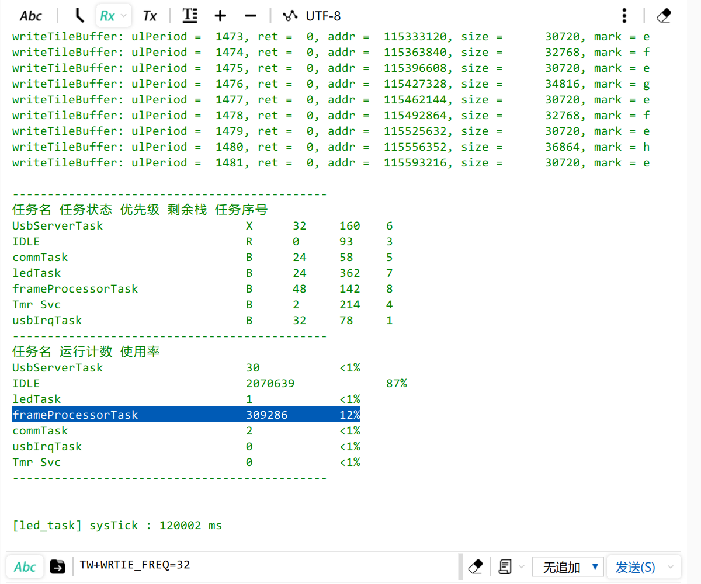
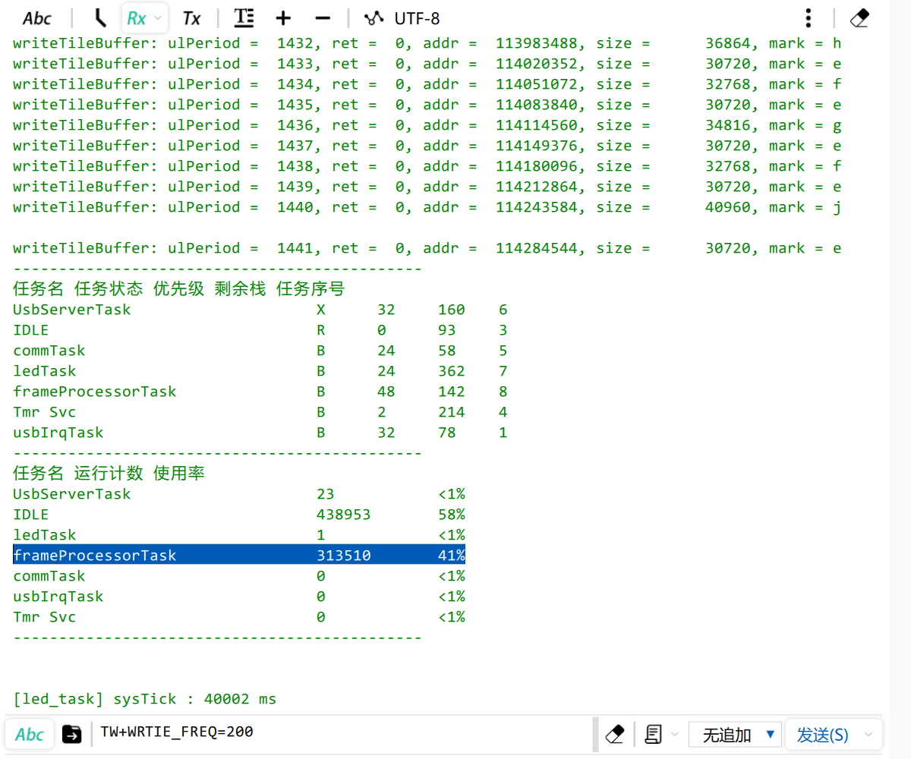

## H750VBT6_FATFS_R015_SDMMC_TF_01

> 创建日期：2023-03-22

## 关于

本工程用于测试本id自研的瓦片切片算法，其产生的数据在 FATFS + TF卡 上读写的实时性

记录了使用 CubeMX 自动生成的 FATFS R0.12C版本 ST团队写的配置文件和BSP驱动 适配 FATFS R0.15 的过程

- 开发环境：STM32CubeIDE v1.11.2 + STM32CubeMX v6.6
- 包版本：STM32CubeH7 V1.11.0 / 04-Nov-2022
- 主RAM：DTCM

## FATFS R0.15 适配 CubeMX R0.12C

### R0.12C  f_lseek()  的BUG

由于 CubeMX 6.6 + STM32CubeH7 V1.11.0 / 04-Nov-2022 生成的 FATFS 版本还是 13年 的 R0.12C，本工程在使用 f_lseek() 移到文件读写指针参数为非0地址时，会返回  FR_INT_ERR，看到这篇症状相同的帖子：[Getting FR_INT_ERR when using f_seek in ff.c - ST Community](https://community.st.com/s/question/0D53W000010vQCQSA2/getting-frinterr-when-using-fseek-in-ffc)，应该是 旧版本 R0.12C的BUG，ChaN老师在 FATFS 的版本更新日志中表明，此 BUG 在 R0.13 中修复，现在是 2023 年，最新版本 为 R0.15，又修复了不少BUG，那就用 CubeMX 自动生成的 FATFS 配置文件 适配最新版的 

### 下载 FATFS R0.15 源码，并在 Path 中添加路径

ChaN 老师网站的下载链接：Download: [FatFs R0.15 (zip)](http://elm-chan.org/fsw/ff/arc/ff15.zip)

解压到 本工程根目录即可，会生成一个 ff15 文件夹，将此文件夹路径添加到 Path 的 Source Location，将此文件夹内的 source 文件夹路径 添加到 Path 的 Includes 

### 适配 ffconf.h

新建 `ffconf_r0.15_by_r013c.h` 解决

### 适配 用户同步函数

在 CubeMX 自动生成的 Middlewares/Third_Party/FatFs/option/syscall.c 中有

```c
/* R0.13C 的4个用户同步函数 */
int ff_cre_syncobj ( BYTE vol, _SYNC_t *sobj )
int ff_del_syncobj ( _SYNC_t sobj )
int ff_req_grant ( _SYNC_t sobj )
void ff_rel_grant ( _SYNC_t sobj )

/* ff malloc 和 free 默认不使能 */
#if _USE_LFN == 3	/* LFN with a working buffer on the heap */
void* ff_memalloc ( UINT msize )
void ff_memfree ( void* mblock )
#endif
```

但 R0.15 版本这几个函数都没了，在ff15/documents/updates.html中有以下说明：

> User provided synchronization functions, `ff_cre_syncobj`, `ff_del_syncobj`, `ff_req_grant` and `ff_rel_grant`, needed when `FF_FS_REENTRANT` are replaced with `ff_mutex_create`, `ff_mutex_delete`, `ff_mutex_take` and `ff_mutex_give` respectively. For example, see `ffsystem.c`.
>
> 翻译：
>
> 用户提供的同步函数，`ff_cre_syncobj`、`ff_del_syncobj`、`ff_req_grant` 和 `ff_rel_grant`。当使能 `FF_FS_REENTRANT` 时，需要分别替换为 `ff_mutex_create`、`ff_mutex_delete`、`ff_mutex_take` 和 `ff_mutex_give`。示例请参见 `ffsystem.c`

ok，看看 ffsystem.c ，cubeMX 我配置为 _FS_REENTRANT 对应使能 FF_FS_REENTRANT，我需要修改此文件的 4个 同步函数 调用 Middlewares/Third_Party/FatFs/option/syscall.c 中的四个同步函数 

```c
#if FF_FS_REENTRANT	/* Mutal exclusion */
/*------------------------------------------------------------------------*/
/* Definitions of Mutex                                                   */
/*------------------------------------------------------------------------*/

#define OS_TYPE	0	/* 0:Win32, 1:uITRON4.0, 2:uC/OS-II, 3:FreeRTOS, 4:CMSIS-RTOS */
```

ffsystem.c 中使能 OS_TYPE 4 是 CMSIS-RTOS V1的，但我的工程是 V2的，这样  ff_mutex_create 中的写法编译就会报错，需要修改如下：

```c
int ff_mutex_create (	/* Returns 1:Function succeeded or 0:Could not create the mutex */
	int vol				/* Mutex ID: Volume mutex (0 to FF_VOLUMES - 1) or system mutex (FF_VOLUMES) */
)
{
    ...
#elif OS_TYPE == 4	/* CMSIS-RTOS */
#if (osCMSIS < 0x20000U)
	osMutexDef(cmsis_os_mutex);
	Mutex[vol] = osMutexCreate(osMutex(cmsis_os_mutex));
#else
    Mutex[vol] = osMutexNew(NULL);
#endif
	return (int)(Mutex[vol] != NULL);
#endif
}
```

### 适配 ffunicode.c 

ff15 中的 ffunicode 与 cubemx自动生成的  Middlewares/Third_Party/FatFs/option/cc936.c 中重复定义，在过滤器中排除 cc936.c 即可

### Path 过滤器的配置

| 文件夹：FATFS                                                | 文件夹：Middlewares                                          | 文件夹：ff15                                                 |
| ------------------------------------------------------------ | ------------------------------------------------------------ | ------------------------------------------------------------ |
|  |  |  |

备注：sd_diskio.c 的副本在UserApp 路径下，自定义了Cache配置并修复了BUG，副本出处：[H750VBT6_FATFS_SDMMC_TF_01](https://github.com/oldgerman/workspace_H7/tree/master/H750VBT6_FATFS_SDMMC_TF_01)

## 测试

### CPU利用率

向层缓冲区不同写入频率下的CPU利用率：

| 32Hz 12%                                                     | 200Hz 41%                                                    |
| ------------------------------------------------------------ | ------------------------------------------------------------ |
|  |  |

