## H750VBT6_FATFS_R015_SDMMC_TF_01

> 创建日期：2023-03-22

## 关于

本工程用于测试本id自研的瓦片切片算法，其产生的数据在 FATFS + TF卡 上读写的实时性

记录了使用 CubeMX 自动生成的 FATFS R0.12C版本 ST团队写的配置文件和BSP驱动 适配 FATFS R0.15 的过程

- 开发环境：STM32CubeIDE v1.11.2 + STM32CubeMX v6.6
- 包版本：STM32CubeH7 V1.11.0 / 04-Nov-2022
- 主RAM：DTCM
- FATFS：R0.15
- TF卡：FAT32 + 32KB 簇大小

## USB命令

USB命令的JSON文件在 VOFA+ 文件夹内，可导入伏特加上位机方便测试

## FATFS R0.15 适配 CubeMX R0.12C

### R0.12C  f_lseek()  的BUG

由于 CubeMX 6.6 + STM32CubeH7 V1.11.0 / 04-Nov-2022 生成的 FATFS 版本还是 13年 的 R0.12C，本工程在使用 f_lseek() 移到文件读写指针参数为非0地址时，会返回  FR_INT_ERR，看到这篇症状相同的帖子：[Getting FR_INT_ERR when using f_seek in ff.c - ST Community](https://community.st.com/s/question/0D53W000010vQCQSA2/getting-frinterr-when-using-fseek-in-ffc)，应该是 旧版本 R0.12C的BUG，ChaN老师在 FATFS 的版本更新日志中表明，此 BUG 在 R0.13 中修复，现在是 2023 年，最新版本 为 R0.15，又修复了不少BUG，那就用 CubeMX 自动生成的 FATFS 配置文件 适配最新版的 

### 下载 FATFS R0.15 源码，并在 Path 中添加路径

ChaN 老师网站的下载链接：Download: [FatFs R0.15 (zip)](http://elm-chan.org/fsw/ff/arc/ff15.zip)

解压到 本工程根目录即可，会生成一个 ff15 文件夹，将此文件夹路径添加到 Path 的 Source Location，将此文件夹内的 source 文件夹路径 添加到 Path 的 Includes 

### 适配 ffconf.h

新建 `ffconf_r0.15_by_r013c.h` 解决

### 适配 用户同步函数

在 CubeMX 自动生成的 Middlewares/Third_Party/FatFs/option/syscall.c 中有

```c
/* R0.13C 的4个用户同步函数 */
int ff_cre_syncobj ( BYTE vol, _SYNC_t *sobj )
int ff_del_syncobj ( _SYNC_t sobj )
int ff_req_grant ( _SYNC_t sobj )
void ff_rel_grant ( _SYNC_t sobj )

/* ff malloc 和 free 默认不使能 */
#if _USE_LFN == 3	/* LFN with a working buffer on the heap */
void* ff_memalloc ( UINT msize )
void ff_memfree ( void* mblock )
#endif
```

但 R0.15 版本这几个函数都没了，在ff15/documents/updates.html中有以下说明：

> User provided synchronization functions, `ff_cre_syncobj`, `ff_del_syncobj`, `ff_req_grant` and `ff_rel_grant`, needed when `FF_FS_REENTRANT` are replaced with `ff_mutex_create`, `ff_mutex_delete`, `ff_mutex_take` and `ff_mutex_give` respectively. For example, see `ffsystem.c`.
>
> 翻译：
>
> 用户提供的同步函数，`ff_cre_syncobj`、`ff_del_syncobj`、`ff_req_grant` 和 `ff_rel_grant`。当使能 `FF_FS_REENTRANT` 时，需要分别替换为 `ff_mutex_create`、`ff_mutex_delete`、`ff_mutex_take` 和 `ff_mutex_give`。示例请参见 `ffsystem.c`

ok，看看 ffsystem.c ，cubeMX 我配置为 _FS_REENTRANT 对应使能 FF_FS_REENTRANT，我需要修改此文件的 4个 同步函数 调用 Middlewares/Third_Party/FatFs/option/syscall.c 中的四个同步函数 

```c
#if FF_FS_REENTRANT	/* Mutal exclusion */
/*------------------------------------------------------------------------*/
/* Definitions of Mutex                                                   */
/*------------------------------------------------------------------------*/

#define OS_TYPE	0	/* 0:Win32, 1:uITRON4.0, 2:uC/OS-II, 3:FreeRTOS, 4:CMSIS-RTOS */
```

ffsystem.c 中使能 OS_TYPE 4 是 CMSIS-RTOS V1的，但我的工程是 V2的，这样  ff_mutex_create 中的写法编译就会报错，需要修改如下：

```c
int ff_mutex_create (	/* Returns 1:Function succeeded or 0:Could not create the mutex */
	int vol				/* Mutex ID: Volume mutex (0 to FF_VOLUMES - 1) or system mutex (FF_VOLUMES) */
)
{
    ...
#elif OS_TYPE == 4	/* CMSIS-RTOS */
#if (osCMSIS < 0x20000U)
	osMutexDef(cmsis_os_mutex);
	Mutex[vol] = osMutexCreate(osMutex(cmsis_os_mutex));
#else
    Mutex[vol] = osMutexNew(NULL);
#endif
	return (int)(Mutex[vol] != NULL);
#endif
}
```

### 适配 ffunicode.c 

ff15 中的 ffunicode.c 中的数据 与 cubemx自动生成的  Middlewares/Third_Party/FatFs/option/cc936.c（GBK编码） 中存在重复定义，在过滤器中排除 cc936.c 即可。实测这样配置后，USB可以正常打印 FATFS 解析文件名和目录名的 GBK 编码的中文字符

### Path 过滤器的配置

| 文件夹：FATFS                                                | 文件夹：Middlewares                                          | 文件夹：ff15                                                 |
| ------------------------------------------------------------ | ------------------------------------------------------------ | ------------------------------------------------------------ |
| 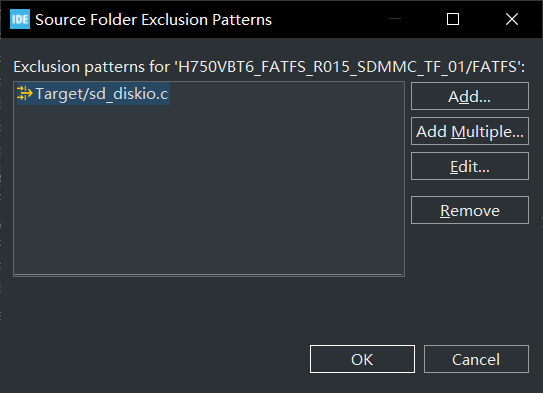 | 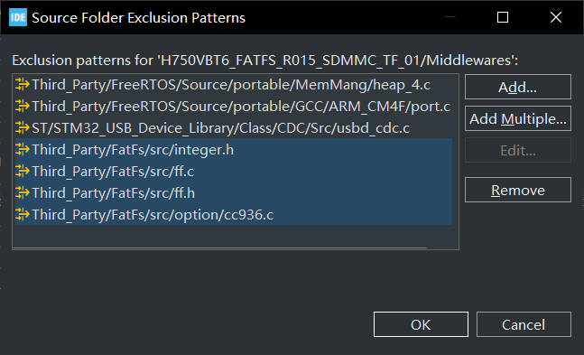 | 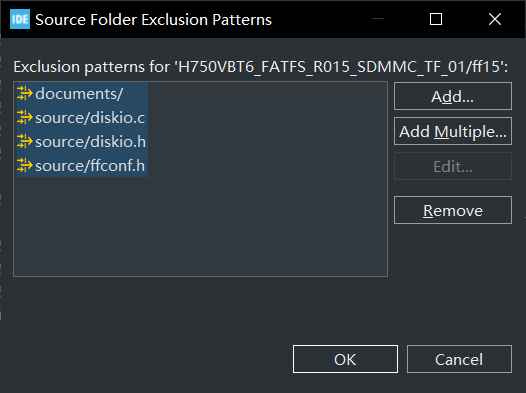 |

备注：sd_diskio.c 的副本在UserApp 路径下，自定义了Cache配置并修复了BUG，副本出处：[H750VBT6_FATFS_SDMMC_TF_01](https://github.com/oldgerman/workspace_H7/tree/master/H750VBT6_FATFS_SDMMC_TF_01)

## 测试（FAT32+32KB簇）

### 各层缓冲区参数

| 层编号 | 瓦片大小 | 瓦片缓冲区大小 | 瓦片缓冲区地址 | 缓冲区大小 | 缓冲区发送周期 | DRAM 当前共使用 | DRAM 当前剩余 | DRAM 历史最少可用 |
| ------ | -------- | -------------- | -------------- | ---------- | -------------- | --------------- | ------------- | ----------------- |
| 0      | 1        | 2048           | 0x30000010     | 2048       | 2048           | 2072            | 129000        | 129000            |
| 1      | 2        | 2048           | 0x30000818     | 4096       | 1024           | 4128            | 126944        | 126944            |
| 2      | 4        | 2048           | 0x30001020     | 8192       | 512            | 6184            | 124888        | 124888            |
| 3      | 8        | 2048           | 0x30001828     | 16384      | 256            | 8240            | 122832        | 122832            |
| 4      | 16       | 2048           | 0x30002030     | 32768      | 128            | 10296           | 120776        | 120776            |
| 5      | 32       | 2048           | 0x30002838     | 65536      | 64             | 12352           | 118720        | 118720            |
| 6      | 64       | 2048           | 0x30003040     | 131072     | 32             | 14408           | 116664        | 116664            |
| 7      | 128      | 2048           | 0x30003848     | 262144     | 16             | 16464           | 114608        | 114608            |
| 8      | 256      | 2048           | 0x30004050     | 524288     | 8              | 18520           | 112552        | 112552            |
| 9      | 512      | 2048           | 0x30004858     | 1048576    | 4              | 20576           | 110496        | 110496            |
| 10     | 1024     | 2048           | 0x30005060     | 2097152    | 2              | 22632           | 108440        | 108440            |
| 11     | 2048     | 2048           | 0x30005868     | 4194304    | 1              | 24688           | 106384        | 106384            |
| 12     | 4096     | 4096           | 0x30006070     | 8388608    | 1              | 28792           | 102280        | 102280            |
| 13     | 8192     | 8192           | 0x30007078     | 16777216   | 1              | 36992           | 94080         | 94080             |
| 14     | 16384    | 16384          | 0x30009080     | 33554432   | 1              | 53384           | 77688         | 77688             |

### 不同 Block 数量下的读写速度

| IO SIZE | 写速度   | 写耗时  | 读速度    | 读耗时 | 测试文件名称 | 测试文件大小 | 校验文件数据 |
| ------- | -------- | ------- | --------- | ------ | ------------ | ------------ | ------------ |
| 512B    | 333KB/S  | 24579ms | 1462KB/S  | 5603ms | Speed00.txt  | 8192KB       | N/A          |
| 1KB     | 610KB/S  | 13419ms | 2539KB/S  | 3226ms | Speed01.txt  | 8192KB       | N/A          |
| 2KB     | 1197KB/S | 6840ms  | 4168KB/S  | 1965ms | Speed02.txt  | 8192KB       | N/A          |
| 4KB     | 2771KB/S | 2956ms  | 6638KB/S  | 1234ms | Speed03.txt  | 8192KB       | N/A          |
| 8KB     | 3423KB/S | 2393ms  | 8551KB/S  | 958ms  | Speed04.txt  | 8192KB       | N/A          |
| 16KB    | 8650KB/S | 947ms   | 9787KB/S  | 837ms  | Speed05.txt  | 8192KB       | N/A          |
| 32KB    | 8982KB/S | 912ms   | 10502KB/S | 780ms  | Speed06.txt  | 8192KB       | N/A          |
| 64KB    | 7699KB/S | 1064ms  | 10556KB/S | 776ms  | Speed07.txt  | 8192KB       | N/A          |

### 实时切片并写入波形文件

- 从文件的第一个扇区开始写入，写100MB以上停止
- 切片 和 写入TF卡 都由 Realtime 优先级（最高优先级）的 frameProcessorTask（帧处理齐任务）处理，下表格中的频率即此任务的调度频率，其他任务的优先级都比此任务低

> *覆盖写入已有文件：表示已有写入 100MB 左右的文件，当前将文件指针移到地址0开始覆盖写入，会使用前一次写入文件的 CLMT，这样 f_lseek() 的执行会更快
>
> *实际频率（Hz）：是取出现概率比较高的值，不是通过直方图计算的平均值

| 备注              | 设置频率（Hz） | 实际频率（Hz）* | CPU 利用率（%） | 吞吐量（KB/s） |
| ----------------- | -------------- | --------------- | --------------- | -------------- |
| 覆盖写入已有文件* | 200            | 165             | 16              | N/A            |
| 覆盖写入已有文件* | 100            | 100±10          | 15              | 3217.5         |
| 覆盖写入已有文件  | 32             | 32.2            | 5               | 1029.6         |
| 删除并新建文件    | 200            | 100             | 41              | N/A            |
| 删除并新建文件    | 100            | 100±10          | 40              | 3217.5         |
| 删除并新建文件    | 32             | 32.2            | 12              | 1029.6         |

注意本节测试的特殊性：

> 不是一边写入一边拓展文件小：
>
> > 一边写入一边拓展文件小的速度会更快，但应用场景除了写，每秒还可能读十来次此文件任意位置的一段数据，那么就需要在这种情况下使用 f_lseek 随机定位文件指针，这么玩的弊端是 f_lseek 执行时快时慢，每次执行 f_lseek、f_write 和 f_read 都可能访问 TF 卡中 的 FAT 表（当访问地址超出RAM中FAT表缓冲区的范围），增加向 SDMMC 的 IDMA 发起读写事务的数量，降低速度
> >
> > 参考：
> >
> > - [为什么FatFs的f_lseek函数执行时间从会几us到几秒钟增加](https://www.amobbs.com/thread-5631536-1-1.html)
>
> 一般解决方法：
>
> > 使用 FATFS 快速查找功能，通过使用内存中的 CLMT（cluster link map table 簇链接映射表），实现无需 FAT 访问的快速向后/长查找操作。这么玩的好处是 f_lseek 在读写时都可以快速在波形文件中定位，缺点是当文件处于快速搜索模式时，文件大小不能通过`f_write`和`f_lseek`扩展
>>
> > 文件大小不能拓展的解决方法：
> >
> > > 新建文件时，集群预分配大小128MB，停止写入时，记录已写入的有效数据量，关闭文件后再次打开（此操作可以退出快速查找模式），使用 f_lseek 裁剪文件到有效数据大小
> >
> > 建立CLMT及其开销：
> >
> > > 将 128MB 文件切片为 4096 份（切片粒度为 32KB，即 TF卡 格式化为 FAT32 时设置的簇大小 32KB），那么可计算 CLMT 数组大小 (128MB / 32K + 1) x 2  = 8194 ，CLMT数组每个元素的大小 sizeof(DWORD) = 4B，开销 STM32H750 RAM 8194 x 4B = 32776B ≈ 32KB
> > >
> > > 计算公式来源：[f_lseek：The number of items needed is (number of the file fragments + 1) * 2.](http://elm-chan.org/fsw/ff/doc/lseek.html)
>
> 上古大佬解决方法：
>
> > [FAT表压缩（利用FAT表的连贯性，压缩FAT表，实现MP3的快进和快退）](https://www.amobbs.com/forum.php?mod=viewthread&tid=3715726)
> >
> > 备注：一般解决方法中的 CLMT 是没有压缩的 FAT 表

CLMT 的数据：

> 未格式化，新建删除WAVE.TXT 多次，重置后第一次以100Hz 写入100MB 
>
> | 前100个元素                                                  | 后100个元素                                                  |
> | ------------------------------------------------------------ | ------------------------------------------------------------ |
> | 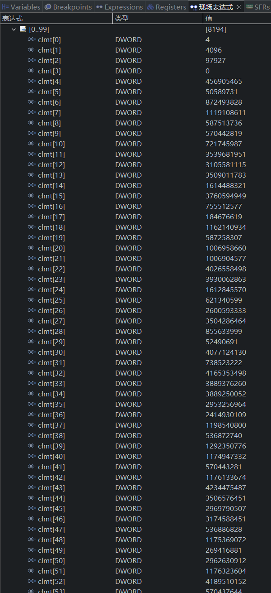 | 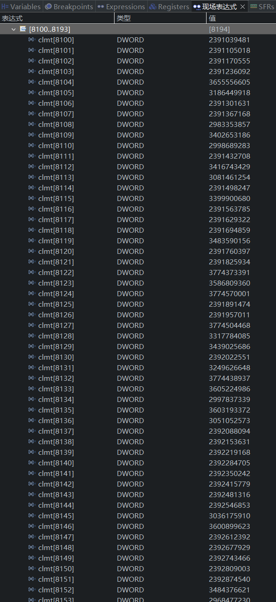 |
>
> 可见某些局部连续的：间隔 6553x
>
> 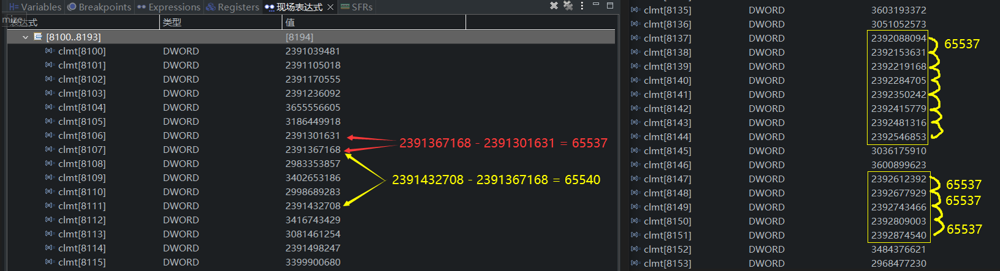

## 测试（FAT32+64KB簇）

不同 Block 数量下的读写速度

| IO SIZE | 写速度   | 写耗时  | 读速度    | 读耗时 | 测试文件名称 | 测试文件大小 | 校验文件数据 |
| ------- | -------- | ------- | --------- | ------ | ------------ | ------------ | ------------ |
| 512B    | 343KB/S  | 23834ms | 1425KB/S  | 5748ms | Speed00.txt  | 8192KB       | N/A          |
| 1KB     | 588KB/S  | 13921ms | 2546KB/S  | 3217ms | Speed01.txt  | 8192KB       | N/A          |
| 2KB     | 1256KB/S | 6522ms  | 4307KB/S  | 1902ms | Speed02.txt  | 8192KB       | N/A          |
| 4KB     | 2168KB/S | 3777ms  | 6370KB/S  | 1286ms | Speed03.txt  | 8192KB       | N/A          |
| 8KB     | 4302KB/S | 1904ms  | 8515KB/S  | 962ms  | Speed04.txt  | 8192KB       | N/A          |
| 16KB    | 6239KB/S | 1313ms  | 9626KB/S  | 851ms  | Speed05.txt  | 8192KB       | N/A          |
| 32KB    | 6262KB/S | 1308ms  | 10543KB/S | 777ms  | Speed06.txt  | 8192KB       | N/A          |
| 64KB    | 7992KB/S | 1025ms  | 11040KB/S | 742ms  | Speed07.txt  | 8192KB       | N/A          |

### 实时切片并写入

- 从文件的第一个扇区开始写入，写100MB以上停止
- 切片 和 写入TF卡 都由 Realtime 优先级（最高优先级）的 frameProcessorTask（帧处理齐任务）处理，下表格中的频率即此任务的调度频率，其他任务的优先级都比此任务低

> *实际频率（Hz）：是取出现概率比较高的值，不是通过直方图计算的平均值

| 备注              | 设置频率（Hz） | 实际频率（Hz）* | CPU 利用率（%） | frame 任务运行计数 | 吞吐量（KB/s） |
| ----------------- | -------------- | --------------- | --------------- | ------------------ | -------------- |
| 覆盖写入已有文件* | 200            | 160             | 23              | 127619             | 5148.0         |
| 覆盖写入已有文件* | 100            | 100             | 16              | 125574             | 3217.5         |
| 覆盖写入已有文件  | 32             | 32.2            | 5               | 121868             | 1029.6         |
| 删除并新建文件    | 100            | 92              | 36              | 324333             | 3217.5         |
| 删除并新建文件    | 32             | 32.2            | 12              | 129861             | 1029.6         |

写入任务频率的直方图：

> > 每次写入任务都立即计算当前的调度频率，直方图的刻度为1Hz
>
> ## 25Hz
>
> 3753次的82.7%落在25±1Hz
>
> 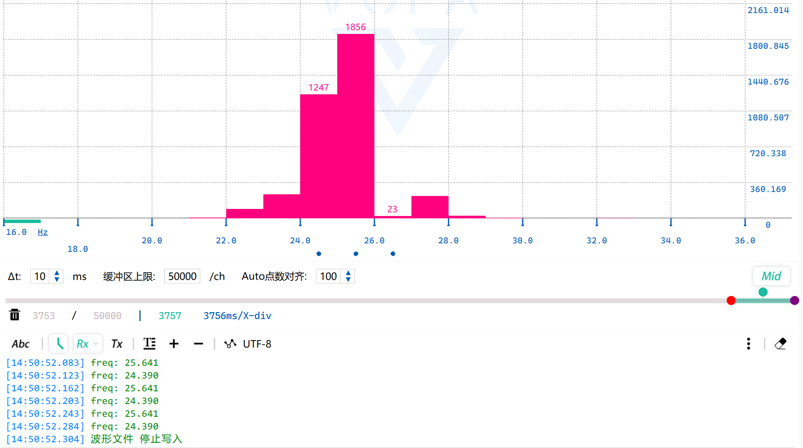
>
> ## 32Hz
>
> 3755次的82.7%落在31-34Hz（调度频率取32Hz时，因为 1000 / 32 = 31.25，无法整除，uint32_t 向下舍入得 31，所以写入任务其实是 31ms 的调度周期，约32.26Hz）
>
> 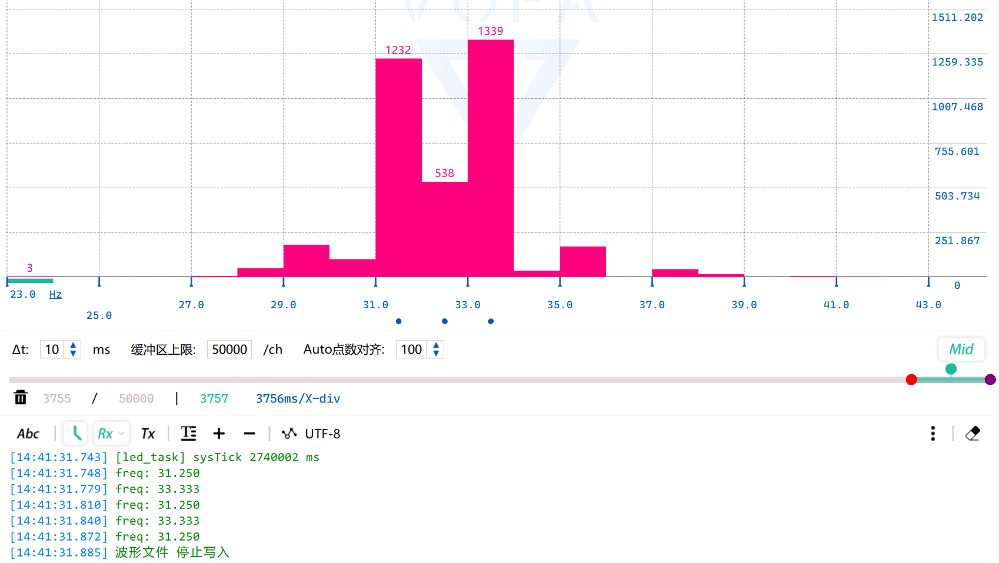
>
> ## 100Hz
>
> 3751次的百分之14.8落在99-100Hz
>
> 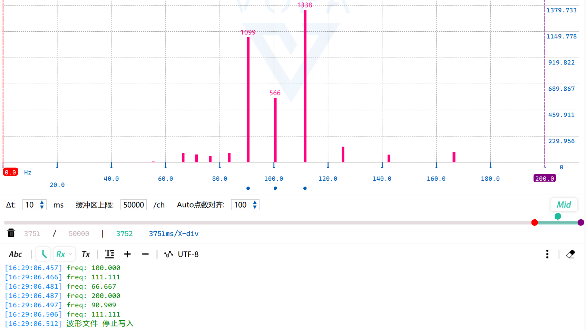
>
> > 取出现次数比较多的直方型，可估计平均写入频率：
> >
> > ( 66Hz x 85 + 71Hz x 70 + 76Hz x 56 + 83Hz x 83 + 90Hz x 1099 + 100Hz x 566 + 111Hz x 1338 + 125Hz x 138 + 142Hz x 68 + 166Hz x 93 ) / 3751 ≈ 93.5Hz
> >
> > 还有比较便捷的方法：程序里丢几行代码统计平均写入频率

### 实时切片但不写入TF卡

| 备注             | 设置频率（Hz） | 实际频率（Hz） | CPU 利用率（%） | frame 任务运行计数 | 切片计数 |
| ---------------- | -------------- | -------------- | --------------- | ------------------ | -------- |
| 覆盖写入已有文件 | 200            | 200            | 6               | 31436              | 3670     |
| 覆盖写入已有文件 | 100            | 100            | 3               | 31390              | 3665     |
| 覆盖写入已有文件 | 32             | 32.2           | 1               | 31335              | 3659     |
| 覆盖写入已有文件 | 25             | 25             | 1               | 31317              | 3657     |

3387次切片 100% 都落在200Hz，并且  frame 任务运行计数 会从30000+ 增加到 120000+，这增加了 90000 次任务打断 ！可见写入 TF 卡就是破坏帧处理器任务实时性的罪魁祸首

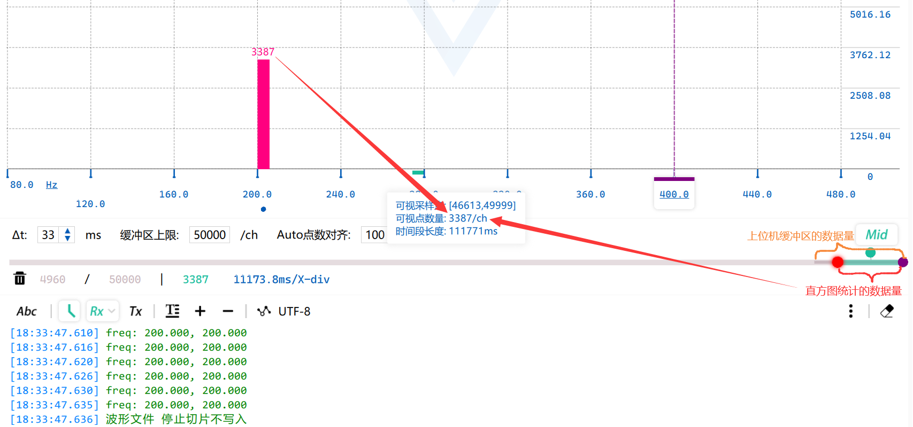

## FATFS + TF卡的实时性欠佳，多缓冲能否曲线救国？

在本工程的直方图测试中，FATFS + TF 卡的实时性确不太不行

为啥摄像机还可以用TF卡实时录制高清视频呢？

例如小米无人机 4K 的云台摄像机，使用 TF 卡存储实时录制的 4K 视频，有幸拆解得知我感兴趣器件的型号：

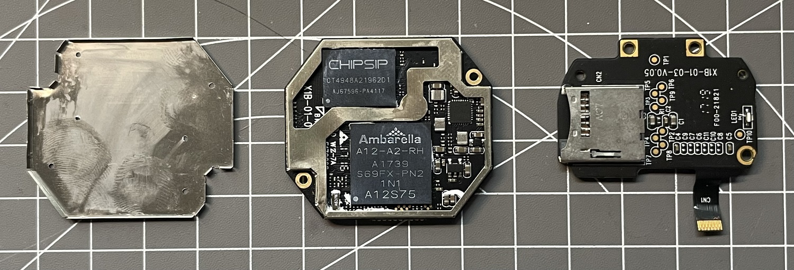

- 感光元件：索尼 4K 星光级

- SoC：[A12A Advanced HD Automotive Camera SoC - Ambarella](https://cn.ambarella.com/wp-content/uploads/A12A-Product-Brief.pdf)（单核 792-MHz ARM® Cortex™-A9）

- DDR3 + NAND：CHIPSET CT4948A21962D1，未找到公开手册，相似型号： CHIPSET CT49248DD486C1，NAND(1Gb)+DDR3(2Gb)

这个级别的配置。。。让本外行分析一波其优势：

- TF 卡一定跑在 UHS-I、UHS-II 或更高速度
- 使用其他 FAT 库，读写 IO/SIZE 突破 FATFS  128 个 512B 的限制
- DDR3 中开辟了视频帧的多缓冲区，对冲 FAT 文件系统小概率发生的写入时间的不确定性

 参考：

- [我要抢首发之小米无人机4K 篇二：新手试飞感受](https://post.smzdm.com/p/539958/)

> "4K的视频真的很大，不过才5分钟就2G多"
>
> 备注：4K实时录像下，TF 卡平均写入速度得 6.83MB/s 左右，约54M码率

- [常用视频标准尺寸和码率 - CSDN](https://blog.csdn.net/qq_38769551/article/details/106349191)

> " 4K码率为40M-65M，一分钟的4K视频输出MP4格式40M码率大概是800M-1G左右/分钟 "

与本工程的直方图测试对比：

- 影响小的因素：TF 卡跑在 HS 速度，FATFS 最大 IO/SZIE 64KB，当前写入任务概率发起 30.0-52.1K 大小的写入，在允许范围内
- 影响大的因素：当前写入任务是单缓冲的，那么FATFS + TF卡实时性不确定的固有属性就被直方图反映出了，这个固有属性应该是无法消除的，解决方法可以参考云台系统加大缓冲区对冲掉（H750VB不能外挂SRAM，片内再开几个层缓冲区有点紧张啊，明明都已经竭尽全力...）

拟解决思路：

- 层缓冲区越多越好，但多少个层缓冲区才可以将这个因素的影响减少到几乎没有，需要测试决定
- 当前帧处理器即实时瓦片切片也执行 TF卡写入，将 TF 卡的写入操作从帧处理器任务分离到一个单独的 TF 卡写入任务，开辟多个层缓冲区，帧处理器向消息队列写入当前应写入层缓冲区的编号，TF 卡写入任务从消息队列尾端取消息，执行写入操作，改变缓冲区大小测试，观察消息队列是否会满，依此确认需要的层缓冲区数量

## 2周目工程

本工程的阶段性测试到此为止，将在 [H750VBT6_FATFS_R015_SDMMC_TF_02](https://github.com/oldgerman/workspace_H7/tree/master/H750VBT6_FATFS_R015_SDMMC_TF_02) 中开始下一阶段

## 附

### 2次幂层缓冲区同步写入4byte帧数据@100Ksps

保持触发ADC采样的定时器频率100KHz不变，将 ADC DMA 缓冲区从 8000 点增大到 8192 点，这样帧处理器的调度频率就会变小，具从 100KHz / 4000 = 25Hz 变小为  100KHz / 4096 ≈ 24.4Hz，那么当 ADC DMA 传输半满或满中断时，帧处理器处理 一半的缓冲区 4096 点，每点 4B，2次幂就是 16384B，刚好等于第14层的瓦片缓冲区大小

### 任务实际调度的单次和平均频率计算

```c
void writeTileBuffer(uint8_t* pulData) {
    /* 用于计算本函数被调用的实时频率的单次和平均值 */
    static float fRealWrittenFreq = 0;
    static uint32_t ulWrittenCount = 0;
    static uint32_t ulTickCountOld =  xTaskGetTickCount();
    uint32_t ulTickCount;	
    ...
    /* 计算实时频率的单次和平均值 */
    ++ulWrittenCount;
    ulTickCount = xTaskGetTickCount();	/* 获取当前的系统时间 */
    uint32_t ulTickOffest = ulTickCount - ulTickCountOld;
    ulTickCountOld = ulTickCount;
    fRealWrittenFreq = (float)1000 / ((float)ulTickOffest / ulWrittenCount);
    if(isnormal(fRealWrittenFreq))	{ // 是一个正常的浮点数
        fRealWrittenFreqAvg = (fRealWrittenFreqAvg + fRealWrittenFreq ) / 2;
    }
    ulWrittenCount = 0;
    printf("freq: %3.3f, %3.3f\r\n", fRealWrittenFreq, fRealWrittenFreqAvg);
    ...
}
```

其中 fRealWrittenFreqAvg 需要在每次开始切片前 归 0，测试：

```c
[18:19:18.228] 波形文件 设置切片时不写入
[18:19:21.547] [led_task] sysTick 20002 ms
[18:19:23.326] 波形文件 写入频率 100Hz
[18:19:25.528] 波形文件 开始切片不写入
[18:19:25.537] freq: inf, 0.000
[18:19:25.548] freq: 100.000, 50.000
[18:19:25.558] freq: 100.000, 75.000
[18:19:25.567] freq: 100.000, 87.500
[18:19:25.577] freq: 100.000, 93.750
[18:19:25.587] freq: 100.000, 96.875
[18:19:25.597] freq: 100.000, 98.438
[18:19:25.607] freq: 100.000, 99.219
[18:19:25.617] freq: 100.000, 99.609
[18:19:25.627] freq: 100.000, 99.805
[18:19:25.637] freq: 100.000, 99.902
[18:19:25.647] freq: 100.000, 99.951
[18:19:25.657] freq: 100.000, 99.976
[18:19:25.667] freq: 100.000, 99.988
[18:19:25.677] freq: 100.000, 99.994
[18:19:25.687] freq: 100.000, 99.997
[18:19:25.697] freq: 100.000, 99.998
[18:19:25.707] freq: 100.000, 99.999
[18:19:25.717] freq: 100.000, 100.000
[18:19:25.727] freq: 100.000, 100.000
[18:19:25.737] freq: 100.000, 100.000
[18:19:25.747] freq: 100.000, 100.000
[18:19:25.757] freq: 100.000, 100.000
... // 之后单次和平均频率都是100.000Hz
```

