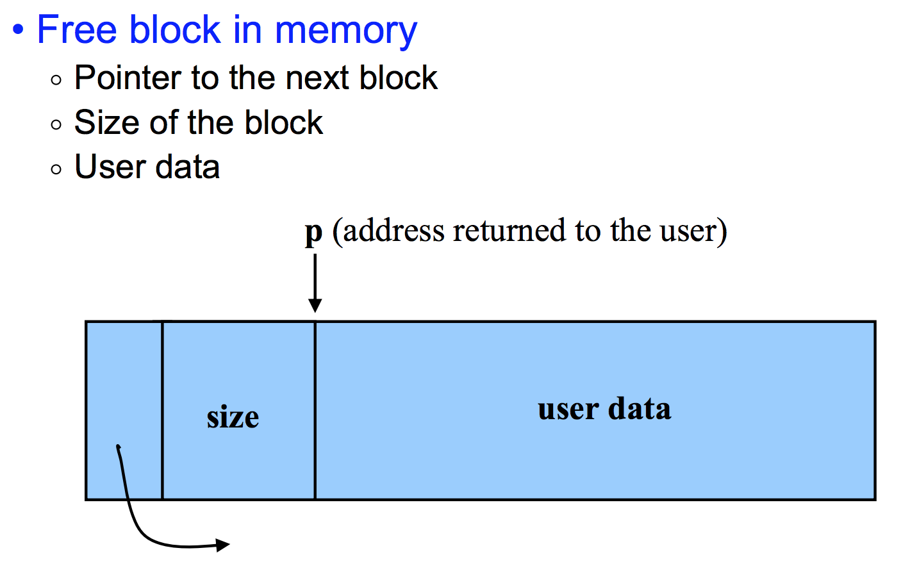

## H750VBT6_FATFS_R015_SDMMC_TF_02

> 创建日期：2023-03-24

## 关于

用于 [H750VBT6_FATFS_R015_SDMMC_TF_01](https://github.com/oldgerman/workspace_H7/tree/master/H750VBT6_FATFS_R015_SDMMC_TF_01) 工程的下阶段测试

- 开发环境：STM32CubeIDE v1.11.2 + STM32CubeMX v6.6
- 包版本：STM32CubeH7 V1.11.0 / 04-Nov-2022
- 主RAM：DTCM
- FATFS：R0.15
- TF卡：FAT32 + 64KB 簇大小
- CPU利用率：由 TIM7 产生 20Ksps 中断作为高精度计数源

## 代码修改

### TileWave 类

- 详见 [tile_wave.h](https://github.com/oldgerman/workspace_H7/blob/master/H750VBT6_FATFS_R015_SDMMC_TF_02/Algorithms/TileWave/tile_wave.h) 头部注释的 @brief

### osRtxMemory 类

- 详见 [rtx_memory.h](https://github.com/oldgerman/workspace_H7/blob/master/H750VBT6_FATFS_R015_SDMMC_TF_02/Bsp/ram/rtx_memory.h) 头部注释的 @brief

## 任意字节对齐的动态内存分配

### 问题

当前工程使用 osRtxMemory 类，申请内存只支持 8 字节对齐，malloc 的第一个 head 很特殊，开销是 16 字节，后续的都是 8 字节：

| 申请大小 | 申请地址   | 地址对齐 | 地址增量 | 当前共使用 | head 大小 | 当前剩余 | 历史最少可用 |
| -------- | ---------- | -------- | -------- | ---------- | --------- | -------- | ------------ |
| 2048     | 0x30000010 | 16       | 16       | 2072       | 16        | 129000   | 129000       |
| 2048     | 0x30000818 | 8        | 2056     | 4128       | 8         | 126944   | 126944       |
| 2048     | 0x30001020 | 16       | 2056     | 6184       | 8         | 124888   | 124888       |
| 2048     | 0x30001828 | 8        | 2056     | 8240       | 8         | 122832   | 122832       |
| ...      | ...        |          |          | ...        | ...       | ...      | ...          |

再看看小内存的：

| 申请大小 | 申请地址   | 地址对齐 | 地址增量 | 当前共使用 | head 大小 | 当前剩余 | 历史最少可用 |
| -------- | ---------- | -------- | -------- | ---------- | --------- | -------- | ------------ |
| 1        | 0x3000d088 | 8        | N/A      | 53400      | 8         | 77672    | 12344        |
| 2        | 0x3000d098 | 8        | 16       | 53416      | 8         | 77656    | 12344        |
| 4        | 0x3000d0a8 | 8        | 16       | 53432      | 8         | 77640    | 12344        |
| 8        | 0x3000d0b8 | 8        | 16       | 53448      | 8         | 77624    | 12344        |
| 16       | 0x3000d0c8 | 8        | 16       | 53472      | 8         | 77600    | 12344        |
| 32       | 0x3000d0e0 | 16       | 24       | 53512      | 8         | 77560    | 12344        |
| 64       | 0x3000d108 | 8        | 40       | 53584      | 8         | 77488    | 12344        |
| 128      | 0x3000d150 | 16       | 72       | 53720      | 8         | 77352    | 12344        |
| 256      | 0x3000d1d8 | 8        | 136      | 53984      | 8         | 77088    | 12344        |
| 512      | 0x3000d2e0 | 16       | 264      | 54504      | 8         | 76568    | 12344        |

可见返回给用户的地址可能是 8 或 16 字节对齐的

这就产生一个问题：申请的动态内存必须 32 字节对齐才可以使用 H7 Cache 维护 API，例如：the SCB_InvalidateDCache_by_Addr() requires a 32-Byte aligned address,

查了下其他平台 malloc 的标准，malloc 可能 8 / 16  字节对齐，看来需要实现支持 32 字节对齐的动态内存申请和释放

### 参考

- [C++ 中的内存对齐——理论篇](https://developer.aliyun.com/article/996348?spm=a2c6h.13262185.profile.9.64a7dc20VHNCtq)

- [C++ 中的内存对齐——实践篇](https://developer.aliyun.com/article/1068586)

- [JinSu_：aligned_malloc实现内存对齐](https://blog.csdn.net/jin739738709/article/details/122992753)

- [How much memory does malloc(0) allocate?](https://prog21.dadgum.com/179.html)

- [Structure of a malloc block](https://stackoverflow.com/questions/49990855/structure-of-a-malloc-block)

  

### 方案

- 由 osRtxMemory 类新的成员函数实现

  > 已添加 [JinSu_：aligned_malloc实现内存对齐](https://blog.csdn.net/jin739738709/article/details/122992753) 中的 `aligned_malloc`、`aligned_free`、`aligned_detect`

- 由 TileWave 内部封装现有的 `malloc`、` free` 实现

  > 内部实现这个待定，暂且新添加 functional object： `aligned_malloc`、`aligned_free`、`aligned_detect` 可以绑定 osRtxMemory 对象 + 成员函数
  
### 测试

> 可以看到 32 字节对齐 与 不进行字节对齐的 3 组申请 + 释放后，最后的剩余内存是一样的，说明没有内存泄漏，很成功

测试 32 字节对齐的动态内存分配 3 次，起始大小 1024 ，每次大小翻倍，单位 byte：

命令：`TW+TEST_DRAM=3+1024+32\r`

> 【从DRAM申请空间】
>
> | 已申请次数 | 内存池大小 | 申请大小 | 申请地址   | 字节对齐 | 共使用 | 剩余   | 历史最少可用 |
> | ---------- | ---------- | -------- | ---------- | -------- | ------ | ------ | ------------ |
> | 1          | 262144     | 1024     | 0x3000d0a0 | Yes      | 54456  | 207688 | 207688       |
> | 2          | 262144     | 2048     | 0x3000d4c0 | Yes      | 56552  | 205592 | 205592       |
> | 3          | 262144     | 4096     | 0x3000dd00 | Yes      | 60696  | 201448 | 201448       |
>
> 【释放从DRAM申请的空间】
>
> | 释放次数 | 内存池大小 | 释放大小 | 释放地址   | 字节对齐 | 共使用 | 剩余   | 历史最少可用 |
> | -------- | ---------- | -------- | ---------- | -------- | ------ | ------ | ------------ |
> | 1        | 262144     | 1024     | 0x3000d0a0 | Yes      | 59624  | 202520 | 201448       |
> | 2        | 262144     | 2048     | 0x3000d4c0 | Yes      | 57528  | 204616 | 201448       |
> | 3        | 262144     | 4096     | 0x3000dd00 | Yes      | 53384  | 208760 | 201448       |
>
> 

测试未字节对齐的动态内存分配 3 次，起始大小 1024 ，每次大小翻倍，单位 byte：

命令：`TW+TEST_DRAM=3+1024\r`

> 【从DRAM申请空间】
>
> | 已申请次数 | 内存池大小 | 申请大小 | 申请地址   | 共使用 | 剩余   | 历史最少可用 |
> | ---------- | ---------- | -------- | ---------- | ------ | ------ | ------------ |
> | 1          | 262144     | 1024     | 0x3000d088 | 54416  | 207728 | 207728       |
> | 2          | 262144     | 2048     | 0x3000d490 | 56472  | 205672 | 205672       |
> | 3          | 262144     | 4096     | 0x3000dc98 | 60576  | 201568 | 201568       |
>
> 【释放从DRAM申请的空间】
>
> | 释放次数 | 内存池大小 | 释放大小 | 释放地址   | 共使用 | 剩余   | 历史最少可用 |
> | -------- | ---------- | -------- | ---------- | ------ | ------ | ------------ |
> | 1        | 262144     | 1024     | 0x3000d088 | 59544  | 202600 | 201568       |
> | 2        | 262144     | 2048     | 0x3000d490 | 57488  | 204656 | 201568       |
> | 3        | 262144     | 4096     | 0x3000dc98 | 53384  | 208760 | 201568       |

获取 32 字节对齐的动态内存分配的层链表信息：

命令：`TW+LAYER_INFO\r`

> | 层编号 | 瓦片大小 | 瓦片缓冲区大小 | 瓦片缓冲区地址 | 缓冲区大小 | 缓冲区发送周期 | DRAM 当前共使用 | DRAM 当前剩余 | DRAM 历史最少可用 |
> | ------ | -------- | -------------- | -------------- | ---------- | -------------- | --------------- | ------------- | ----------------- |
> | 0      | 1        | 2048           | 0x30000020     | 2048       | 2048           | 2112            | 260032        | 260032            |
> | 1      | 2        | 2048           | 0x30000860     | 4096       | 1024           | 4208            | 257936        | 257936            |
> | 2      | 4        | 2048           | 0x30001080     | 8192       | 512            | 6304            | 255840        | 255840            |
> | 3      | 8        | 2048           | 0x300018c0     | 16384      | 256            | 8400            | 253744        | 253744            |
> | 4      | 16       | 2048           | 0x300020e0     | 32768      | 128            | 10496           | 251648        | 251648            |
> | 5      | 32       | 2048           | 0x30002920     | 65536      | 64             | 12592           | 249552        | 249552            |
> | 6      | 64       | 2048           | 0x30003140     | 131072     | 32             | 14688           | 247456        | 247456            |
> | 7      | 128      | 2048           | 0x30003980     | 262144     | 16             | 16784           | 245360        | 245360            |
> | 8      | 256      | 2048           | 0x300041a0     | 524288     | 8              | 18880           | 243264        | 243264            |
> | 9      | 512      | 2048           | 0x300049e0     | 1048576    | 4              | 20976           | 241168        | 241168            |
> | 10     | 1024     | 2048           | 0x30005200     | 2097152    | 2              | 23072           | 239072        | 239072            |
> | 11     | 2048     | 2048           | 0x30005a40     | 4194304    | 1              | 25168           | 236976        | 236976            |
> | 12     | 4096     | 4096           | 0x30006260     | 8388608    | 1              | 29312           | 232832        | 232832            |
> | 13     | 8192     | 8192           | 0x300072a0     | 16777216   | 1              | 37552           | 224592        | 224592            |
> | 14     | 16384    | 16384          | 0x300092c0     | 33554432   | 1              | 53984           | 208160        | 208160            |

## 附

- [为什么 std::function 不能绑定到 C 风格的可变参数函数？](https://stackoverflow.com/questions/18370396/why-cant-stdfunction-bind-to-c-style-variadic-functions)
- [C function pointer to function with varying number of arguments](https://www.lemoda.net/c/function-pointer-ellipsis/)
- [gcc warning "will be initialized after [-Wreorder]](https://stackoverflow.com/questions/1564937/gcc-warning-will-be-initialized-after)