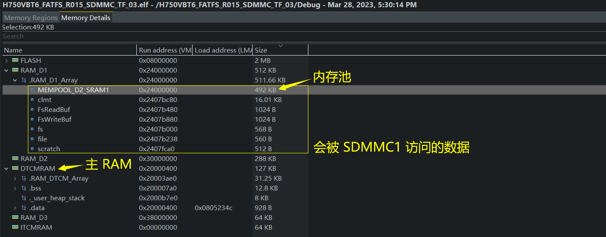
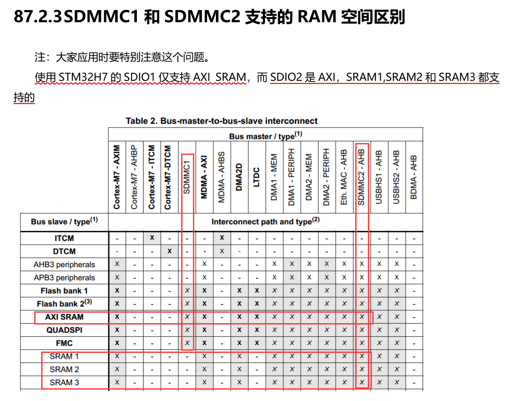
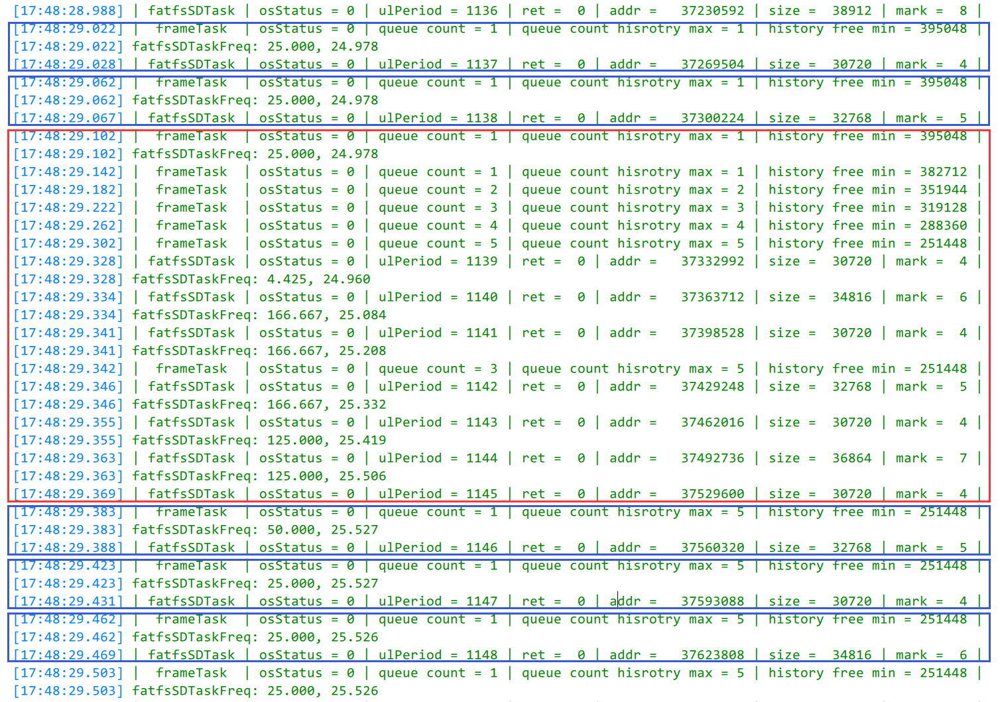
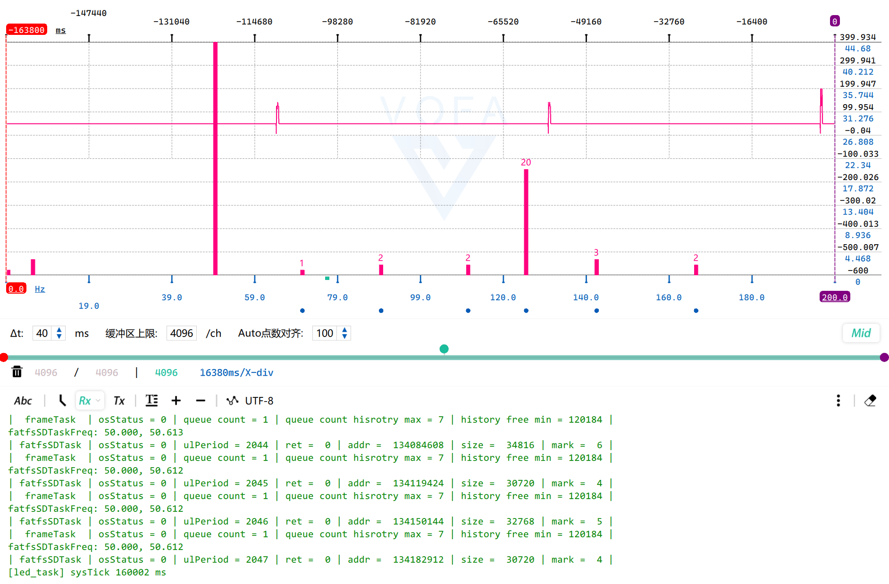
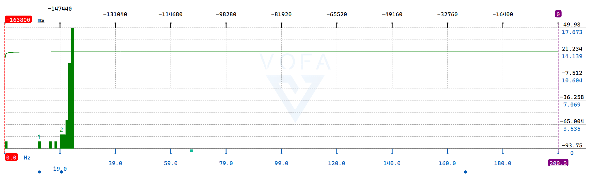
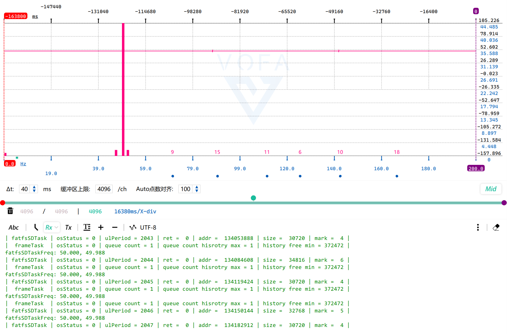
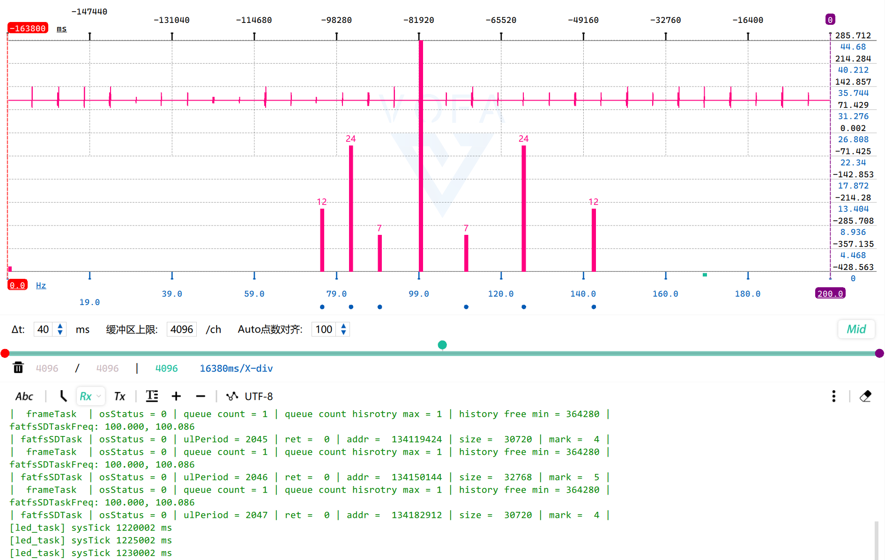
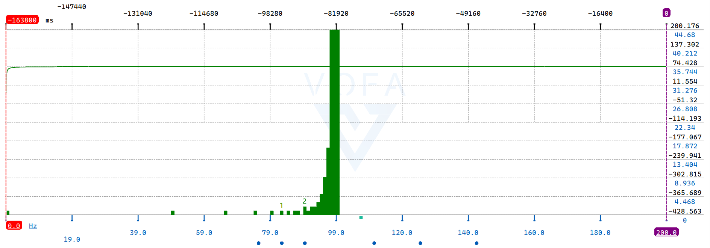
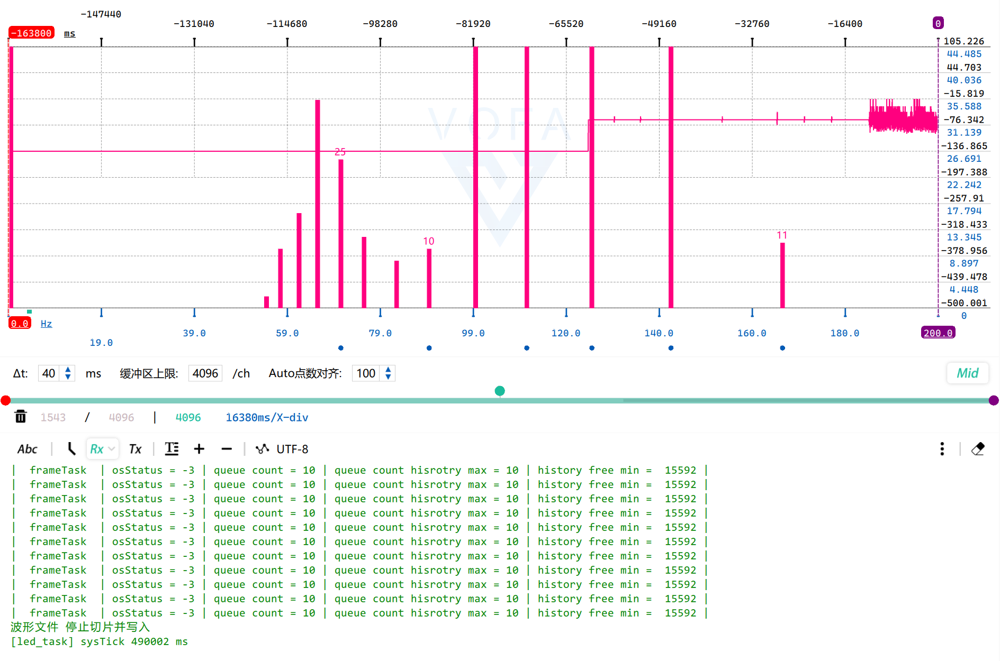

## H750VBT6_FATFS_R015_SDMMC_TF_03

> 创建日期：2023-03-27

## 关于

用于 [H750VBT6_FATFS_R015_SDMMC_TF_02](https://github.com/oldgerman/workspace_H7/tree/master/H750VBT6_FATFS_R015_SDMMC_TF_02) 工程的下阶段测试

关键内存分布：



## 帧处理任务 与 FASFS+SD卡任务 之间的消息队列通信

### 参考

- [FreeRTOS消息队列——xiaojie0513](https://shequ.stmicroelectronics.cn/thread-619700-1-1.html)

  > **3.写阻塞**
  >
  > 与读阻塞想反，任务也可以在写队列时指定一个阻塞超时时间。这个时间是**当被写队列已满时，任务进入阻塞态**以等待队列空间有效的最长时间。
  >
  > > 阻塞态（Blocked） ：由于等待信号量，消息队列，事件标志组等而处于的状态被称之为阻塞态，任务调用延迟函数也会处于阻塞态。—— Armfly V5 FreeRTOS P146
  >
  > 由于队列可以被多个任务写入，所以对单个队列而言，也可能有多个任务处于阻塞状态以等待队列空间有效。这种情况下，一旦队列空间有效，只会有一个任务会被解除阻塞，这个任务就是所有等待任务中优先级最高的任务。而如果所有等待任务的优先级相同，那么被解除阻塞的任务将是等待最久的任务。

### 存取消息时发生了什么？

假设 RTOS 对象情况如下：

- frameProcessorTask（帧处理器任务）是 RealTime 优先级，向消息队列放数据，每秒固定频率执行（取 25Hz，每 40 ms 系统时间戳被调度一次）
- fatfsSDTask（FATFS SD卡任务）是 Normal 优先级，从消息队列取数据，需要消息队列里有消息才会解除阻塞态，然后在运行态时从消息队列取数据（由事件驱动）
- 消息队列采用 FIFO 方式的存取
- 有 3 个写入 SD 卡的缓冲区（3 个看作一个循环缓冲区）分别对应三种消息：msg_write_buf_1、msg_write_buf_2、msg_write_buf_3，frameProcessorTask 每次调用会循环发送这三种消息

用表格当作时序图模拟一波运行过程：

| frameProcessorTask | frameProcessorTask | fatfsSDTask      | fatfsSDTask        | msg_queue                                         | msg_queue        |
| ------------------ | ------------------ | ---------------- | ------------------ | ------------------------------------------------- | ---------------- |
| 调度时间戳（ms）   | 放数据             | 调度时间戳（ms） | fatfsSDTask 取数据 | 剩余的消息                                        | 剩余的消息个数   |
| 40                 | msg_write_buf_1    |                  |                    | msg_write_buf_1                                   | 1                |
|                    |                    | 42               | msg_write_buf_1    |                                                   | 0                |
| 80                 | msg_write_buf_2    |                  |                    | msg_write_buf_2                                   | 1                |
| 120                | msg_write_buf_3    |                  |                    | msg_write_buf_3、msg_write_buf_2                  | 2                |
|                    |                    | 122              | msg_write_buf_2    | msg_write_buf_3                                   | 1                |
| 160                | msg_write_buf_1    |                  |                    | msg_write_buf_1、msg_write_buf_3                  | 2                |
| 200                | msg_write_buf_2    |                  |                    | msg_write_buf_2、msg_write_buf_1、msg_write_buf_3 | 3 **消息队列满** |
|                    |                    | 202              | msg_write_buf_3    | msg_write_buf_2、msg_write_buf_1                  | 2                |
|                    |                    | 222              | msg_write_buf_1    | msg_write_buf_2                                   | 1                |
| 240                | msg_write_buf_3    |                  |                    | msg_write_buf_3、msg_write_buf_2                  | 2                |
|                    |                    | 262              | msg_write_buf_2    | msg_write_buf_3                                   | 1                |
| 280                | msg_write_buf_1    |                  |                    | msg_write_buf_1、msg_write_buf_3                  | 2                |
|                    |                    | 292              | msg_write_buf_3    | msg_write_buf_1                                   | 1                |
|                    |                    | 302              | msg_write_buf_1    |                                                   | 0                |
| 320                | msg_write_buf_2    |                  |                    | msg_write_buf_2                                   | 1                |
| 360                | msg_write_buf_3    |                  |                    | msg_write_buf_3、msg_write_buf_2                  | 2                |
| ...                | ...                | ...              | ...                | ...                                               | ...              |

### 消息队列参数的约束

消息队列的深度取多大？比较特殊：

- 消息队列深度不能超过写入SD卡缓冲区的个数，若超过了，当消息队列满时，例如消息队列里有 msg_write_buf_1、2、3、1，就会发生重复写入两次 1 号缓冲区的数据

消息队列的存放函数超时等待时间给多大？比较特殊：

- 在本工程中，我一开始认为永远不能让消息队列存满，后来应该是可以存满的，但需要保证 存放消息的等待时间 + 本次任务运行到此的时间 < 任务的绝对调度周期，这个等待的时间可能需要动态调整（暂未写到代码中）

  > ```c
  > static void frameProcessorTask(void* argument)
  > {
  > 
  > 	TickType_t xLastWakeTime;
  > 	TickType_t xTaskPeriod;
  > 	xLastWakeTime = xTaskGetTickCount();	/* 获取当前的系统时间 */
  > 	TickType_t xTimeStampStartFun;     // 任务函数被调度时在for(;;)最开始记录的时间戳
  >  TickType_t xTimeStampBeforePutMsg; // 存放消息队列之前的时间戳
  >  TickType_t xTimeStampOffset = 1;  // 时间偏移，这个值需要看情况调整
  >  bool isMsgQueueOverflow;  // 标记消息队列是否溢出
  > 
  > 	for (;;)
  > 	{
  >      /* 进入函数立即保存时间戳 */
  >      xTimeStampStartFun = xTaskGetTickCount();
  > 
  >      /* 数据处理 */
  >      ... 
  > 
  > 		xTaskPeriod = 1000 / frame_freq;	/* 调度周期，单位ms */
  >       /* 结束函数保存时间戳 */
  >       xTimeStampBeforePutMsg = xTaskGetTickCount();
  >      /* 向消息队列存放缓冲区的消息，并判断是否成功在给定时间内将消息放入队列 */
  >      if(osMessageQueuePut(	osMessageQueueId_t 	mq_id,
  >          const void * msg_ptr,
  >          uint8_t      msg_prio,
  >          uint32_t     timeout //写阻塞时间 给 xTaskPeriod - (xTimeStampBeforePutMsg - xTimeStampStartFun) - xTimeStampOffset  当被写队列已满时，存放消息的任务进入阻塞态等待队列空间的最长时间
  >      	) == osErrorTimeout) {
  >          isMsgQueueOverflow = true; //消息队列溢出
  >          printf("消息队列溢出\r\n");
  >     }
  >       /* 等待绝对时间的下次调度 */
  > 		vTaskDelayUntil(&xLastWakeTime, xTaskPeriod);
  > 	}
  > };
  > ```
  >
  > 若写等待时间到了，消息队列还是满的，就会发生消息队列被覆盖写入
  >
  > **osMessageQueuePut** 可能的 **osStatus_t** 返回值：
  >
  > - osOK：消息已放入队列。
  > - osErrorTimeout：无法在给定时间内将消息放入队列（等待时间语义）。
  > - osErrorResource：队列中空间不足（尝试语义）。
  > - osErrorParameter：参数mq_id为NULL或无效，ISR 中指定的非零超时。
  >
  > ```c
  > /// Status code values returned by CMSIS-RTOS functions.
  > typedef enum {
  >   osOK                      =  0,         ///< Operation completed successfully.
  >   osError                   = -1,         ///< Unspecified RTOS error: run-time error but no other error message fits.
  >   osErrorTimeout            = -2,         ///< Operation not completed within the timeout period.
  >   osErrorResource           = -3,         ///< Resource not available.
  >   osErrorParameter          = -4,         ///< Parameter error.
  >   osErrorNoMemory           = -5,         ///< System is out of memory: it was impossible to allocate or reserve memory for the operation.
  >   osErrorISR                = -6,         ///< Not allowed in ISR context: the function cannot be called from interrupt service routines.
  >   osStatusReserved          = 0x7FFFFFFF  ///< Prevents enum down-size compiler optimization.
  > } osStatus_t;
  > ```

## FATFS 发送缓冲区无法使用 RAM_D2

排查了好久，百思不得其解，最后发现原因是 开发板 使用的 SDMMC1 控制器的 IDMA 只能访问 RAM_D2（AXI SRAM）！我潜意识里却想着正在画的板子用的 SDMMC2...。看安富莱V7的教程时还特别标出了，实际测试时又忘了：



## 测试（闪迪64G Ultra）

闪迪 64G Ultra 格式化为 FAT32 + 64KB 簇大小，在格式化后写入几十G后，才进行下列测试

### 层链表信息

| 层编号 | 瓦片大小 | 瓦片缓冲区大小 | 瓦片缓冲区地址 | 缓冲区大小 | 缓冲区发送周期 | DRAM 当前共使用 | DRAM 当前剩余 | DRAM 历史最少可用 |
| ------ | -------- | -------------- | -------------- | ---------- | -------------- | --------------- | ------------- | ----------------- |
| 0      | 1        | 2048           | 0x240005e0     | 4096       | 2048           | 3592            | 500216        | 500216            |
| 1      | 2        | 2048           | 0x24000e20     | 8192       | 1024           | 5688            | 498120        | 498120            |
| 2      | 4        | 2048           | 0x24001640     | 16384      | 512            | 7784            | 496024        | 496024            |
| 3      | 8        | 2048           | 0x24001e80     | 32768      | 256            | 9880            | 493928        | 493928            |
| 4      | 16       | 2048           | 0x240026a0     | 65536      | 128            | 11976           | 491832        | 491832            |
| 5      | 32       | 2048           | 0x24002ee0     | 131072     | 64             | 14072           | 489736        | 489736            |
| 6      | 64       | 2048           | 0x24003700     | 262144     | 32             | 16168           | 487640        | 487640            |
| 7      | 128      | 2048           | 0x24003f40     | 524288     | 16             | 18264           | 485544        | 485544            |
| 8      | 256      | 2048           | 0x24004760     | 1048576    | 8              | 20360           | 483448        | 483448            |
| 9      | 512      | 2048           | 0x24004fa0     | 2097152    | 4              | 22456           | 481352        | 481352            |
| 10     | 1024     | 2048           | 0x240057c0     | 4194304    | 2              | 24552           | 479256        | 479256            |
| 11     | 2048     | 2048           | 0x24006000     | 8388608    | 1              | 26648           | 477160        | 477160            |
| 12     | 4096     | 4096           | 0x24006820     | 16777216   | 1              | 30792           | 473016        | 473016            |
| 13     | 8192     | 8192           | 0x24007860     | 33554432   | 1              | 39032           | 464776        | 464776            |
| 14     | 16384    | 16384          | 0x24009880     | 67108864   | 1              | 55464           | 448344        | 448344            |

注：根据瓦片缓冲区大小可知，不定长度写入的范围是 30KB ~ 52KB

### fatfsSDTask 执行周期

25Hz

> 事件消息队列深度为 10，覆盖写入波形文件，fatfsSDTask 实时单次频率（粉色）和实时平均频率（绿色）的直方图：
>
> 
>
> 
>
> 从实时单次频率直方图中串口消息可知：在本次测试中，消息队列的消息数历史最大值为 4，内存池最少可用 282216B，使用的态内存峰值为 492KB - 282216B ≈ 216KB，环形缓冲区使用的态内存峰值为  216KB - 55464B ≈ 162KB（55464B 为层瓦片缓冲和字符串缓冲区使用的内存，使用`TW+LAYER_INFO\r`命令即可获取）
>
> 经过十多次测试，极少数情况出现消息队列消息数是 5：概率约10000 次写入难碰到一次
>
> 
>
> 消息队列消息数是 5 时，环形写缓冲区占用的动态内存： 492KB - 55464B - 251448B ≈ 192.3KB

100Hz

> 设置事件消息队列深度为 15，此频率下消息队列很容易溢出，测试内存池可以支持的最大消息数为 11
>
> ```shell
> | frameTask | osStatus = 0 | queue count = 1 | queue count hisrotry max = 1 | history free min = 372472 | 
> | frameTask | osStatus = 0 | queue count = 2 | queue count hisrotry max = 2 | history free min = 353992 | 
> | frameTask | osStatus = 0 | queue count = 3 | queue count hisrotry max = 3 | history free min = 317080 | 
> | frameTask | osStatus = 0 | queue count = 4 | queue count hisrotry max = 4 | history free min = 286312 | 
> | frameTask | osStatus = 0 | queue count = 5 | queue count hisrotry max = 5 | history free min = 253496 | 
> | frameTask | osStatus = 0 | queue count = 6 | queue count hisrotry max = 6 | history free min = 222728 | 
> | frameTask | osStatus = 0 | queue count = 7 | queue count hisrotry max = 7 | history free min = 187864 | 
> | frameTask | osStatus = 0 | queue count = 8 | queue count hisrotry max = 8 | history free min = 157096 | 
> | frameTask | osStatus = 0 | queue count = 9 | queue count hisrotry max = 9 | history free min = 124280 | 
> | frameTask | osStatus = 0 | queue count = 10 | queue count hisrotry max = 10 | history free min =  93512 | 
> | frameTask | osStatus = 0 | queue count = 11 | queue count hisrotry max = 11 | history free min =  54552 | 
> | frameTask | osStatus = 0 | queue count = 12 | queue count hisrotry max = 12 | history free min =  23784 | 
> | frameTask | osStatus = 0 | queue count = 13 | queue count hisrotry max = 13 | history free min =  23784 | 
> ```

总结

> 以固定频率调度 frameProcessorTask 实时切片并写消息解除 fatfsSDTask 的阻塞，大多部分情况下，都是 frameTask 和 fatfsSDTask 交替调度，当fatfsSDTask 的实时性抽风时，稍后会补回调度，当频率过快，消息队列还是会空间不足
>
> 为了保险起见，将消息队列深度给 6 ，根据在100Hz 测得的 history free min = 222728B，这时环形写缓冲区占用的动态内存： 492KB - 55464B - 222728B ≈ 220.3KB。**通过将 AXI SRAM 的 256KB 作为动态内存给环形写缓冲区使用，就足够消除 FATFS + SD卡 以 25Hz 不定长度写入 30K~52KB 时间不确定的影响**

50Hz（补充）

> 格式化为 32KB 簇大小，用于对比三星64G EVO Plus 50Hz 下的测试
>
> 写入新建后预分配128MB的波形文件，fatfsSDTask 实时单次频率（粉色）和实时平均频率（绿色）的直方图：
>
> 

## 测试（三星64G EVO Plus）

三星 64G EVO Plus（约）格式化为 FAT32 + 32KB 簇大小，在刚刚格式化后测试

### fatfsSDTask 执行周期

25Hz

> 写入新建后预分配128MB的波形文件，fatfsSDTask 实时单次频率（粉色）和实时平均频率（绿色）的直方图：
>
> 
>
> 
>
> 全程很稳定

50Hz

> 写入新建后预分配128MB的波形文件，情况和 25Hz 开始时一样，因为 clmt 没有初始值了，导致 f_lseek 执行时间过长
>
> 
>
> 紧接着测试覆盖写入波形文件，全程丝滑多了
>
> 

100Hz

> 覆盖写入波形文件，fatfsSDTask 实时单次频率（粉色）和实时平均频率（绿色）的直方图：
>
> 
>
> 
>
> 4096次的 ( 4096 - ( 12 + 24 + 7 + 7 + 24 + 12 ) ) / 4096 = 97.9% 落在 100Hz，消息队列的消息数全程没有超过 1 个（经过多次测试，还是没有超过 1 个），以 100Hz 发起不定长度的写入，平均速度超过 4MB/s，每次写的时间都不超过 10ms，相当逆天（对比前文测试闪迪 64G Ultra 即使格式化后，50Hz 甚至会出现消息个数为 7...）
>
> 一高兴，秒翻车：
>
> 

总结

> FATFS + SD 卡的实时性不行不能一概而论，**使用高性能 SD 卡，可以提升一定的写入实时性**

## 附

### 消息队列传指针的问题

消息队列传了事件结构的地址，里面含有多缓冲区的地址信息

若 fatfsSDTask 取的是消息队列满时的一个消息，并用指针变量保存了这个消息，且还未或正在通过这个指针访问事件地址上的参数数据时，被 frameProcessorTask 抢占调度，紧接着 frameProcessorTask 在下一个掉事件结构的地址上设置新的数据，这时是可以向消息队列最后一个消息空位里放消息的（新事件结构的地址），切回 fatfsSDTask 调度时，继续根据指针访问前一个事件结构的地址上设置的数据

### 写入环形缓冲区的线程安全

本工程不需要保证环形缓冲的线程安全，当消息队列溢出，就表明失败，消息队列只要没有溢出，那环形缓冲区必定是安全的

参考：

- [线程安全的环形缓冲区实现](https://blog.csdn.net/lezhiyong/article/details/7879558)

  > 应用背景：
  >
  > 线程1每次将数量不一的音频采样点（PCM音频数据）写入环形缓冲区，线程2每次取固定数量采样点送音频编码器，线程1线程2在平均时间内的读写数据量相等（倒入桶中的水量有时大有时小，但每次取一瓢喝）
  >
  > > **和本工程的应用场景很相似：**
  > >
  > > frameProcessorTask 以固定的调度周期将固定的数量采样点写入环形缓冲区，向消息队列里写带有本次缓冲区信息的消息。fatfsSDTask 从消息队列里取消息，以不确定的调度周期每次将将固定数量的采样点写入SD卡。frameProcessorTask 和 fatfsSDTask 任务在平均时间内的调度次数和读写数据量相等，但调度周期一个确定，一个不确定。
