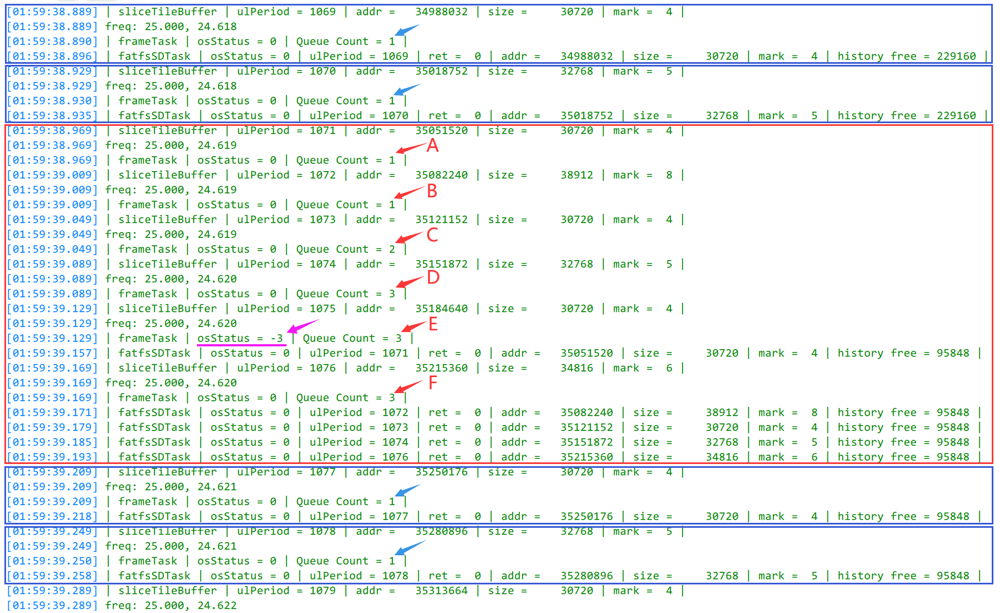

## H750VBT6_FATFS_R015_SDMMC_TF_03

> 创建日期：2023-03-27

## 关于

用于 [H750VBT6_FATFS_R015_SDMMC_TF_02](https://github.com/oldgerman/workspace_H7/tree/master/H750VBT6_FATFS_R015_SDMMC_TF_02) 工程的下阶段测试

## 帧处理任务 与 FASFS+SD卡任务 之间的消息队列通信

### 参考

- [FreeRTOS消息队列——xiaojie0513](https://shequ.stmicroelectronics.cn/thread-619700-1-1.html)

  > **3.写阻塞**
  >
  > 与读阻塞想反，任务也可以在写队列时指定一个阻塞超时时间。这个时间是**当被写队列已满时，任务进入阻塞态**以等待队列空间有效的最长时间。
  >
  > > 阻塞态（Blocked） ：由于等待信号量，消息队列，事件标志组等而处于的状态被称之为阻塞态，任务调用延迟函数也会处于阻塞态。—— Armfly V5 FreeRTOS P146
  >
  > 由于队列可以被多个任务写入，所以对单个队列而言，也可能有多个任务处于阻塞状态以等待队列空间有效。这种情况下，一旦队列空间有效，只会有一个任务会被解除阻塞，这个任务就是所有等待任务中优先级最高的任务。而如果所有等待任务的优先级相同，那么被解除阻塞的任务将是等待最久的任务。

### 存取消息时发生了什么？

假设 RTOS 对象情况如下：

- frameProcessorTask（帧处理器任务）是 RealTime 优先级，向消息队列放数据，每秒固定频率执行（取 25Hz，每 40 ms 系统时间戳被调度一次）
- fatfsSDTask（FATFS SD卡任务）是 Low 优先级，从消息队列取数据，需要消息队列里有消息才会解除阻塞态，然后在运行态时从消息队列取数据（由事件驱动）
- 消息队列采用 FIFO 方式的存取
- 有 3 个写入 SD 卡的缓冲区（3 个看作一个循环缓冲区）分别对应三种消息：msg_write_buf_1、msg_write_buf_2、msg_write_buf_3，frameProcessorTask 每次调用会循环发送这三种消息

用表格当作时序图模拟一波运行过程：

| frameProcessorTask | frameProcessorTask | fatfsSDTask      | fatfsSDTask        | msg_queue                                         | msg_queue        |
| ------------------ | ------------------ | ---------------- | ------------------ | ------------------------------------------------- | ---------------- |
| 调度时间戳（ms）   | 放数据             | 调度时间戳（ms） | fatfsSDTask 取数据 | 剩余的消息                                        | 剩余的消息个数   |
| 40                 | msg_write_buf_1    |                  |                    | msg_write_buf_1                                   | 1                |
|                    |                    | 42               | msg_write_buf_1    |                                                   | 0                |
| 80                 | msg_write_buf_2    |                  |                    | msg_write_buf_2                                   | 1                |
| 120                | msg_write_buf_3    |                  |                    | msg_write_buf_3、msg_write_buf_2                  | 2                |
|                    |                    | 122              | msg_write_buf_2    | msg_write_buf_3                                   | 1                |
| 160                | msg_write_buf_1    |                  |                    | msg_write_buf_1、msg_write_buf_3                  | 2                |
| 200                | msg_write_buf_2    |                  |                    | msg_write_buf_2、msg_write_buf_1、msg_write_buf_3 | 3 **消息队列满** |
|                    |                    | 202              | msg_write_buf_3    | msg_write_buf_2、msg_write_buf_1                  | 2                |
|                    |                    | 222              | msg_write_buf_1    | msg_write_buf_2                                   | 1                |
| 240                | msg_write_buf_3    |                  |                    | msg_write_buf_3、msg_write_buf_2                  | 2                |
|                    |                    | 262              | msg_write_buf_2    | msg_write_buf_3                                   | 1                |
| 280                | msg_write_buf_1    |                  |                    | msg_write_buf_1、msg_write_buf_3                  | 2                |
|                    |                    | 292              | msg_write_buf_3    | msg_write_buf_1                                   | 1                |
|                    |                    | 302              | msg_write_buf_1    |                                                   | 0                |
| 320                | msg_write_buf_2    |                  |                    | msg_write_buf_2                                   | 1                |
| 360                | msg_write_buf_3    |                  |                    | msg_write_buf_3、msg_write_buf_2                  | 2                |
| ...                | ...                | ...              | ...                | ...                                               | ...              |

### 消息队列参数的约束

消息队列的深度取多大？比较特殊：

- 消息队列深度不能超过写入SD卡缓冲区的个数，若超过了，当消息队列满时，例如消息队列里有 msg_write_buf_1、2、3、1，就会发生重复写入两次 1 号缓冲区的数据

消息队列的存放函数超时等待时间给多大？比较特殊：

- 在本工程中，我一开始认为永远不能让消息队列存满，后来应该是可以存满的，但需要保证 存放消息的等待时间 + 本次任务运行到此的时间 < 任务的绝对调度周期，这个等待的时间可能需要动态调整：

  > ```c
  > static void frameProcessorTask(void* argument)
  > {
  > 
  > 	TickType_t xLastWakeTime;
  > 	TickType_t xTaskPeriod;
  > 	xLastWakeTime = xTaskGetTickCount();	/* 获取当前的系统时间 */
  > 	TickType_t xTimeStampStartFun;     // 任务函数被调度时在for(;;)最开始记录的时间戳
  >  TickType_t xTimeStampBeforePutMsg; // 存放消息队列之前的时间戳
  >  TickType_t xTimeStampOffset = 1;  // 时间偏移，这个值需要看情况调整
  >  bool isMsgQueueOverflow;  // 标记消息队列是否溢出
  > 
  > 	for (;;)
  > 	{
  >      /* 进入函数立即保存时间戳 */
  >      xTimeStampStartFun = xTaskGetTickCount();
  > 
  >      /* 数据处理 */
  >      ... 
  > 
  > 		xTaskPeriod = 1000 / frame_freq;	/* 调度周期，单位ms */
  >       /* 结束函数保存时间戳 */
  >       xTimeStampBeforePutMsg = xTaskGetTickCount();
  >      /* 向消息队列存放缓冲区的消息，并判断是否成功在给定时间内将消息放入队列*/ */
  >      if(osMessageQueuePut(	osMessageQueueId_t 	mq_id,
  >          const void * msg_ptr,
  >          uint8_t      msg_prio,
  >          uint32_t     timeout //写阻塞时间 给 xTaskPeriod - (xTimeStampBeforePutMsg - xTimeStampStartFun) - xTimeStampOffset  当被写队列已满时，存放消息的任务进入阻塞态等待队列空间的最长时间
  >      	) == osErrorTimeout) {
  >          isMsgQueueOverflow = true; //消息队列溢出
  >          printf("消息队列溢出\r\n");
  >     }
  >       /* 等待绝对时间的下次调度 */
  > 		vTaskDelayUntil(&xLastWakeTime, xTaskPeriod);
  > 	}
  > };
  > ```
  >
  > 若写等待时间到了，消息队列还是满的，就会发生消息队列被覆盖写入
  >
  > **osMessageQueuePut** 可能的 **osStatus_t** 返回值：
  >
  > - osOK：消息已放入队列。
  > - osErrorTimeout：无法在给定时间内将消息放入队列（等待时间语义）。
  > - osErrorResource：队列中空间不足（尝试语义）。
  > - osErrorParameter：参数mq_id为NULL或无效，ISR 中指定的非零超时。
  >
  > ```c
  > /// Status code values returned by CMSIS-RTOS functions.
  > typedef enum {
  >   osOK                      =  0,         ///< Operation completed successfully.
  >   osError                   = -1,         ///< Unspecified RTOS error: run-time error but no other error message fits.
  >   osErrorTimeout            = -2,         ///< Operation not completed within the timeout period.
  >   osErrorResource           = -3,         ///< Resource not available.
  >   osErrorParameter          = -4,         ///< Parameter error.
  >   osErrorNoMemory           = -5,         ///< System is out of memory: it was impossible to allocate or reserve memory for the operation.
  >   osErrorISR                = -6,         ///< Not allowed in ISR context: the function cannot be called from interrupt service routines.
  >   osStatusReserved          = 0x7FFFFFFF  ///< Prevents enum down-size compiler optimization.
  > } osStatus_t;
  > ```

## 测试

### 消息队列放满但未溢出的瞬间

配置消息队列深度为 3 ，以 25Hz 实时切片并写入SD卡，大多部分时间下，都是 frameTask 和 fatfsSDTask 交替调度



## 附

### 消息队列传指针的问题

消息队列传了事件结构的地址，里面含有多缓冲区的地址信息

若 fatfsSDTask 取的是消息队列满时的一个消息，并用指针变量保存了这个消息，且还未或正在通过这个指针访问事件地址上的参数数据时，被 frameProcessorTask 抢占调度，紧接着 frameProcessorTask 在下一个掉事件结构的地址上设置新的数据，这时是可以向消息队列最后一个消息空位里放消息的（新事件结构的地址），切回 fatfsSDTask 调度时，继续根据指针访问前一个事件结构的地址上设置的数据

### 写入环形缓冲区的线程安全

本工程不需要保证环形缓冲的线程安全，当消息队列溢出，就表明失败，消息队列只要没有溢出，那环形缓冲区必定是安全的

参考

- [线程安全的环形缓冲区实现](https://blog.csdn.net/lezhiyong/article/details/7879558)

  > 应用背景：
  >
  > 线程1每次将数量不一的音频采样点（PCM音频数据）写入环形缓冲区，线程2每次取固定数量采样点送音频编码器，线程1线程2在平均时间内的读写数据量相等（倒入桶中的水量有时大有时小，但每次取一瓢喝）
  >
  > > **和本工程的应用场景很相似：**
  > >
  > > frameProcessorTask 以固定的调度周期将固定的数量采样点写入环形缓冲区，向消息队列里写带有本次缓冲区信息的消息。fatfsSDTask 从消息队列里取消息，以不确定的调度周期每次将将固定数量的采样点写入SD卡。frameProcessorTask 和 fatfsSDTask 任务在平均时间内的调度次数和读写数据量相等，但调度周期一个确定，一个不确定。
