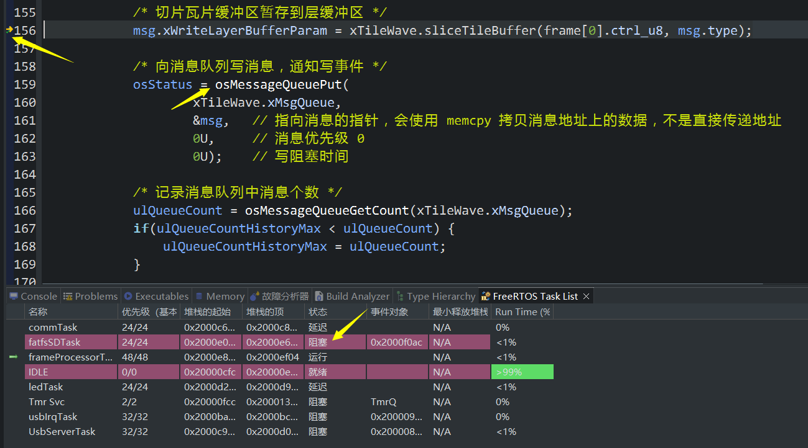
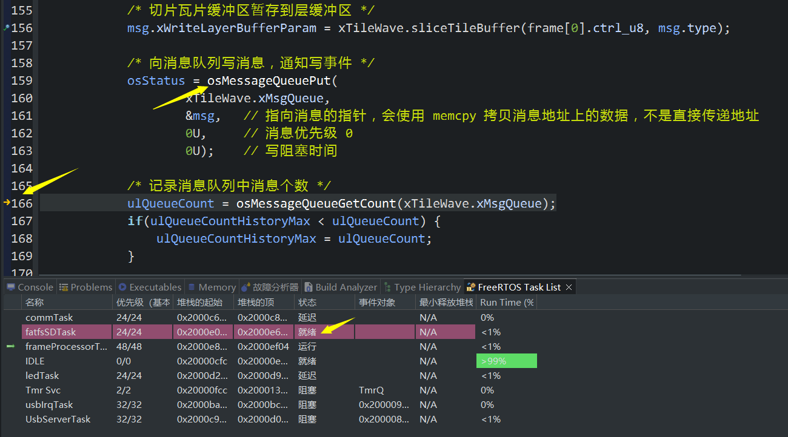
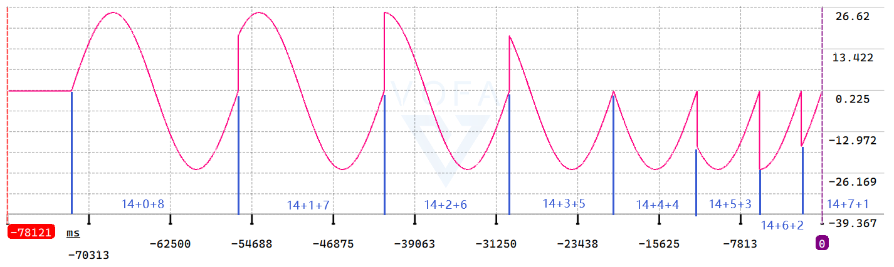
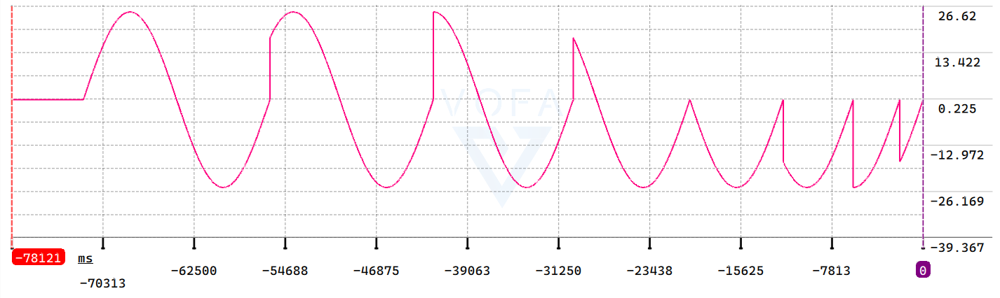
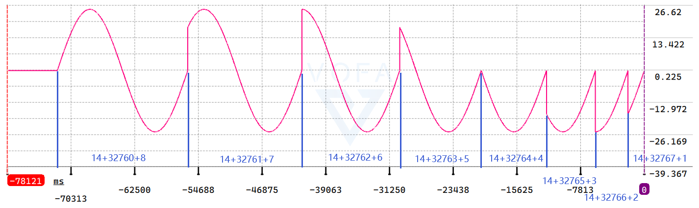
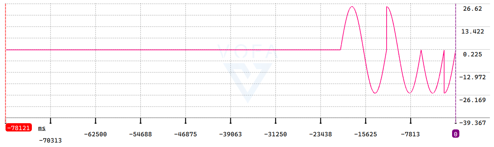
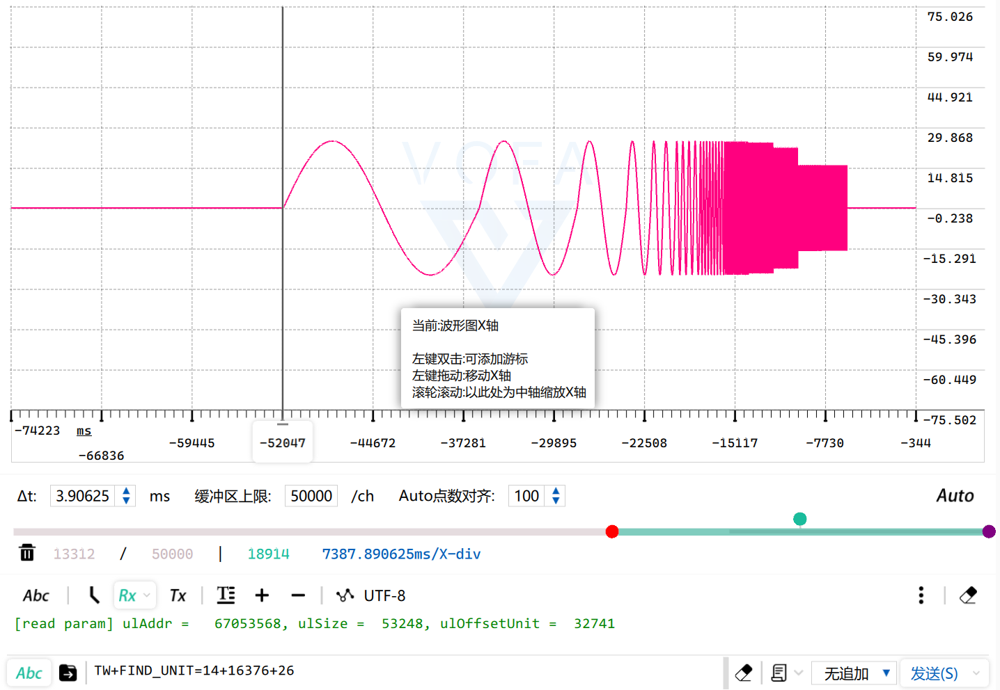
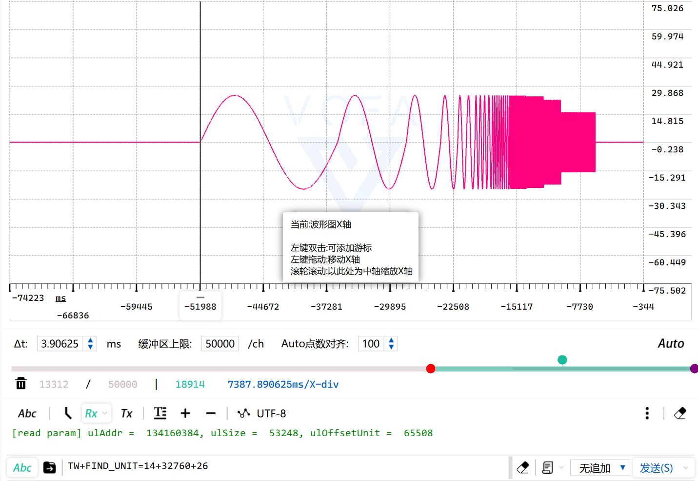
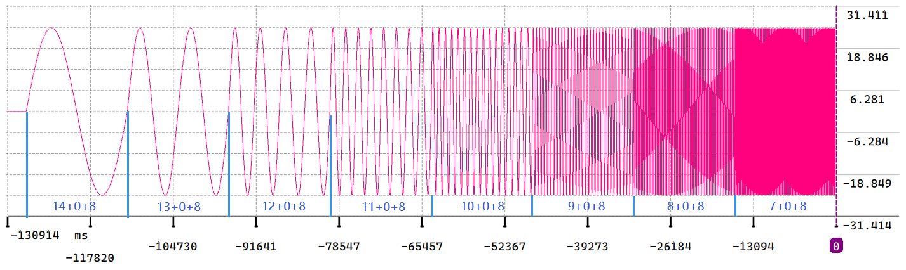

## H750VBT6_FATFS_R015_SDMMC_TF_04

## 关于

在 [H750VBT6_FATFS_R015_SDMMC_TF_03](https://github.com/oldgerman/workspace_H7/tree/master/H750VBT6_FATFS_R015_SDMMC_TF_03) 的基础上修改

计划实现：

- 瓦片波形文件 (*.tilewave) 文件格式设计

- 写瓦片数据消息队列放满后，等可以写入时，以某种方式标出未记录的数据的地址区间

  > 应该要在文件格式头部存这个坏数据的范围信息

- 读瓦片数据的查找算法

## 不定长写入规律表

| 层编号       | 0       | 1       | 2       | 3       | 4       | 5       | 6       | 7       | 8       | 9       | 10      | 11      | 12   | 13   | 14   |      |      |
| ------------ | ------- | ------- | ------- | ------- | ------- | ------- | ------- | ------- | ------- | ------- | ------- | ------- | ---- | ---- | ---- | ---- | ---- |
| 缓冲区       | 4KB     | 8KB     | 16KB    | 32KB    | 64KB    | 128KB   | 256KB   | 512KB   | 1MB     | 2MB     | 4MB     | 8MB     | 16MB | 32MB | 64MB |      |      |
| 瓦片大小     | 1B      | 2B      | 4B      | 8B      | 16B     | 32B     | 64B     | 128B    | 256B    | 512B    | 1KB     | 2KB     | 4KB  | 8KB  | 16KB |      |      |
| 瓦片缓冲区   | 2KB     | 2KB     | 2KB     | 2KB     | 2KB     | 2KB     | 2KB     | 2KB     | 2KB     | 2KB     | 2KB     | 2KB     | 4KB  | 8KB  | 16KB |      |      |
| 瓦片数       | 4096    | 4096    | 4096    | 4096    | 4096    | 4096    | 4096    | 4096    | 4096    | 4096    | 4096    | 4096    | 4096 | 4096 | 4096 |      |      |
|              |         |         |         |         |         |         |         |         |         |         |         |         |      |      |      |      |      |
| 1            | 1B      | 2B      | 4B      | 8B      | 16B     | 32B     | 64B     | 128B    | 256B    | 512B    | 1KB     | **2KB** | 4KB  | 8KB  | 16KB | 30KB | a    |
| 2            | 2B      | 4B      | 8B      | 16B     | 32B     | 64B     | 128B    | 256B    | 512B    | 1KB     | **2KB** | 4KB     | 8KB  | 16KB | 32KB | 32KB | b    |
| 4            | 4B      | 8B      | 16B     | 32B     | 64B     | 128B    | 256B    | 512B    | 1KB     | **2KB** | 4KB     | 8KB     | 16KB | 32KB | 64KB | 34KB | c    |
| 8            | 8B      | 16B     | 32B     | 64B     | 128B    | 256B    | 512B    | 1KB     | **2KB** | 2KB     | 4KB     | 8KB     | 16KB | 32KB | 64KB | 36KB | d    |
| 16           | 16B     | 32B     | 64B     | 128B    | 256B    | 512B    | 1KB     | **2KB** | 2KB     | 2KB     | 4KB     | 8KB     | 16KB | 32KB | 64KB | 38KB | e    |
| 32           | 32B     | 64B     | 128B    | 256B    | 512B    | 1KB     | **2KB** | 2KB     | 2KB     | 2KB     | 4KB     | 8KB     | 16KB | 32KB | 64KB | 40KB | f    |
| 64           | 64B     | 128B    | 256B    | 512B    | 1KB     | **2KB** | 2KB     | 2KB     | 2KB     | 2KB     | 4KB     | 8KB     | 16KB | 32KB | 64KB | 42KB | g    |
| 128          | 128B    | 256B    | 512B    | 1KB     | **2KB** | 2KB     | 2KB     | 2KB     | 2KB     | 2KB     | 4KB     | 8KB     | 16KB | 32KB | 64KB | 44KB | h    |
| 256          | 256B    | 512B    | 1KB     | **2KB** | 2KB     | 2KB     | 2KB     | 2KB     | 2KB     | 2KB     | 4KB     | 8KB     | 16KB | 32KB | 64KB | 46KB | i    |
| 512          | 512B    | 1KB     | **2KB** | 2KB     | 2KB     | 2KB     | 2KB     | 2KB     | 2KB     | 2KB     | 4KB     | 8KB     | 16KB | 32KB | 64KB | 48KB | j    |
| 1024         | 1KB     | **2KB** | 2KB     | 2KB     | 2KB     | 2KB     | 2KB     | 2KB     | 2KB     | 2KB     | 4KB     | 8KB     | 16KB | 32KB | 64KB | 50KB | k    |
| 2048         | **2KB** | 2KB     | 2KB     | 2KB     | 2KB     | 2KB     | 2KB     | 2KB     | 2KB     | 2KB     | 4KB     | 8KB     | 16KB | 32KB | 64KB | 52KB | l    |
|              |         |         |         |         |         |         |         |         |         |         |         |         |      |      |      |      |      |
| 每秒写入次数 | 16/2048 | 16/1024 | 16/512  | 16/256  | 16/128  | 16/64   | 16/32   | 16/16   | 16/8    | 16/4    | 16/2    | 1       | 1    | 1    | 1    | 合计 | 编号 |

30KB ~ 52KB 不定长写入随周期的变化规律：

```c
T  1 2 3 4 5 6 7 8 9 0 1 2 3 4 5 6 7 8 9 0 1 2 3 4 5 6 7 8 9 0 1 2  ... // 周期
   a b a c a b a d a b a c a b a e a b a c a b a d a b a c a b a f  ... // 编号
a: |   |   |   |   |   |   |   |   |   |   |   |   |   |   |   |    ...
b:   |       |       |       |       |       |       |       |      ...
c:       |               |               |               |          ...
d:               |                               |                  ...
e:                               |
f:                                                               |  ...
```

| T    | Layer           | 1    | 2    | 3    | 4    | 5    | 6    | 7    | 8    | 9    | 10   | 11   | 12   | 13   | 14   | 15   | 16   |
| ---- | --------------- | ---- | ---- | ---- | ---- | ---- | ---- | ---- | ---- | ---- | ---- | ---- | ---- | ---- | ---- | ---- | ---- |
| 1    | 14              | 8    | 8    | 8    | 8    | 8    | 8    | 8    | 8    | 8    | 8    | 8    | 8    | 8    | 8    | 8    | 8    |
| 1    | 13              | 4    | 4    | 4    | 4    | 4    | 4    | 4    | 4    | 4    | 4    | 4    | 4    | 4    | 4    | 4    | 4    |
| 1    | 12              | 2    | 2    | 2    | 2    | 2    | 2    | 2    | 2    | 2    | 2    | 2    | 2    | 2    | 2    | 2    | 2    |
| 1    | 11              | 1    | 1    | 1    | 1    | 1    | 1    | 1    | 1    | 1    | 1    | 1    | 1    | 1    | 1    | 1    | 1    |
| 2    | 10              |      | 1    |      | 1    |      | 1    |      | 1    |      | 1    |      | 1    |      | 1    |      | 1    |
| 4    | 9               |      |      |      | 1    |      |      |      | 1    |      |      |      | 1    |      |      |      | 1    |
| 8    | 8               |      |      |      |      |      |      |      | 1    |      |      |      |      |      |      |      | 1    |
| 16   | 7               |      |      |      |      |      |      |      |      |      |      |      |      |      |      |      | 1    |
|      | :point_up_2:SUM | 15   | 16   | 15   | 17   | 15   | 16   | 15   | 18   | 15   | 16   | 15   | 17   | 15   | 16   | 15   | 19   |
|      | :point_left:SUM | 15   | 31   | 46   | 63   | 78   | 94   | 109  | 127  | 142  | 158  | 173  | 190  | 205  | 221  | 236  | 255  |


## 写入的一些问题

### 周期计数器 BUG 修复

最开始的写入居然是最大的 52KB，但这时 0-10 层 还没有写满 2KB 呢

```c
|  frameTask  | osStatus = 0 | queue count = 1 | queue count hisrotry max = 1 | history free min = 395048 | 
fatfsSDTaskFreq: 0.005, 0.005
| fatfsSDTask | osStatus = 0 | ulPeriod =    0 | ret =  0 | addr =          0 | size =  53248 | mark = 15 | /* !< 52KB */
|  frameTask  | osStatus = 0 | queue count = 1 | queue count hisrotry max = 1 | history free min = 395048 | 
fatfsSDTaskFreq: 1.000, 0.502
| fatfsSDTask | osStatus = 0 | ulPeriod =    1 | ret =  0 | addr =      53248 | size =  30720 | mark =  4 | /* !< 30KB */
|  frameTask  | osStatus = 0 | queue count = 1 | queue count hisrotry max = 1 | history free min = 395048 | 
fatfsSDTaskFreq: 1.000, 0.668
| fatfsSDTask | osStatus = 0 | ulPeriod =    2 | ret =  0 | addr =      83968 | size =  32768 | mark =  5 | /* !< 32KB */
```

将周期计数器从 0-2047 计数范围改为 1-2048 计数后正常

```c
|  frameTask  | osStatus = 0 | queue count = 1 | queue count hisrotry max = 1 | history free min = 417576 | 
fatfsSDTaskFreq: 0.091, 0.091
| fatfsSDTask | osStatus = 0 | ulPeriod =    1 | ret =  0 | addr =          0 | size =  30720 | mark =  4 | /* !< 30KB */
|  frameTask  | osStatus = 0 | queue count = 1 | queue count hisrotry max = 1 | history free min = 415528 | 
fatfsSDTaskFreq: 1.000, 0.545
| fatfsSDTask | osStatus = 0 | ulPeriod =    2 | ret =  0 | addr =      30720 | size =  32768 | mark =  5 | /* !< 32KB */
|  frameTask  | osStatus = 0 | queue count = 1 | queue count hisrotry max = 1 | history free min = 415528 | 
fatfsSDTaskFreq: 1.000, 0.697
| fatfsSDTask | osStatus = 0 | ulPeriod =    3 | ret =  0 | addr =      63488 | size =  30720 | mark =  4 | /* !< 30KB */
```

### 最大的一次写入

出现在第 2048 周期 ，此时一次写 52KB

```c
|  frameTask  | osStatus = 0 | queue count = 1 | queue count hisrotry max = 1 | history free min = 397096 | 
fatfsSDTaskFreq: 50.000, 49.976
| fatfsSDTask | osStatus = 0 | ulPeriod = 2045 | ret =  0 | addr =   66959360 | size =  30720 | mark =  4 | 
|  frameTask  | osStatus = 0 | queue count = 1 | queue count hisrotry max = 1 | history free min = 397096 | 
fatfsSDTaskFreq: 50.000, 49.976
| fatfsSDTask | osStatus = 0 | ulPeriod = 2046 | ret =  0 | addr =   66990080 | size =  32768 | mark =  5 | 
    
|  frameTask  | osStatus = 0 | queue count = 1 | queue count hisrotry max = 1 | history free min = 397096 | 
fatfsSDTaskFreq: 50.000, 49.976
| fatfsSDTask | osStatus = 0 | ulPeriod = 2047 | ret =  0 | addr =   67022848 | size =  30720 | mark =  4 | 
|  frameTask  | osStatus = 0 | queue count = 1 | queue count hisrotry max = 1 | history free min = 395048 | 
fatfsSDTaskFreq: 50.000, 49.976
| fatfsSDTask | osStatus = 0 | ulPeriod = 2048 | ret =  0 | addr =   67053568 | size =  53248 | mark = 15 | /* !< 52KB */

|  frameTask  | osStatus = 0 | queue count = 1 | queue count hisrotry max = 1 | history free min = 395048 | 
fatfsSDTaskFreq: 50.000, 49.976
| fatfsSDTask | osStatus = 0 | ulPeriod =    1 | ret =  0 | addr =   67106816 | size =  30720 | mark =  4 | 
|  frameTask  | osStatus = 0 | queue count = 1 | queue count hisrotry max = 1 | history free min = 395048 | 
fatfsSDTaskFreq: 50.000, 49.976
| fatfsSDTask | osStatus = 0 | ulPeriod =    2 | ret =  0 | addr =   67137536 | size =  32768 | mark =  5 | 
```

### 最后一次写入

当前配置中的最后一次是第 4096 次写入，是不定长写入范围 30KB ~ 52KB 中 最长的 52KB

预分配 128MB 的波形文件 写满了多少？

> 偏移地址 134160384B + 写入大小 52KB = 134213632B，128MB - 134213632B = 4096B
>
> 剩余4KB，没有超过 128MB，这 4KB 可以当作瓦片波形文件头

```c
|  frameTask  | osStatus = 0 | queue count = 1 | queue count hisrotry max = 1 | history free min = 370424 | 
fatfsSDTaskFreq: 50.000, 49.988
| fatfsSDTask | osStatus = 0 | ulPeriod = 2047 | ret =  0 | addr =  134129664 | size =  30720 | mark =  4 | 
|  frameTask  | osStatus = 0 | queue count = 1 | queue count hisrotry max = 1 | history free min = 370424 | 
fatfsSDTaskFreq: 50.000, 49.988
| fatfsSDTask | osStatus = 0 | ulPeriod = 2048 | ret =  0 | addr =  134160384 | size =  53248 | mark = 15 | /* !< 52KB */
[led_task] sysTick 245002 ms
[led_task] sysTick 250002 ms
[led_task] sysTick 255002 ms
```

### 任意时刻停止写入

当前配置中的最后一次是第 4096 次写入，是不定长写入范围 30KB ~ 52KB 中 最长的 52KB，比 30KB 多的这 22KB 是层 0-10 瓦片缓冲区写满的瓦片数据，当任意时刻停止写入时，停止前的最后一次写入很难保证刚好是 52KB，概率只有 1 / 2048，而此时层 0-10 瓦片缓冲区中还有一部分瓦片数据没有写入到 SD卡，因此，当任意时刻停止写入时，需要强制写入 52KB，不论层 0-10 瓦片缓冲区是否存满瓦片

添加了一些代码，已实现：

```c
| fatfsSDTask | osStatus = 0 | ulPeriod =   64 | ret =  0 | addr =    2052096 | size =  43008 | mark = 10 | 
|  frameTask  | osStatus = 0 | queue count = 1 | queue count hisrotry max = 1 | history free min = 405288 | 
fatfsSDTaskFreq: 25.000, 24.617
| fatfsSDTask | osStatus = 0 | ulPeriod =   65 | ret =  0 | addr =    2095104 | size =  30720 | mark =  4 | 
|  frameTask  | osStatus = 0 | queue count = 1 | queue count hisrotry max = 1 | history free min = 405288 | 
fatfsSDTaskFreq: 25.000, 24.623
| fatfsSDTask | osStatus = 0 | ulPeriod =   66 | ret =  0 | addr =    2125824 | size =  32768 | mark =  5 | 
波形文件 停止切片并写入
|  frameTask  | osStatus = 0 | queue count = 1 | queue count hisrotry max = 1 | history free min = 395048 | 
fatfsSDTaskFreq: 25.000, 24.629
| fatfsSDTask | osStatus = 0 | ulPeriod =   67 | ret =  0 | addr =    2158592 | size =  53248 | mark = 15 |  /* !< 52KB */
[led_task] sysTick 30003 ms
[led_task] sysTick 35003 ms
[led_task] sysTick 40003 ms
```

## 读取的一些问题

### 单元

单元是在层、瓦片之后引入的新概念，1个单元大小 等于 `ulIOSizeMin`，该成员变量在每个`TileWave`对象构造时指定，单元限制了对层缓冲区的最小读写操作大小

### 任意层的一个单元在文件中的地址

一个瓦片仅会在一个周期内，需要生成一次读参数配置

算法在 `TileWave::xFindUnit()` 实现

### 任意层的多个连续单元在文件中的地址

对于层缓冲区的多个连续单元，在 SD 卡上可能跨越多个周期，问题比较复杂，需要生成多次读参数配置

算法在 `TileWave::xFindUnitList()` 实现

## 测试

### fatfsSDTask 任务状态

`osMessageQueueGet()`的`timeout`参数之前给错成 `0U`，导致不论消息队列里是否消息，`fatfsSDTask()` 都是就绪态， 将`timeout` 参数修改为`osWaitForever`正常（消息队列里没消息时，可以进入阻塞态）

```c
static void fatfsSDTask(void* argument)
{
...
	for(;;)
	{
		osStatus = osMessageQueueGet(xTileWave.xMsgQueue, &msg, 0U, osWaitForever);   // wait for message
		//                                                          ^~~~~~~~~~~~~
		//                                                          从 0U 修改为 osWaitForever
	}
}
```

frameProcessorTask 写消息前 fatfsSDTask 是阻塞态：



frameProcessorTask 写消息后 fatfsSDTask 是就绪态：



### CPU 利用率

- 25Hz 实时写入 1700次，10Hz 读取单周期的一个单元，并打印1个单元的数据

  ```c
  ---------------------------------------------
  任务名 运行计数 使用率
  UsbServerTask                  	518		<1%
  IDLE                           	1129090		77%
  ledTask                        	7		<1%
  frameProcessorTask             	140907		9%
  commTask                       	0		<1%
  fatfsSDTask                    	182545		12% // printf 打印 1 个单元内的 512 个 4byte 数据
  usbIrqTask                     	0		<1%
  Tmr Svc                        	0		<1%
  ---------------------------------------------
  ```

- 25Hz 实时写入 1700次，10Hz 读取单周期的一个单元，不打印单元的数据

  ```c
  ---------------------------------------------
  任务名 运行计数 使用率
  UsbServerTask                  	529		<1%
  IDLE                           	1280669		86%
  ledTask                        	6		<1%
  frameProcessorTask             	137213		9%
  commTask                       	0		<1%
  fatfsSDTask                    	54979		3% // printf 不打印单元数据
  usbIrqTask                     	0		<1%
  Tmr Svc                        	0		<1%
  ---------------------------------------------
  ```

### TileWave::xFindUnit()

> 命令：`TW+FIND_UNIT=层号+单元偏移+单元长度`

TW+FIND_UNIT=14+0+8 到 14+7+1步进



TW+FIND_UNIT=14+8+8 到 14+15+1步进



TW+FIND_UNIT=14+32760+8 到 14+32767+1 步进



TW+FIND_UNIT=13+0+4 到 13+3+1 步进



| 第2048周期的26个单元：                                       | 第4096周期的26个单元：                                       |
| ------------------------------------------------------------ | ------------------------------------------------------------ |
|  |  |

### TileWave::xFindUnitList()

某一层的连续单元读取（存在跨周期+非连续文件地址）



## 附

### 参考

- [vector 类 Microsoft | Learn](https://learn.microsoft.com/zh-cn/cpp/standard-library/vector-class?view=msvc-170)
- [正确释放 vector 的内存 clear()，swap()，shrink_to_fit()](https://blog.csdn.net/wangshubo1989/article/details/50359750)
- [函数返回值是容器的执行速度比容器作为参数传递要慢的多](https://www.cnblogs.com/nixiangren/p/9987775.html)
- [vector作为函数返回值出现的问题及解决方法](https://zhuanlan.zhihu.com/p/381183992)
