## H750VBT6_FATFS_SDMMC_TF_01

## 警告

请勿将存有重要数据的SD卡用于本工程的代码测试，请准备专用的SD卡测试 ！！！

## 关于 

在 H750VBT6_chapter_88 基础上修改，使能cache配置

## 配置 Cache 的深坑

### 修改ST固件库的BUG

按照 sd_diskio.c 中介绍的方法，将ENABLE_SD_DMA_CACHE_MAINTENANCE 和 ENABLE_SCRATCH_BUFFER 使能就行：

```c
#define ENABLE_SD_DMA_CACHE_MAINTENANCE  1
#define ENABLE_SCRATCH_BUFFER
```

但调试时却看到 FATFS 全局变量内很多数据都是乱码，关闭这两个选项并关闭Cache（注释掉 main 函数中的 SCB_EnableDCache();）后测试SD卡才正常，甚是纳闷，2号命令测试如下表

| 关D-cache，2号测试命令，测试OK，FATFS fs变量的成员win[512] 内都是文件名的字符 | 开D-cache，2号测试命令，报错，FATFS fs变量的成员win[512] 内都是乱码 |
| ------------------------------------------------------------ | ------------------------------------------------------------ |
| 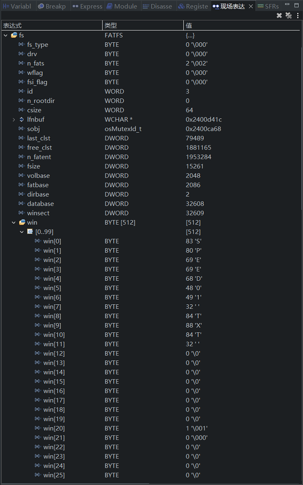                     | 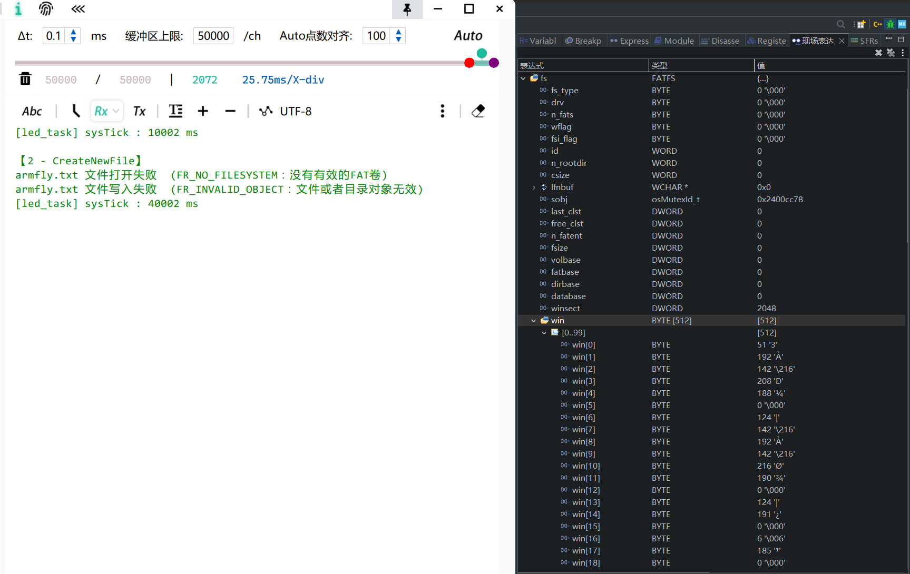 |

将`SD_read()`中的0x3改为0x1f

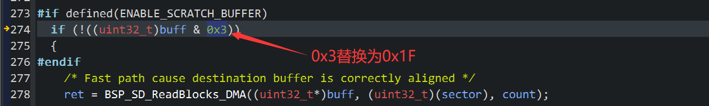

再次配置为开Cache，总算乱码消失+测试SD卡正常：

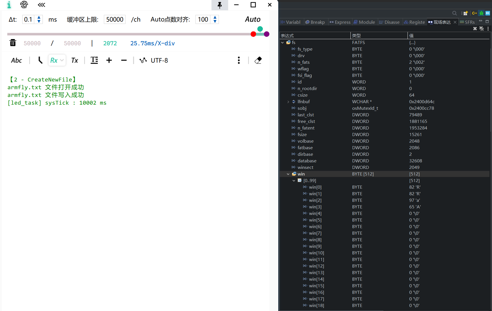

这么改的原因来自这篇文章：[STM32+SDIO+FreeRTOS+FATFS在带有DMA和CACHE的平台的调试注意要点](https://blog.csdn.net/Fairchild_1947/article/details/122271451) 的分析，简述就是 FATFS 类型的 fs 变量成员 win[512] 编译后在SRAM的地址不是32字节对齐的，SD_read()中对D-Cache使用 SCB_InvalidateDCache_by_Addr（CMSIS数据高速缓存维护API）需要被操作的地址是32字节对齐，但该函数内语句`if (!((uint32_t)buff & 0x3))`{...} 中的`!((uint32_t)buff & 0x3)`为 1时，只能说明32bit 地址值 buff **至少4字节对齐**，将0x3修改为 0x1f 后，才可判断地址值 buff **至少32字节对齐**，SD_read()内与本段描述有关的代码如下：

```c
DRESULT SD_read(BYTE lun, BYTE *buff, DWORD sector, UINT count)
{
	...
#if (ENABLE_SD_DMA_CACHE_MAINTENANCE == 1)
	uint32_t alignedAddr;
#endif
	...
#if defined(ENABLE_SCRATCH_BUFFER)
	/* buff是32字节对齐 */
	if (!((uint32_t)buff & 0x1f))
		//                     ^~~~   从0x3修改为0x1f
	{
#endif
		/* Fast path cause destination buffer is correctly aligned */
		ret = BSP_SD_ReadBlocks_DMA((uint32_t*)buff, (uint32_t)(sector), count);

		if (ret == MSD_OK) {
			...
			if (BSP_SD_GetCardState() == SD_TRANSFER_OK)
			{
				res = RES_OK;
#if (ENABLE_SD_DMA_CACHE_MAINTENANCE == 1)
				/*
			the SCB_InvalidateDCache_by_Addr() requires a 32-Byte aligned address,
			adjust the address and the D-Cache size to invalidate accordingly.
				 */
				alignedAddr = (uint32_t)buff & ~0x1F;
				SCB_InvalidateDCache_by_Addr((uint32_t*)alignedAddr, count*BLOCKSIZE + ((uint32_t)buff - alignedAddr));
#endif
				break;
			}
			...
		}

#if defined(ENABLE_SCRATCH_BUFFER)
	}

	/* buff不是32字节对齐 */
	else
	{
		/* Slow path, fetch each sector a part and memcpy to destination buffer */
		int i;

		for (i = 0; i < count; i++)
		{
			ret = BSP_SD_ReadBlocks_DMA((uint32_t*)scratch, (uint32_t)sector++, 1);
			if (ret == MSD_OK )
			{
				...
#if (ENABLE_SD_DMA_CACHE_MAINTENANCE == 1)
				/*
				 *
				 * invalidate the scratch buffer before the next read to get the actual data instead of the cached one
				 */
				SCB_InvalidateDCache_by_Addr((uint32_t*)scratch, BLOCKSIZE);
#endif
				memcpy(buff, scratch, BLOCKSIZE);
				buff += BLOCKSIZE;
			}
			...
		}

		if ((i == count) && (ret == MSD_OK ))
			res = RES_OK;
	}
#endif
	return res;
}
```

产生乱码的问题根源是 全局变量 FATFS fs 的的成员win[512]是4字节对齐地址 ？如下图

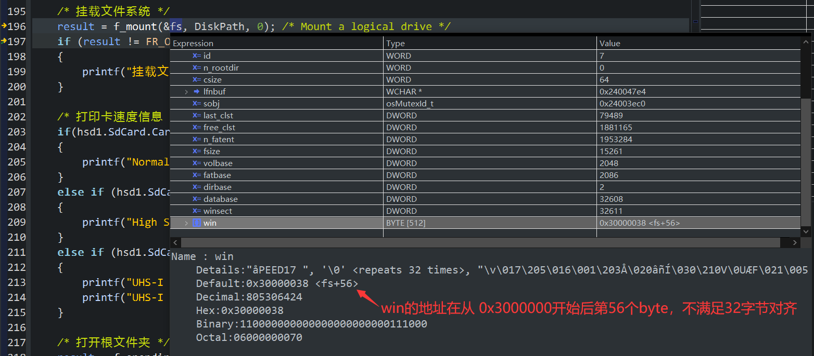

很可惜并不是，真正的原因是 全局变量 FATFS fs 的成员 win[512] 的元素地址不是32字节对齐，这个元素的地址又传给了 SD_read() 的 buff 参数，在后文有分析

另外从 STM32CubeH7 V1.11.0 / 04-Nov-2022 包自动生成的 sd_diskio.c 的 SD_write() 括号位置有 BUG，需要如下修改：

```c
//不知道这个错误又会坑多少人。。。
DRESULT SD_write(BYTE lun, const BYTE *buff, DWORD sector, UINT count)
{
...
  if (!((uint32_t)buff & 0x3))
  {
      ...
#if defined(ENABLE_SCRATCH_BUFFER)
  }       // <-----在此处添加括号！！
  else {
      ...
    }

//  }     // <-----错误的括号位置！！
#endif

  return res;
}
```

将SD_read()中的0x3改为0x1f，那么理应 SD_write()中的0x3也需要改为0x1f ，但实测后，SD_write这个是 0x3 才正常，0x1f 反而报错，这我也不明白，先写在这里好了：

> 测试：将SD_read()也修改为0x1f
>
> - f_open() 会返回 FR_NO_FILESYSTEM：没有有效的FAT卷
> - f_write() 会返回 FR_INVALID_OBJECT：文件或者目录对象无效

由于需要修改的 sd_diskio.c 的0x3位置是cubemx自动生成会覆盖的地方，为了以后修改cubemx配置重新生成的代码不与修改冲突，可以将 修改后的 sd_diskio.c复制一份到工程内用户创建的文件夹，然后在CubeIDE 的过滤器中屏蔽掉 CubeMX 自动生成的 sd_diskio.c，步骤如下：

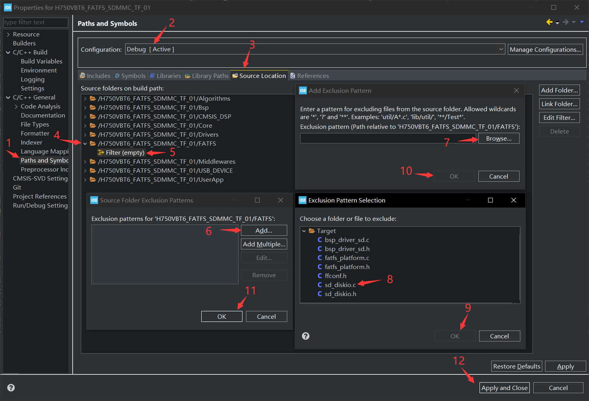


### 为啥 0x1f  可以判断地址是否4字节对齐?

- 0x1f 二进制： 00011111

例如将几个不足32字节的变量编译为对齐/不对齐32字节地址

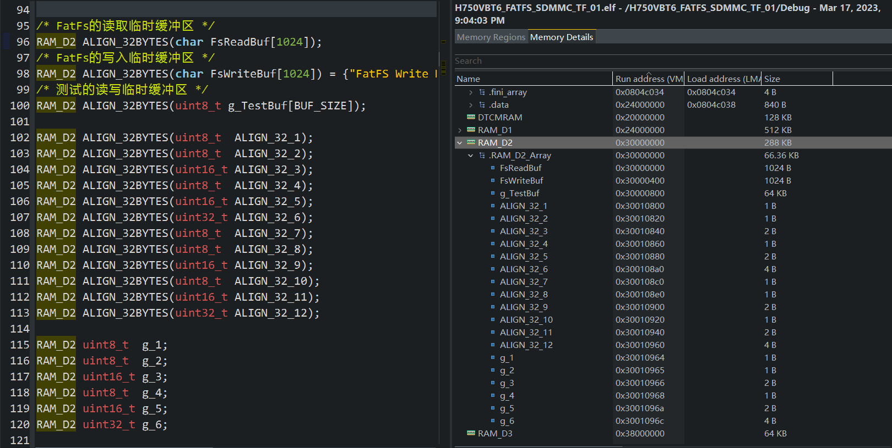其地址依次为：0x30010800、0x30010820、0x30010840...
减去0x30010800，简化为 0x00、0x20、0x40、0x60、0x80、0xa0、0xc0、0xe0
（最大只能到0xe0，0xe0 + 0x20 等于 0x100，尾数回到 0x00 )

列出下表格：""Δ" 表示 "以16进制数表示的32字节对齐地址的最后2位的"

| Δ16进制值 | Δ10进制值 | Δ2进制值      | Δ & 0x1f     | !( Δ & 0x1f ) |
| --------- | --------- | ------------- | ------------ | ------------- |
| 0x00      | 0         | 00000000      | 00000000     | true          |
| 0x20      | 32        | 00100000      | 00000000     | true          |
| 0x40      | 64        | 01000000      | 00000000     | true          |
| 0x60      | 96        | 01100000      | 00000000     | true          |
| 0x80      | 128       | 10000000      | 00000000     | true          |
| 0xa0      | 160       | 10100000      | 00000000     | true          |
| 0xc0      | 192       | 11000000      | 00000000     | true          |
| 0xe0      | 224       | 11100000      | 00000000     | true          |
| ~~0x100~~ | ~~256~~   | ~~100000000~~ | ~~00000000~~ | ~~true~~      |

秒懂：

- 对于 & 0xf 判断 4字节对齐，规律依据是 32字节对齐地址的最后 的 5 个bit 必定是 0
- 对于 & 0x3 判断 4字节对齐，规律依据是 4字节对齐地址的最后 的 2 个bit 必定是 0

### 全局变量 FATFS fs 的成员 win[512] 的元素地址不是32字节对齐

> 比如1号命令期间 进入 SD_read 非 32字节对齐 处理的代码块是 8次，在断点处暂停看到的 buff 值都是 0x24001d18 ， 该地址不是32字节对齐的，该地址是 fs 的 第 56号 元素的地址 字符值为 “RRaA”，是FA32 FS 扇区签名信息 （ FS information sector signature (0x52 0x52 0x61 0x41 = "`RRaA`")）
>
> 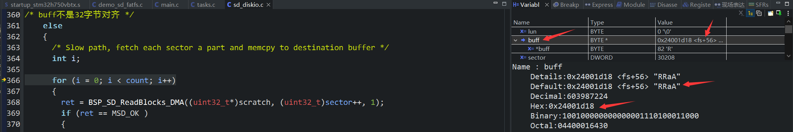
>
> 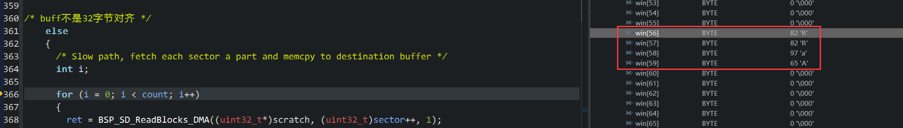
>
> 在读写函数中 fs.buf[56] 被高频使用，那么 sd_diskio.c 内的读写函数就会高频使用 memcpy 复制到临时32字节对齐缓冲区 scratch[512]，延长了读写时间

FIL file 中也有一个 buf[512]，这个会不会也导致非32字节对齐？

> 测试1~7号命令时发现触发 SD_read() 的非32字节对齐的断点只会是 fs->win[...]，没有出现 fp->buf[...] ，也就是说
>
> **对于本工程的测试代码，全局 FIL 变量 file 的成员 buf[512] 中出现的扇区号的地址总是32字节对齐的**
>
> 扇区是物理磁盘的最小单位，对于我使用的SD卡，是512字节，FAT32一个簇一般包含 1、2、4、8、16、32、64 和 128 个扇区，簇的大小取决于格式化SD卡时用户的指定大小，我使用的SD簇大小是32KB，一个簇包含 64 个 512B 大小的扇区

备注：

> 在 ff.c 中搜索 disk_read，有以下 10 行代码：
>
> ```c
> if (disk_read(fs->drv, fs->win, sector, 1) != RES_OK) {
> if (disk_read(fs->drv, fp->buf, fp->sect, 1) != RES_OK) res = FR_DISK_ERR;
> if (disk_read(fs->drv, rbuff, sect, cc) != RES_OK) ABORT(fs, FR_DISK_ERR);
> if (disk_read(fs->drv, fp->buf, sect, 1) != RES_OK)	ABORT(fs, FR_DISK_ERR);	/* Fill sector cache */
>  disk_read(fs->drv, fp->buf, sect, 1) != RES_OK) {
> if (disk_read(fs->drv, fp->buf, dsc, 1) != RES_OK) ABORT(fs, FR_DISK_ERR);	/* Load current sector */
> if (disk_read(fs->drv, fp->buf, nsect, 1) != RES_OK) ABORT(fs, FR_DISK_ERR);	/* Fill sector cache */
> if (disk_read(fs->drv, fp->buf, sect, 1) != RES_OK) ABORT(fs, FR_DISK_ERR);
> if (disk_read(pdrv, buf, 0, 1) != RES_OK) return FR_DISK_ERR;	/* Load MBR */
> if (disk_read(pdrv, buf, 0, 1) != RES_OK) return FR_DISK_ERR;	/* Read the MBR */
> ```
>
> 搜索 disk_write，有以下 28 行代码：
>
> ```c
> if (disk_write(fs->drv, fs->win, wsect, 1) != RES_OK) {
> disk_write(fs->drv, fs->win, wsect, 1);
> disk_write(fs->drv, fs->win, fs->winsect, 1);
> if (disk_write(fs->drv, fp->buf, fp->sect, 1) != RES_OK) ABORT(fs, FR_DISK_ERR);
> if (disk_write(fs->drv, fp->buf, fp->sect, 1) != RES_OK) ABORT(fs, FR_DISK_ERR);
> if (disk_write(fs->drv, wbuff, sect, cc) != RES_OK) ABORT(fs, FR_DISK_ERR);
> if (disk_write(fs->drv, fp->buf, fp->sect, 1) != RES_OK) LEAVE_FF(fs, FR_DISK_ERR);
> if (disk_write(fs->drv, fp->buf, fp->sect, 1) != RES_OK) ABORT(fs, FR_DISK_ERR);
> if (disk_write(fs->drv, fp->buf, fp->sect, 1) != RES_OK) ABORT(fs, FR_DISK_ERR);
> if (disk_write(fs->drv, fp->buf, fp->sect, 1) != RES_OK) {
> if (disk_write(fs->drv, fp->buf, fp->sect, 1) != RES_OK) ABORT(fs, FR_DISK_ERR);
> if (disk_write(pdrv, buf, sect, n) != RES_OK) return FR_DISK_ERR;
> if (disk_write(pdrv, buf, sect, n) != RES_OK) return FR_DISK_ERR;
> if (disk_write(pdrv, buf, sect, n) != RES_OK) return FR_DISK_ERR;
> if (disk_write(pdrv, buf, sect, n) != RES_OK) return FR_DISK_ERR;
> if (disk_write(pdrv, buf, sect++, 1) != RES_OK) return FR_DISK_ERR;
> if (disk_write(pdrv, buf, sect++, 1) != RES_OK) return FR_DISK_ERR;
> if (disk_write(pdrv, buf, sect++, 1) != RES_OK) return FR_DISK_ERR;
> if (disk_write(pdrv, buf, sect++, 1) != RES_OK) return FR_DISK_ERR;
> if (disk_write(pdrv, buf, b_vol, 1) != RES_OK) return FR_DISK_ERR;	/* Write it to the VBR sector */
> disk_write(pdrv, buf, b_vol + 6, 1);		/* Write backup VBR (VBR + 6) */
> disk_write(pdrv, buf, b_vol + 7, 1);		/* Write backup FSINFO (VBR + 7) */
> disk_write(pdrv, buf, b_vol + 1, 1);		/* Write original FSINFO (VBR + 1) */
> if (disk_write(pdrv, buf, sect, (UINT)n) != RES_OK) return FR_DISK_ERR;
> if (disk_write(pdrv, buf, sect, (UINT)n) != RES_OK) return FR_DISK_ERR;
> if (disk_write(pdrv, buf, 0, 1) != RES_OK) return FR_DISK_ERR;	/* Write it back to the MBR */
> if (disk_write(pdrv, buf, 0, 1) != RES_OK) return FR_DISK_ERR;	/* Write it to the MBR */
> return (disk_write(pdrv, buf, 0, 1) != RES_OK || disk_ioctl(pdrv, CTRL_SYNC, 0) != RES_OK) ? FR_DISK_ERR : FR_OK;
> ```
>
> disk_read()使用的参数共同点：
>
> - 参数1：读驱动的函数指针
>
> - 参数2、参数 4：
>
>   > 为 fs->win 是 FATFS 的win[512]、为 fp->buf 是 FIL 的 buf[512]
>   >
>   > 为  fs->win 、fp->buf、buf 时，参数 4 一定是 1
>   >
>   > 为 rbuff 时，参数 4 是 cc 变量，那么 rbuff 是写的文件的缓冲区的地址，cc 缓冲区以Block为单位的大小（1 Block = 512B ）
>
> - 参数3：
>
>   > 参数 2 是 fs->win 时
>   >
>   > > 例如 move_window中 向 disk_read 传入 的 sector 参数表示在 fs->win[] 中出现的扇区号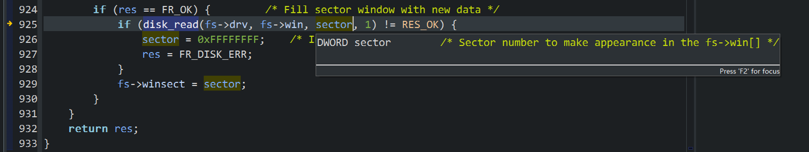
>   >
>   > 参数 2 是 fp->buf 时
>   >
>   > > 例如 f_open 中 向的 disk_read 传入 的 fp->sect 参数表示buf[]中出现的扇区号（0：表示无效）
>   > >
>   > > 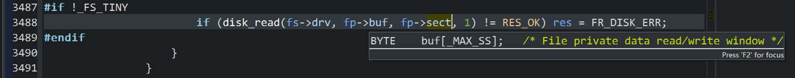
>
> disk_write()使用的参数共同点：
>
> - 参数1：写驱动的函数指针
>
> - 参数2、参数 4：
>
>   > 为 fs->win、fp->buf、buf 时，参数 4 情况很多
>   >
>   > 为 wbuff 时，参数 4 是 cc 变量，那么 wbuff 是读的文件的缓冲区的地址，cc 缓冲区以Block为单位的大小（1 Block = 512B ）
>
> - 参数3：略

解决方法：禁用 cache 的情况

> 关闭Cache，确保文件缓冲区至少4字节对齐，使用默认的sd_diskio.c（不修改0x3），禁用cache配置，避免 sd_diskio.c 读写函数执行SCB_InvalidateDCache_by_Addr()和处理非32字节对齐地址的 memcpy + scratch[512]

解决方法：打开 cache 的情况

> 无法解决，Cache反被Cache误，好在这个对读写速度的影响微乎其微，见本文测试部分的对比

## 测试

被测SD卡：闪迪64G Ultra 

### 6号命令（关闭读校验）

使能Cache + FS 模式 （SDMMC 时钟频率 25MHz ）@3.3V

> 将 sdmmc.c 的 hsd1.Init.ClockDiv = 4; 从 本工程默认的 4分频 临时改为 8分频 测试

| IO SIZE | 写速度   | 写耗时  | 读速度   | 读耗时 | 测试文件名称 | 测试文件大小 | 校验文件数据 |
| ------- | -------- | ------- | -------- | ------ | ------------ | ------------ | ------------ |
| 512B    | 329KB/S  | 24884ms | 1282KB/S | 6386ms | Speed00.txt  | 8192KB       | N/A          |
| 1KB     | 565KB/S  | 14475ms | 2025KB/S | 4044ms | Speed01.txt  | 8192KB       | N/A          |
| 2KB     | 1207KB/S | 6782ms  | 3176KB/S | 2579ms | Speed02.txt  | 8192KB       | N/A          |
| 4KB     | 1941KB/S | 4219ms  | 4222KB/S | 1940ms | Speed03.txt  | 8192KB       | N/A          |
| 8KB     | 2952KB/S | 2775ms  | 4890KB/S | 1675ms | Speed04.txt  | 8192KB       | N/A          |
| 16KB    | 4949KB/S | 1655ms  | 5329KB/S | 1537ms | Speed05.txt  | 8192KB       | N/A          |
| 32KB    | 5214KB/S | 1571ms  | 5572KB/S | 1470ms | Speed06.txt  | 8192KB       | N/A          |
| 64KB    | 5221KB/S | 1569ms  | 5572KB/S | 1470ms | Speed07.txt  | 8192KB       | N/A          |

使能Cache + HS 模式（SDMMC 时钟频率 50MHz）@3.3V

| IO SIZE | 写速度   | 写耗时  | 读速度    | 读耗时 | 测试文件名称 | 测试文件大小 | 校验文件数据 |
| ------- | -------- | ------- | --------- | ------ | ------------ | ------------ | ------------ |
| 512B    | 336KB/S  | 24349ms | 1452KB/S  | 5640ms | Speed00.txt  | 8192KB       | N/A          |
| 1KB     | 607KB/S  | 13490ms | 2522KB/S  | 3247ms | Speed01.txt  | 8192KB       | N/A          |
| 2KB     | 1234KB/S | 6637ms  | 4483KB/S  | 1827ms | Speed02.txt  | 8192KB       | N/A          |
| 4KB     | 2663KB/S | 3076ms  | 6736KB/S  | 1216ms | Speed03.txt  | 8192KB       | N/A          |
| 8KB     | 3383KB/S | 2421ms  | 8359KB/S  | 980ms  | Speed04.txt  | 8192KB       | N/A          |
| 16KB    | 8677KB/S | 944ms   | 9752KB/S  | 840ms  | Speed05.txt  | 8192KB       | N/A          |
| 32KB    | 8167KB/S | 1003ms  | 10475KB/S | 782ms  | Speed06.txt  | 8192KB       | N/A          |
| 64KB    | 8445KB/S | 970ms   | 10502KB/S | 780ms  | Speed07.txt  | 8192KB       | N/A          |

禁用Cache + HS 模式（SDMMC 时钟频率 50MHz）@3.3V

> 数据来自于 H750VBT6_chapter_88 工程的测试

| IO SIZE | 写速度   | 写耗时  | 读速度    | 读耗时 | 测试文件名称 | 测试文件大小 | 校验文件数据 |
| ------- | -------- | ------- | --------- | ------ | ------------ | ------------ | ------------ |
| 512B    | 331KB/S  | 24732ms | 1437KB/S  | 5699ms | Speed00.txt  | 8192KB       | N/A          |
| 1KB     | 610KB/S  | 13422ms | 2486KB/S  | 3294ms | Speed01.txt  | 8192KB       | N/A          |
| 2KB     | 1190KB/S | 6883ms  | 4110KB/S  | 1993ms | Speed02.txt  | 8192KB       | N/A          |
| 4KB     | 2678KB/S | 3058ms  | 6595KB/S  | 1242ms | Speed03.txt  | 8192KB       | N/A          |
| 8KB     | 3411KB/S | 2401ms  | 8551KB/S  | 958ms  | Speed04.txt  | 8192KB       | N/A          |
| 16KB    | 8687KB/S | 943ms   | 9869KB/S  | 830ms  | Speed05.txt  | 8192KB       | N/A          |
| 32KB    | 9112KB/S | 899ms   | 10625KB/S | 771ms  | Speed06.txt  | 8192KB       | N/A          |
| 64KB    | 9163KB/S | 894ms   | 10652KB/S | 769ms  | Speed07.txt  | 8192KB       | N/A          |

### 7号命令（开启读校验）

> 可以看出开 Cache 的显著优势，不再被读校验最高 4MB/s 所限制

使能Cache + HS 模式（SDMMC 时钟频率 50MHz）@3.3V

| IO SIZE | 写速度   | 写耗时  | 读速度   | 读耗时 | 测试文件名称 | 测试文件大小 | 校验文件数据 |
| ------- | -------- | ------- | -------- | ------ | ------------ | ------------ | ------------ |
| 512B    | 328KB/S  | 24948ms | 1380KB/S | 5935ms | Speed00.txt  | 8192KB       | OK           |
| 1KB     | 591KB/S  | 13846ms | 2283KB/S | 3588ms | Speed01.txt  | 8192KB       | OK           |
| 2KB     | 1351KB/S | 6062ms  | 3785KB/S | 2164ms | Speed02.txt  | 8192KB       | OK           |
| 4KB     | 2271KB/S | 3607ms  | 5271KB/S | 1554ms | Speed03.txt  | 8192KB       | OK           |
| 8KB     | 4397KB/S | 1863ms  | 6455KB/S | 1269ms | Speed04.txt  | 8192KB       | OK           |
| 16KB    | 8614KB/S | 951ms   | 7154KB/S | 1145ms | Speed05.txt  | 8192KB       | OK           |
| 32KB    | 9416KB/S | 870ms   | 7550KB/S | 1085ms | Speed06.txt  | 8192KB       | OK           |
| 64KB    | 7488KB/S | 1094ms  | 7550KB/S | 1085ms | Speed07.txt  | 8192KB       | OK           |

禁用Cache + HS 模式（SDMMC 时钟频率 50MHz）@3.3V

> 数据来自于 H750VBT6_chapter_88 工程的测试

| IO SIZE | 写速度   | 写耗时  | 读速度   | 读耗时 | 测试文件名称 | 测试文件大小 | 校验文件数据 |
| ------- | -------- | ------- | -------- | ------ | ------------ | ------------ | ------------ |
| 512B    | 314KB/S  | 26087ms | 1154KB/S | 7096ms | Speed00.txt  | 8192KB       | OK           |
| 1KB     | 540KB/S  | 15154ms | 1943KB/S | 4214ms | Speed01.txt  | 8192KB       | OK           |
| 2KB     | 1035KB/S | 7912ms  | 2978KB/S | 2750ms | Speed02.txt  | 8192KB       | OK           |
| 4KB     | 1630KB/S | 5024ms  | 3862KB/S | 2121ms | Speed03.txt  | 8192KB       | OK           |
| 8KB     | 2031KB/S | 4032ms  | 4394KB/S | 1864ms | Speed04.txt  | 8192KB       | OK           |
| 16KB    | 7543KB/S | 1086ms  | 4727KB/S | 1733ms | Speed05.txt  | 8192KB       | OK           |
| 32KB    | 8274KB/S | 990ms   | 4914KB/S | 1667ms | Speed06.txt  | 8192KB       | OK           |
| 64KB    | 9547KB/S | 858ms   | 4914KB/S | 1667ms | Speed07.txt  | 8192KB       | OK           |

### MPU 配置的影响

本工程运行域默认使用 RAM_D1，通过在 demo_sd_fatfs.c 的宏 RAM_D2 将读写缓冲区编译到 RAM_D2 测试

MPU 对 RAM_D1 和 RAM_D2 的配置如下：

| 内存域 | TEX   | C    | B    | S    | 说明                                      |
| ------ | ----- | ---- | ---- | ---- | ----------------------------------------- |
| RAM_D1 | 0b001 | 1    | 1    | 0    | Write back，read allocate，write allocate |
| RAM_D2 | 0b000 | 0    | 0    | 0    | Non-cacheable                             |

| RAM_D1 使用安富莱 v7 bsp教程 AXI_SRAM 的配置    | RAM_D2 无 Cache 配置                          |
| ----------------------------------------------- | --------------------------------------------- |
| 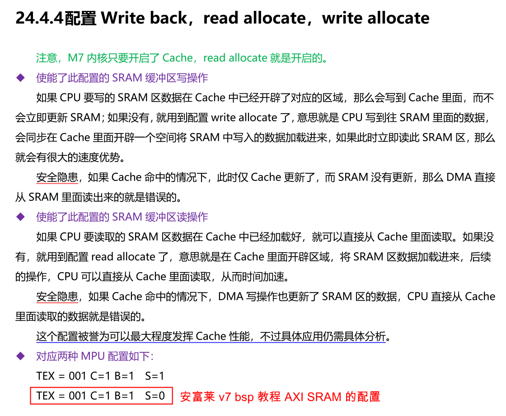 | 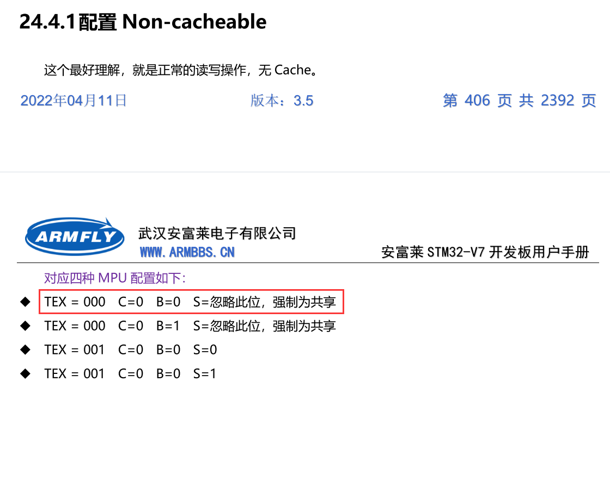 |

#### 不使用 宏 RAM_D2 

```
		【2 - CreateNewFile】
		armfly.txt 文件打开成功
		armfly.txt 文件写入成功

		【1 - ViewRootDir】
		UHS-I SD Card <50MB/S for SDR50, DDR50 Cards, MAX Clock < 50MHz OR 100MHz
		UHS-I SD Card <104MB/S for SDR104, MAX Clock < 108MHz, Spec version 3.01
		属性        |  文件大小 | 短文件名 | 长文件名
		(0x22)目录            0  System Volume Information
		(0x32)文件           37  armfly.txt
		(0x32)文件           10  1234567890.txt

		【3 - ReadFileData】

		armfly.txt 文件内容 :
		FatFS Write Demo
		 www.armfly.com
```

 #### 使用 宏 RAM_D2 

```shell
		【2 - CreateNewFile】
		armfly.txt 文件打开成功
		armfly.txt 文件写入成功

		【1 - ViewRootDir】
		UHS-I SD Card <50MB/S for SDR50, DDR50 Cards, MAX Clock < 50MHz OR 100MHz
		UHS-I SD Card <104MB/S for SDR104, MAX Clock < 108MHz, Spec version 3.01
		属性        |  文件大小 | 短文件名 | 长文件名
		(0x22)目录            0  System Volume Information
		(0x32)文件          178  armfly.txt
		(0x32)文件           10  1234567890.txt

		【3 - ReadFileData】

		armfly.txt 文件内容 :
		��9j����*F�/��:��QL
		�B�GuI5�&Z�-兔���&A8�Ŭ���*nS�T@�Y>c���峿����!E��R�x�V�].��b�������҄�	u��k�*�Ae2�] ��"�S����-�%y�	>�`�7��.dR�,�^̓Qpr�S�!�l��)��̡6�c��弩�l�
```

## SD卡文件数据恢复

改ST固件库试错测试时，用着3D打印机SD卡做的测试，读写函数的BUG把SD卡里的文件搞得看不到了，记录一下苦逼的恢复过程

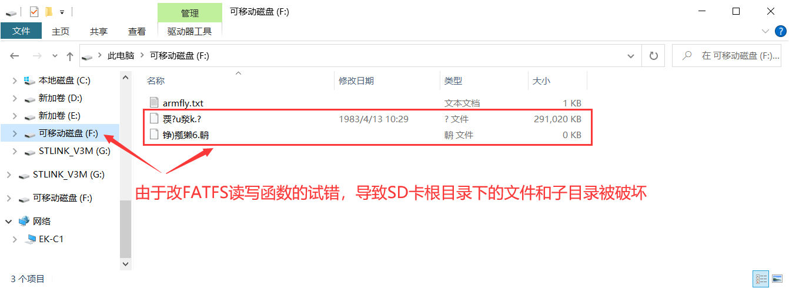

上图是按照下图重建分区表后才能看见，不然目录里啥都看不到


然后如下操作

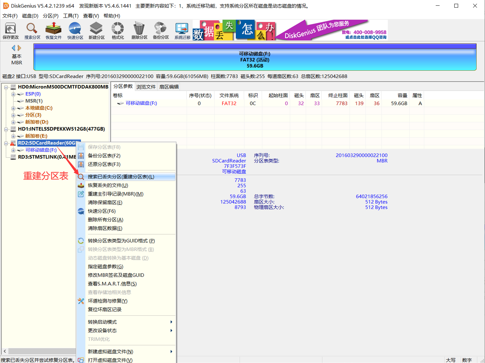

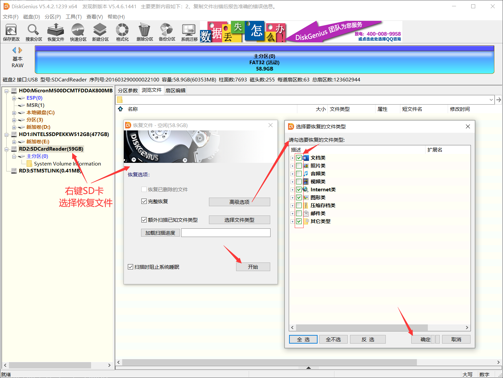


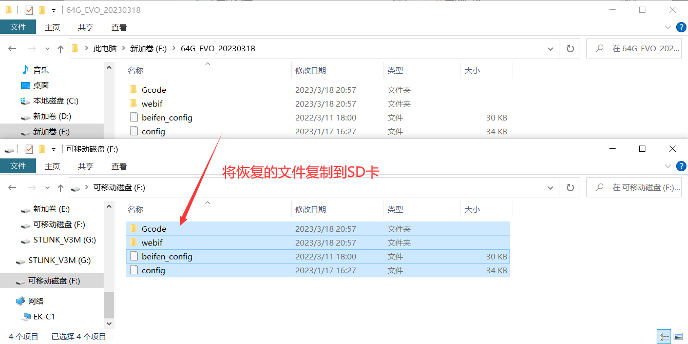

恢复结果，两个 config 文件是好的，webif里 2730个文件只恢复了1000多个。。。好在电脑中有以前的备份

测试 FATFS + SD 卡一定不要用存有重要数据的SD卡测试，找一张单独的SD卡测试 ！！！

