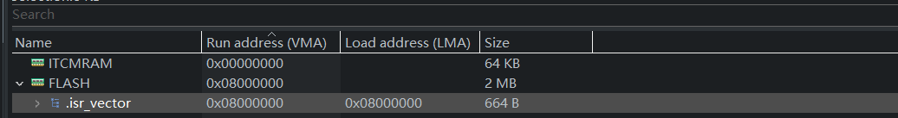
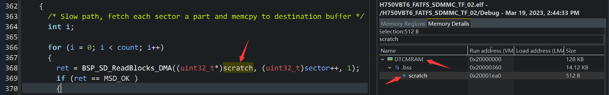
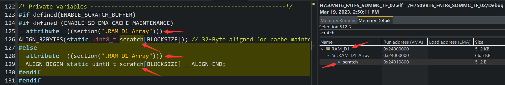
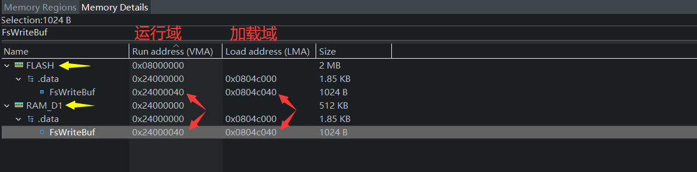
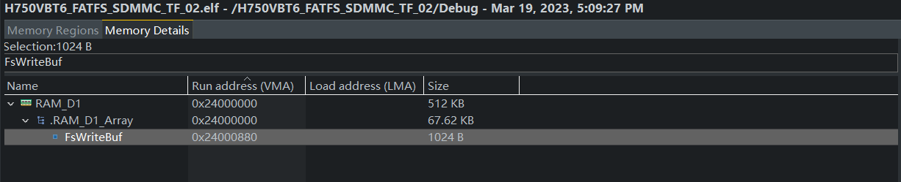
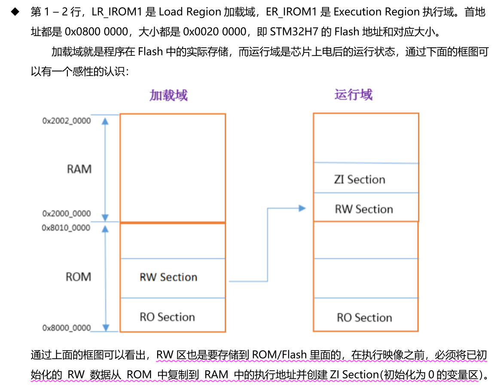

## H750VBT6_FATFS_SDMMC_TF_02

## 警告

请勿将存有重要数据的SD卡用于本工程的代码测试，请准备专用的SD卡测试 ！！！

## 关于

在 H750VBT6_FATFS_SDMMC_TF_01 的基础上修改

- 使能Cache
- 使用 DTCM 做主 RAM
- 可能会将某些代码放到 ITCM

## 参考

ST

- [LAT1037：关于 STM32CubeIDE 链接脚本NOLOAD关键字的问题](https://mcu.eetrend.com/files/2021-11/wen_zhang_/100555348-227361-lat1037guanyustm32cubeidelianjiejiaobendexiaowenti.pdf)

## 性能优化

### 修改RAM分配方案

按照安富莱 v7 bsp 25.6节的方式修改


修改链接文件：H750VBT6_FATFS_SDMMC_TF_02.ld 

- 搜索所有 RAM_D1 除了 MEMORY {...}里的，其他都替换为 DTCMRAM，以将主 RAM 从 RAM_D1 改为 DTCMRAM

  （修改链接文件的以下5处：）

  ```livescript
  _estack = ORIGIN(DTCMRAM) + LENGTH(DTCMRAM);
  /*               ^~~~~~~           ^~~~~~~ */
  
  .data :
  {...} >DTCMRAM AT> FLASH
  /*     ^~~~~~~ */
  
  .bss :
  {...} >DTCMRAM
  /*     ^~~~~~~ */
  
  ._user_heap_stack :
  {...} >DTCMRAM
  /*     ^~~~~~~ */
  ```

- SECTION {...} 里添加 RAM_ITCM_Array 和 RAM_D1_Array 段，备用

  （除了MDMA以外的DMA都控制器不能访问DTCM，需要将DMA使用的缓冲区指定编译到DTCM以外的RAM，例如 SDMMC 的 IDMA不能访问DTCM，使用 RAM_D1 存放 IDMA 读写缓冲区）

  ```c
    /* 4byte align */
    .RAM_ITCM_Array (NOLOAD):
    {
      . = ALIGN(4);
      *(.RAM_ITCM_Array)
      . = ALIGN(4);
    } >ITCMRAM
        
    /* 4byte align */
    .RAM_D1_Array (NOLOAD):
    {
      . = ALIGN(4);
      *(.RAM_D1_Array)
      . = ALIGN(4);
    } >RAM_D1
  ```

### 复制 中断向量表到 DTCM RAM

在 main 函数最前面内加入以下代码，DTCM地址要 0x200 对齐

```c
int main(void)
{
  /* USER CODE BEGIN 1 */
  /* Operation interrupt vector table begin ----------------------------------*/
//#define INTERNAL_FLASH_BOOTLOADER_JUMP_TO_QSPI_FLASH_APP

#if defined(INTERNAL_FLASH_BOOTLOADER_JUMP_TO_QSPI_FLASH_APP)
	/** 将当前使用的内部flash里的中断向量表改为外部QSPI Flash里的中断向量表
	  * Change the currently used interrupt vector table in the internal flash
	  * to the interrupt vector table in the external QSPI Flash
	  */
	SCB->VTOR = (uint32_t *)QSPI_BASE;
#endif

#define COPY_VECTORTABLE_TO_DTCM

#if defined(COPY_VECTORTABLE_TO_DTCM)
#if defined(INTERNAL_FLASH_BOOTLOADER_JUMP_TO_QSPI_FLASH_APP)
	uint32_t *SouceAddr = (uint32_t *)QSPI_BASE;
#else
	uint32_t *SouceAddr = (uint32_t *)FLASH_BANK1_BASE;
#endif
	uint32_t *DestAddr = (uint32_t *)D1_DTCMRAM_BASE;
	memcpy(DestAddr, SouceAddr, 0x400);

	/** 设置当前的中断向量表为 ITCM 里复制好的中断向量表副本
	  * Set the current interrupt vector table as a copy of the copied interrupt
	  * vector table in ITCM
	  */
	SCB->VTOR = D1_DTCMRAM_BASE;
#endif
  /* Operation interrupt vector table end ------------------------------------*/

  /* USER CODE END 1 */
...
}
```

memcpy() 最后一个参数是 0x400，单位 byte，也就是 1024B，需要大于中断向量表的 664B：



修改链接文件：H750VBT6_FATFS_SDMMC_TF_02.ld 

DTCMRAM 还是从0x20000400 开始，复制中断向量表时会覆盖掉一些段的数据，导致程序崩溃

```c
DTCMRAM (xrw)  : ORIGIN = 0x20000000, LENGTH = 128K
```

将 ORIGIN 增加 1KB，LENGTH 减去1KB，即可

```c
DTCMRAM (xrw)  : ORIGIN = 0x20000400, LENGTH = 127K
```

### 指定编译位置

注意以下全局变量需要编译到指定内存，不可将其改为局部变量，因为局部变量位于栈区，而本工程系统栈使用的是DTCM，IDMA会无法访问

**512B临时缓冲区scratch**

sd_diskio.c的512B临时缓冲区scratch 被默认编译到主RAM，即DTCM



使用宏，将其编译到 RAM_D1，即AXI SRAM

```c
__attribute__((section(".RAM_D1_Array")))
```



**FATFS 全局变量 FATFS fs 和 FIL file**

```c
#define  RAM_D1	__attribute__((section(".RAM_D1_Array")))

/* FATFS文件系统对象 */
RAM_D1 FATFS fs;
/* 文件对象 */
RAM_D1 FIL file;
```

为啥？因为 SD_read 和 SD_write 中调用的 IDMA 读写函数的缓冲区地址 可能是 fs.win[...] 或 file.buf[...]，所以不能让这两个全局变量被默认编译到DTCM

**FATFS 用户程序的读写缓冲区**

```c
#define  RAM_D1	__attribute__((section(".RAM_D1_Array")))

/* FatFs的读取临时缓冲区 */
RAM_D1 ALIGN_32BYTES(char FsReadBuf[1024]);
/* FatFs的写入临时缓冲区 */
RAM_D1 ALIGN_32BYTES(char FsWriteBuf[1024]);
/* 测试的读写临时缓冲区 */
RAM_D1 ALIGN_32BYTES(uint8_t g_TestBuf[BUF_SIZE]);
```

### 向 armfly.txt 写入文本数据的存储位置

本工程在 H750VBT6_FATFS_SDMMC_TF_02 基础之上修改，修改前，FatFs 的写入临时缓冲区 里存有待写入 armfly.txt  的文本：

```c
/* FatFs的写入临时缓冲区 */
ALIGN_32BYTES(char FsWriteBuf[1024]) = {"FatFS Write Demo \r\n www.armfly.com \r\n"};
```

H750VBT6_FATFS_SDMMC_TF_02  的主 RAM 为 RAM_D1，没有指定 FsWriteBuf 的编译位置，那么 FsWriteBuf 会被链接到 .data段。下载程序到 H750时，这部分有初始值的数据就会保存在 FLASH（ROM）的 .data段，在执行映像前，会被复制到 RAM_D1 （RAM）的 .data段，因此可以在构建分析器里可以看到 FsWriteBuf 出现两次：



但本工程主 RAM 为 DTCM，且不指定 FsWriteBuf 的编译位置，那么 FsWriteBuf 会被链接到 DTCM 的 .data段，但 SDMMC 的 IDMA 不能访问DTCM 中的这个缓冲区，所以我使用 RAM_D1 宏将其连接到自定义的 .RAM_D1_Array段：

```c
#define  RAM_D1	__attribute__((section(".RAM_D1_Array")))

/* FatFs的写入临时缓冲区 */
RAM_D1 ALIGN_32BYTES(char FsWriteBuf[1024]) = {"FatFS Write Demo \r\n www.armfly.com \r\n"};
```



OK问题解决了，但当运行 2号 和 3号 测试命令时，写入的内容总是乱码：

```shell
【2 - CreateNewFile】
armfly.txt 文件打开成功
armfly.txt 文件写入成功

【3 - ReadFileData】

armfly.txt 文件内容 : 
{h�m�"�@;j�`{h[mC�{hZe{h�m��i"���
```

这。。。难道又是 Cache 问题？经过苦逼的排错，发现并不是

回顾一下安富莱v7 bsp教程 P429页，简述运行域和加载域时，末尾带过的这句话：

​       **"RW区也是要存储到 ROM/Flash 里面的，在执行映像之前，必须将已初 始化的 RW 数据从 ROM 中复制到 RAM 中的执行地址并创建ZI Section（初始化为0的变量区）"**



RW区包括 .data段（有初始值的全局变量） 和 .bss段（无初始值的全局变量）

在 SECTION 中我自定义的 .RAM_D1_Array段 有 NOLOAD 修饰：

```c
  /* 4byte align */
  .RAM_D1_Array (NOLOAD):
  {
    . = ALIGN(4);
    *(.RAM_D1_Array)
    . = ALIGN(4);
  } >RAM_D1
```

NOLOAD属性使这段不会在下载程序时写入 FLASH ，意味着不能断电保存 `"FatFS Write Demo \r\n www.armfly.com \r\n"` ，运行域中的 .data段 中变量的初始值 来自CPU执行启动文件的汇编代码时，将加载域中的 .data段拷贝到运行域， 而我自定义的 .RAM_D1_Array段根本没有加载域，只有运行域

所以 FsWriteBuf 的初始值是未定义的，当测试命令2时，向armfly.txt 文件写入的都是乱码

解决方法1：

解决方法：

- 创建一个新的带有该文本内容的全局变量，或在函数内定义含有该测试文本的局部变量

  ```c
  /* 全局变量：在.data段的测试文本内容 */
  char DataSec_ArmflyTxt[] = {"FatFS Write Demo \r\n www.armfly.com \r\n"};
  
  static void CreateNewFile(void)
  {
      /* 局部变量：在栈中的测试文本内容 */
      char DataSec_ArmflyTxt[] = {"FatFS Write Demo \r\n www.armfly.com \r\n"};
      ...
  }
  ```

- 测试命令2时，使用 memcpy 拷贝该变量到 FsWriteBuf 

  ```c
  static void CreateNewFile(void)
  {
      ...
      /* 重置缓冲区的数据为待写入内容 */
  	//strlen 遇到'\0'停止，字符串大小不计算'\0'在内
  //    memcpy((void *)FsWriteBuf, DataSec_ArmflyTxt, strlen(DataSec_ArmflyTxt) + 1);
  	//strlen 是函数需要调用，耗费时间长，sizeof是运算符，使用sizeof更好
      memcpy((void *)FsWriteBuf, DataSec_ArmflyTxt, sizeof(DataSec_ArmflyTxt));
  
  	/* 写一串数据 */
  	result = f_write(&file, FsWriteBuf, sizeof(DataSec_ArmflyTxt), (UINT* )&bw);
      ...
  }
  ```

测试OK：

```c
【2 - CreateNewFile】
armfly.txt 文件打开成功
armfly.txt 文件写入成功

【3 - ReadFileData】
armfly.txt 文件内容 : 
FatFS Write Demo 
 www.armfly.com 
```

备注：如果不用 NOLOAD 修饰，会导致编译生成的 BIN 文件过大，详见：[LAT1037：关于 STM32CubeIDE 链接脚本NOLOAD关键字的问题](https://mcu.eetrend.com/files/2021-11/wen_zhang_/100555348-227361-lat1037guanyustm32cubeidelianjiejiaobendexiaowenti.pdf) 

## 测试

按照前一节 性能优化 配置完后，在非调试状态下测试，使用闪迪64G Ultra 格式化为 FAT32 簇大小32KB

### 6号命令

使用本工程Debug配置，优化等级O0

| IO SIZE | 写速度   | 写耗时  | 读速度    | 读耗时 | 测试文件名称 | 测试文件大小 | 校验文件数据 |
| ------- | -------- | ------- | --------- | ------ | ------------ | ------------ | ------------ |
| 512B    | 330KB/S  | 24778ms | 1434KB/S  | 5709ms | Speed00.txt  | 8192KB       | N/A          |
| 1KB     | 592KB/S  | 13821ms | 2571KB/S  | 3186ms | Speed01.txt  | 8192KB       | N/A          |
| 2KB     | 1314KB/S | 6231ms  | 4348KB/S  | 1884ms | Speed02.txt  | 8192KB       | N/A          |
| 4KB     | 2273KB/S | 3604ms  | 6430KB/S  | 1274ms | Speed03.txt  | 8192KB       | N/A          |
| 8KB     | 4348KB/S | 1884ms  | 8542KB/S  | 959ms  | Speed04.txt  | 8192KB       | N/A          |
| 16KB    | 8614KB/S | 951ms   | 9787KB/S  | 837ms  | Speed05.txt  | 8192KB       | N/A          |
| 32KB    | 9470KB/S | 865ms   | 10529KB/S | 778ms  | Speed06.txt  | 8192KB       | N/A          |
| 64KB    | 9503KB/S | 862ms   | 10529KB/S | 778ms  | Speed07.txt  | 8192KB       | N/A          |

使用本工程Release配置，优化等级 O3

| IO SIZE | 写速度   | 写耗时  | 读速度    | 读耗时 | 测试文件名称 | 测试文件大小 | 校验文件数据 |
| ------- | -------- | ------- | --------- | ------ | ------------ | ------------ | ------------ |
| 512B    | 339KB/S  | 24159ms | 1459KB/S  | 5611ms | Speed00.txt  | 8192KB       | N/A          |
| 1KB     | 605KB/S  | 13523ms | 2515KB/S  | 3256ms | Speed01.txt  | 8192KB       | N/A          |
| 2KB     | 1305KB/S | 6277ms  | 4454KB/S  | 1839ms | Speed02.txt  | 8192KB       | N/A          |
| 4KB     | 2442KB/S | 3354ms  | 6803KB/S  | 1204ms | Speed03.txt  | 8192KB       | N/A          |
| 8KB     | 3417KB/S | 2397ms  | 8350KB/S  | 981ms  | Speed04.txt  | 8192KB       | N/A          |
| 16KB    | 8733KB/S | 938ms   | 9893KB/S  | 828ms  | Speed05.txt  | 8192KB       | N/A          |
| 32KB    | 9492KB/S | 863ms   | 10597KB/S | 773ms  | Speed06.txt  | 8192KB       | N/A          |
| 64KB    | 9581KB/S | 855ms   | 10611KB/S | 772ms  | Speed07.txt  | 8192KB       | N/A          |

不校验数据下，优化等级体高，读写速度没有明显提升，对比下面的 H750VBT6_chapter_88 测试数据，无明显提升

| IO SIZE | 写速度   | 写耗时  | 读速度    | 读耗时 | 测试文件名称 | 测试文件大小 | 校验文件数据 |
| ------- | -------- | ------- | --------- | ------ | ------------ | ------------ | ------------ |
| 512B    | 331KB/S  | 24732ms | 1437KB/S  | 5699ms | Speed00.txt  | 8192KB       | N/A          |
| 1KB     | 610KB/S  | 13422ms | 2486KB/S  | 3294ms | Speed01.txt  | 8192KB       | N/A          |
| 2KB     | 1190KB/S | 6883ms  | 4110KB/S  | 1993ms | Speed02.txt  | 8192KB       | N/A          |
| 4KB     | 2678KB/S | 3058ms  | 6595KB/S  | 1242ms | Speed03.txt  | 8192KB       | N/A          |
| 8KB     | 3411KB/S | 2401ms  | 8551KB/S  | 958ms  | Speed04.txt  | 8192KB       | N/A          |
| 16KB    | 8687KB/S | 943ms   | 9869KB/S  | 830ms  | Speed05.txt  | 8192KB       | N/A          |
| 32KB    | 9112KB/S | 899ms   | 10625KB/S | 771ms  | Speed06.txt  | 8192KB       | N/A          |
| 64KB    | 9163KB/S | 894ms   | 10652KB/S | 769ms  | Speed07.txt  | 8192KB       | N/A          |

### 7号命令

使用本工程Debug配置，优化等级O0

| IO SIZE | 写速度   | 写耗时  | 读速度   | 读耗时 | 测试文件名称 | 测试文件大小 | 校验文件数据 |
| ------- | -------- | ------- | -------- | ------ | ------------ | ------------ | ------------ |
| 512B    | 325KB/S  | 25188ms | 1393KB/S | 5878ms | Speed00.txt  | 8192KB       | OK           |
| 1KB     | 612KB/S  | 13366ms | 2307KB/S | 3550ms | Speed01.txt  | 8192KB       | OK           |
| 2KB     | 1195KB/S | 6852ms  | 3523KB/S | 2325ms | Speed02.txt  | 8192KB       | OK           |
| 4KB     | 2572KB/S | 3184ms  | 5113KB/S | 1602ms | Speed03.txt  | 8192KB       | OK           |
| 8KB     | 3725KB/S | 2199ms  | 6173KB/S | 1327ms | Speed04.txt  | 8192KB       | OK           |
| 16KB    | 8650KB/S | 947ms   | 6803KB/S | 1204ms | Speed05.txt  | 8192KB       | OK           |
| 32KB    | 9426KB/S | 869ms   | 7148KB/S | 1146ms | Speed06.txt  | 8192KB       | OK           |
| 64KB    | 9426KB/S | 869ms   | 7148KB/S | 1146ms | Speed07.txt  | 8192KB       | OK           |

使用本工程Release配置，优化等级 O3

| IO SIZE | 写速度   | 写耗时  | 读速度   | 读耗时 | 测试文件名称 | 测试文件大小 | 校验文件数据 |
| ------- | -------- | ------- | -------- | ------ | ------------ | ------------ | ------------ |
| 512B    | 343KB/S  | 23829ms | 1445KB/S | 5667ms | Speed00.txt  | 8192KB       | OK           |
| 1KB     | 592KB/S  | 13828ms | 2444KB/S | 3351ms | Speed01.txt  | 8192KB       | OK           |
| 2KB     | 1358KB/S | 6030ms  | 4255KB/S | 1925ms | Speed02.txt  | 8192KB       | OK           |
| 4KB     | 2282KB/S | 3589ms  | 6187KB/S | 1324ms | Speed03.txt  | 8192KB       | OK           |
| 8KB     | 4452KB/S | 1840ms  | 7876KB/S | 1040ms | Speed04.txt  | 8192KB       | OK           |
| 16KB    | 8789KB/S | 932ms   | 8894KB/S | 921ms  | Speed05.txt  | 8192KB       | OK           |
| 32KB    | 9592KB/S | 854ms   | 9503KB/S | 862ms  | Speed06.txt  | 8192KB       | OK           |
| 64KB    | 9615KB/S | 852ms   | 9492KB/S | 863ms  | Speed07.txt  | 8192KB       | OK           |

校验数据开启后，优化等级提高，读速度有明显提升，对比下面的 H750VBT6_chapter_88 测试数据，读速度有很大提升

| IO SIZE | 写速度   | 写耗时  | 读速度   | 读耗时 | 测试文件名称 | 测试文件大小 | 校验文件数据 |
| ------- | -------- | ------- | -------- | ------ | ------------ | ------------ | ------------ |
| 512B    | 314KB/S  | 26087ms | 1154KB/S | 7096ms | Speed00.txt  | 8192KB       | OK           |
| 1KB     | 540KB/S  | 15154ms | 1943KB/S | 4214ms | Speed01.txt  | 8192KB       | OK           |
| 2KB     | 1035KB/S | 7912ms  | 2978KB/S | 2750ms | Speed02.txt  | 8192KB       | OK           |
| 4KB     | 1630KB/S | 5024ms  | 3862KB/S | 2121ms | Speed03.txt  | 8192KB       | OK           |
| 8KB     | 2031KB/S | 4032ms  | 4394KB/S | 1864ms | Speed04.txt  | 8192KB       | OK           |
| 16KB    | 7543KB/S | 1086ms  | 4727KB/S | 1733ms | Speed05.txt  | 8192KB       | OK           |
| 32KB    | 8274KB/S | 990ms   | 4914KB/S | 1667ms | Speed06.txt  | 8192KB       | OK           |
| 64KB    | 9547KB/S | 858ms   | 4914KB/S | 1667ms | Speed07.txt  | 8192KB       | OK           |

