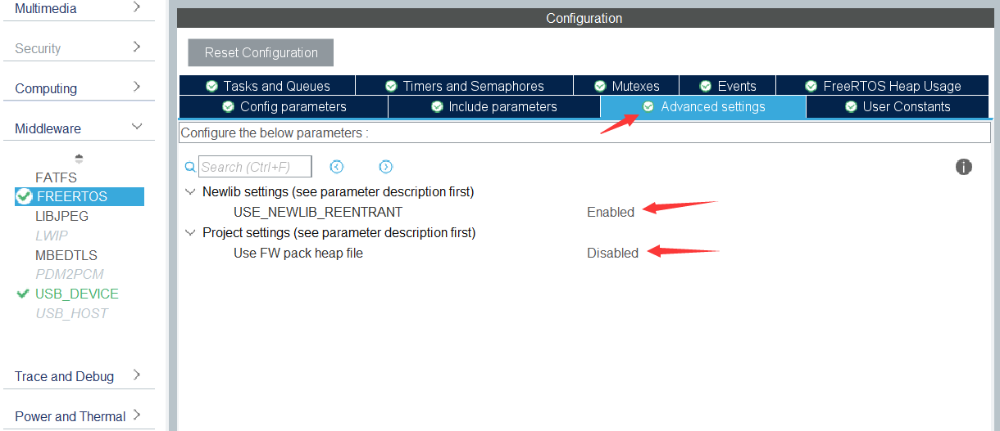
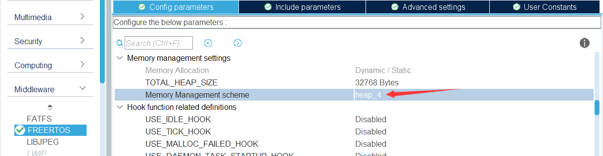

## 打印浮点数，进入HardFault_Handler

优先级：LED任务Normal，USBServer任务AboveNormal

问题场景：若不开LED任务，不会出现此情况。若LED任务使用printf，USB命令解析任务调用 Respond() 使用 %f 转义字符打印浮点数 ，那么就进 HardFault ，将将%f 改成%d，不会跳到HardFault_Handler 中，非常奇怪

排错环节：

[求助：MDK中 sprintf 输出浮点数据出错](https://www.amobbs.com/thread-3258924-1-1.html)

> (梗概)
>
> Lz的解决方法：UCOSII的任务堆栈没有8字节对齐，在声明任务堆栈时，强制8字节对齐就可以了，系统默认是4字节对齐，
>
> ```c
> __align(8) static  OS_STK       AppTaskStartStk[APP_TASK_START_STK_SIZE];
> ```
>
> 23楼解释了对齐原理

在 `H750VBT6_ST_USB_CDC_01\Middlewares\Third_Party\FreeRTOS\Source\portable\GCC\ARM_CM4F\portmacro.h`中，栈空间默认是8字节对齐的，排除此原因

```c
#define portBYTE_ALIGNMENT			8
```

[stm32cubeIDE在freeRTOS无法printf float 浮点数](https://blog.csdn.net/tao475824827/article/details/107477724)

> (梗概)
>
> 想用cubeIDE在freeRTOS下printf浮点数，你需要按照下面这么几个步骤来做：
>
> > 1. 驱动串口(图形化引脚配置，cubeIDE的驱动代码生成)
> > 2. 使用printf（串口重定向）
> > 3. 使用printf输出浮点数 （菜单勾选）
> > 4. 在freeRTOS中使用printf （修改task默认堆栈大小,默认128 word小了，会进hardfault）
> > 5. 怎么使用printf在freeRTOS中输出浮点数 （本文内容，增加第三方提供的补丁）
>
> 其中，1、2、3、4都是很常规的操作，在网上能搜到不少教程和帖子。
> 实在不行可以看我的[上一篇](https://blog.csdn.net/tao475824827/article/details/107477724)
>
> 一般来说，到这里就应该结束了，没想到 步骤5 让我爬了一个星期。
>
> （至少截止目前，2020.7.16，cubeIDE v1.3.0版本）依然存在在freeRTOS下，线程中使用printf、USB库等接口的异常。
> 因为这些接口使用了malloc等接口，而不是freeRTOS提供的有线程保护的pvPortMalloc等接口，ST官方自己实现的_sbrk函数有些问题(sysmem.c里)，导致线程中一些调用了系统自身malloc的函数接口出问题。

## Dave Nadler 的解决方法：

Github：[https://github.com/DRNadler/FreeRTOS_helpers](https://github.com/DRNadler/FreeRTOS_helpers)

博客：[https://nadler.com/embedded/newlibAndFreeRTOS.html](https://nadler.com/embedded/newlibAndFreeRTOS.html)

> (梗概)
>
> Newlib 3.0是唯一分布在STM的STM32CubeIDE开发环境中的运行时库。您可以为每个 C 和 C++选择*标准*或*简化（4 种可能的组合）。*截至 2019 年 7 月（仍然是 2020 年 6 月！令人难以置信！）， **使用 FreeRTOS 的 Cube 生成的项目**不能正确支持 malloc/free/etc和系列，也不支持一般的 newlib RTL 可重入。 **如果您的应用程序调用malloc/free/etc****，它会损坏内存：**
>
> - **直接地**
> - **通过应用程序调用的 newlib C-RTL 函数（例如sprintf %f），或**
> - **通过 STM 提供的 HAL-LL 代码（例如 STM 的 USB 堆栈）**
>
> 本文档解释了如何解决此问题（按照本页底部的说明进行操作）。

讨论贴：[https://community.st.com/s/question/0D50X0000BB1eL7SQJ/bug-cubemx-freertos-projects-corrupt-memory](https://community.st.com/s/question/0D50X0000BB1eL7SQJ/bug-cubemx-freertos-projects-corrupt-memory)

> (梗概)
>
> BUG：CubeMX FreeRTOS 项目损坏内存
>
> 典型的用户症状：***带浮点数的 sprintf 不工作或崩溃\***。
>
> > **newlib 使用 malloc/malloc_r 的示例：**
> > 在 malloc_r 中放置一个断点（最内层的 malloc 例程）显示以下内容：
> >
> > - newlib 3.0在调用 main() 之前**不**使用malloc （不像早期的 NXP/newlib 2.5 启动，malloc'd 5k）。验证了所有四个 newlib 变体。
> > - 使用简单的十进制输出，sprintf不调用malloc
> > - **对于%f输出，sprintf执行 4 个malloc，总计约 200 字节**（仅在每个任务/线程第一次调用时）。
> >   %f还需要适当的链接器参数来支持浮点数。
> > - printf或预期执行 IO（与字符串操作相对）的类似函数分配 428 字节的 IO 控制结构。

## 步骤

CubeMX中的FreeRTOS 的 Advanced 设置：



Use FW pack heap file 是 Disabled，那么这里无论选啥`heapX.c`都不会再用了



从工程目录树中右键 `Core\Src\sysmem.c` 和 `Middlewares\Third_Party\FreeRTOS\Source\portable\GCC\ARM_CM4F\port.c`从项目中排除（右键.c文件，Resource Configurations ---> Exclude from build），编译器时会忽视掉

将 `heap_useNewlib_ST.c` 复制到 `Middlewares\Third_Party\FreeRTOS\Source\portable\MemMang`目录下

将 `port_DRN.c`复制到 `Middlewares\Third_Party\FreeRTOS\Source\portable\GCC\ARM_CM4F` 目录下

`heap_useNewlib_ST.c`中有这样一句代码：

```c
#define ISR_STACK_LENGTH_BYTES (configISR_STACK_SIZE_WORDS*4)
```

configISR_STACK_SIZE_WORDS 定义在  [README.md 中的 FreeRTOS ISR 堆栈使用检查（适用于 Arm Cortex M4-7）](https://github.com/DRNadler/FreeRTOS_helpers/blob/master/README.md) 加入的代码中

在 `Core\Src\FreeRTOSConfig.h`最后的

```
/* USER CODE BEGIN Defines */

/* USER CODE END Defines */
```

之间加入：

```c
  // DRN ISR (MSP) stack initialization and checking
  #if !defined(EXTERNC)
    #if defined(__cplusplus)
      #define EXTERNC extern "C"
    #else
      #define EXTERNC extern
    #endif
  #endif
  #define configISR_STACK_SIZE_WORDS (0x100) // in WORDS, must be valid constant for GCC assembler
  #define configSUPPORT_ISR_STACK_CHECK  1   // DRN initialize and check ISR stack
  EXTERNC unsigned long /*UBaseType_t*/ xUnusedISRstackWords( void );  // check unused amount at runtime
```

运行，复现问题场景，还是进入 HardFault，服气

最后看到 [taotao830 的两篇博客](https://blog.csdn.net/tao475824827/article/details/107286336)，确认是 ledTask 任务栈太小，从 `64*8` 暴力增加到 `1024*8` byte  解决，实际上用不到这么大

## 线程安全的printf ？

[Dave Nadler 博客 ](https://nadler.com/embedded/newlibAndFreeRTOS.html) 的 `通过 FreeRTOS 安全地使用 newlib - 可能的方法`  小节中，推荐 的[mpaland/printf]( https://github.com/mpaland/printf) 开源项目的星星最多（1.9K Star），支持 浮点数，实测在 `heap_useNewlib_ST.c `基础上再加 [mpaland/printf]( https://github.com/mpaland/printf) 的 printf 是脱裤子放屁，因为本文上一节使用的是 优于此（博客中 `通过 FreeRTOS 安全地使用 newlib - 可能的方法`  小节）方案的 （博客中 `通过 FreeRTOS 安全地使用 newlib - 推荐的解决方案详细信息` 小节）方法

所谓 CubeIDE 使用的 newlib 的 printf 非线程安全，指的就是 配合 `%f`会使用非线程安全的malloc，而  heap_useNewlib_ST.c  的加入，就将 malloc 相关的函数 变为线程安全了，因此 printf 、sprintf、snprintf 等函数都变为线程安全了

[mpaland/printf ]( https://github.com/mpaland/printf)备注：

> 问题1：这个库只有 _putchar() 可对接到串口，没有 _wrtite() 可重定向，打印10个字符就要分10次串口打印，十分蛋疼
>
> 问题2：STM32CubeIDE取消勾选 Use float with scanf from newlib-nano 还是无法定向到这个库的 printf，串口没有数据输出，经过考证好像STM32CubeIDE中非线程安全的 printf 在.a文件中：[默认 printf 系列的 .a 文件在哪里？](https://community.st.com/s/question/0D53W00001gtpzmSAA/where-is-the-a-file-for-the-default-printf-family)
>
> 放弃此方案：是我对[Dave Nadler 博客 ](https://nadler.com/embedded/newlibAndFreeRTOS.html) 的理解有误，在 `heap_useNewlib_ST.c `基础上再加 [mpaland/printf]( https://github.com/mpaland/printf) 的 printf 是脱裤子放屁

实测 heap_useNewlib_ST.c 与 CubeIDE 默认的 newlib 的 printf 配合使用，多个任务使用printf打印浮点数工作得挺好，进行混合命令解析测试，每1ms发了1万次都没崩溃

