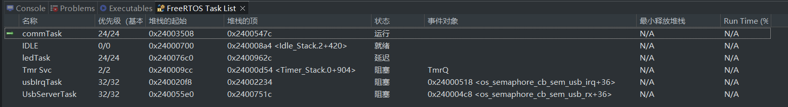
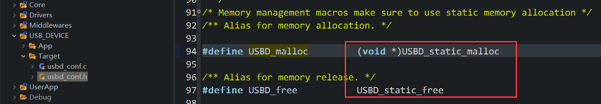
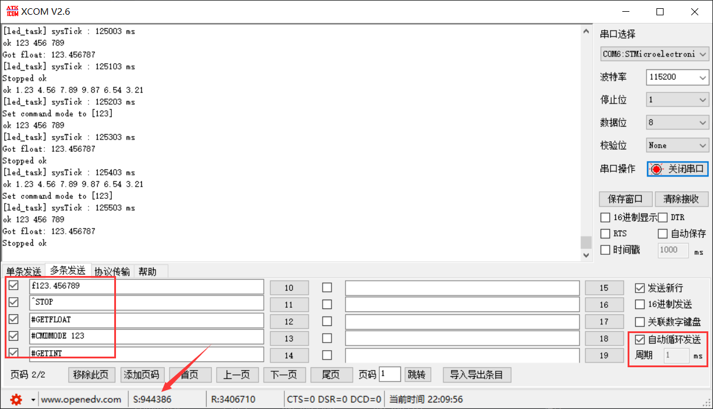
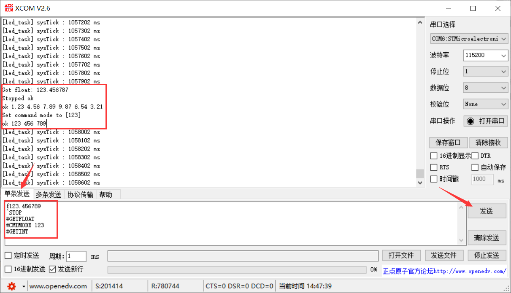

## H750VBT6_ST_USB_CDC_01

## 功能

使用USB虚拟串口解析接收到的命令并回复，支持输入浮点回复浮点数，所有USB处理相关的任务都是事件驱动的

## 任务划分

按照创建顺序依次是：

- usbIrqTask：CDC接收中断处理
- StartDefaultTask：调用Main()执行完毕后此任务自行删除
- CommunicationTask：调用创建 UsbServerTask 的函数，然后每秒1次打酱油
- UsbServerTask：进行VCP命令解析
- ledTask：每200ms闪烁一次开发板红色led
- 系统任务：略



## USB相关的信号量

路径 `Core/Src/Freertos.c`

```c
osSemaphoreId sem_usb_irq;
osSemaphoreId sem_usb_rx;
osSemaphoreId sem_usb_tx;
```

## ST USB 的修改

### STM32CubeF4 与 STM32CubeH7 的 ST USB 区别

ST USB不是仅有一个版本兼容 所有带 USB 外设的STM32，对于 F4 和 H7，在细节上会有很多不同，由于我参考 ODrive、ZH的项目都是使用 F405，但示例工程使用的是H750，因此修改不会完全一样

### usbd_cdc.c

头文件加入 

```c
#include "freertos_inc.h"		//提供信号量 sem_usb_tx
```

（此步骤跳过）~~将 `if(pdev->pClassData != NULL)`加入~~

```c
USBD_CDC_DeInit()	//不必加，ST USB做了 pClassData NULL 检查
USBD_CDC_DataOut()	
USBD_CDC_TransmitPacket()
USBD_CDC_ReceivePacket()
```

> pdev 是 USBD_HandleTypeDef 类型的指针，USBD_HandleTypeDef  成员 void指针pClassData 在 USBD_CDC_Init() 中指向 USBD_malloc() 返回的 USBD_CDC_HandleTypeDef 地址：
>
> ```c
> static uint8_t USBD_CDC_Init(USBD_HandleTypeDef *pdev, uint8_t cfgidx)
> {
> ...
> hcdc = (USBD_CDC_HandleTypeDef *)USBD_malloc(sizeof(USBD_CDC_HandleTypeDef));
> ...
> pdev->pClassDataCmsit[pdev->classId] = (void *)hcdc;		//转换为指针常量
> pdev->pClassData = pdev->pClassDataCmsit[pdev->classId];
> ...
> }
> 
> ```
>
> 仅在 USBD_CDC_DeInit() 这块动态内存会被 USBD_free() 释放
>
> ```c
> static uint8_t USBD_CDC_DeInit(USBD_HandleTypeDef *pdev, uint8_t cfgidx)
> {
> ...
> /* DeInit  physical Interface components */
> if (pdev->pClassDataCmsit[pdev->classId] != NULL)
> {
>  ((USBD_CDC_ItfTypeDef *)pdev->pUserData[pdev->classId])->DeInit();
>  (void)USBD_free(pdev->pClassDataCmsit[pdev->classId]);
>  pdev->pClassDataCmsit[pdev->classId] = NULL;
>  pdev->pClassData = NULL;
> }
> ...
> }
> ```
>
> 但注意 ST-USB H7的 malloc 和 free 实现为静态：
>
> 
>
> 

 `USBD_CDC_DataIn() `的以下位置加入：

```c
static uint8_t USBD_CDC_DataIn(USBD_HandleTypeDef *pdev, uint8_t epnum)
{
...
    hcdc->TxState = 0U;
    osSemaphoreRelease(sem_usb_tx);	// +++ 释放信号量

    if (((USBD_CDC_ItfTypeDef *)pdev->pUserData[pdev->classId])->TransmitCplt != NULL)
...
}
```

### usbd_cdc_if.c

以下位置加入：

```c
/* USER CODE BEGIN INCLUDE */
#include <cmsis_os.h>
#include "interface_usb.hpp"
/* USER CODE END INCLUDE */
```

`CDC_Control_FS()`的以下位置加入：

```c
static int8_t CDC_Control_FS(uint8_t cmd, uint8_t* pbuf, uint16_t length)
{
    ...
	case CDC_GET_LINE_CODING:
        pbuf[0] = (uint8_t)(115200);
        pbuf[1] = (uint8_t)(115200 >> 8);
        pbuf[2] = (uint8_t)(115200 >> 16);
        pbuf[3] = (uint8_t)(115200 >> 24);
        pbuf[4] = 0;  // stop bits (1)
        pbuf[5] = 0;  // parity (none)
        pbuf[6] = 8;  // number of bits (8)
    ...
}
```

`CDC_Receive_FS()`的以下位置加入：

```c
static int8_t CDC_Receive_FS(uint8_t* Buf, uint32_t *Len)
{
  /* USER CODE BEGIN 6 */
#if 0	// CubeMX Generated
  USBD_CDC_SetRxBuffer(&hUsbDeviceFS, &Buf[0]);
  USBD_CDC_ReceivePacket(&hUsbDeviceFS);
#else
  usb_rx_process_packet(Buf, *Len);
#endif
  return (USBD_OK);
  /* USER CODE END 6 */
}
```

`CDC_Transmit_FS()`以下位置加入：

> 当前最多仅支持一次发送64个字符

```c
uint8_t CDC_Transmit_FS(uint8_t* Buf, uint16_t Len)
{
...
  /* USER CODE BEGIN 7 */
#if 0	//CubeMX Generated
  /* Code automatically generated by CubeMX */
  USBD_CDC_HandleTypeDef *hcdc = (USBD_CDC_HandleTypeDef*)hUsbDeviceFS.pClassData;
  if (hcdc->TxState != 0){
    return USBD_BUSY;
  }
  USBD_CDC_SetTxBuffer(&hUsbDeviceFS, Buf, Len);
  result = USBD_CDC_TransmitPacket(&hUsbDeviceFS);
#else
  //Check length
  if (Len > CDC_DATA_FS_MAX_PACKET_SIZE)
      return USBD_FAIL;

  // Check for ongoing transmission
  USBD_CDC_HandleTypeDef *hcdc = (USBD_CDC_HandleTypeDef*)hUsbDeviceFS.pClassData;
  if(hcdc->TxState != 0)
	  return USBD_BUSY;

  // memcpy Buf into UserTxBufferFS
  memcpy(UserTxBufferFS, Buf, Len);

  // Update Len
  USBD_CDC_SetTxBuffer(&hUsbDeviceFS, UserTxBufferFS, Len);
  result = USBD_CDC_TransmitPacket(&hUsbDeviceFS);
#endif
  /* USER CODE END 7 */
...
}
```

以下位置加入：

```c
/* USER CODE BEGIN PRIVATE_FUNCTIONS_IMPLEMENTATION */
/**
  * @brief 	Customize the disconnect function before USB initialization to reduce the trouble of reset
  * @notice	Called within the "USER CODE BEGIN SysInit" section of main()
  */
void USB_Status_Init(void)
{
    GPIO_InitTypeDef GPIO_InitStruct = {0};

    /* GPIO Ports Clock Enable */
    __HAL_RCC_GPIOA_CLK_ENABLE();

    /*Configure GPIO pin Output Level */
    HAL_GPIO_WritePin(GPIOA, GPIO_PIN_11 | GPIO_PIN_12, GPIO_PIN_RESET);

    /*Configure GPIO pin : USB*/
    GPIO_InitStruct.Pin = GPIO_PIN_11 | GPIO_PIN_12;
    GPIO_InitStruct.Mode = GPIO_MODE_OUTPUT_PP;
    GPIO_InitStruct.Pull = GPIO_PULLDOWN;
    GPIO_InitStruct.Speed = GPIO_SPEED_FREQ_LOW;
    HAL_GPIO_Init(GPIOA, &GPIO_InitStruct);

    HAL_Delay(2000);	// If it doesn't work, just extend the delay
}
/* USER CODE END PRIVATE_FUNCTIONS_IMPLEMENTATION */
```

### usbd_cdc_if.h

以下位置加入：

```c
/* USER CODE BEGIN EXPORTED_FUNCTIONS */
void USB_Status_Init(void);
/* USER CODE END EXPORTED_FUNCTIONS */
```

## printf() 相关

### 重定向

路径：`H750VBT6_ST_USB_CDC_01/Bsp/communication/communication.cpp`

代码：

```c
extern "C" {
int _write(int file, const char *data, int len);
}

// @brief This is what printf calls internally
int _write(int file, const char *data, int len)
{
    usb_stream_output_ptr->process_bytes((uint8_t *) data, len, nullptr);
    return len;
}
```

分析：

STM32CubeIDE 内置 CubeMX 会在 `/H750VBT6_ST_USB_CDC_01/Core/Src/syscalls.c`内生成以下使用 weak 修饰的函数：

```c
extern int __io_putchar(int ch) __attribute__((weak));
extern int __io_getchar(void) __attribute__((weak));

__attribute__((weak)) int _read(int file, char *ptr, int len)
{
...
*ptr++ = __io_getchar();
...
}
__attribute__((weak)) int _write(int file, char *ptr, int len)
{
...
__io_putchar(*ptr++);
...
}
```

因此可以直接在其他源代码文件中定义 强函数，可选方式是 重写 __io_putchar() 与 `__io_getchar()` 与外设的收发API对接，或者直接重写 `_read()`与 `_write()`，可参考：[STM32CubeIDE printf重定向設置](https://blog.csdn.net/kyzb002/article/details/101100922)

使用 fibre框架 的一些项目的处理方式：

ODrive新版由于使用 devel 分支的 fibre，实现地很复杂，先放在这里吧

```c++
// @brief This is what printf calls internally
int _write(int file, const char* data, int len) {
    fibre::cbufptr_t buf{(const uint8_t*)data, (const uint8_t*)data + len};

    if (odrv.config_.uart0_protocol == ODrive::STREAM_PROTOCOL_TYPE_STDOUT ||
        odrv.config_.uart0_protocol == ODrive::STREAM_PROTOCOL_TYPE_ASCII_AND_STDOUT) {
        uart0_stdout_sink.write(buf);
        if (!uart0_stdout_pending) {
            uart0_stdout_pending = true;
            osMessagePut(uart_event_queue, 3, 0);
        }
    }

    if (odrv.config_.usb_cdc_protocol == ODrive::STREAM_PROTOCOL_TYPE_STDOUT ||
        odrv.config_.usb_cdc_protocol == ODrive::STREAM_PROTOCOL_TYPE_ASCII_AND_STDOUT) {
        usb_cdc_stdout_sink.write(buf);
        if (!usb_cdc_stdout_pending) {
            usb_cdc_stdout_pending = true;
            osMessagePut(usb_event_queue, 7, 0);
        }
    }

    return len; // Always pretend that we processed everything
}
```

ZH 的 Dummy-Robot、HelloWord-Dynamic，对于任意 printf 都会向 usb 和 uart 同时打印信息 

```C++
// @brief This is what printf calls internally
int _write(int file, const char *data, int len)
{
    usb_stream_output_ptr->process_bytes((uint8_t *) data, len, nullptr);
    uart2_stream_output_ptr->process_bytes((uint8_t *) data, len, nullptr);
    return len;
}
```

本工程仅将 _write 对接到 USB 输出流：

路径：`Bsp\communication\communication.cpp`

```c
extern "C" {
int _write(int file, const char *data, int len);
}

// @brief This is what printf calls internally
int _write(int file, const char *data, int len)
{
    usb_stream_output_ptr->process_bytes((uint8_t *) data, len, nullptr);
    return len;
}
```

### 指定串口打印

使用 Respod()

路径：`Bsp\communication\ascii_processor.hpp`

```C++
// Function to send messages back through specific channel (UART or USB-VCP).
// Use this function instead of printf because printf will send messages over ALL CHANNEL.
template<typename ... TArgs>
void Respond(StreamSink &output, bool include_checksum, const char *fmt, TArgs &&... args)
{...(略)}
```

参数 `StreamSink &output` 给 外设输出流对象 就行

参考用法：OnAsciiCmd()，路径：`UserApp\protocols\ascii_protocol.cpp`

### 指定串口解析ASCII命令

路径：`Bsp\communication\ascii_processor.hpp`

```c
void ASCII_protocol_parse_stream(const uint8_t *buffer, size_t len, StreamSink &response_channel)
```

参考用法1：

UsbServerTask()，路径：`Bsp\communication\interface_usb.cpp`

```c
ASCII_protocol_parse_stream(CDC_interface.rx_buf, CDC_interface.rx_len, usb_stream_output);
```

参考用法2：

由于 `ASCII_protocol_parse_stream()` 会调用 `ASCII_protocol_process_line()` 

[Dummy-Robot](https://github.com/peng-zhihui/Dummy-Robot) 源码的`ASCII_protocol_process_line()` 中根据`response_channel.channelType` 调用不同的 `OnXXXAsciiCmd()`，路径：`Dummy-Robot/2.Firmware/Core-STM32F4-fw/Bsp/communication/ascii_processor.cpp`

```c
// @brief Executes an ASCII protocol command
// @param buffer buffer of ASCII encoded characters
// @param len size of the buffer
void ASCII_protocol_process_line(
		const uint8_t* buffer,			//接收消息的buffer
		size_t len,						//接收消息的len
		StreamSink &response_channel)	//发回消息的端口
{
    static_assert(sizeof(char) == sizeof(uint8_t));

    // copy everything into a local buffer so we can insert null-termination
    char cmd[MAX_LINE_LENGTH + 1];
    if (len > MAX_LINE_LENGTH) len = MAX_LINE_LENGTH;
    memcpy(cmd, buffer, len);

    cmd[len] = 0; // null-terminate

    if (response_channel.channelType == StreamSink::CHANNEL_TYPE_USB)
    	//电机协议命令解释器函数：USB端口
        OnUsbAsciiCmd(cmd, len, response_channel);	//发回消息的端口：Dummy可以通过USB发回消息
    else if (response_channel.channelType == StreamSink::CHANNEL_TYPE_UART4)
        OnUart4AsciiCmd(cmd, len, response_channel);
    else if (response_channel.channelType == StreamSink::CHANNEL_TYPE_UART5)
        OnUart5AsciiCmd(cmd, len, response_channel);
}
```

然后分别在 OnUsbAsciiCmd()、OnUart4AsciiCmd()、OnUart5AsciiCmd()中自定义命令解析即可，路径：`Dummy-Robot/2.Firmware/Core-STM32F4-fw/UserApp/protocols/ascii_protocol.cpp`

### 打印浮点数崩溃

问题场景：

> > ledTask 任务 与 UsbServerTask任务 分别使用 printf 和 snprintf
> >
> > 优先级：ledTask任务Normal，UsbServerTask任务AboveNormal
>
> ledTask任务使用了printf：
>
> ```c
> void ledTask(void* argument){
> ...
> 	for(;;){
> ...
> 		/* 打印时间节拍 */
> 		printf("[led_task] sysTick : %ld ms\r\n", xTaskGetTickCount());
> 		vTaskDelayUntil(&xLastWakeTime, xFrequency);
> 	}
> }
> ```
>
> UsbServerTask任务在VCP命令解析时，调用的ASCII_protocol_parse_stream()
>
> ```c++
> static void UsbServerTask(void *ctx)
> {
> ...
>     for (;;)
>     {
>         osStatus sem_stat = osSemaphoreAcquire(sem_usb_rx, osWaitForever);
> ...
>     	ASCII_protocol_parse_stream(CDC_interface.rx_buf, CDC_interface.rx_len, usb_stream_output);
> ...
>     }
> }
> ```
>
> ​	ASCII_protocol_parse_stream() 调用到 OnAsciiCmd() ，即自定义命令解析函数，若回应时打印浮点数：
>
> ```c++
> void OnAsciiCmd(const char* _cmd, size_t _len, StreamSink &_responseChannel)
> {
> ...
>     if (_cmd[0] == 'f')
>     {
>         float value;
>         argNum = sscanf(&_cmd[1], "%f", &value);
>         Respond(_responseChannel, false, "Got float: %f\n", argNum, value);
>     }
> ...
> }
> ```
>
> 那么 OnAsciiCmd()调用的 Respond() 内部 就会以 %f  调用 snprintf()：
>
> ```c
> template<typename ... TArgs>
> void Respond(StreamSink &output, bool include_checksum, const char *fmt, TArgs &&... args)
> {
>     char response[64];
>     size_t len = snprintf(response, sizeof(response), fmt, std::forward<TArgs>(args)...);
>     output.process_bytes((uint8_t *) response, len, nullptr);
> ...
> }
> ```
>
> 若 ledTask 任务不使用 printf() ，UsbServerTask 任务打印浮点数不会进 HardFault 
>
> 若 ledTask  任务使用printf()，UsbServerTask 任务打印浮点数 ，秒进 HardFault ，将 UsbServerTask 任务打印浮点数的转义字符 `%f` 改成 `%d`，又不会进 HardFault 
>
> 解决方法在下一部分：线程安全

### 线程安全

原因是 STM32CubeIDE 使用 newlib 的 printf()、sprintf()、snprintf() 等对于`%f`输出，会使用非线程安全的 malloc()

关于newlib？在CubeIDE下使用 printf 和 scanf float 时要勾选的就是newlib的实现：


这个问题被吐槽很久了，但至今newlib的 %f 还是使用非线程安全的 malloc()

按照 [Dave Nadler 博客 ](https://nadler.com/embedded/newlibAndFreeRTOS.html) 的方法（本项目根目录的 `FreeRTOS_helpers_相关资料`文件夹中有记录）搞定

## 测试：ASCII命令解析

使用原子XCOM自动循环发送，UsbTaskServer任务进行自定义ASCII命令解析，与此同时ledTask任务打印系统时间

> 测试命令
>
> ```
> f123.456789
> ^STOP
> #GETFLOAT
> #CMDMODE 123
> #GETINT
> ```
>
> 

解析单条发送的多条命令：

> 

发送 `$ISR_STACK`  命令查看 ISR 堆栈（需要 [Dave Nadler 的 FreeRTOS_helpers 的  port_DRN.c ](https://github.com/DRNadler/FreeRTOS_helpers)支持）

> ```c
> ISR Stack : 100/256  39%
> ```

发送 `$TASK_STACK` 命令查看 任务堆栈

> ```c
> commTask : 70/128  54%
> UsbServerTask : 408/512  79%
> usbIrqTask : 50/128  39%
> ledTask : 152/256  59%
> ```
