## H750VBT6_ST_USB_CDC_02

## 关于

在 H750VBT6_ST_USB_CDC_01 工程的基础上修改为 [USB应用实战视频教程第3期](https://www.armbbs.cn/forum.php?mod=viewthread&tid=116108&highlight=USB%D3%A6%D3%C3%CA%B5%D5%BD%CA%D3%C6%B5%BD%CC%B3%CC) 的下位机，与修改后的 [USB应用实战视频教程第4期](https://www.armbbs.cn/forum.php?mod=viewthread&tid=116396&highlight=USB%D3%A6%D3%C3%CA%B5%D5%BD) 的上位机进行 USB+CDC+BULK 传输

QT工程在本工程根目录的 USB_QT 文件夹下

## 参考

### armfly教程

[USB应用实战视频教程第3期：手把手玩转USB BULK方式下位机和QT6.4上位机开发上篇（2022-10-24）](https://www.armbbs.cn/forum.php?mod=viewthread&tid=116108&highlight=USB%D3%A6%D3%C3%CA%B5%D5%BD%CA%D3%C6%B5%BD%CC%B3%CC)

[USB应用实战视频教程第4期：手把手玩转基于QT6.4的USB BULK上位机和下位机开发下篇（2022-11-07）](https://www.armbbs.cn/forum.php?mod=viewthread&tid=116396&highlight=USB%D3%A6%D3%C3%CA%B5%D5%BD)

[【专题教程第8期】基于emWin模拟器的USB BULK上位机开发，仅需C即可，简单易实现](https://www.armbbs.cn/forum.php?mod=viewthread&tid=90026)

### armfly工具

[Zadig：USB驱动安装工具，此工具让libusb-win32，WinUSB，libusbK的驱动安装超级简单](https://www.armbbs.cn/forum.php?mod=viewthread&tid=15108&highlight=Zadig)

[emWin USB BULK上位机](https://www.armbbs.cn/forum.php?mod=viewthread&tid=90026)

### Manual

[UM1734 用户手册 STM32Cube USB 设备库 ](https://www.st.com/resource/zh/user_manual/um1734-stm32cube-usb-device-library-stmicroelectronics.pdf)

## H750VBT6_ST_USB_CDC_01 的修改

在`H750VBT6_ST_USB_CDC_01`工程的基础上修改

### usbd_cdc.h

不修改，仅列出3个端点地址

```c
#ifndef CDC_IN_EP
#define CDC_IN_EP                                   0x81U  /* EP1 for data IN */
#endif /* CDC_IN_EP */
#ifndef CDC_OUT_EP
#define CDC_OUT_EP                                  0x01U  /* EP1 for data OUT */
#endif /* CDC_OUT_EP */
#ifndef CDC_CMD_EP
#define CDC_CMD_EP                                  0x82U  /* EP2 for CDC commands */
#endif /* CDC_CMD_EP  */
```

libusb 端点地址编码如下：


- 0x81 二进制是 `100000001`，bit[2:0] = 001， 1号端点，bit7[7] = 1，方向 1，IN端点，用作 BULK IN端点
- 0x01 二进制是 `000000001`，bit[2:0] = 001， 1号端点，bit[7] = 0，方向 0，OUT端点，用作 BULK OUT端点
- 0x82 二进制是 `100000010`，bit[2:0] = 010，2号端点，bit7[7] = 1，方向 1，IN端点，用作 中断端点

注意：IN/OUT是 数据对于Host的方向

### usbd_desc.c

为了不影响ST USB VCP 被WIN10自动装载虚拟串口的驱动，按照[USB应用实战视频教程第3期](https://www.armbbs.cn/forum.php?mod=viewthread&tid=116108&highlight=USB%D3%A6%D3%C3%CA%B5%D5%BD%CA%D3%C6%B5%BD%CC%B3%CC)修改了设备描述符的 VID 和 PID 及字符串，修改前：

```c
#define USBD_VID     1155
#define USBD_MANUFACTURER_STRING     "STMicroelectronics"
#define USBD_PID_FS     22336
#define USBD_PRODUCT_STRING_FS     "STM32 Virtual ComPort"
```

修改后：	

```c
#define USBD_VID     0xC251
#define USBD_MANUFACTURER_STRING     "Keil Software"
#define USBD_PID_FS     0x3505
#define USBD_PRODUCT_STRING_FS     "Keil USB Device 0"
```

此VID来自Keil的RL-USB库，Keil注册的PID很少的说，ST都注册了几十个了，PID也是一样，这里仅作测试使用，USB ID 查询网站：[devicehunt.com](https://devicehunt.com/search/type/usb/vendor/any/device/any)

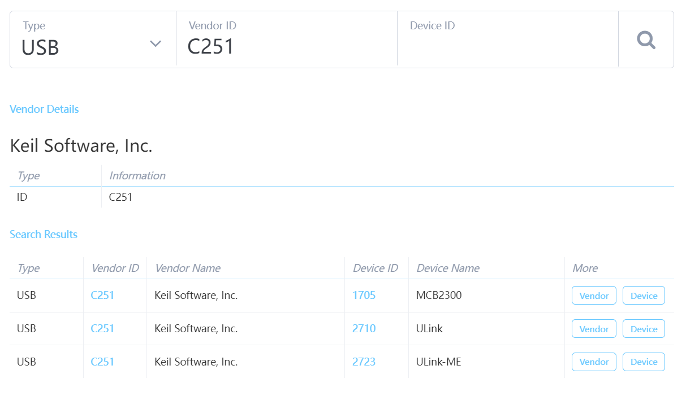

### usbd_cdc_if.h

将 APP_RX_DATA_SIZE 和 APP_RX_DATA_SIZE 从 64 加到最大的2048

```c
#define APP_RX_DATA_SIZE  2048
#define APP_TX_DATA_SIZE  2048
```

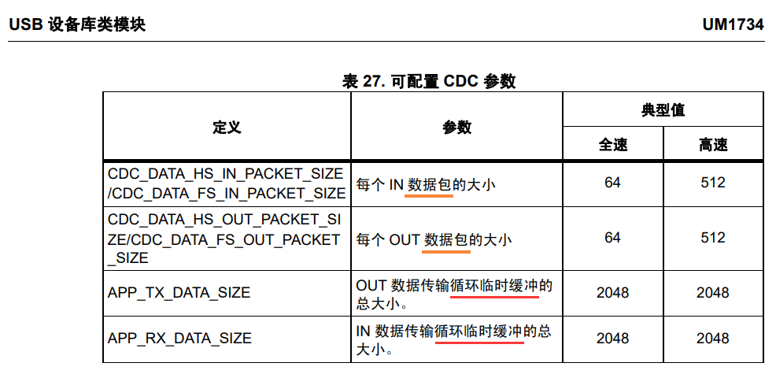

注意不同型号的STM32 USB FS CDC 范围临时循环缓冲区可配置范围不一样：

| H750：4~2048                                                 | F429：4~2048                                                 |
| ------------------------------------------------------------ | ------------------------------------------------------------ |
| 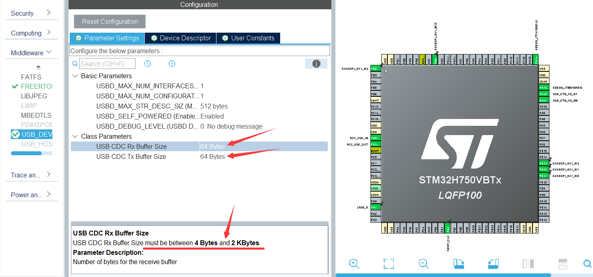 | 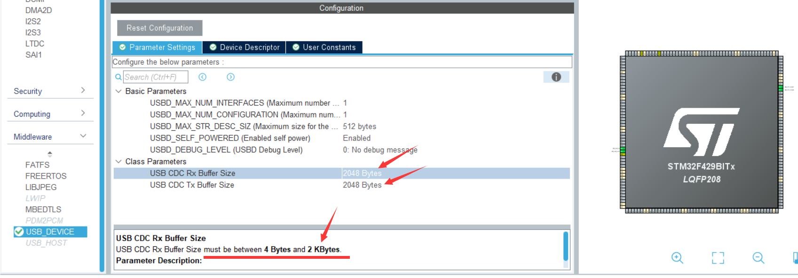 |
| F401：1~1000                                                 | F072：1~1000                                                 |
| 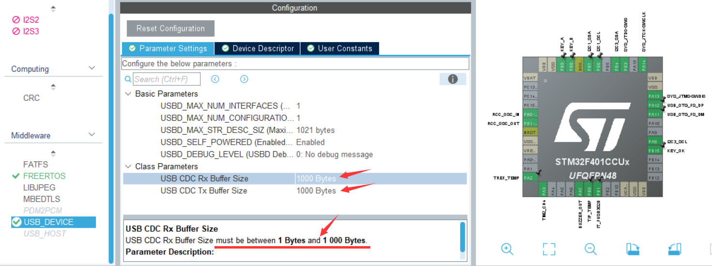 | 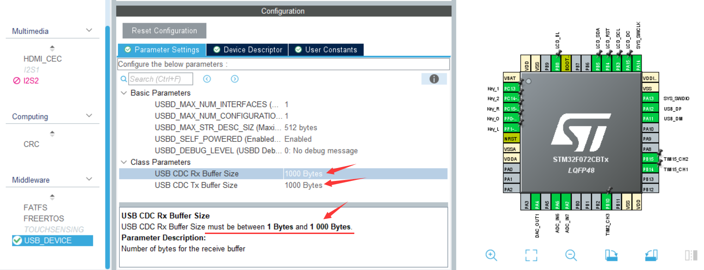 |

这个循环临时缓冲区内的数据会拆分为MPS事务（64字节数据包）逐一发送

可设置大于MPS事务的包大小.png)

不明白为啥 ODrive 的代码将 零时循环缓冲区大小 仅设置为 64字节，对于 F405，设置为 1000 都 没问题

### usbd_cdc_if.c

CDC_Transmit_FS() 改回 CubeMX 默认生成的

```c
uint8_t CDC_Transmit_FS(uint8_t* Buf, uint16_t Len)
{
  uint8_t result = USBD_OK;
  /* USER CODE BEGIN 7 */
#if 1	//CubeMX Generated
  /* Code automatically generated by CubeMX */
  USBD_CDC_HandleTypeDef *hcdc = (USBD_CDC_HandleTypeDef*)hUsbDeviceFS.pClassData;
  if (hcdc->TxState != 0){
    return USBD_BUSY;
  }
  USBD_CDC_SetTxBuffer(&hUsbDeviceFS, Buf, Len);
  result = USBD_CDC_TransmitPacket(&hUsbDeviceFS);
#else
...
#endif
  /* USER CODE END 7 */
  return result;
}
```

### ascii_protocol.cpp

添加全局数组：

```c
uint8_t usb_data[1024];
```

OnAsciiCmd()添加 0x02命令解析，并返回1024个随机数：

```C++
/* 返回1024个随机数据 */
else if(_cmd[0] == 0x02)
{
	for(int i = 0; i<1024; i++) {
		usb_data[i] = rand() % 50;
	}
	_responseChannel.process_bytes((uint8_t *) usb_data, 1024, nullptr);
}
```

### interface_usb.cpp

class USBSender：去掉 length 是否大于 CDC_DATA_FS_MAX_PACKET_SIZE （值为64，即FS数据包大小）的检查

```c++
class USBSender : public PacketSink
{
...
    int process_packet(uint8_t *buffer, size_t length) override
    {
        // cannot send partial packets
#if 0	
        if (length > CDC_DATA_FS_MAX_PACKET_SIZE)
            return -1;
#endif
        ...
    }
...
};
```

class TreatPacketSinkAsStreamSink：去掉 Loop to ensure all bytes get sent

```c++
class TreatPacketSinkAsStreamSink : public StreamSink
{
...
    int process_bytes(uint8_t *buffer, size_t length, size_t *processed_bytes)
    {
#if 0
        // Loop to ensure all bytes get sent
        while (length)
        {
            size_t chunk = length < CDC_DATA_FS_MAX_PACKET_SIZE ? length : CDC_DATA_FS_MAX_PACKET_SIZE;
            if (output_.process_packet(buffer, length) != 0)
                return -1;
            buffer += chunk;
            length -= chunk;
            if (processed_bytes)
                *processed_bytes += chunk;
        }
#else
        if (output_.process_packet(buffer, length) != 0)
            return -1;
#endif
        return 0;
    }
...
} usb_stream_output(usb_packet_output_cdc);
```

## QT上位机的修改

### mainwindow.ui

删除 翻转 LED按钮

### mainwindow.h

删除 成员函数on_pushButton_3_clicked()

### mainwindow.cpp

删除 成员函数 on_pushButton_3_clicked()原型

usbdataupdate()：

> IN/OUT端点改为 0x81和 0x01，发送命令时，追加`'\r\n'`
>
> ```C++
> void MainWindow::usbdataupdate(){
> ...
>         /*
>            H750VBT6_ST_USB_CDC_02工程的 usbd_cdc.h 中断端点的地址 CDC_CMD_EP 是 0x82U， 0x81和0x01作为BULK端点IN/OUT地址
>            因为 m_dev->config->interface->altsetting->endpoint->bEndpointAddress值为0x82，所以需要减1才是BULK端点IN地址
>            注意：硬汉哥的教程中RL-USB的配置是STM32F429BIT6的 0x81 作为 中断端点地址, 0x82和0x02作为BULK端点IN/OUT地址
>         */
>         ret = usb_bulk_read(m_dev_handle,
>                             m_dev->config->interface->altsetting->endpoint->bEndpointAddress - 1,   //endpoint IN 地址 0x81
>                             RecTraData,
>                             2048,
>                             128);
> ...
>         /* fibre框架处理USB接收的消息要求至少末尾要有回车符 */
>         RecTraData[1] = '\r';
>         RecTraData[2] = '\n';
> ...
>     
>             /* 执行发送 */
>             ret = usb_bulk_write(m_dev_handle,
>                                  1,                 //endpoint OUT 地址 0x01
>                                  RecTraData,
>                                  3,                 //以 一个数字+"\r\n" 的格式发送命令，共3个字符
>                                  128);
> ...
> }
> ```
>
> 注意：与 硬汉哥 [USB应用实战视频教程第3期](https://www.armbbs.cn/forum.php?mod=viewthread&tid=116108&highlight=USB%D3%A6%D3%C3%CA%B5%D5%BD%CA%D3%C6%B5%BD%CC%B3%CC) 的端点配置是不一样的
>
> 

## Zadig 覆盖驱动

烧录固件，插电脑，默认还是被装载VCP驱动（COM7就是）

然后打开Zadig，勾选 “List All Devices”，才能看到 Keil USB Device 0

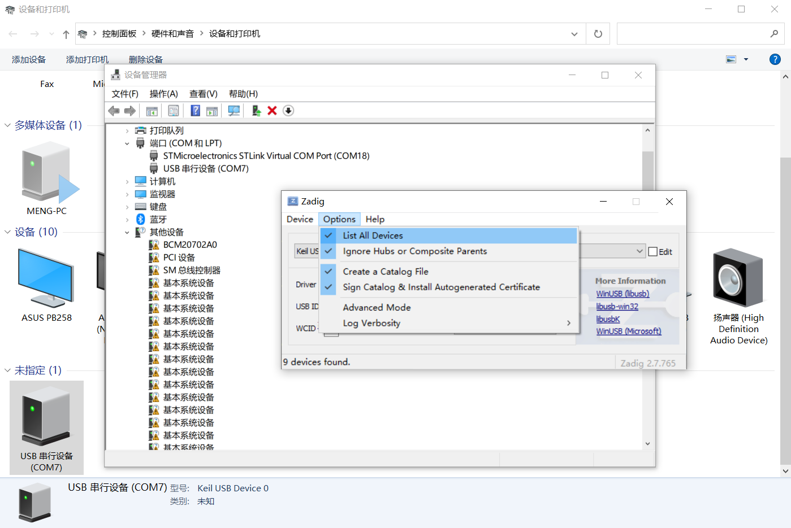

然后选择 libusb-win32 ，点击 “Replace Driver”，等待覆盖COM驱动

| 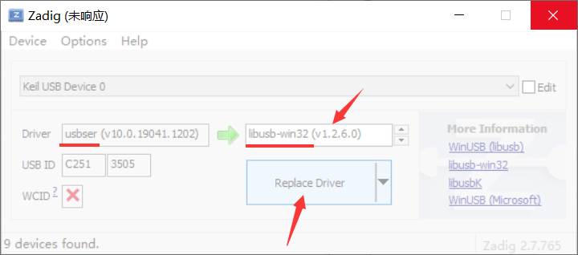 | 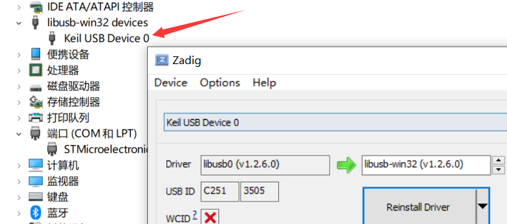 |
| ------------------------------------------------------------ | ------------------------------------------------------------ |

覆盖之后，显示 libusb-win32 devices，即使拔掉USB后再插上，也是识别为此驱动，VCP的COM号已不显示

## 测试

### 硬汉哥emWin上位机抓取的USB设备信息

但是无法进行采集数据，原因是此上位机的端点和我配置得不一样

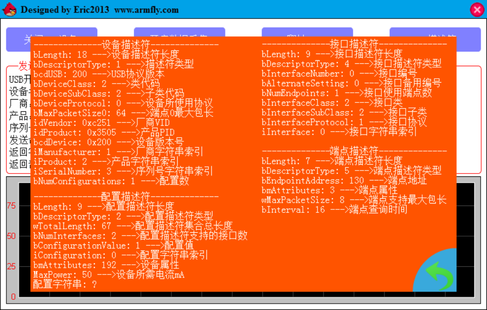

### 修改后的硬汉哥QT USB BULK上位机通信

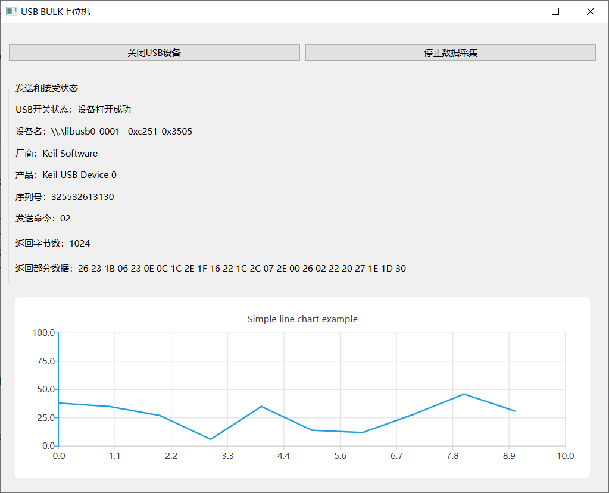
