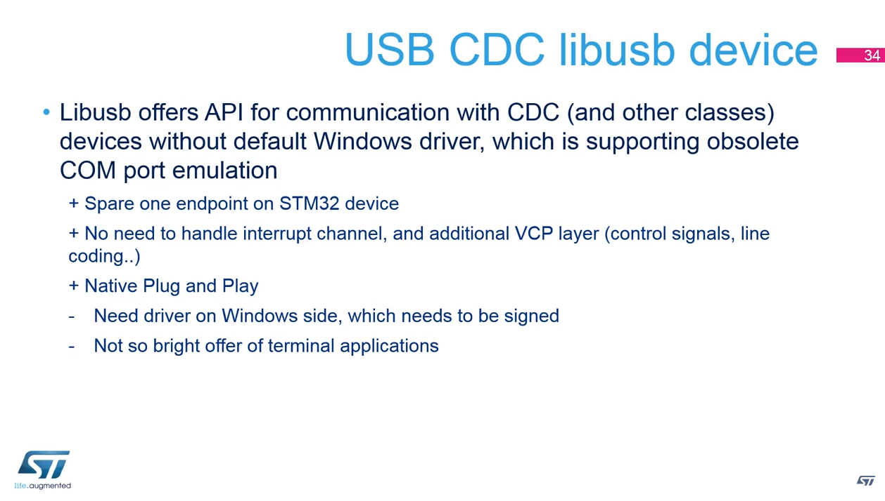
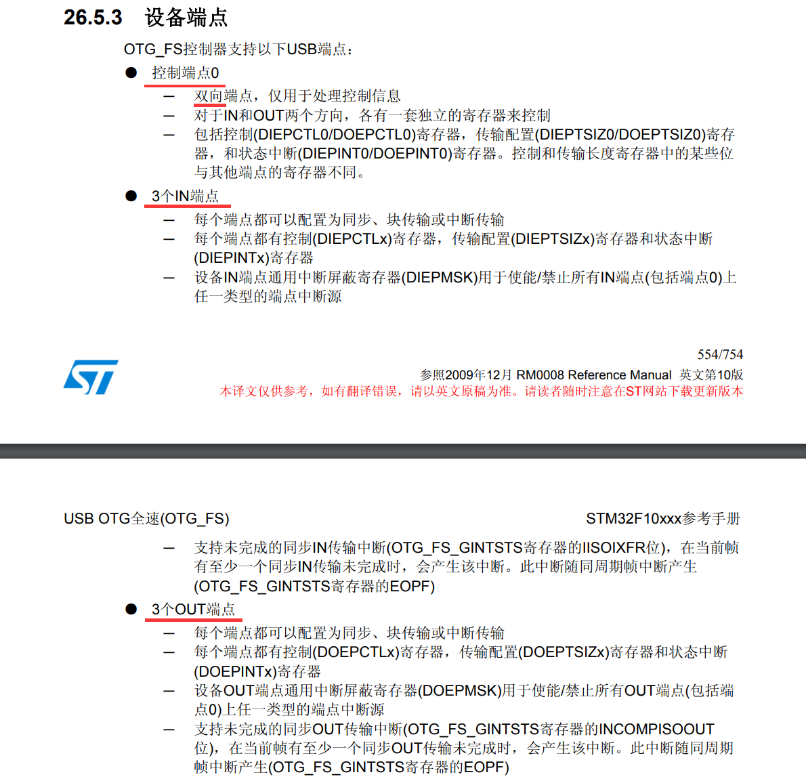
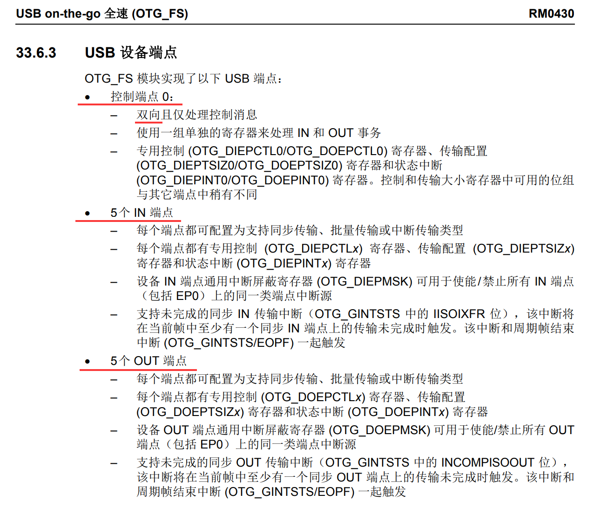
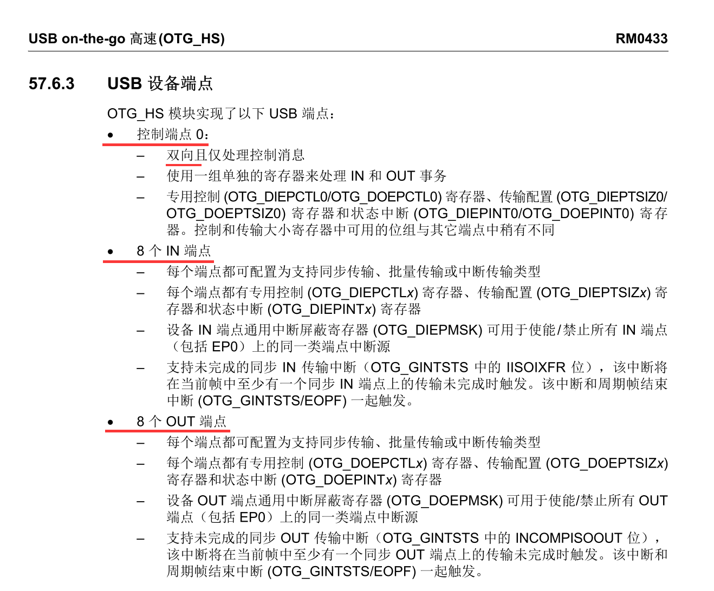
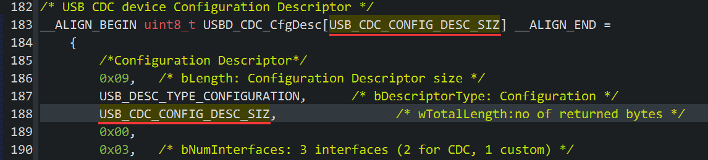
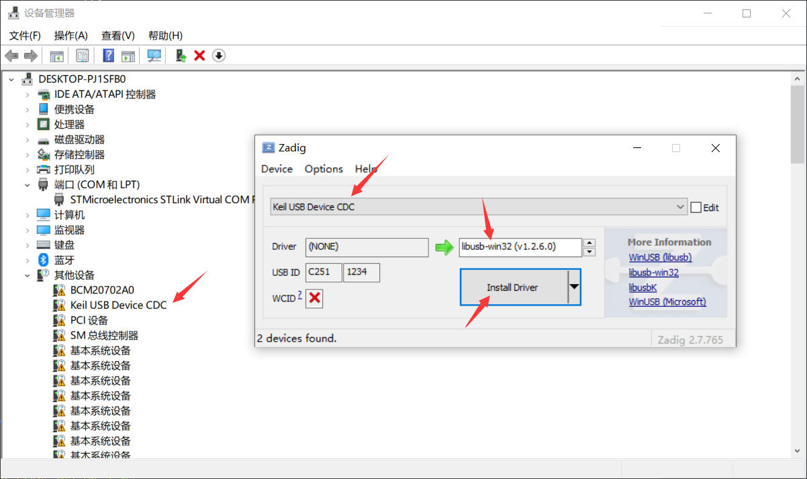
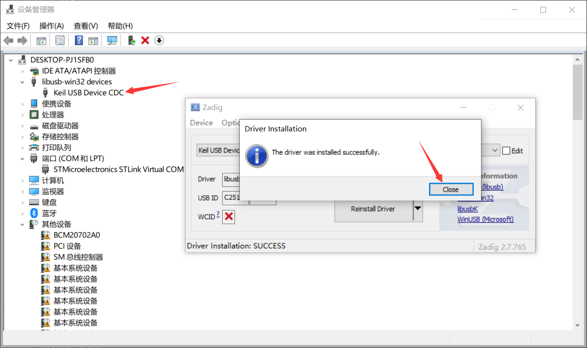
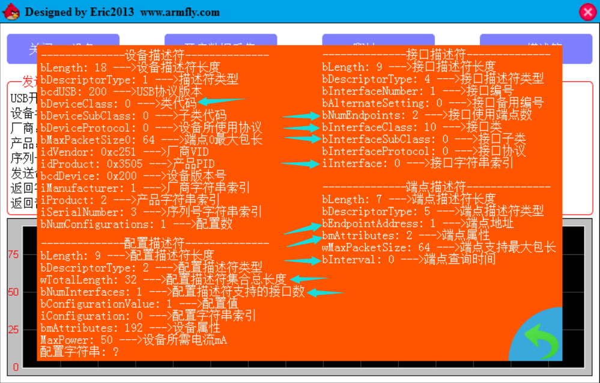
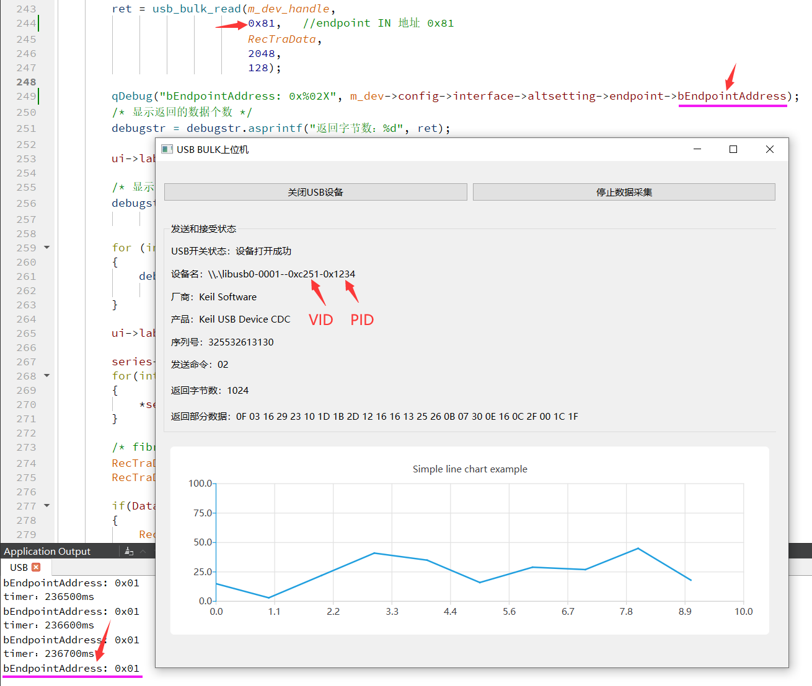

## H750VBT6_ST_USB_CDC_03

在 H750VBT6_ST_USB_CDC_02 工程的基础上，去掉中断端点和CDC类下ACM协议相关的东西，端点数量从 3个减少为2个

CDC+libusb 无需中断端点，CDC+VCP无libusb的情况装载win10的VCP驱动才需要中断端点

## ST培训视频

### 简介

[STM32 USB training - 09.3 USB CDC libusb device lab](https://www.youtube.com/watch?v=ft8LXVcYFRg&list=PLnMKNibPkDnFFRBVD206EfnnHhQZI4Hxa&index=12)

> 从CubeMX的 STM32F446ZET6 + USB FS Device 模式 + VCP模式 的初始化代码进行修改

此视频介绍说，CDC + libusb 是 CDC + VCP的替代品

ST经常从客户那里收到关于 vcp 使用的投诉，这种类型的通信在日常应用有诸多限制

- 第一个限制：VCP来自不再使用的非常旧的com端口，并且其仿真为不能即插即用的通信接口，比如运行在不同上位机的应用程序与VCP通信时，看到的可能不是同一个 COM 端口号

- 第二个限制：如果使用VCP通信，会使用一个附加端点，CDC VCP协议需要3个端点，除了IN / OUT 两个端点，还有一个CMD端点，CMD端点是中断端点（附加端点），但中断端点上几乎没有通信的荷载，可以认为VCP通信浪费了一个端点（大多数STM32的USB外设的端点数量非常有限），当端点数量有限，可以将VCP放入USB复合设备

因此ST推荐使用libUSB，libusb是全开源的API，可以在windows和linux平台上运行，CDC+libusb有以下优势与劣势：



Libusb 提供了与 CDC（和其他类）设备通信的 API，无需默认的 Windows 驱动程序，它支持过时的 COM 端口模拟

优势：

+ 在STM32设备上空闲（节省？）一个端点
+ 无需处理中断通道和额外的 VCP 层（控制信号、线路编码……）
+ 本机即插即用

劣势：

- 需要Windows端具有签名的驱动程序
- 终端应用程序的发布不透明

优点主要是 libusb不需要中断端点的协议，可以节约1个端点，对于CDC只需要IN/OUT两个端点，这意味着程序不需要处理中断端点、LineCoding（CDC下ACM协议的东西），在windows端的优势是没有额外的VCP协议层与本机即插即用

关于端点个数，以USB-FS设备端点为例

| F103：7个                                                    | F413：11个                                                   | H750：17个                                                   |
| ------------------------------------------------------------ | ------------------------------------------------------------ | ------------------------------------------------------------ |
|  |  |  |

- CDC+VCP使用3个：BULK IN、BULK OUT、CMD IN
- CDC+libusb使用2个：BULK IN、BULK OUT

缺点主要是终端应用程序和API不像标准COM端口那样通俗易懂（绝大多数程序都是准备好连接一些COM端口）

### 备注

视频中上位机使用 Visual Basic 的 Windows 窗体应用 (.NET Framework) 模板整的，但C# 的那一套本id不会，换QT的C++整好了

视频中改 ST USB  库的 usbd_cdc.c 时，删除了 USB-LS 和 USB-HS 相关的东西，仅支持 USB FS

ST USB 描述符的详细介绍可参考： [【经验分享】STM32 USB相关知识扫盲](https://shequ.stmicroelectronics.cn/thread-634273-1-1.html)

## H750VBT6_ST_USB_CDC_02的修改

### usb_desc.c

为了与 02 工程的做区分，修改 PID 及其字符串

> ```c
> #define USBD_PID_FS     0x1234
> #define USBD_PRODUCT_STRING_FS     "Keil USB Device CDC"
> ```

修改 USBD_FS_DeviceDesc[...] 的 设备类、子类，默认这两个值都是 0x02，在win10上会被装载 VCP 功能：

> ```c
>   0x02,                       /*bDeviceClass*/
>   0x02,                       /*bDeviceSubClass*/
> ```
>
> 将其都修改为0x00
>
> ```c
>   0x00,                       /*bDeviceClass*/
>   0x00,                       /*bDeviceSubClass*/
> ```
>

### usbd_cdc.c

配置描述符数组：USBD_CDC_CfgDesc[USB_CDC_CONFIG_DESC_SIZ]：

> `/*Configuration Descriptor*/`
>
> > ```
> > 0x02,                                       /* bNumInterfaces: 2 interfaces */
> > ```
> >
> > 修改为 1 个：
> >
> > ```
> > 0x01,                                       /* bNumInterfaces: 1 interfaces */
> > ```
>
> 移除
>
> ```
>  /* Interface Descriptor */
> ...
>   /* Interface descriptor type */
> ...
>   /* Header Functional Descriptor */
> ...
>   /* Call Management Functional Descriptor */
> ...
>   /* ACM Functional Descriptor */
> ...
>   /* Union Functional Descriptor */
> ...
>   /* Endpoint 2 Descriptor */
> ...
>   /*---------------------------------------------------------------------------*/
> ```

USBD_CDC_Init()

> 注释掉  CDCCmdEpAdd 相关的语句：
>
> ```c
>     /* Set bInterval for CDC CMD Endpoint */
> //    pdev->ep_in[CDCCmdEpAdd & 0xFU].bInterval = CDC_HS_BINTERVAL;
> 
>     /* Set bInterval for CMD Endpoint */
> //    pdev->ep_in[CDCCmdEpAdd & 0xFU].bInterval = CDC_FS_BINTERVAL;
> 
>   /* Open Command IN EP */
> //  (void)USBD_LL_OpenEP(pdev, CDCCmdEpAdd, USBD_EP_TYPE_INTR, CDC_CMD_PACKET_SIZE);
> //  pdev->ep_in[CDCCmdEpAdd & 0xFU].is_used = 1U;
> ```

USBD_CDC_DeInit()

> 注释掉  CDCCmdEpAdd 相关的语句：
>
> ```c
>   /* Close Command IN EP */
> //  (void)USBD_LL_CloseEP(pdev, CDCCmdEpAdd);
> //  pdev->ep_in[CDCCmdEpAdd & 0xFU].is_used = 0U;
> //  pdev->ep_in[CDCCmdEpAdd & 0xFU].bInterval = 0U;
> ```

### usbd_cdc.h

由于删除很多配置描述符数组的元素，因此数组大小也要减小：

```c
#define USB_CDC_CONFIG_DESC_SIZ                     32U /* 67U 减少为 32U*/
```

此值得自己数出来，因为既作为配置描述符数组初始化时的大小，也作为其内部的元素值



### usbd_cdc_if.c

去掉 获取 linecoding 内的代码，linecoding是ACM协议下的东西，不需要了

```c
    case CDC_GET_LINE_CODING:

    break;
```

## Zadig 覆盖驱动

|  |  |
| ------------------------------------------------------------ | ------------------------------------------------------------ |

## QT上位机的修改

在 H750VBT6_ST_USB_CDC_02 目录下的 USB_QT 工程的基础上修改

### mainwindow.cpp

m_dev_PRODUCT：

```c
#define m_dev_PRODUCT   0x1234	 /* Product ID of the m_dev        */
```

MainWindow::usbdataupdate()：端点地址改为固定的 0x81

```c
        ret = usb_bulk_read(m_dev_handle,
                            0x81,   //endpoint IN 地址 0x81
                            RecTraData,
                            2048,
                            128);
```

## 测试

### 硬汉哥emWin上位机抓取的USB设备信息

相比 H750VBT6_ST_USB_CDC_02 ，H750VBT6_ST_USB_CDC_03 的改动使得描述符的蓝色箭头的信息被修改

备注：需要临时将 PID 改回 0x3505

| H750VBT6_ST_USB_CDC_02                                       | H750VBT6_ST_USB_CDC_03                                       |
| ------------------------------------------------------------ | ------------------------------------------------------------ |
|  |  |

### 修改后的硬汉哥QT USB BULK上位机通信

和 [STM32 USB training - 09.3 USB CDC libusb device lab](https://www.youtube.com/watch?v=ft8LXVcYFRg&list=PLnMKNibPkDnFFRBVD206EfnnHhQZI4Hxa&index=12) 说的一样，去掉 中断端点 对CDC BULK 无影响

