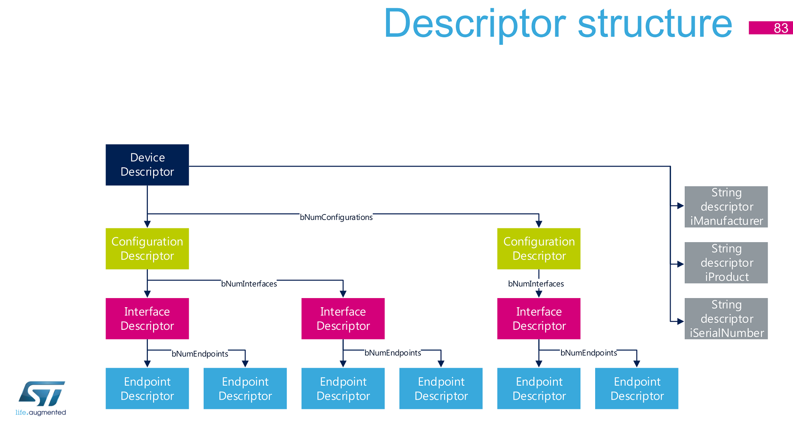
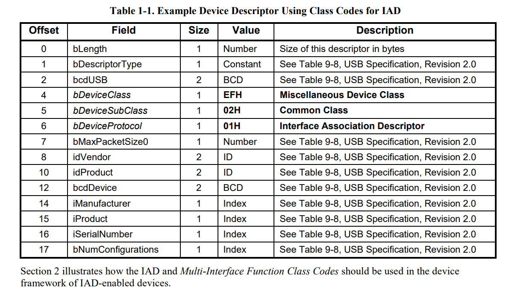
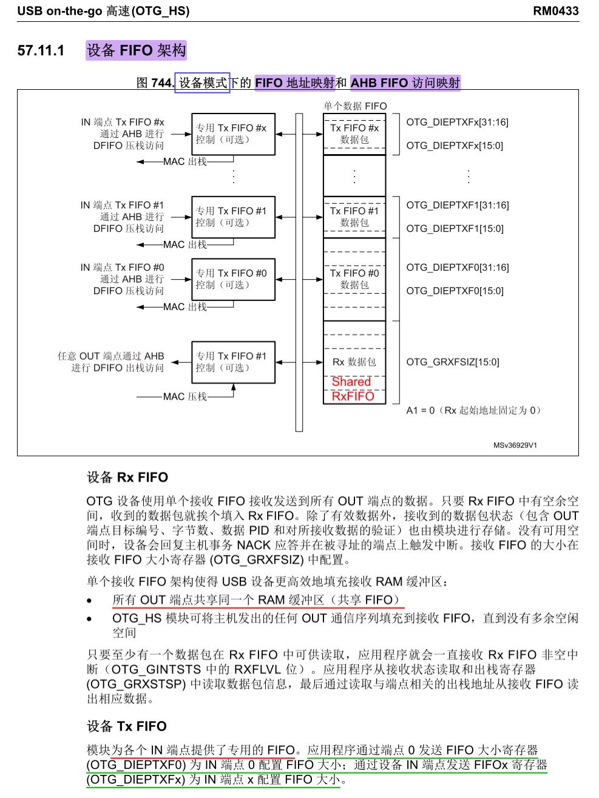
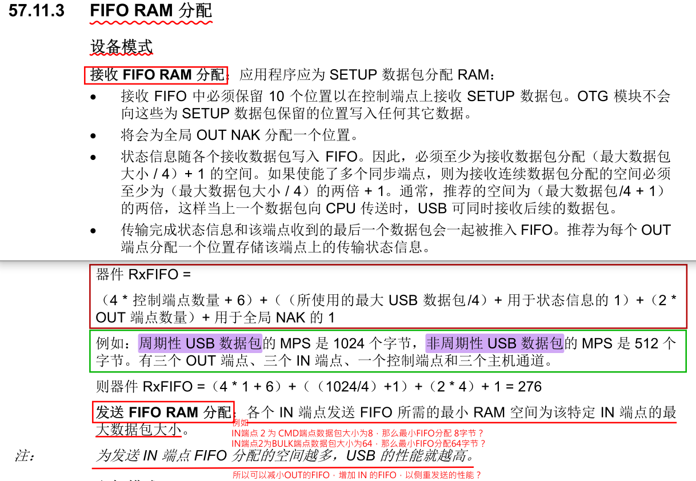
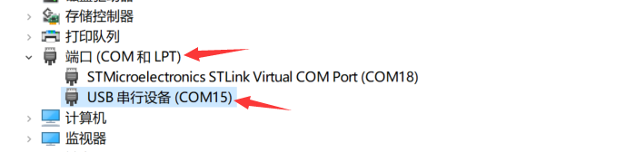
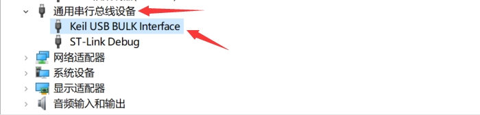
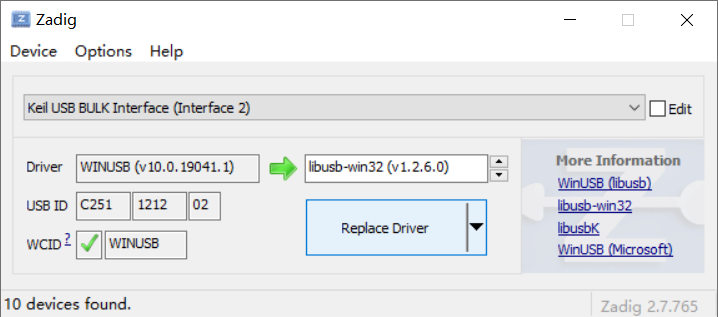
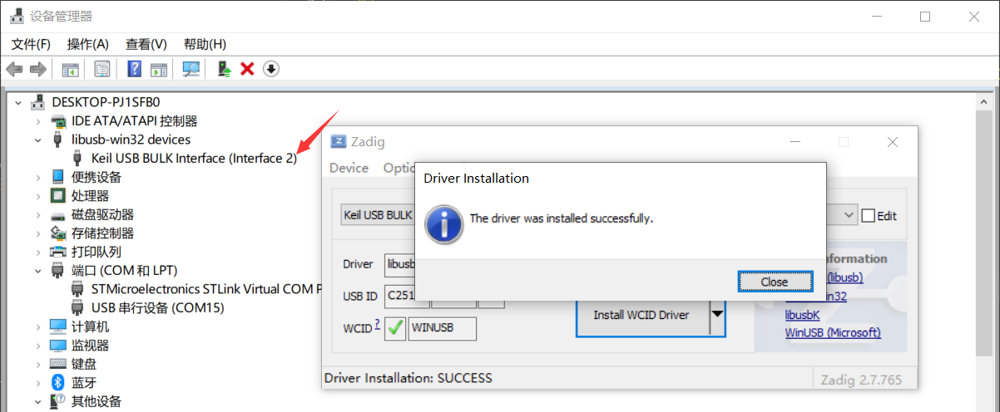

## H750VBT6_ST_USB_CDC_04

## 关于

在 H750VBT6_ST_USB_CDC_02 与 H750VBT6_ST_USB_CDC_03 工程的基础上修改为USB-FS Device模式的 CDC + VCP 与 CDC + libusb（BULK）的复合设备

## fibre 相关的修改

### protocol.hpp

 StreamSink 类 增加 内置类型声明 和 成员变量 channelType，这个后文介绍的 `ASCII_protocol_process_line()` 需要用到

```C++
class StreamSink
{
public:
    enum ChannelType_t
    {
        CHANNEL_TYPE_USB_CDC,
        CHANNEL_TYPE_USB_BULK,
    };
    ChannelType_t channelType;
...
}
```

### interface_usb.hpp

usb_rx_process_packet() 新增参数 endpoint_pair

```c
void usb_rx_process_packet(uint8_t *buf, uint32_t len, uint8_t endpoint_pair);
```

### interface_usb.cpp

class USBSender 新增端点参数

```C++

class USBSender : public PacketSink
{
public:
    USBSender(uint8_t endpoint_pair, const osSemaphoreId &sem_usb_tx);

    int process_packet(const uint8_t *buffer, size_t length) override
    {
...
        uint8_t status = CDC_Transmit_FS(const_cast<uint8_t *>(buffer), length, endpoint_pair_);
...
    }

private:
    uint8_t endpoint_pair_;
...
};
```

USESender 对象：新增

```c
USBSender usb_packet_output_cdc(CDC_OUT_EP, sem_usb_tx);
USBSender usb_packet_output_bulk(BULK_OUT_EP, sem_usb_tx);
```

新增 USBInterface 对象 Bulk_interface：

```c
static USBInterface BULK_interface = {
    .rx_buf = nullptr,
    .rx_len = 0,
    .data_pending = false,
    .out_ep = BULK_OUT_EP,
    .in_ep = BULK_IN_EP,
    .usb_sender = usb_packet_output_bulk,
};
```

class TreatPacketSinkAsStreamSink 构造函数修改：

```C++
class TreatPacketSinkAsStreamSink : public StreamSink
{
public:
    TreatPacketSinkAsStreamSink(PacketSink &output, StreamSink::ChannelType_t channel_type) 
    : output_(output), channelType(channel_type)
    {}
...
} usb_stream_output(usb_packet_output_cdc);
```

usb_stream_output 重命名为 usb_stream_cdc_output

TreatPacketSinkAsStreamSink 类的 usb_stream_output 对象 得单独初始化了：

```C++
TreatPacketSinkAsStreamSink usb_stream_cdc_output(usb_packet_output_cdc, StreamSink::CHANNEL_TYPE_USB_CDC);
```

新增 TreatPacketSinkAsStreamSink 类的 usb_stream_bulk_output 对象

```C++
TreatPacketSinkAsStreamSink usb_stream_bulk_output(usb_packet_output_cdc, StreamSink::CHANNEL_TYPE_USB_BULK);
```

usb_rx_process_packet，CDC_Receive_FS 自定义回调函数 ，新增参数 endpoint_pair ，内部也需要根据 endpoint 做处理

```c
// Called from CDC_Receive_FS callback function, this allows the communication
// thread to handle the incoming data
void usb_rx_process_packet(uint8_t *buf, uint32_t len, uint8_t endpoint_pair)
```

UsbServerTask() 新增  if (Bulk_interface.data_pending) {...}

```c++
static void UsbServerTask(void *ctx)
{
...
    // BULK Interface
    if (BULK_interface.data_pending)
    {
        BULK_interface.data_pending = false;

        ASCII_protocol_parse_stream(BULK_interface.rx_buf, BULK_interface.rx_len, usb_stream_bulk_output);
        USBD_CDC_ReceivePacket(&hUsbDeviceFS, BULK_interface.out_ep);  // Allow next packet
    }
...
}
```

### ascii_processor.hpp

新增

```c++
void OnCDCAsciiCmd(const char* _cmd, size_t _len, StreamSink& _responseChannel);
void OnBULKAsciiCmd(const char* _cmd, size_t _len, StreamSink& _responseChannel);
```

### ascii_processor.cpp

`ASCII_protocol_parse_stream()` 调用的 `ASCII_protocol_process_line()` ，需要根据`response_channel.channelType` 调用不同的 `OnXXXAsciiCmd()`

```C++
void ASCII_protocol_process_line(const uint8_t *buffer, size_t len, StreamSink &response_channel)
...
    if (response_channel.channelType == StreamSink::CHANNEL_TYPE_USB_CDC)
        OnCDCAsciiCmd(cmd, len, response_channel);	
    else if (response_channel.channelType == StreamSink::CHANNEL_TYPE_USB_BULK)
        OnBULKAsciiCmd(cmd, len, response_channel);
}
```

### ascii_protocol.cpp

OnCDCAsciiCmd() 拆分为 OnCDCAsciiCmd() 与 OnBULKAsciiCmd()，代码略

## ST USB 的修改

参考 [ODrive](https://github.com/odriverobotics/ODrive) 的USB复合设备代码修改，本工程 CDC+VCP 对应  CDC Interface，新增的  CDC BULK 对应 Native Interface

>复合设备修改流程简介：
>
>1. 修改端点数量、设备描述符、配置描述符
>2. 临时循环缓冲区需要增加一组 RX、TX 的
>3. 很多API需要加入一个 endpoint 参数，用于区分复合设备的端点，主要是 usbd_cdc_if.c 和 usbd_cdc.c 内的

### usbd_cdc.h

新增端点

```c
#ifndef BULK_IN_EP
#define BULK_IN_EP                                   0x83  /* EP3 IN: device TX endpoint */
#endif /* BULK_IN_EP */
#ifndef BULK_OUT_EP
#define BULK_OUT_EP                                  0x03  /* EP3 OUT: device RX endpoint */
#endif /* BULK_OUT_EP */
```

修改配置描述符大小：

```c
#define USB_CDC_CONFIG_DESC_SIZ                     (67U + 39U)
```

USBD_CDC_ItfTypeDef 成员 Receive 增加参数 epnum：

```c
typedef struct _USBD_CDC_Itf
{
...
  int8_t (* Receive)(uint8_t *Buf, uint32_t *Len, uint8_t epnum);
...
} USBD_CDC_ItfTypeDef;
```

新增 类型：

```c
typedef struct
{
    uint8_t* 		Buffer;
    uint32_t 		Length;
    __IO uint32_t 	State;
} USBD_CDC_EP_HandleTypeDef;
```

修改 USBD_CDC_HandleTypeDef：

```c
typedef struct
{
  uint32_t data[CDC_DATA_HS_MAX_PACKET_SIZE / 4U];      /* Force 32-bit alignment */
  uint8_t  CmdOpCode;
  uint8_t  CmdLength;

  USBD_CDC_EP_HandleTypeDef CDC_Tx;
  USBD_CDC_EP_HandleTypeDef CDC_Rx;

  USBD_CDC_EP_HandleTypeDef BULK_Tx;
  USBD_CDC_EP_HandleTypeDef BULK_Rx;
} USBD_CDC_HandleTypeDef;
```

USBD_CDC_SetTxBuffer()、USBD_CDC_SetRxBuffer()、USBD_CDC_ReceivePacket()、USBD_CDC_TransmitPacket() 新增参数 endpoint_pair：

```c
uint8_t USBD_CDC_SetTxBuffer(USBD_HandleTypeDef *pdev, uint8_t *pbuff,
                             uint32_t length, uint8_t endpoint_pair);

uint8_t USBD_CDC_SetRxBuffer(USBD_HandleTypeDef *pdev, uint8_t *pbuff, uint8_t endpoint_pair);
uint8_t USBD_CDC_ReceivePacket(USBD_HandleTypeDef *pdev, uint8_t endpoint_pair);
uint8_t USBD_CDC_TransmitPacket(USBD_HandleTypeDef *pdev, uint8_t endpoint_pair);
```

### usbd_cdc.c

`/* Includes ------------------------------------------------------------------*/`新增：

> ```c
> #include "usbd_desc.h"
> ```

`@defgroup USBD_CDC_Private_FunctionPrototypes` 新增：

> ```c
> static uint8_t USBD_WinUSBComm_SetupVendor(USBD_HandleTypeDef* pdev, USBD_SetupReqTypedef* req);
> ```

USBD_ClassTypeDef USBD_CDC 新增成员 USBD_UsrStrDescriptor ：

> ```c
> USBD_ClassTypeDef  USBD_CDC =
> {
> ...
>   USBD_UsrStrDescriptor,
> #endif /* USE_USBD_COMPOSITE  */
> };
> ```

配置描述符修改  ：USBD_CDC_CfgDesc[USB_CDC_CONFIG_DESC_SIZ]：

> USB描述符层次结构，参考：[STM32 USB training - 04 USB descriptors](https://www.youtube.com/watch?v=s-_f4QzgYW0&list=PLnMKNibPkDnFFRBVD206EfnnHhQZI4Hxa&index=4&t=563s)
>
> > 一个USB设备只有一个设备描述符、三个字符描述符（分别为制造商、产品、串口号）
> > 一设备描述符下可以有多个配置描述符
> > 一个配置描述符下可以有多个接口描述符
> > 一个接口描述符下可以有多个端点描述符
> >
> > 
>
> USBD_CDC_CfgDesc[USB_CDC_CONFIG_DESC_SIZ]：的结构，参考：[STMCU小助手：STM32 USB相关知识扫盲](https://shequ.stmicroelectronics.cn/thread-634273-1-1.html)
>
> > 只有1个VCP情况：
> >
> > ```c
> > 配置描述符
> > {
> >         接口描述符1（通信接口）
> >         {
> >                 其他描述符（特殊描述符）
> >                 {
> >                         /*Header Functional Descriptor*/
> >                         /*Call Management Functional Descriptor*/
> >                         /*ACM Functional Descriptor*/
> >                         /*Union Functional Descriptor*/
> >                 }
> >                 端点描述符(命令端点)
> >         }
> >         接口描述符2（数据接口）
> >         {
> >                 端点描述符1（输出端口）
> >                 端点描述符2（输入端口）
> >         }
> > }
> > ```
> >
> > ST USB VCP 默认生成的配置描述符结构：（`{}` 代表省略的代码）
> >
> > ```c
> > /* USB CDC device Configuration Descriptor */
> > __ALIGN_BEGIN static uint8_t USBD_CDC_CfgDesc[USB_CDC_CONFIG_DESC_SIZ] __ALIGN_END =
> > {
> >   /* Configuration Descriptor */
> >   /*---------------------------------------------------------------------------*/
> >   /* Interface Descriptor */
> >   /* Interface descriptor type */
> >   /* Header Functional Descriptor */
> >   /* Call Management Functional Descriptor */
> >   /* ACM Functional Descriptor */
> >   /* Union Functional Descriptor */
> >   /* Endpoint 2 Descriptor */
> >   /*---------------------------------------------------------------------------*/
> >   /* Data class interface descriptor */
> >   /* Endpoint OUT Descriptor */
> >   /* Endpoint IN Descriptor */
> > };
> > ```
> >
> > 看作：
> >
> > ```c
> > /* USB CDC device Configuration Descriptor */
> > __ALIGN_BEGIN static uint8_t USBD_CDC_CfgDesc[USB_CDC_CONFIG_DESC_SIZ] __ALIGN_END =
> > {
> >   /* 配置描述符 Configuration Descriptor */
> >   {
> > 	  /*---------------------------------------------------------------------------*/
> > 	  /* 接口描述符1（通信接口 Interface Descriptor、Interface descriptor type */
> > 	  {
> > 		  /* 其他描述符（特殊描述符）*/
> > 		  {
> > 			  /* Header Functional Descriptor */
> > 			  /* Call Management Functional Descriptor */
> > 			  /* ACM Functional Descriptor */
> > 			  /* Union Functional Descriptor */
> > 		  }
> > 		  /* 端点描述符(命令端点) Endpoint 2 Descriptor */
> > 	  }
> > 	  /*---------------------------------------------------------------------------*/
> > 	  /* 接口描述符2（数据接口） Data class interface descriptor */
> > 	  {
> > 		  /* 端点描述符1（输出端口）Endpoint OUT Descriptor */
> > 		  /* 点描述符2（输入端口）Endpoint IN Descriptor */
> > 	  }
> >   }
> > };
> > ```
> >
> > 新增 CDC BULK 组成复合设备后：
> >
> > ```c
> > 配置描述符
> > {
> >         接口关联描述符1
> >         {
> > 			接口描述符1（通信接口）
> > 			{
> > 					其他描述符（特殊描述符）
> > 					{
> > 							/*Header Functional Descriptor*/
> > 							/*Call Management Functional Descriptor*/
> > 							/*ACM Functional Descriptor*/
> > 							/*Union Functional Descriptor*/
> > 					}
> > 					端点描述符(命令端点)
> > 			}
> > 			接口描述符2（数据接口）
> > 			{
> > 					端点描述符1（输出端口）
> > 					端点描述符2（输入端口）
> > 			}
> >         }
> >         接口关联描述符2
> >         {
> > 			接口描述符3（数据接口）
> > 			{
> > 					端点描述符3（输出端口）
> > 					端点描述符4（输入端口）
> > 			}
> >         }
> > }
> > ```
> >
> > 
>
> bNumInterfaces：从 0x02 改为 0x03
>
> ```c
> 0x03,   									  /* bNumInterfaces: 3 interfaces (2 for CDC, 1 custom) */
> ```
>
> 新增USB复合 特有的 Interface Association Descriptor（IAD）(接口关联描述符)
>
> > 对应上上个代码块的 `接口关联描述符1`，此处作为 VCP 的 IAD
> >
> > ```c
> > /* Interface Association Descriptor: CDC device (virtual com port) */
> > 0x08,   /* bLength: IAD size */
> > 0x0B,   /* bDescriptorType: Interface Association Descriptor */
> > 0x00,   /* bFirstInterface */
> > 0x02,   /* bInterfaceCount */
> > 0x02,   /* bFunctionClass: Communication Interface Class */
> > 0x02,   /* bFunctionSubClass: Abstract Control Model */
> > 0x01,   /* bFunctionProtocol: Common AT commands */
> > 0x00,   /* iFunction */
> > ```
>
> USB复合设备用Interface Association Descriptor（IAD）实现，在要合并的接口描述符前加上IAD描述符即可，例如随便找的一个 [USBDescriptors.h](https://github.com/cmSAMIAMnot/SAML11freeRTOS/blob/e935be47caa3d2d79379c9d2099409729afc472c/Demo/CORTEX_A5_SAMA5D4x_EK_IAR/AtmelFiles/usb/include/USBDescriptors.h)，实现为结构：
>
> > ```c
> > /**
> >  * \typedef USBInterfaceAssociationDescriptor
> >  * \brief
> >  */
> > typedef struct _USBInterfaceAssociationDescriptor {
> > 
> >    unsigned char bLength;			//描述符大小
> >    unsigned char bDescriptorType;	//IAD描述符类型
> >    unsigned char bFirstInterface;	//起始接口
> >    unsigned char bInterfaceCount;	//接口数
> >    unsigned char bFunctionClass;	//类型代码
> >    unsigned char bFunctionSubClass;	//子类型代码
> >    unsigned char bFunctionProtocol;	//协议代码
> >    unsigned char iFunction;			//描述字符串索引
> > } __attribute__ ((__packed__)) USBInterfaceAssociationDescriptor; /* GCC*/
> > ```
>
> 增加 `接口关联描述符2` 及其块内的描述符：
>
> > ```c
> > 接口关联描述符2
> > {
> > 	接口描述符3（数据接口）
> > 	{
> > 		端点描述符3（输出端口）
> > 		端点描述符4（输入端口）
> > 	}
> > }
> > ```
> >
> > 实际代码：
> >
> > ```c
> >   ///////////////////////////////////////////////////////////////////////////////
> > 
> >   /* Interface Association Descriptor: custom device */
> >   0x08,   /* bLength: IAD size */
> >   0x0B,   /* bDescriptorType: Interface Association Descriptor */
> >   0x02,   /* bFirstInterface */
> >   0x01,   /* bInterfaceCount */
> >   0x00,   /* bFunctionClass: */
> >   0x00,   /* bFunctionSubClass: */
> >   0x00,   /* bFunctionProtocol: */
> >   0x06,   /* iFunction */
> > 
> >   /*---------------------------------------------------------------------------*/
> > 
> >   /*Data class interface descriptor*/
> >   0x09,   								/* bLength: Endpoint Descriptor size */
> >   USB_DESC_TYPE_INTERFACE,  			/* bDescriptorType: */
> >   0x02,   								/* bInterfaceNumber: Number of Interface */
> >   0x00,   								/* bAlternateSetting: Alternate setting */
> >   0x02,   								/* bNumEndpoints: Two endpoints used */
> >   0x00,   								/* bInterfaceClass: vendor specific */
> >   0x01,   								/* bInterfaceSubClass: REF Communication */
> >   0x00,   								/* bInterfaceProtocol: */
> >   0x00,   								/* iInterface: */
> > 
> >   /*Endpoint OUT Descriptor*/
> >   0x07,   								/* bLength: Endpoint Descriptor size */
> >   USB_DESC_TYPE_ENDPOINT,     			/* bDescriptorType: Endpoint */
> >   BULK_OUT_EP,                        	/* bEndpointAddress */
> >   0x02,                              	/* bmAttributes: Bulk */
> >   LOBYTE(CDC_DATA_FS_MAX_PACKET_SIZE),  /* wMaxPacketSize: */
> >   HIBYTE(CDC_DATA_FS_MAX_PACKET_SIZE),
> >   0x00,                              	/* bInterval: ignore for Bulk transfer */
> > 
> >   /*Endpoint IN Descriptor*/
> >   0x07,   								/* bLength: Endpoint Descriptor size */
> >   USB_DESC_TYPE_ENDPOINT,      			/* bDescriptorType: Endpoint */
> >   BULK_IN_EP,                         	/* bEndpointAddress */
> >   0x02,                              	/* bmAttributes: Bulk */
> >   LOBYTE(CDC_DATA_FS_MAX_PACKET_SIZE),  /* wMaxPacketSize: */
> >   HIBYTE(CDC_DATA_FS_MAX_PACKET_SIZE),
> >   0x00,                              	/* bInterval: ignore for Bulk transfer */
> > ```
> >
> > 

USBD_CDC_Init()

>  加入新增端点的一些配置
>
>  ```c
>  static uint8_t USBD_CDC_Init(USBD_HandleTypeDef *pdev, uint8_t cfgidx)
>  {
>  ...
>  /* Open BULK IN endpoint */
>  USBD_LL_OpenEP(pdev,
>              BULK_IN_EP,
>              USBD_EP_TYPE_BULK,
>              pdev->dev_speed == USBD_SPEED_HIGH ? CDC_DATA_HS_IN_PACKET_SIZE : CDC_DATA_FS_IN_PACKET_SIZE);
>  
>  pdev->ep_in[BULK_IN_EP & 0xFU].is_used = 1U;
>  
>  /* Open BULK OUT endpoint */
>  USBD_LL_OpenEP(pdev,
>              BULK_OUT_EP,
>              USBD_EP_TYPE_BULK,
>              pdev->dev_speed == USBD_SPEED_HIGH ? CDC_DATA_HS_OUT_PACKET_SIZE : CDC_DATA_FS_OUT_PACKET_SIZE);
>  
>  pdev->ep_out[BULK_OUT_EP & 0xFU].is_used = 1U;
>  
>    hcdc->CDC_Rx.Buffer = NULL;
>    hcdc->BULK_Rx.Buffer = NULL;
>      
>  /* Init Xfer states */
>  hcdc->CDC_Tx.State = 0;
>  hcdc->CDC_Rx.State = 0;
>  hcdc->BULK_Tx.State = 0;
>  hcdc->BULK_Rx.State = 0;
>  
>    if (!(hcdc->CDC_Rx.Buffer != NULL && hcdc->BULK_Rx.Buffer != NULL))
>    {
>      return (uint8_t)USBD_EMEM;
>    }
>  
>    if (pdev->dev_speed == USBD_SPEED_HIGH)
>    {
>      /* Prepare Out endpoint to receive next packet */
>      (void)USBD_LL_PrepareReceive(pdev, CDCOutEpAdd, hcdc->CDC_Rx.Buffer,
>                                   CDC_DATA_HS_OUT_PACKET_SIZE);
>      (void)USBD_LL_PrepareReceive(pdev, BULK_OUT_EP, hcdc->BULK_Rx.Buffer,
>                                   CDC_DATA_HS_OUT_PACKET_SIZE);
>    }
>    else
>    {
>      /* Prepare Out endpoint to receive next packet */
>      (void)USBD_LL_PrepareReceive(pdev, CDCOutEpAdd, hcdc->CDC_Rx.Buffer,
>                                   CDC_DATA_FS_OUT_PACKET_SIZE);
>      (void)USBD_LL_PrepareReceive(pdev, BULK_OUT_EP, hcdc->BULK_Rx.Buffer,
>                                   CDC_DATA_FS_OUT_PACKET_SIZE);
>    }
>  }
>  ```
>

USBD_CDC_DeInit()

> 加入新增端点的一些配置
>
> ```c
> static uint8_t USBD_CDC_DeInit(USBD_HandleTypeDef *pdev, uint8_t cfgidx)
> {
> ...
>   /* Close EP IN */
>   (void)USBD_LL_CloseEP(pdev, BULK_IN_EP);
>   pdev->ep_in[BULK_IN_EP & 0xFU].is_used = 0U;
> 
>   /* Close EP OUT */
>   (void)USBD_LL_CloseEP(pdev, BULK_OUT_EP);
>   pdev->ep_out[BULK_OUT_EP & 0xFU].is_used = 0U;
> ...
> }
> ```

USBD_CDC_Setup()

>  case USB_REQ_TYPE_STANDARD 后面增加：
>
> ```c
>         case USB_REQ_TYPE_VENDOR:
>             return USBD_WinUSBComm_SetupVendor(pdev, req);
> ```

USBD_CDC_DataIn()

> 新增端点判断
>
> ```c
> static uint8_t USBD_CDC_DataIn(USBD_HandleTypeDef *pdev, uint8_t epnum)
> {
> ...
> else
> {
> 	// NOTE: We would logically expect xx_IN_EP here, but we actually get the xx_OUT_EP
> 	if (epnum == CDC_OUT_EP) 
> 	{
> 		hcdc->CDC_Tx.State = 0;
> 	} else if (epnum == BULK_OUT_EP) 
> 	{
> 		hcdc->BULK_Tx.State = 0;
> 	} else
> 	{
> 		return (uint8_t)USBD_FAIL;
> 	}
> 	//Note: We could use independent semaphores for simoultainous USB transmission.
>  osSemaphoreRelease(sem_usb_tx);
>     if (((USBD_CDC_ItfTypeDef *)pdev->pUserData[pdev->classId])->TransmitCplt != NULL)
>     {
>     	if (epnum == CDC_OUT_EP)
>     	{
>     		((USBD_CDC_ItfTypeDef *)pdev->pUserData[pdev->classId])->TransmitCplt(hcdc->CDC_Tx.Buffer, &hcdc->CDC_Tx.Length, epnum);
>     	} else if (epnum == BULK_OUT_EP)
>     	{
>     		((USBD_CDC_ItfTypeDef *)pdev->pUserData[pdev->classId])->TransmitCplt(hcdc->BULK_Tx.Buffer, &hcdc->BULK_Tx.Length, epnum);
>     	} else
>     	{
>     		return (uint8_t)USBD_FAIL;
>     	}
>     }
> }
> ...
> }
> ```

USBD_CDC_DataOut()

> 新增端点判断
>
> ```c
> static uint8_t USBD_CDC_DataOut(USBD_HandleTypeDef *pdev, uint8_t epnum)
> {
> ...
>   /* Get the received data length */
>   USBD_CDC_EP_HandleTypeDef* hEP_Rx;
>   if (epnum == CDC_OUT_EP)
>   {
>       hEP_Rx = &hcdc->CDC_Rx;
>   } else if (epnum == BULK_OUT_EP)
>   {
>       hEP_Rx = &hcdc->BULK_Rx;
>   } else
>   {
>       return USBD_FAIL;
>   }
>   hEP_Rx->Length = USBD_LL_GetRxDataSize(pdev, epnum);
> ...
>   ((USBD_CDC_ItfTypeDef *)pdev->pUserData[pdev->classId])->Receive(hEP_Rx->Buffer, &hEP_Rx->Length, epnum);
> ...
> }
> ```

USBD_CDC_GetFSCfgDesc()

> 新增端点 数据包大小 约束
>
> ```c
> static uint8_t *USBD_CDC_GetFSCfgDesc(uint16_t *length)
> {
> ...
>   pEpOutDesc = USBD_GetEpDesc(USBD_CDC_CfgDesc, BULK_OUT_EP);
>   pEpInDesc = USBD_GetEpDesc(USBD_CDC_CfgDesc, BULK_IN_EP);
>   if (pEpOutDesc != NULL)
>   {
>     pEpOutDesc->wMaxPacketSize = CDC_DATA_FS_MAX_PACKET_SIZE;
>   }
> 
>   if (pEpInDesc != NULL)
>   {
>     pEpInDesc->wMaxPacketSize = CDC_DATA_FS_MAX_PACKET_SIZE;
>   }
> ...
> }
> ```

USBD_CDC_GetHSCfgDesc()

> 新增端点 数据包大小 约束
>
> ```c
> static uint8_t *USBD_CDC_GetHSCfgDesc(uint16_t *length)
> {
> ...
>   pEpOutDesc = USBD_GetEpDesc(USBD_CDC_CfgDesc, BULK_OUT_EP);
>   pEpInDesc = USBD_GetEpDesc(USBD_CDC_CfgDesc, BULK_IN_EP);
>   if (pEpOutDesc != NULL)
>   {
>     pEpOutDesc->wMaxPacketSize = CDC_DATA_HS_MAX_PACKET_SIZE;
>   }
> 
>   if (pEpInDesc != NULL)
>   {
>     pEpInDesc->wMaxPacketSize = CDC_DATA_HS_MAX_PACKET_SIZE;
>   }
> ...
> }
> ```

USBD_CDC_GetOtherSpeedCfgDesc()

> 新增 数据包大小 约束
>
> ```c
> static uint8_t *USBD_CDC_GetOtherSpeedCfgDesc(uint16_t *length)
> {
> ...
>   pEpOutDesc = USBD_GetEpDesc(USBD_CDC_CfgDesc, BULK_OUT_EP);
>   pEpInDesc = USBD_GetEpDesc(USBD_CDC_CfgDesc, BULK_IN_EP);
>   if (pEpOutDesc != NULL)
>   {
>     pEpOutDesc->wMaxPacketSize = CDC_DATA_FS_MAX_PACKET_SIZE;
>   }
> 
>   if (pEpInDesc != NULL)
>   {
>     pEpInDesc->wMaxPacketSize = CDC_DATA_FS_MAX_PACKET_SIZE;
>   }
> ...
> }
> ```

USBD_CDC_SetTxBuffer() 

> 新增参数 endpoint_pair、端点判断
>
> ```c
> uint8_t USBD_CDC_SetTxBuffer(USBD_HandleTypeDef *pdev,
>                              uint8_t *pbuff, uint32_t length, uint8_t endpoint_pair)
> {
> ...
>   USBD_CDC_EP_HandleTypeDef* hEP_Tx;
>   if (endpoint_pair == CDC_OUT_EP)
>   {
>       hEP_Tx = &hcdc->CDC_Tx;
>   } else if (endpoint_pair == BULK_OUT_EP)
>   {
>       hEP_Tx = &hcdc->BULK_Tx;
>   } else
>   {
>       return USBD_FAIL;
>   }
> 
>   hEP_Tx->Buffer = pbuff;
>   hEP_Tx->Length = length;
> ...
> }
> ```

USBD_CDC_SetRxBuffer()

> 新增参数 endpoint_pair、端点判断
>
> ```c
> uint8_t USBD_CDC_SetRxBuffer(USBD_HandleTypeDef *pdev, uint8_t *pbuff, uint8_t endpoint_pair)
> {
> ...
>   USBD_CDC_EP_HandleTypeDef* hEP_Rx;
>   if (endpoint_pair == CDC_OUT_EP)
>   {
>       hEP_Rx = &hcdc->CDC_Rx;
>   } else if (endpoint_pair == REF_OUT_EP)
>   {
>       hEP_Rx = &hcdc->REF_Rx;
>   } else
>   {
>       return USBD_FAIL;
>   }
> 
>   hEP_Rx->Buffer = pbuff;
> ...
> }
> ```

USBD_CDC_TransmitPacket()

> 新增参数 endpoint_pair、端点判断
>
> ```c
> uint8_t USBD_CDC_TransmitPacket(USBD_HandleTypeDef *pdev, uint8_t endpoint_pair)
> {
> ...
>   // Select Endpoint
> 	USBD_CDC_EP_HandleTypeDef* hEP_Tx;
> 	uint8_t in_ep;
> 	if (endpoint_pair == CDC_OUT_EP)
> 	{
> 	  hEP_Tx = &hcdc->CDC_Tx;
> 	  in_ep = CDC_IN_EP;
> 	} else if (endpoint_pair == BULK_OUT_EP)
> 	{
> 	  hEP_Tx = &hcdc->BULK_Tx;
> 	  in_ep = BULK_IN_EP;
> 	} else
> 	{
> 	  return USBD_FAIL;
> 	}
> 
>   if (hEP_Tx->State == 0U)
>   {
>     /* Tx Transfer in progress */
> 	  hEP_Tx->State = 1U;
> 
>     /* Update the packet total length */
>     pdev->ep_in[in_ep & 0xFU].total_length = hEP_Tx->Length;
> 
>     /* Transmit next packet */
>     (void)USBD_LL_Transmit(pdev, in_ep, hEP_Tx->Buffer, hEP_Tx->Length);
> 
>     ret = USBD_OK;	//ret 初始化值 就是 USBD_BUSY
>   }
> 
>   return (uint8_t)ret;
> }
> ```

USBD_CDC_ReceivePacket()

> 新增参数 endpoint_pair、端点判断
>
> ```c
> uint8_t USBD_CDC_ReceivePacket(USBD_HandleTypeDef *pdev, uint8_t endpoint_pair)
> {
> ...
>   // Select Endpoint
>   USBD_CDC_EP_HandleTypeDef* hEP_Rx;
>   uint8_t out_ep;
>   if (endpoint_pair == CDC_OUT_EP)
>   {
>       hEP_Rx = &hcdc->CDC_Rx;
>       out_ep = CDC_OUT_EP;
>   } else if (endpoint_pair == BULK_OUT_EP)
>   {
>       hEP_Rx = &hcdc->BULK_Rx;
>       out_ep = BULK_OUT_EP;
>   } else
>   {
>       return USBD_FAIL;
>   }
>   
>   if (pdev->dev_speed == USBD_SPEED_HIGH)
>   {
>     /* Prepare Out endpoint to receive next packet */
>     (void)USBD_LL_PrepareReceive(pdev, out_ep, hEP_Rx->Buffer,
>                                  CDC_DATA_HS_OUT_PACKET_SIZE);
>   }
>   else
>   {
>     /* Prepare Out endpoint to receive next packet */
>     (void)USBD_LL_PrepareReceive(pdev, out_ep, hEP_Rx->Buffer,
>                                  CDC_DATA_FS_OUT_PACKET_SIZE);
>   }
> 
>   return (uint8_t)USBD_OK;
> }
> ```

新增 `/* WinUSB support ------------------------------------------------------------*/`段内代码，太长略，本id不了解winUSB的东西，在本文后面Zadig覆盖驱动的小节，可以看出作用是让windows为其复合设设备的CDC BULK 装载winUSB驱动

> USBD_WinUSBComm_Extended_Properties_OS_Desc[] 最后的
>
> ```C
>         // ========================================
>         //                                  4
>         'B', 0, 'U', 0, 'L', 0, 'K', 0, 0, 0, 0, 0, 0, 0
>         // 26 bPropertyData “BULK”
>         // ========================================
>         //                                  14
> ```


### usbd_desc.h

`/* USER CODE BEGIN EXPORTED_FUNCTIONS */`

> ```c
> uint8_t * USBD_UsrStrDescriptor(struct _USBD_HandleTypeDef *pdev, uint8_t index,  uint16_t *length);
> ```

### usbd_desc.c

@defgroup USBD_DESC_Private_Defines

> ### 修改为：
>
> ```c
> #define USBD_VID     0xC251
> #define USBD_LANGID_STRING     1033
> #define USBD_MANUFACTURER_STRING     "Keil Software"
> #define USBD_PID_FS     0x1212	/* 为了与之前的工程区分，修改PID */
> 
> #define USBD_PRODUCT_XSTR(s) USBD_PRODUCT_STR(s)
> #define USBD_PRODUCT_STR(s) #s
> 
> #define USBD_PRODUCT_STRING_FS     	Keil USB CDC Interface
> #define NATIVE_STRING 				Keil USB BULK Interface
> 
> #define USBD_CONFIGURATION_STRING_FS     "CDC Config"
> #define USBD_INTERFACE_STRING_FS     "CDC Interface"
> ```
>
> ### 修改步骤：
>
> 增加 转字符串替换宏函数
>
> ```c
> #define USBD_PRODUCT_XSTR(s) USBD_PRODUCT_STR(s)
> #define USBD_PRODUCT_STR(s) #s
> ```
>
> 示例用法：处理 Product String 和 Native String 
>
> ```c
> uint8_t * USBD_FS_ProductStrDescriptor(USBD_SpeedTypeDef speed, uint16_t *length)
> {
>     ...
> 	USBD_GetString((uint8_t *) USBD_PRODUCT_XSTR(USBD_PRODUCT_STRING_FS), USBD_StrDesc, length);
>     //						 ^~~~~~~~~~~~~~~~~ ^~~~~~~~~~~~~~~~~~~~~~
>     ...
> }
> 
> uint8_t *USBD_UsrStrDescriptor(struct _USBD_HandleTypeDef *pdev, uint8_t index, uint16_t *length)
> {
> ...
> 	USBD_GetString((uint8_t *) USBD_PRODUCT_XSTR(NATIVE_STRING), USBD_StrDesc, length);
>     //					      ^~~~~~~~~~~~~~~~~ ^~~~~~~~~~~~~
> ....
> }
> 
> ```
>
> 未增加此宏时的情况：
>
> ```c
> USBD_GetString((uint8_t *)USBD_PRODUCT_STRING_FS, USBD_StrDesc, length);
> //					    ^~~~~~~~~~~~~~~~~~~~~~
> ```
>
> 修改 CDC Interface 的字符串，修改前：
>
> ```c
> #define USBD_PRODUCT_STRING_FS     "STM32 Virtual ComPort"
> ```
>
> 修改后：
>
> ```c
> #define USBD_PRODUCT_STRING_FS     	Keil USB CDC Interface
> ```
>
> 增加  Native Interface 的字符：
>
> ```c
> #define NATIVE_STRING 				Keil USB Native Interface
> ```
>
> 

`/* USER CODE BEGIN 0 */` 加入

> 不知道这个 MS OS 字符串描述符 是干啥的，但ODrive加了
>
> MS OS String descriptor 应该是 *Microsoft OS Descriptors* (MODs)，找不到啥资料，先放在这里
>
> > [USB 设备的 Microsoft 操作系统描述符](https://learn.microsoft.com/en-us/windows-hardware/drivers/usbcon/microsoft-defined-usb-descriptors)
> >
> > [Microsoft OS 2.0 描述符规范](https://learn.microsoft.com/en-us/windows-hardware/drivers/usbcon/microsoft-os-2-0-descriptors-specification)
>
> ```c
> // MS OS 字符串描述符告诉 Windows 它可以查询其他描述符
> // 这是一个标准的字符串描述符。
> // Windows 只会查询操作系统描述符一次！
> // 通过删除删除注册表中有关已查询设备的信息：
> // HKEY_LOCAL_MACHINE\SYSTEM\CurrentControlSet\Control\usbflags\VVVVPPPPRRRR
> __ALIGN_BEGIN uint8_t USBD_MS_OS_StringDescriptor[]  __ALIGN_END =
>  {
>      0x12,           //  bLength           1 0x12  Length of the descriptor
>      0x03,           //  bDescriptorType   1 0x03  Descriptor type
>      //  qwSignature      14 ‘MSFT100’ Signature field
>      0x4D, 0x00,     //  'M'
>      0x53, 0x00,     //  'S'
>      0x46, 0x00,     //  'F'
>      0x54, 0x00,     //  'T'
>      0x31, 0x00,     //  '1'
>      0x30, 0x00,     //  '0'
>      0x30, 0x00,     //  '0'
>      MS_VendorCode,  //  bMS_VendorCode    1 Vendor-specific Vendor code
>      0x00            //  bPad              1 0x00  Pad field
>  };
> 
> // redefined further down
> __ALIGN_BEGIN uint8_t USBD_StrDesc[USBD_MAX_STR_DESC_SIZ] __ALIGN_END;
> 
> /**
> * @brief  UsrStrDescriptor
> *         return non standard string descriptor
> * @param  pdev: device instance
> * @param  index : descriptor index (0xEE for MS OS String Descriptor)
> * @param  length : pointer data length
> * @retval pointer to descriptor buffer
> */
> uint8_t *USBD_UsrStrDescriptor(struct _USBD_HandleTypeDef *pdev, uint8_t index, uint16_t *length)
> {
>     *length = 0;
>     if (USBD_IDX_MICROSOFT_DESC_STR == index)
>     {
>         *length = sizeof(USBD_MS_OS_StringDescriptor);
>         return USBD_MS_OS_StringDescriptor;
>     } else if (USBD_IDX_REF_INTF_STR == index)
>     {
>         USBD_GetString((uint8_t *) USBD_PRODUCT_XSTR(NATIVE_STRING), USBD_StrDesc, length);
>         return USBD_StrDesc;
>     }
>     return NULL;
> }
> 
> ```
>
> 

设备描述符修改，USBD_FS_DeviceDesc[USB_LEN_DEV_DESC]，因为配置描述符使用了 IAD，所以设备描述符的这三个元素也要修改：

> ```c
> 0xEF,                       /*bDeviceClass*/
> 0x02,                       /*bDeviceSubClass*/
> 0x01,                       /*bDeviceProtocol*/
> ```
>
> 设备描述符现在看起来是这样：
>
> ```c
> /** USB standard device descriptor. */
> __ALIGN_BEGIN uint8_t USBD_FS_DeviceDesc[USB_LEN_DEV_DESC] __ALIGN_END =
> {
>   0x12,                       /*bLength */
>   USB_DESC_TYPE_DEVICE,       /*bDescriptorType*/
>   0x00,                       /*bcdUSB */
>   0x02,
>   0xEF,                       /*bDeviceClass*/
>   0x02,                       /*bDeviceSubClass*/
>   0x01,                       /*bDeviceProtocol*/
>   USB_MAX_EP0_SIZE,           /*bMaxPacketSize*/
>   LOBYTE(USBD_VID),           /*idVendor*/
>   HIBYTE(USBD_VID),           /*idVendor*/
>   LOBYTE(USBD_PID_FS),        /*idProduct*/
>   HIBYTE(USBD_PID_FS),        /*idProduct*/
>   0x00,                       /*bcdDevice rel. 2.00*/
>   0x02,
>   USBD_IDX_MFC_STR,           /*Index of manufacturer  string*/
>   USBD_IDX_PRODUCT_STR,       /*Index of product string*/
>   USBD_IDX_SERIAL_STR,        /*Index of serial number string*/
>   USBD_MAX_NUM_CONFIGURATION  /*bNumConfigurations*/
> };
> ```
>
> 对应下表格黑色粗体部分：[USB Interface Association Descriptor Device Class Code and Use Model.PDF](https://www.usb.org/sites/default/files/iadclasscode_r10.pdf)
>
> 
>
> 注意 数组某些 Field 的 Size 为 2 ：bcdUSB、idVendor、idProduct、bcdDevice

USBD_FS_ProductStrDescriptor() 加入 USBD_PRODUCT_XSTR 宏函数

> ```c
> uint8_t * USBD_FS_ProductStrDescriptor(USBD_SpeedTypeDef speed, uint16_t *length)
> {
>   if(speed == 0)
>   {
>     USBD_GetString((uint8_t *)USBD_PRODUCT_XSTR(USBD_PRODUCT_STRING_FS), USBD_StrDesc, length);
>   }
>   else
>   {
>     USBD_GetString((uint8_t *)USBD_PRODUCT_XSTR(USBD_PRODUCT_STRING_FS), USBD_StrDesc, length);
>   }
>   return USBD_StrDesc;
> }
> ```

### usbd_cdc_if.h

增加一组临时循环缓冲区大小宏常量，

```c
#define BULK_RX_DATA_SIZE  2048
#define BULK_TX_DATA_SIZE  2048
```

缓冲区大小，将默认 CDC 的改为 64，新增 BULK 的改为 2048

```c
#define APP_RX_DATA_SIZE  64
#define APP_TX_DATA_SIZE  64
```

CDC_Transmit_FS() 新增参数 endpoint_pair

```c
uint8_t CDC_Transmit_FS(uint8_t* Buf, uint16_t Len, uint8_t endpoint_pair);
```

### usbd_cdc_if.c

增加一组临时循环缓冲区， 用于复合设备的第二个设备

```c
uint8_t BULKRxBufferFS[BULK_RX_DATA_SIZE];
uint8_t BULKTxBufferFS[BULK_TX_DATA_SIZE];
```

CDC_Receive_FS() 新增参数 endpoint_pair

```c
static int8_t CDC_Receive_FS(uint8_t* pbuf, uint32_t *Len, uint8_t endpoint_pair);
```

CDC_Init_FS() 改为根据端点设置 临时循环缓冲区Buffer

```c
  USBD_CDC_SetTxBuffer(&hUsbDeviceFS, UserTxBufferFS, 0, CDC_OUT_EP);
  USBD_CDC_SetRxBuffer(&hUsbDeviceFS, UserRxBufferFS, CDC_OUT_EP);
  USBD_CDC_SetTxBuffer(&hUsbDeviceFS, BULKTxBufferFS, 0, BULK_OUT_EP);
  USBD_CDC_SetRxBuffer(&hUsbDeviceFS, BULKRxBufRferFS, BULK_OUT_EP);
```

CDC_Receive_FS() 和内部调用的 usb_rx_process_packet() 新增参数 endpoint_pair 

```c
static int8_t CDC_Receive_FS(uint8_t* Buf, uint32_t *Len, uint8_t endpoint_pair)
{
...
  usb_rx_process_packet(Buf, *Len, endpoint_pair);
...
}
```

CDC_Transmit_FS() 新增参数 endpoint_pair ，内部也需要根据 endpoint 做处理

```c
uint8_t CDC_Transmit_FS(uint8_t* Buf, uint16_t Len, uint8_t endpoint_pair)
{
  uint8_t result = USBD_OK;
  /* USER CODE BEGIN 7 */
  /* Code automatically generated by CubeMX */
  USBD_CDC_HandleTypeDef *hcdc = (USBD_CDC_HandleTypeDef*)hUsbDeviceFS.pClassData;

  // Select EP
  USBD_CDC_EP_HandleTypeDef* hEP_Tx;
  uint8_t* TxBuff;
  uint16_t TxBuffLength;
  if (endpoint_pair == CDC_OUT_EP) {
      hEP_Tx = &hcdc->CDC_Tx;
      TxBuff = UserTxBufferFS;
      TxBuffLength = APP_TX_DATA_SIZE;
  } else if (endpoint_pair == BULK_OUT_EP) {
      hEP_Tx = &hcdc->BULK_Tx;
      TxBuff = BULKTxBufferFS;
      TxBuffLength = BULK_TX_DATA_SIZE;
  } else {
      return USBD_FAIL;
  }

  // Check for ongoing transmission
  if (hEP_Tx->State != 0){
    return USBD_BUSY;
  }
  //Check length
  if (Len > TxBuffLength)
      return USBD_FAIL;

  // memcpy Buf into UserTxBufferFS
  memcpy(TxBuff, Buf, Len);

  USBD_CDC_SetTxBuffer(&hUsbDeviceFS, TxBuff, Len, endpoint_pair);
  result = USBD_CDC_TransmitPacket(&hUsbDeviceFS, endpoint_pair);
  /* USER CODE END 7 */
  return result;
}
```

### usbd_conf.h

`@defgroup USBD_CONF_Exported_Defines` 新增

```
#define MS_VendorCode 'P'
```


### usbd_conf.c

USBD_LL_Init() 增加1个 2048字节的 TX fifo 初始化：

> ```c
>   /* USER CODE BEGIN TxRx_Configuration */
>   HAL_PCDEx_SetRxFiFo(&hpcd_USB_OTG_FS, 0x80);		//  0x80 = 128, 128*4 = 512byte,  ALL OUT EP Buffer
>   HAL_PCDEx_SetTxFiFo(&hpcd_USB_OTG_FS, 0, 0x40);	//  0x80 = 128, 128*4 = 256byte,  EP0 IN
>   HAL_PCDEx_SetTxFiFo(&hpcd_USB_OTG_FS, 1, 0x80);	//  0x80 = 128, 128*4 = 512byte,  CDC IN endpoint
>   HAL_PCDEx_SetTxFiFo(&hpcd_USB_OTG_FS, 3, 0x200); 	// 0x200 = 512, 512*4 = 2048byte, BULK IN endpoint
> ```
>
> H750VBT6 CubeMX 的 USB-FS 在硬件上其实是 没有ULPI接口的USB-HS，有 4KB 专用 FIFO
>
> | CubeMX 的 USB_OTG_HS                                         |
> | ------------------------------------------------------------ |
> | .png) |
> | CubeMX 的 USB_OTG_FS                                         |
> | .png) |
>
> 本示例参考的 ODrive v3 使用主控是 F405RGT6，其 USB-FS 只有 1.25KB FIFO，USB-HS才有 4KB FIFO
>
> 因此这里配置可以 与ODrive 不一样
>
> H750VBTx CubeMX USB-FS Device模式 VCP 默认初始化的 FIFO 配置如下：
>
> ```c
>   /* USER CODE BEGIN TxRx_Configuration */
>   HAL_PCDEx_SetRxFiFo(&hpcd_USB_OTG_FS, 0x80);
>   HAL_PCDEx_SetTxFiFo(&hpcd_USB_OTG_FS, 0, 0x40);
>   HAL_PCDEx_SetTxFiFo(&hpcd_USB_OTG_FS, 1, 0x80);
> ```
>
> 由设备FIFO架构的描述，可知 RX FIFO 由所有 OUT端点共享：
>
> 
>
> 参考：[USB HAL_PCDEx_SetRxFiFo()、HAL_PCDEx_SetTxFiFo() FIFO分配注意问题](https://blog.csdn.net/sandyde123/article/details/120218765)
>
> HAL_PCDEx_SetRxFiFo() 、 HAL_PCDEx_SetTxFiFo() 最后的参数的单位为4字节，且分配的总内存大小不能超过 4KB
>
> 那么默认情况合计就是 1.25KB？
>
> ```c
>   /* USER CODE BEGIN TxRx_Configuration */
>   HAL_PCDEx_SetRxFiFo(&hpcd_USB_OTG_FS, 0x80);		// 0x80 = 128, 128*4 = 512byte
>   HAL_PCDEx_SetTxFiFo(&hpcd_USB_OTG_FS, 0, 0x40);	// 0x80 = 128, 128*4 = 256byte
>   HAL_PCDEx_SetTxFiFo(&hpcd_USB_OTG_FS, 1, 0x80);	// 0x80 = 128, 128*4 = 512byte
> ```
>
> 感觉这里是CubeMX的BUG，H750明明是 4KB 可用，却仅用了 1.25KB，例如RL-USB里的 OTG-FS就是以4KB FIFO分配的：
>
> > [STM32H7 USB的4KB专用FIFO的分配问题](https://www.armbbs.cn/forum.php?mod=viewthread&tid=103438&highlight=STM32H7%2BUSB%B5%C44KB%D7%A8%D3%C3FIFO%B5%C4%B7%D6%C5%E4%CE%CA%CC%E2)
> >
> > ```c
> > #define USBD_FS_MAX_ENDPOINT_NUM   (8U)
> > 
> > // FIFO sizes in bytes (total available memory for FIFOs is 4 kB
> > #define OTG_FS_RX_FIFO_SIZE        (1024U)
> > 
> > #define OTG_FS_TX0_FIFO_SIZE       (64U)
> > #define OTG_FS_TX1_FIFO_SIZE       (1024U)
> > #define OTG_FS_TX2_FIFO_SIZE       (512U)
> > #define OTG_FS_TX3_FIFO_SIZE       (256U)
> > #define OTG_FS_TX4_FIFO_SIZE       (256U)
> > #define OTG_FS_TX5_FIFO_SIZE       (256U)
> > #define OTG_FS_TX6_FIFO_SIZE       (256U)
> > #define OTG_FS_TX7_FIFO_SIZE       (256U)
> > #define OTG_FS_TX8_FIFO_SIZE       (192U)
> > //合计：						   4096U
> > ```
>
> 那么进行 USB_OTG_FS 4KB FIFO 测试：
>
> > 将 H750VBT6_ST_USB_CDC_03 的 usbd_conf.c 的FIFO临时改为 合计4KB：
> >
> > ```c
> >   HAL_PCDEx_SetRxFiFo(&hpcd_USB_OTG_FS, 0x200);		// 0x200 = 512, 512*4 = 2048byte
> >   HAL_PCDEx_SetTxFiFo(&hpcd_USB_OTG_FS, 0, 0x100);	// 0x100 = 256, 256*4 = 1024byte
> >   HAL_PCDEx_SetTxFiFo(&hpcd_USB_OTG_FS, 1, 0x100);	// 0x100 = 256, 256*4 = 1024byte
> > ```
> >
> > 测试：正常
> >
> > 4KB_FIFO(OUT：2048、IN：1024+1024)测试.png)
> >
> > 因为分配的 RxFiFo 是 2048 byte 大于 1.25KB，而使用TxFiFo的数据还可以正常发回，所以可确定 H750VBTx 的USB_OTG_HS2，即CubeMX中的USB_OTG_FS，用有4KB FIFO
>
> 备注：RM0433 57.11.3 FIFO RAM 分配
>
> > 
> >
> > 器件RxFIFO有个严谨的公式，暂时不太了解，先放在这里

HAL_PCD_SetupStageCallback()

```c
暂时不加
```


### usbd_def.h

```c
#define USBD_SUPPORT_USER_STRING_DESC                   1U
```

```c
#define  USBD_IDX_LANGID_STR                            0x00 
#define  USBD_IDX_MFC_STR                               0x01 
#define  USBD_IDX_PRODUCT_STR                           0x02
#define  USBD_IDX_SERIAL_STR                            0x03 
#define  USBD_IDX_CONFIG_STR                            0x04 
#define  USBD_IDX_INTERFACE_STR                         0x05
#define  USBD_IDX_REF_INTF_STR                       0x06
#define  USBD_IDX_MICROSOFT_DESC_STR                    0xEE
```

## 测试

### 设备管理器

正常枚举复合设备

|  |  |
| ---------------------------------------------- | ------------------------------------------------ |

### Zadig覆盖驱动

usbd_cdc.c 内 `/* WinUSB support */`的一大堆代码作用是让windows为其复合设设备的CDC BULK 装载winUSB驱动：



但是 QT上位机使用 libusb 似乎用不了，所以得覆盖为 libusb：




