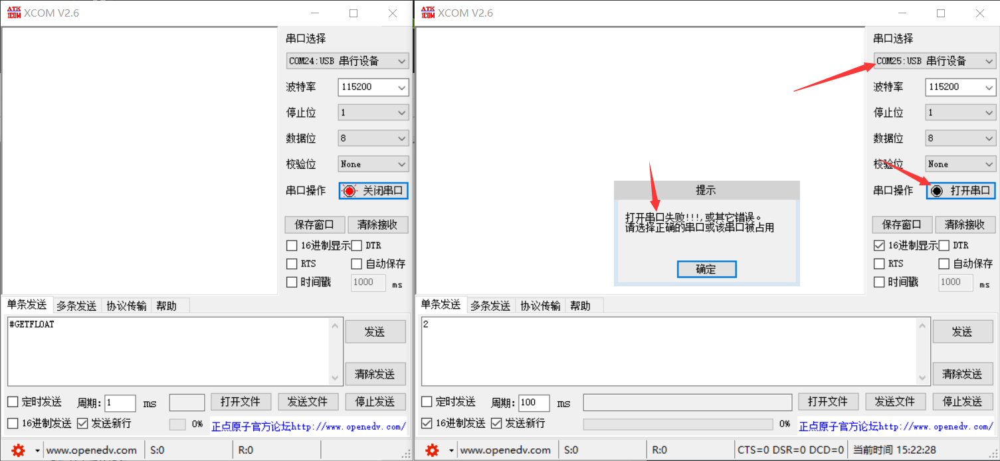
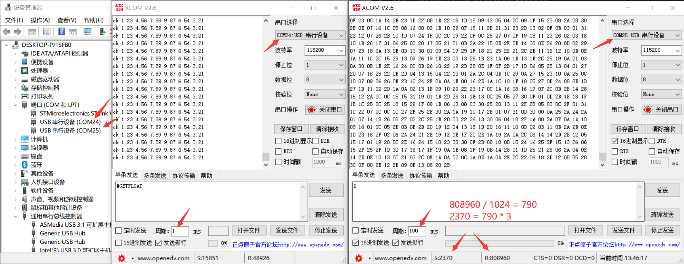
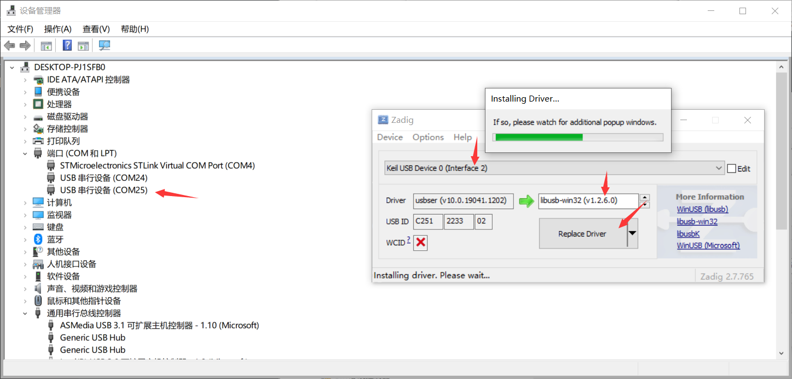
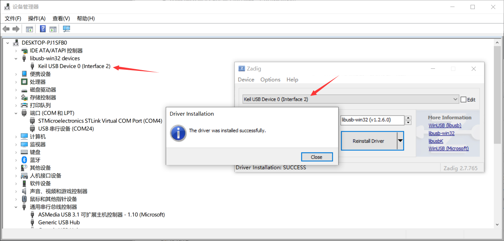
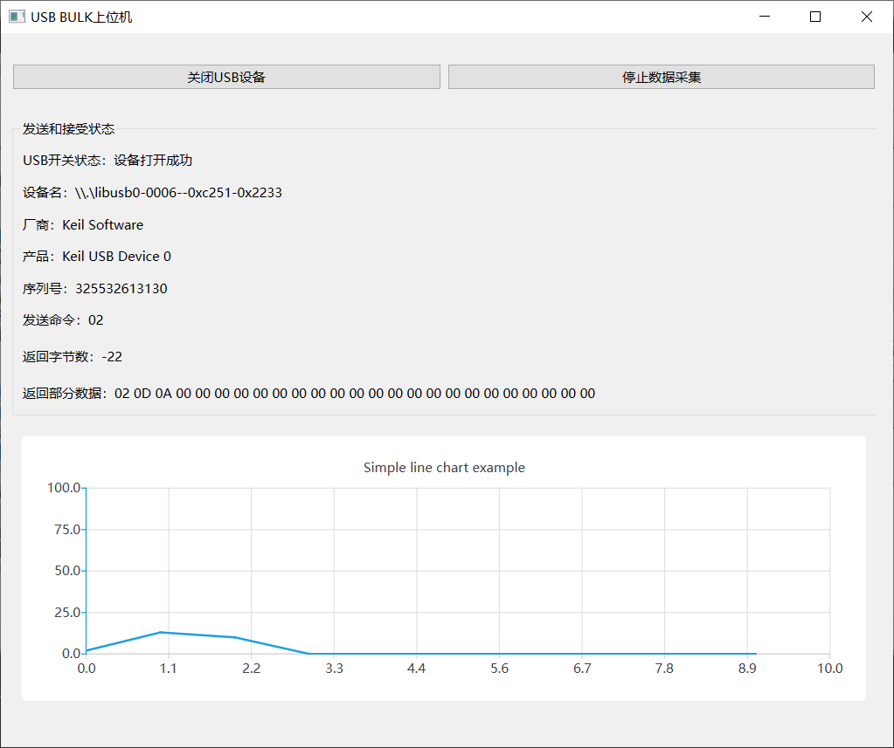
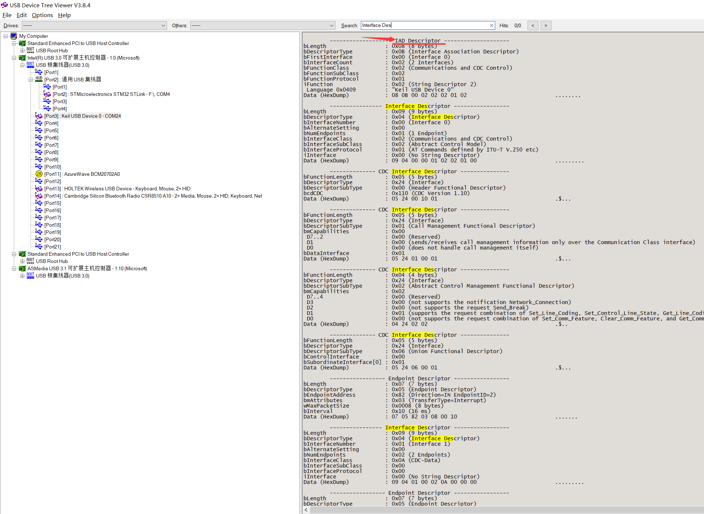
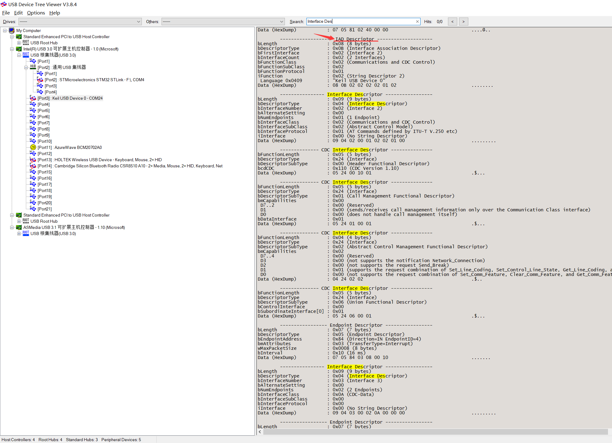
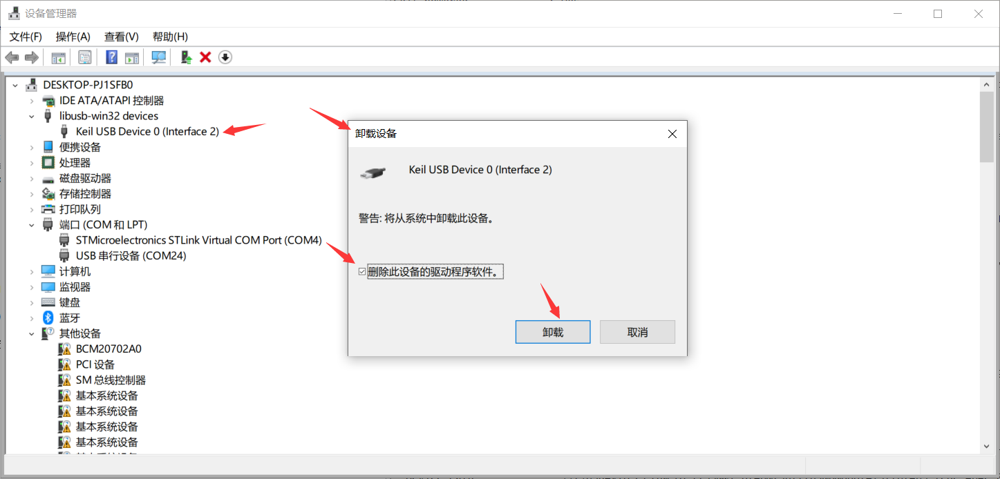
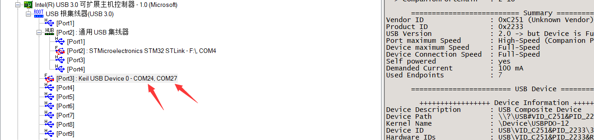

## H750VBT6_ST_USB_CDC_05

## 介绍

在 H750VBT6_ST_USB_CDC_02 的基础上修改，改为 2个虚拟串口 的 USB 复合设备 

02工程大部分都是CubeMX自动生成的单个虚拟串口的代码，`usbd_cdc.c`中的改动只有`USBD_CDC_DataIn()`加了一句释放信号量

## 参考

[STM32 USB CDC 虚拟多串口_ST中文论坛](https://shequ.stmicroelectronics.cn/thread-613510-1-1.html)

> 参考此文修改设备描述符和配置描述符

[【经验分享】STM32 USB相关知识扫盲_ST中文论坛](https://shequ.stmicroelectronics.cn/thread-634273-1-1.html)

> 描述符结构

[STM32 USB如何配置多个CDC设备---5个CDC设备](https://zhuanlan.zhihu.com/p/345252630)

> 此文特殊之处：
>
> - 平台不是win平台，描述符要求和win不同
> - 使用联合描述符代替WIN平台下硬性要求的IAD，并注释掉了一些描述符，以缩短5个CDC描述符的长度，控制在255个字节内（USB2.0最大配置描述符长度）
> - CMD端点使用无效端点号，不对CMD端点初始化，节省了端点
>
> 此文对比 ODrive 的修改方式：
>
> - 优点：比 ODrive 的修改量小很多很多，结构体仅需修改一个 USBD_CDC_ItfTypeDef，函数无需加入 if--else 判断端点
>
> - 缺点：2个VCP共用一组临时循环缓冲区，而Odrive修改为两组临时循环缓冲区提供给两个VCP分别使用
>
> H750VBT6_ST_USB_CDC_05 参考了此文对ST-USB库发送和接收的一部分函数，增加端点参数，而其他的修改部分不同

[STM32 USB进阶培训：02- USB复合设备概念及CDC_MSC深入介绍.PDF](https://www.stmcu.com.cn/Designresource/design_resource_detail?file_name=STM32+USB%E8%BF%9B%E9%98%B6%E5%9F%B9%E8%AE%AD%EF%BC%9A02-+USB%E5%A4%8D%E5%90%88%E8%AE%BE%E5%A4%87%E6%A6%82%E5%BF%B5%E5%8F%8ACDC_MSC%E6%B7%B1%E5%85%A5%E4%BB%8B%E7%BB%8D&lang=EN&ver=1)

> 介绍USB复合设备的基本概念，使用USB CDC+MSC来介绍如何实现USB复合设备的过程

[MOOC - STM32 USB training：STM32 USB training - 08 STM32 USB Device library](https://www.youtube.com/watch?v=I1HfAkz-brc&list=PLnMKNibPkDnFFRBVD206EfnnHhQZI4Hxa&index=8&t=134s) 课件资料的 PPT

> 此PPT讲述ST-USB的驱动分层，其中层之间API的调用关系非常受用

## ST-USB改动

### usbd_cdc.c

配置描述符数组：`USBD_CDC_CfgDesc[USB_CDC_CONFIG_DESC_SIZ]`

> /* bNumInterfaces */ 从 0x02 改为 0x04，因为 2个 VCP使用 4个接口（一个VCP使用中断传输+BULK传输，2组VCP共4个接口）
>
> ```c
> 0x04, 									  /* bNumInterfaces: 2个VCP使用4个接口 */
> ```
>
> 在第一个VCP的接口描述符1前加入IAD：
>
> ```c
> ///////////////////////////////////////////////////////////////////////////////
> 
> /* IAD (Interface Association Descriptor): CDC device (virtual com port) */
> 0x08,   /* bLength: 			描述符大小，固定 IAD size */
> 0x0B,   /* bDescriptorType: 	IAD描述符类型，固定 Interface Association Descriptor */
> 0x00,   /* bFirstInterface 	起始接口编号 */
> 0x02,   /* bInterfaceCount 	本IAD下设备类的接口数量 */
> 0x02,   /* bFunctionClass: 	类型代码，本个IAD指示的是什么类型的设备，例如CDC是0X02，MSC是0X08 */
> 0x02,   /* bFunctionSubClass: 子类型代码 	Abstract Control Model */
> 0x01,   /* bFunctionProtocol: 协议代码 	Common AT commands */
> 0x02,   /* iFunction 			描述字符串索引 */
> ```
>
> 在配置描述符末尾 `}` 前加入第二个VCP的描述符，过程如下：
>
> > 复制第一组VCP的描述符（从`/* IAD ...*/`到`/* Endpoint IN Descriptor */`）到此
> >
> > 修改IAD：
> >
> > > `/* bFirstInterface */` 从 0x00 改为 0x02，因为第一个VCP使用了0x00、0x01 Interface，所以第二个VCP从0x02开始，作为第二个VCP的 bFirstInterface
> > >
> > > ```c
> > >  ///////////////////////////////////////////////////////////////////////////////
> > > 
> > >   /* Interface Association Descriptor: custom device */
> > >   0x08,   /* bLength: 			描述符大小，固定 IAD size */
> > >   0x0B,   /* bDescriptorType: 	IAD描述符类型，固定 Interface Association Descriptor */
> > >   0x02,   /* bFirstInterface 	起始接口编号 */
> > >   0x02,   /* bInterfaceCount 	本个IAD下设备类的接口数量 */
> > >   0x02,   /* bFunctionClass: 	类型代码，本个IAD指示的是什么类型的设备，例如CDC是0X02，MSC是0X08 */
> > >   0x02,   /* bFunctionSubClass: 子类型代码 	*/
> > >   0x01,   /* bFunctionProtocol: 协议代码 	*/
> > >   0x02,   /* iFunction 			描述字符串索引 */
> > > ```
> >
> > 修改2个接口描述符的 bInterfaceNumber
> >
> > > 中断传输的接口编号从 0x00 改为 0x02，因为第一个VCP中断和数据占用了 0x00、0x01，所以第二个VCP的第一个接口从0x02开始
> > >
> > > ```c
> > > /* Interface descriptor type */
> > >  ...
> > >   0x02, // 第几号端口                         /* bInterfaceNumber: Number of Interface */
> > >   ...
> > > ```
> > >
> > > 数据类接口描述符的接口编号从 0x01 改为 0x03，因为第二个VCP的第一个接口从0x02开始，数据传输是第二个接口，所以是0x03：
> > >
> > > ```c
> > >   /* Data class interface descriptor */
> > > ...
> > >   0x03,    // 第几号端口                      /* bInterfaceNumber: Number of Interface */
> > > ...
> > > ```
> >
> > 修改端点描述符的端点
> >
> > > ```c
> > >  /* Endpoint 2 Descriptor */
> > >  ...
> > >   CDC_CMD_EP1,                                 /* bEndpointAddress */
> > >   ...
> > > /* Endpoint OUT Descriptor */
> > > ...
> > >   BULK_OUT_EP,                                 /* bEndpointAddress */
> > > ...
> > > /* Endpoint IN Descriptor */
> > > ...
> > >   BULK_IN_EP,                                  /* bEndpointAddress */
> > > ...
> > > ```

函数定义：`USBD_CDC_Init()`

> 增加第二组VCP的三个端点的初始化
>
> ```c
> static uint8_t USBD_CDC_Init(USBD_HandleTypeDef *pdev, uint8_t cfgidx)
> {
> ...
>   /* Open Command IN EP */
>   (void)USBD_LL_OpenEP(pdev, CDC_CMD_EP1, USBD_EP_TYPE_INTR, CDC_CMD_PACKET_SIZE);
>   pdev->ep_in[CDC_CMD_EP1 & 0xFU].is_used = 1U;
> 
>   /* Open BULK IN endpoint */
>   USBD_LL_OpenEP(pdev,
>                  BULK_IN_EP,
>                  USBD_EP_TYPE_BULK,
>                  pdev->dev_speed == USBD_SPEED_HIGH ? CDC_DATA_HS_IN_PACKET_SIZE : CDC_DATA_FS_IN_PACKET_SIZE);
> 
>   pdev->ep_in[BULK_IN_EP & 0xFU].is_used = 1U;
> 
>   /* Open BULK OUT endpoint */
>   USBD_LL_OpenEP(pdev,
>                  BULK_OUT_EP,
>                  USBD_EP_TYPE_BULK,
>                  pdev->dev_speed == USBD_SPEED_HIGH ? CDC_DATA_HS_OUT_PACKET_SIZE : CDC_DATA_FS_OUT_PACKET_SIZE);
> 
>   pdev->ep_out[BULK_OUT_EP & 0xFU].is_used = 1U;
>     
> ...
>     (void)USBD_LL_PrepareReceive(pdev, BULK_OUT_EP, hcdc->RxBuffer,
>                            	     CDC_DATA_FS_OUT_PACKET_SIZE);
> ...
>     (void) USBD_LL_PrepareReceive(pdev, BULK_OUT_EP, hcdc->RxBuffer,
>                            	     CDC_DATA_FS_OUT_PACKET_SIZE);
> }
> ```

函数定义：`USBD_CDC_DeInit()`

> 增加第二组VCP的三个端点的关闭：
>
> ```c
>   /* Close EP IN */
>   (void)USBD_LL_CloseEP(pdev, BULK_IN_EP);
>   pdev->ep_in[BULK_IN_EP & 0xFU].is_used = 0U;
> 
>   /* Close EP OUT */
>   (void)USBD_LL_CloseEP(pdev, BULK_OUT_EP);
>   pdev->ep_out[BULK_OUT_EP & 0xFU].is_used = 0U;
> 
>   /* Close Command IN EP */
>   (void)USBD_LL_CloseEP(pdev, CDC_CMD_EP1);
>   pdev->ep_in[CDC_CMD_EP1 & 0xFU].is_used = 0U;
>   pdev->ep_in[CDC_CMD_EP1 & 0xFU].bInterval = 0U;
> ```

函数定义：`USBD_CDC_DataOut()`

> 调用`USBD_CDC_ItfTypeDef`成员`Receive`函数指针的参数，增加 epnum
>
> ```c
> static uint8_t USBD_CDC_DataOut(USBD_HandleTypeDef *pdev, uint8_t epnum)
> {
> ...
> ((USBD_CDC_ItfTypeDef *)pdev->pUserData[pdev->classId])->Receive(hcdc->RxBuffer, &hcdc->RxLength, epnum);
> //																								  ^~~~~
> ...
> }
> ```

函数定义：`USBD_CDC_TransmitPacket()`

> 函数参数增加 epnum， CDCInEpAdd 更改为传入的 epnum 
>
> ```c
> uint8_t USBD_CDC_TransmitPacket(USBD_HandleTypeDef *pdev, uint8_t epnum) 
> //                                                               ^~~~~
> {
> ...
> 	/* Update the packet total length */
>     pdev->ep_in[epnum & 0xFU].total_length = hcdc->TxLength;
> //				^~~~~    
> 
>     /* Transmit next packet */
>     (void)USBD_LL_Transmit(pdev, epnum, hcdc->TxBuffer, hcdc->TxLength);
> //								 ^~~~~
> ...
> }
> ```

函数定义：`USBD_CDC_ReceivePacket()`

> 函数参数增加 epnum， CDCInEpAdd 更改为传入的 epnum 
>
> ```c
> uint8_t USBD_CDC_ReceivePacket(USBD_HandleTypeDef *pdev, uint8_t epnum)
> {
> ...
>     /* Prepare Out endpoint to receive next packet */
>     (void)USBD_LL_PrepareReceive(pdev, epnum, hcdc->RxBuffer,
>                                  CDC_DATA_HS_OUT_PACKET_SIZE);
> ...
>     /* Prepare Out endpoint to receive next packet */
>     (void)USBD_LL_PrepareReceive(pdev, epnum, hcdc->RxBuffer,
>                                  CDC_DATA_FS_OUT_PACKET_SIZE);
> ...
> }
> ```

### usbd_cdc.h

增加3个端点用于第二个VCP：

```c
#ifndef BULK_IN_EP
#define BULK_IN_EP                                   0x83U  /* EP3 IN: device TX endpoint */
#endif /* BULK_IN_EP */
#ifndef BULK_OUT_EP
#define BULK_OUT_EP                                  0x03U  /* EP3 OUT: device RX endpoint */
#endif /* BULK_OUT_EP */
#ifndef CDC_CMD_EP1
#define CDC_CMD_EP1                                  0x84U  /* EP4 for CDC commands */
#endif
```

配置描述符大小：因为增加了第二个VCP，且每组VCP又增加了IAD，所以描述符总长度增加了

```c
#define USB_CDC_CONFIG_DESC_SIZ                     (9U+66U*2)
```

结构体声明：`USBD_CDC_ItfTypeDef`

> 成员`Receive`函数指针的参数，增加 epnum
>
> ```c
> typedef struct _USBD_CDC_Itf
> {
> ...
>   int8_t (* Receive)(uint8_t *Buf, uint32_t *Len, uint8_t epnum);
> ...
> } USBD_CDC_ItfTypeDef;
> ```

函数声明：`USBD_CDC_ReceivePacket()`、`USBD_CDC_TransmitPacket()` 增加 epnum 参数

```c
uint8_t USBD_CDC_ReceivePacket(USBD_HandleTypeDef *pdev, uint8_t epnum);
uint8_t USBD_CDC_TransmitPacket(USBD_HandleTypeDef *pdev, uint8_t epnum);
```

### usbd_desc.c

PID修改：随便改一个，目的是避免装载其他工程在电脑上打上的libusb-win32驱动

```c
#define USBD_PID_FS     0x2233
```

设备描述符数组：USBD_FS_DeviceDesc[USB_LEN_DEV_DESC]

> 因为配置描述符使用了 IAD，所以设备描述符的这三个元素也要修改，表示复合设备
>
> ```c
> 0xEF,                       /*bDeviceClass*/
> 0x02,                       /*bDeviceSubClass*/
> 0x01,                       /*bDeviceProtocol*/
> ```

### usbd_cdc_if.c

函数声明：`CDC_Receive_FS()`增加参数 epnum

```c
static int8_t CDC_Receive_FS(uint8_t* pbuf, uint32_t *Len, uint8_t epnum);
```

函数定义：`CDC_Receive_FS()` 及其调用的 `usb_rx_process_packet()` 增加参数 epnum

```c
static int8_t CDC_Receive_FS(uint8_t* Buf, uint32_t *Len, uint8_t epnum)
{
...
  usb_rx_process_packet(Buf, *Len, epnum);
...
}
```

函数定义：`CDC_Transmit_FS()` 及其调用的 `USBD_CDC_TransmitPacket()` 增加参数 epnum

```c
uint8_t CDC_Transmit_FS(uint8_t* Buf, uint16_t Len, uint8_t epnum)
{
...
  result = USBD_CDC_TransmitPacket(&hUsbDeviceFS, epnum);
...
}
```

### usbd_cdc_if.h

函数声明：`CDC_Transmit_FS()`增加参数 epnum

```c
uint8_t CDC_Transmit_FS(uint8_t* Buf, uint16_t Len, uint8_t epnum);
```

### usbd_conf.c

函数定义：`USBD_LL_Init()` 增加1个 2048字节的 TX fifo 初始化：

```c
/* USER CODE BEGIN TxRx_Configuration */
HAL_PCDEx_SetRxFiFo(&hpcd_USB_OTG_FS, 0x80);		//  0x80 = 128, 128*4 = 512byte,  ALL OUT EP Buffer
HAL_PCDEx_SetTxFiFo(&hpcd_USB_OTG_FS, 0, 0x80);	//  0x80 = 128, 128*4 = 256byte,  EP0 IN
HAL_PCDEx_SetTxFiFo(&hpcd_USB_OTG_FS, 1, 0x80);	//  0x80 = 128, 128*4 = 512byte,  CDC IN endpoint
HAL_PCDEx_SetTxFiFo(&hpcd_USB_OTG_FS, 3, 0x200); 	// 0x200 = 512, 512*4 = 2048byte, BULK IN endpoint
```

### usbd_conf.h

修改最大接口数：`USBD_MAX_NUM_INTERFACES` 从 1U 增加到 2U，此修改很重要！！！很多复合设备教程没有提及！！！

> ```c
> #define USBD_MAX_NUM_INTERFACES     2U
> ```
>
> 实测，复合设备下，若为 1U，则XCOM无法打开第二个VCP，改为2U后才能打开！！！
>
> 

## fibre 相关的修改

### protocol.hpp

 StreamSink 类 增加 内置类型声明 和 成员变量 channelType，这个后文介绍的 `ASCII_protocol_process_line()` 需要用到

```C++
class StreamSink
{
public:
    enum ChannelType_t
    {
        CHANNEL_TYPE_USB_CDC,
        CHANNEL_TYPE_USB_BULK,
    };
    ChannelType_t channelType;
...
}
```

### interface_usb.hpp

usb_rx_process_packet() 新增参数 endpoint_pair

```c
void usb_rx_process_packet(uint8_t *buf, uint32_t len, uint8_t endpoint_pair);
```

### interface_usb.cpp

class USBSender 新增端点参数

```C++
class USBSender : public PacketSink
{
public:
    USBSender(uint8_t endpoint_pair, const osSemaphoreId &sem_usb_tx);

    int process_packet(const uint8_t *buffer, size_t length) override
    {
...
        uint8_t status = CDC_Transmit_FS(const_cast<uint8_t *>(buffer), length, endpoint_pair_);
...
    }

private:
    uint8_t endpoint_pair_;
...
};
```

USESender 对象：新增

```c
USBSender usb_packet_output_cdc(CDC_OUT_EP, sem_usb_tx);
USBSender usb_packet_output_bulk(BULK_OUT_EP, sem_usb_tx);
```

新增 USBInterface 对象 Bulk_interface：

```c
static USBInterface BULK_interface = {
    .rx_buf = nullptr,
    .rx_len = 0,
    .data_pending = false,
    .out_ep = BULK_OUT_EP,
    .in_ep = BULK_IN_EP,
    .usb_sender = usb_packet_output_bulk,
};
```

class TreatPacketSinkAsStreamSink 构造函数修改：

```C++
class TreatPacketSinkAsStreamSink : public StreamSink
{
public:
    TreatPacketSinkAsStreamSink(PacketSink &output, StreamSink::ChannelType_t channel_type) 
    : output_(output), channelType(channel_type)
    {}
...
} usb_stream_output(usb_packet_output_cdc);
```

usb_stream_output 重命名为 usb_stream_cdc_output

TreatPacketSinkAsStreamSink 类的 usb_stream_output 对象 得单独初始化了：

```C++
TreatPacketSinkAsStreamSink usb_stream_cdc_output(usb_packet_output_cdc, StreamSink::CHANNEL_TYPE_USB_CDC);
```

新增 TreatPacketSinkAsStreamSink 类的 usb_stream_bulk_output 对象

```C++
TreatPacketSinkAsStreamSink usb_stream_bulk_output(usb_packet_output_bulk, StreamSink::CHANNEL_TYPE_USB_BULK);
```

usb_rx_process_packet，CDC_Receive_FS 自定义回调函数 ，新增参数 endpoint_pair ，内部也需要根据 endpoint 做处理

```c
// Called from CDC_Receive_FS callback function, this allows the communication
// thread to handle the incoming data
void usb_rx_process_packet(uint8_t *buf, uint32_t len, uint8_t endpoint_pair)
```

UsbServerTask() 新增  if (Bulk_interface.data_pending) {...}

```c++
static void UsbServerTask(void *ctx)
{
...
    // BULK Interface
    if (BULK_interface.data_pending)
    {
        BULK_interface.data_pending = false;

        ASCII_protocol_parse_stream(BULK_interface.rx_buf, BULK_interface.rx_len, usb_stream_bulk_output);
        USBD_CDC_ReceivePacket(&hUsbDeviceFS, BULK_interface.out_ep);  // Allow next packet
    }
...
}
```

### ascii_processor.hpp

新增

```c++
void OnCDCAsciiCmd(const char* _cmd, size_t _len, StreamSink& _responseChannel);
void OnBULKAsciiCmd(const char* _cmd, size_t _len, StreamSink& _responseChannel);
```

### ascii_processor.cpp

`ASCII_protocol_parse_stream()` 调用的 `ASCII_protocol_process_line()` ，需要根据`response_channel.channelType` 调用不同的 `OnXXXAsciiCmd()`

```C++
void ASCII_protocol_process_line(const uint8_t *buffer, size_t len, StreamSink &response_channel)
...
    if (response_channel.channelType == StreamSink::CHANNEL_TYPE_USB_CDC)
        OnCDCAsciiCmd(cmd, len, response_channel);	
    else if (response_channel.channelType == StreamSink::CHANNEL_TYPE_USB_BULK)
        OnBULKAsciiCmd(cmd, len, response_channel);
}
```

### ascii_protocol.cpp

`OnCDCAsciiCmd()` 拆分为 `OnCDCAsciiCmd()` 与 `OnBULKAsciiCmd()`，代码略

## 测试

不使用Zadig，win10识别出2个COM，1号COM每1ms解析自定义ASCII命令，2号COM每100ms以16进制发送2，返回1024个随机数，小测一下无丢包



使用Zadig覆盖VCP驱动，对复合设备的端口2（即VCP2）覆盖为libusb驱动





打开QT上位机：发送命令无响应，无数据发回



使用 [USB 设备树查看器 V3.8.4](https://www.uwe-sieber.de/usbtreeview_e.html) 查看，IAD啥的都是OK的





卸载libusb-win32驱动



识别到两个COM



结论：libusb-win32 对复合设备的VCP驱动覆盖失败，暂未找到可用参考的资料，开摆！