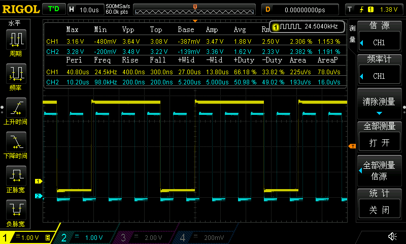

## Demo_偏好占空比步幅精度

### 1

```
TIM12:
期望pwm占空比： 66.599998%
期望pwm频率： 30000Hz
定时器pwm偏好(0：侧重占空比，1：侧重频率)：0
实际pwm占空比： 66.589355%
实际pwm占空比步幅： 0.012207%
实际pwm频率： 24414Hz
实际pwm频率步幅： 0.000000Hz

TIM3:
期望pwm占空比： 50.000000%
期望pwm频率： 70000Hz
定时器pwm偏好(0：侧重占空比，1：侧重频率)：0
实际pwm占空比： 50.000000%
实际pwm占空比步幅： 0.048828%
实际pwm频率： 97656Hz
实际pwm频率步幅： 0.000000Hz
```



### 2

```
TIM12:
期望pwm占空比： 66.599998%
期望pwm频率： 3000000Hz
定时器pwm偏好(0：侧重占空比，1：侧重频率)：0
实际pwm占空比： 65.625000%
实际pwm占空比步幅： 1.562500%
实际pwm频率： 3125000Hz
实际pwm频率步幅： 0.000000Hz

TIM3:
期望pwm占空比： 50.000000%
期望pwm频率： 7000000Hz
定时器pwm偏好(0：侧重占空比，1：侧重频率)：0
实际pwm占空比： 50.000000%
实际pwm占空比步幅： 3.125000%
实际pwm频率： 6250000Hz
实际pwm频率步幅： 0.000000Hz
```


### 3

示波器带宽不够，测25MHz方波不全，测不出100MHz方波

```
TIM12:
期望pwm占空比： 66.599998%
期望pwm频率： 30000000Hz
定时器pwm偏好(0：侧重占空比，1：侧重频率)：0
实际pwm占空比： 62.500000%
实际pwm占空比步幅： 12.500000%
实际pwm频率： 25000000Hz
实际pwm频率步幅： 0.000000Hz

TIM3:
期望pwm占空比： 50.000000%
期望pwm频率： 70000000Hz
定时器pwm偏好(0：侧重占空比，1：侧重频率)：0
实际pwm占空比： 50.000000%
实际pwm占空比步幅： 50.000000%
实际pwm频率： 100000000Hz
实际pwm频率步幅： 0.000000Hz
```


## Demo_偏好频率步幅精度

待实现