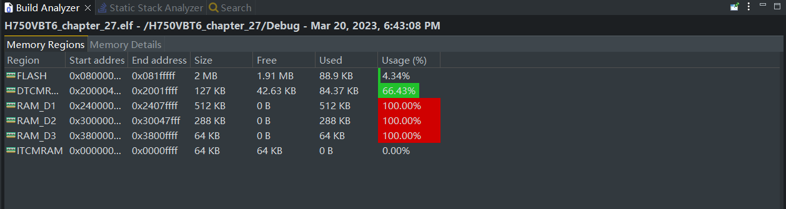
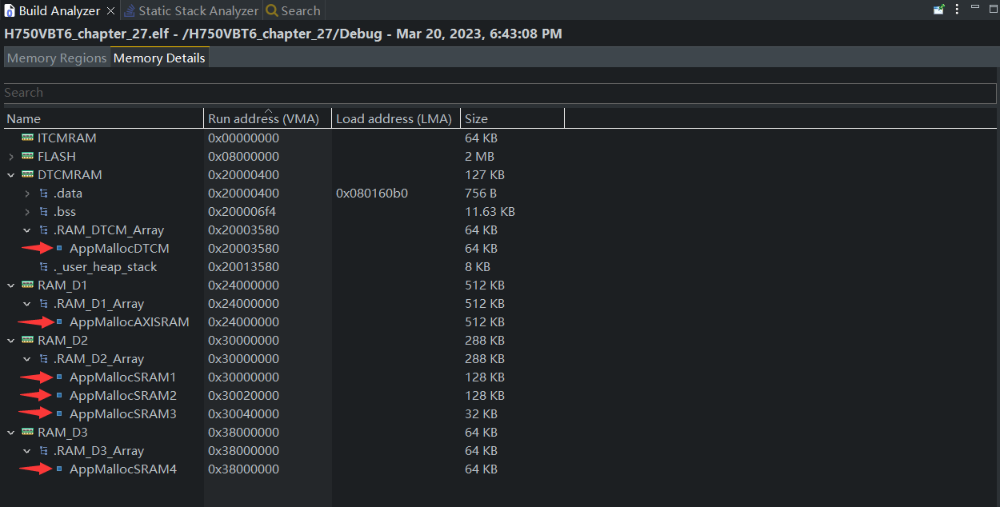

## H750VBT6_chapter_27

> 创建日期：2023-03-20

## 关于

在某个H750VBT6_ST_USB_CDC工程（带有fibre通信框架并处理好print线程安全）的基础上，添加安富莱V7教程 《第27章 STM32H7 的 TCM，SRAM等五块内存 的动态内存分配实现》 的相关例程： **V7-006_TCM，SRAM等五块内存的动态内存分配实现**  代码  `main.c` 中的示例程序到 `H750VBT6_chapter_88\UserApp` 路径下的 `demo_ram.cpp`，少许修改后进行测试

- 开发环境：STM32CubeIDE v1.11.2 + STM32CubeMX v6.6
- 包版本：STM32CubeH7 V1.11.0 / 04-Nov-2022
- 主RAM：DTCM

## 典例

```c
/* Mem head */
mem_head_t *DTCMUsed;
/*       Memory Pool        Size [KB  *1024/8]                  Section       */
uint64_t AppMallocDTCM           [64*1024/8]     __attribute__((section(".RAM_DTCM_Array")));
/* Allocated Memory Address */
void *DTCM_Addr0;

void Demo()
{
    /* 从DTCM申请280字节空间，使用指针变量DTCM_Addr0操作这些空间时不要超过280字节大小 */
    printf("=========================================================\r\n");
    DTCM_Addr0 = osRtxMemoryAlloc(AppMallocDTCM, 280, 0);
    DTCMUsed = MemHeadPtr(AppMallocDTCM);
    printf("DTCM总大小 = %d字节，申请大小 = 0280字节，当前共使用大小 = %d字节\r\n",
           DTCMUsed->size, DTCMUsed->used);

    /* 释放从DTCM申请的280字节空间 */
    osRtxMemoryFree(AppMallocDTCM, DTCM_Addr0);
    DTCMUsed = MemHeadPtr(AppMallocDTCM);
    printf("释放DTCM动态内存区申请的0280字节，当前共使用大小 = %d字节\r\n", DTCMUsed->used);
}
```

## 关联工程

典例中使相关函数时，总是传全局参数有点繁琐，小改成 C++ 封装的版本：[H750VBT6_RTX_MEMORY_01](https://github.com/oldgerman/workspace_H7/tree/master/H750VBT6_RTX_MEMORY_01)

## 代码分布

内存管理的文件位于`Bsp\ram`，有以下源代码

```c
.
|-- dynamic_ram.cpp  // 定义RAM分配空间、提供统一初始化各个内存池的函数
|-- dynamic_ram.h    // 提供 RamInit()
|-- rtx_memory.c     // 动态内存管理
`-- rtx_memory.h     //
```

RamInit() 需要在 Main() 内最前面调用，Main() 位于 `UserApp/main.cpp`

```c
void Main()
{
	/* 初始化动态内存空间 */
	RamInit();
	...
}
```

例程函数`DemoRAM()`位于`UserApp/demo_ram.h` ，在 ascii_protocol.cpp 的OnAsciiCmd() 的最后调用：

```c
void OnAsciiCmd(const char* _cmd, size_t _len, StreamSink &_responseChannel)
{
...
    /* RAM: R0, R1, R2... */
    else if (_cmd[0] == 'R')
    {
    	DemoRAM(_cmd[1]);
    }
}
```

链接文件的 SECTION {...} 中加入了以下段，用于指定编译内存池的RAM：

```c
  .RAM_DTCM_Array (NOLOAD):
  {
    *(.RAM_DTCM_Array)
  } >DTCMRAM
  
  .RAM_ITCM_Array (NOLOAD):
  {
    *(.RAM_ITCM_Array)
  } >ITCMRAM
  
  .RAM_D1_Array (NOLOAD):
  {
    *(.RAM_D1_Array)
  } >RAM_D1
  
  .RAM_D2_Array (NOLOAD):
  {
    *(.RAM_D2_Array)
  } >RAM_D2

  .RAM_D3_Array (NOLOAD):
  {
    *(.RAM_D3_Array)
  } >RAM_D3
```

## 测试

### 编译生成的 .elf 信息

RAM使用率：



几个内存池的分布：



### 安富莱示例程序

向 USB VCP 输入 R0、R1、R2...R8 即可测试例程

```shell
[led_task] sysTick : 5002 ms
[led_task] sysTick : 10002 ms
操作提示:
1. 从DTCM依次申请280字节，64字节和6111字节
2. 释放从DTCM申请的空间
3. 从AXI SRAM依次申请160字节，32字节和2333字节
4. 释放从AXI SRAM申请的空间
5. 从D2域SRAM依次申请200字节，96字节和4111字节
6. 释放从D2域SRAM申请的空间
7. 从D3域SRAM依次申请300字节，128字节和5111字节
8. 释放从D3域SRAM申请的空间
[led_task] sysTick : 15002 ms
=========================================================
DTCM总大小 = 65536字节，申请大小 = 0280字节，当前共使用大小 = 304字节
DTCM总大小 = 65536字节，申请大小 = 0064字节，当前共使用大小 = 376字节
DTCM总大小 = 65536字节，申请大小 = 6111字节，当前共使用大小 = 6496字节
[led_task] sysTick : 20002 ms
[led_task] sysTick : 25002 ms
释放DTCM动态内存区申请的0280字节，当前共使用大小 = 6208字节
释放DTCM动态内存区申请的0064字节，当前共使用大小 = 6136字节
释放DTCM动态内存区申请的6111字节，当前共使用大小 = 16字节
[led_task] sysTick : 35002 ms
=========================================================
AXI SRAM总大小 = 524288字节，申请大小 = 0162字节，当前共使用大小 = 184字节
AXI SRAM总大小 = 524288字节，申请大小 = 0032字节，当前共使用大小 = 224字节
AXI SRAM总大小 = 524288字节，申请大小 = 2333字节，当前共使用大小 = 2568字节
[led_task] sysTick : 40002 ms
释放AXI SRAM动态内存区申请的0160字节，当前共使用大小 = 2400字节
释放AXI SRAM动态内存区申请的0032字节，当前共使用大小 = 2360字节
释放AXI SRAM动态内存区申请的2333字节，当前共使用大小 = 16字节
[led_task] sysTick : 45002 ms
=========================================================
D2域SRAM总大小 = 131072字节，申请大小 = 0200字节，当前共使用大小 = 224字节
D2域SRAM总大小 = 131072字节，申请大小 = 0096字节，当前共使用大小 = 328字节
D2域SRAM总大小 = 131072字节，申请大小 = 4111字节，当前共使用大小 = 4448字节
释放D2域SRAM动态内存区申请的0200字节，当前共使用大小 = 4240字节
释放D2域SRAM动态内存区申请的0096字节，当前共使用大小 = 4136字节
释放D2域SRAM动态内存区申请的4111字节，当前共使用大小 = 16字节
[led_task] sysTick : 50002 ms
=========================================================
D3域SRAM总大小 = 65536字节，申请大小 = 0300字节，当前共使用大小 = 328字节
D3域SRAM总大小 = 65536字节，申请大小 = 0128字节，当前共使用大小 = 464字节
D3域SRAM总大小 = 65536字节，申请大小 = 5111字节，当前共使用大小 = 5584字节
[led_task] sysTick : 55002 ms
释放D3域SRAM动态内存区申请的0300字节，当前共使用大小 = 5272字节
释放D3域SRAM动态内存区申请的0128字节，当前共使用大小 = 5136字节
释放D3域SRAM动态内存区申请的5111字节，当前共使用大小 = 16字节
```

