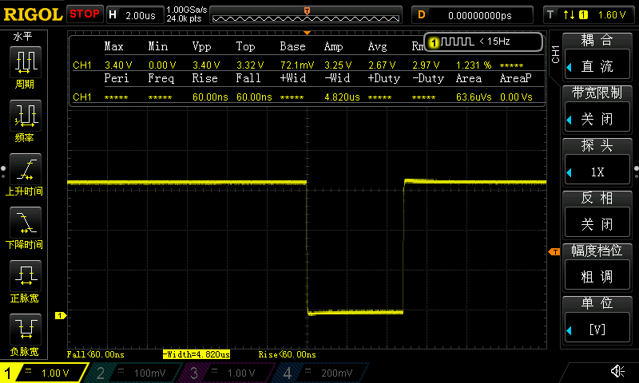
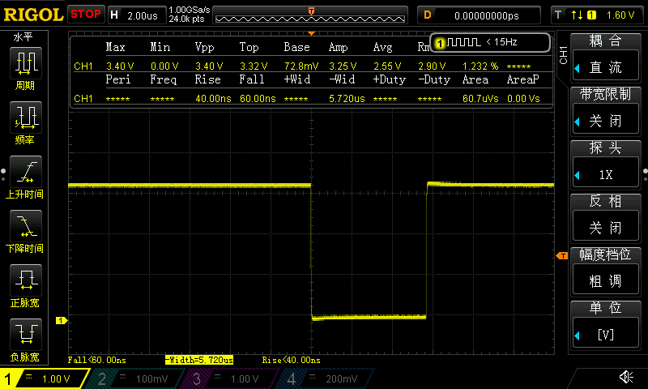
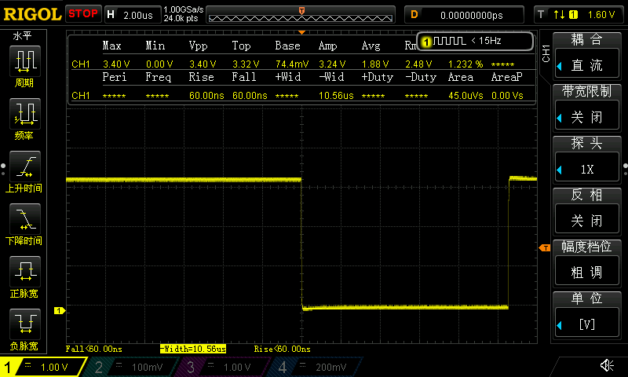

## 第35章 STM32H7的定时器应用之高精度单次延 迟实现（支持 TIM2,3,4 和 5）

## 实际测试

### 串口信息

```
*************************************************************
CPU : STM32H750VBT6, LQFP100, 主频: 400MHz
UID = 32363235 31305114 001F002C
*************************************************************
定时器pwm调节测试:

定时器通道对应输出引脚 PB1: TIM3 CH4   PB15: TIM12 CH2
操作提示:
1. KEY A短按实现一个 5 微秒的单次延迟，开启后翻转PA1，时间到后翻转PA1
2. KEY B短按实现一个 10 微秒的单次延迟，开启后翻转PA1，时间到后翻转PA1

检测到 KEY A 短按
......
检测到 KEY B 短按
......
```

### 5us

| 5us硬件单次延迟测试10次最小值                                | 5us硬件单次延迟测试10次最大值                                |
| ------------------------------------------------------------ | ------------------------------------------------------------ |
|  |  |

### 10us

| 10us硬件单次延迟测试10次最小值                               | 10us硬件单次延迟测试10次最大值                               |
| ------------------------------------------------------------ | ------------------------------------------------------------ |
|  |  |

