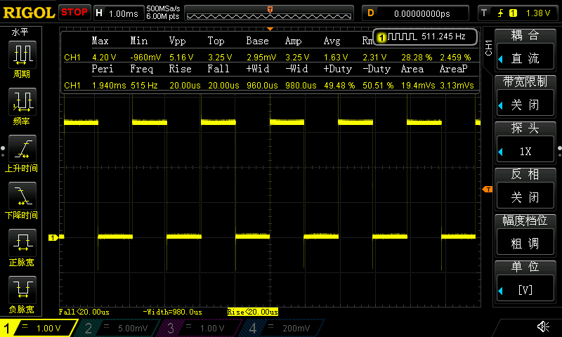
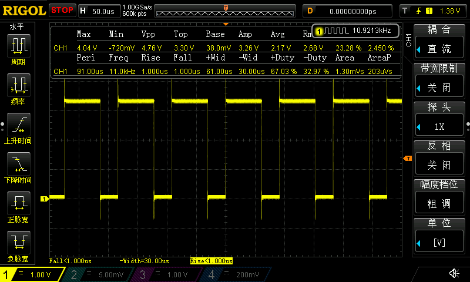

## 第37章 STM32H7 的 LPTIM低功耗定时器应用 之 PWM

## 实际测试

### 串口信息

```
*************************************************************
CPU : STM32H750VBT6, LQFP100, 主频: 400MHz
UID = 32363235 31305114 001F002C
*************************************************************
低功耗定时器LPTIM1 pwm调节测试:

低功耗定时器时钟源 LSE: 32768Hz
低功耗定时器通道对应输出引脚 PD13（没有引出2.54排针，对应开发板U3的Pin7）
操作提示:
1. KEY A 长按或连续长按，以2倍增量修改LPTIM1 pwm频率
2. KEY B 短按以1%，长按或连续长按以10%增量修改LPTIM1 pwm占空比
3. KEY A 短按以应用修改

修改期望pwm频率： 2Hz
修改期望pwm频率： 4Hz
修改期望pwm频率： 8Hz
......
修改期望pwm频率： 16384Hz


修改pwm占空比： 51.000000%
修改pwm占空比： 52.000000%
修改pwm占空比： 53.000000%
......
期望pwm占空比： 75.000000%
```

### 1Hz

```
期望pwm占空比： 50.000000%
期望pwm频率： 1Hz
实际pwm占空比： 50.000000%
实际pwm占空比步幅： 0.003052%
实际pwm频率： 1.000000Hz

期望pwm占空比： 75.000000%
期望pwm频率： 1Hz
实际pwm占空比： 75.000000%
实际pwm占空比步幅： 0.003052%
实际pwm频率： 1.000000Hz
```


| 频率1Hz 占空比50%                                            | 频率1Hz 占空比75%                                            |
| ------------------------------------------------------------ | ------------------------------------------------------------ |
|  |  |

### 512Hz

```
期望pwm占空比： 50.000000%
期望pwm频率： 512Hz
实际pwm占空比： 50.000000%
实际pwm占空比步幅： 1.562500%
实际pwm频率： 512.000000Hz

期望pwm频率： 512Hz
实际pwm占空比： 75.000000%
实际pwm占空比步幅： 1.562500%
实际pwm频率： 512.000000Hz
```

| 频率512Hz 占空比50%                                          | 频率512Hz 占空比75%                                          |
| ------------------------------------------------------------ | ------------------------------------------------------------ |
|  |  |

### 16384Hz

```
期望pwm占空比： 50.000000%
期望pwm频率： 16384Hz
实际pwm占空比： 50.000000%
实际pwm占空比步幅： 50.000000%
实际pwm频率： 16384.000000Hz

期望pwm频率： 16384Hz
实际pwm占空比： 100.000000%	 //...
实际pwm占空比步幅： 50.000000%	//...
实际pwm频率： 16384.000000Hz
```

| 频率16384Hz 占空比50%                                        | 频率16384Hz 占空比100%<br />                                 |
| ------------------------------------------------------------ | ------------------------------------------------------------ |
|  |  |

### PWM占空比为0%时

| PWM占空比为0%时输出LPTIM PWM极性相反电平，本例种极性为LOW，输出高电平 | 1Hz-16384Hz都一样                                            |
| ------------------------------------------------------------ | ------------------------------------------------------------ |
|  |  |

