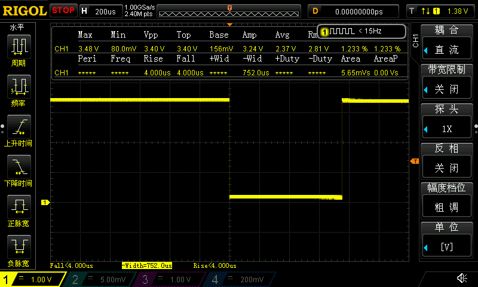
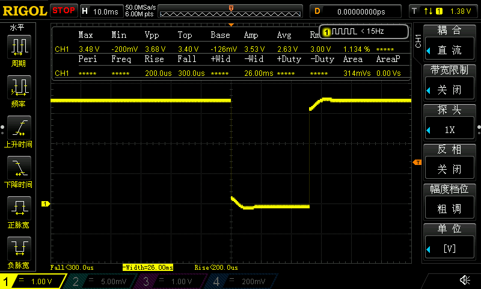
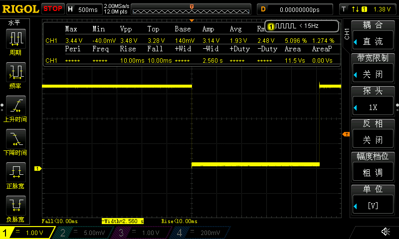
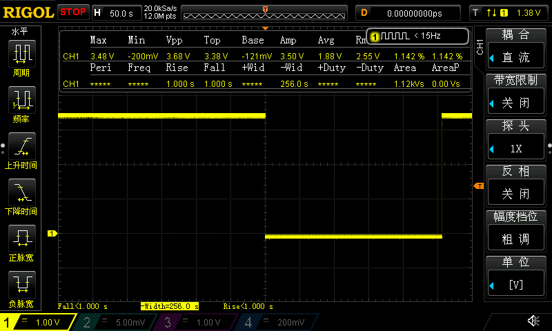

## 第38章 STM32H7 的 LPTIM低功耗定时器应用 之超时唤醒

## 实际测试

### 串口信息

```
*************************************************************
CPU : STM32H750VBT6, LQFP100, 主频: 400MHz
UID = 32363235 31305114 001F002C
*************************************************************
低功耗定时器停机模式唤醒测试:
低功耗定时器时钟源 LSE: 32768Hz
每次在超时中断回调函数中置PA1为低电平
操作提示:
1. KEY A 长按或连续长按，以10倍增量修改超时时间，短按以应用修改，并置PA1为高电平
2. KEY B 短按进入停机模式

应用期望超时时间： 256us
实际超时时间： 244us
执行超时中断回调函数，并退出停机模式
......
应用期望超时时间： 25600us
实际超时时间： 25604us
执行超时中断回调函数，并退出停机模式
......
应用期望超时时间： 2560000us
实际超时时间： 2559997us
进入停机模式, 2560000us后唤醒		//备注：可选
执行超时中断回调函数，并退出停机模式
......
应用期望超时时间： 256000000us
实际超时时间： 256000000us
执行超时中断回调函数，并退出停机模式
```

### 捕捉PA1引脚的信号

| 256us，测得752.0us                                   | 25.6ms，测得26.00ms                                    |
| ---------------------------------------------------- | ------------------------------------------------------ |
|  |  |

| 2.56s，测得2.560s                                    | 256s，测得256.0s                                   |
| ---------------------------------------------------- | -------------------------------------------------- |
|  |  |
