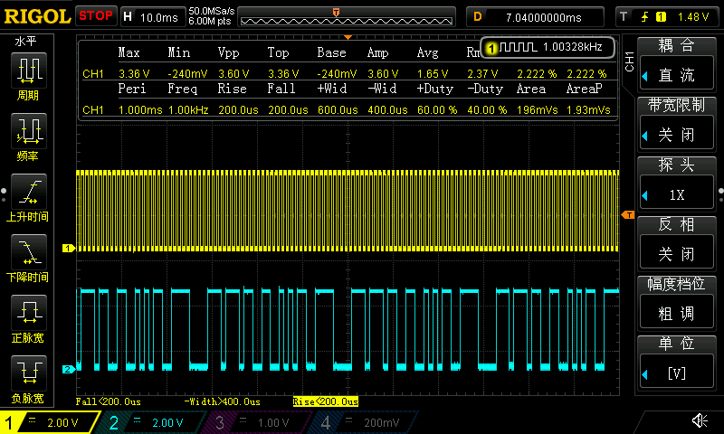
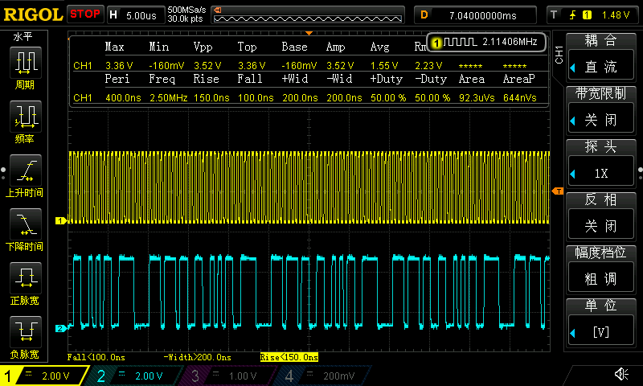
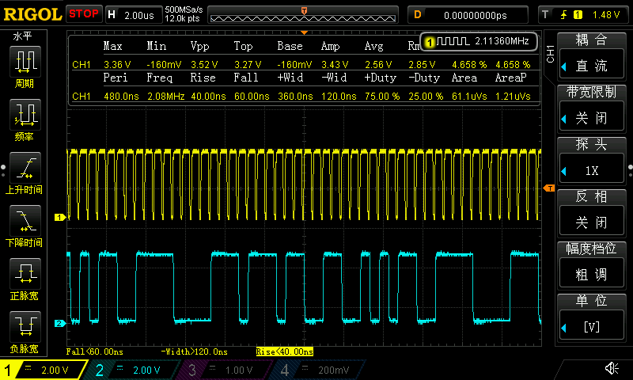
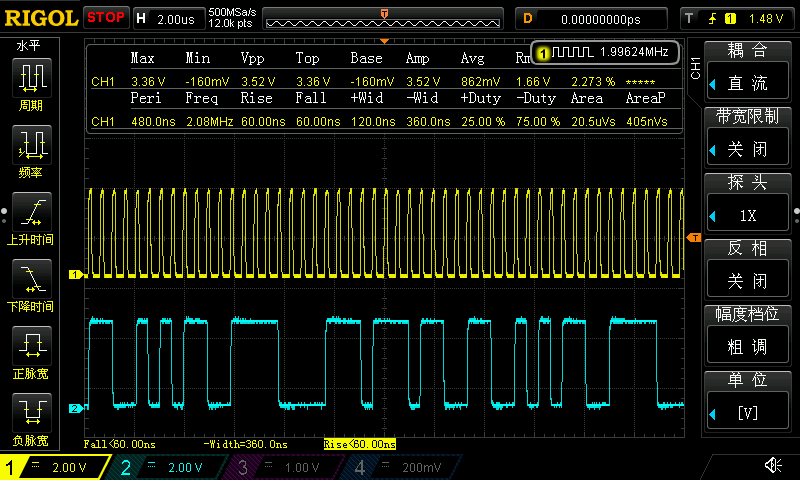
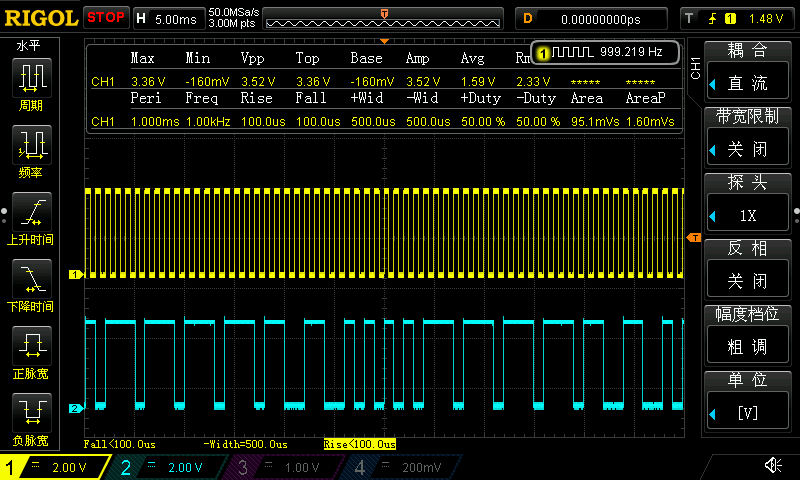
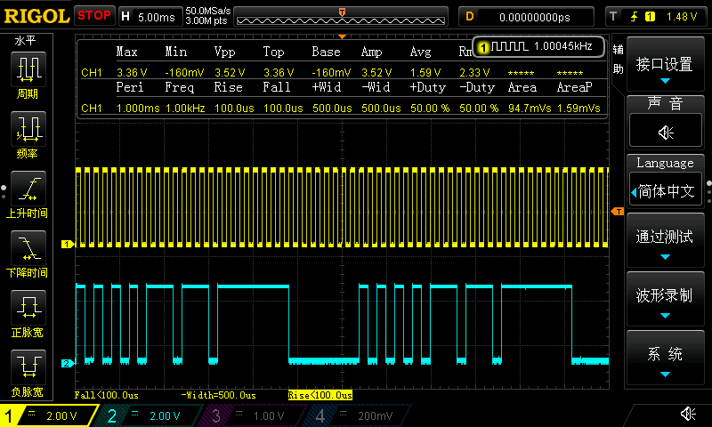

## 第43章 STM32H7的DMA应用之双缓冲控制任意IO和脉冲数控制

## 实际测试

### 串口信息

```
*************************************************************
CPU : STM32H750VBT6, LQFP100, 主频: 400MHz
UID = 32363235 31305114 001F002C
*************************************************************
DMA应用之双缓冲控制任意IO做PWM和脉冲数控制:
DMA1请求生成信号 为tim12 CH1，默认PWM频率1KHz，占空比50%
DMA + tim12 控制的IO为PE0，需要使用示波器测量
tim12 CH1在CubeMX配置为PWM Generation Output，输出的PWM引脚为PB14（虽然没有必要让tim12 生成的PWM输出到io，但还是启用以方便测试）
操作提示:
1. KEY A 长按或连续长按，以2倍增量修改tim12 pwm频率，短按以应用PWM修改，并打开PWM
2. KEY B 长按或连续长按以10%增量修改tim12 pwm占空比，短按关闭PWM
3. 串口输入A，设置波形缓冲区0（16位）
4. 串口输入B，设置波形缓冲区1（16位）
```

### 默认IO_Toggle_M0 +  IO_Toggle_M1 + 50%占空比

默认IO_Toggle_M0使用的电平数据：`1010,1100,1111,0000`

默认IO_Toggle_M1使用的电平数据：`1110,1110,1100,1100`

```c
/* 任意GPIO PWM脉冲数据 */
#define bitLVL_NUM 2
// 缓冲区0
uint8_t bitLVL_M0[bitLVL_NUM] = {	//以bit指定一串电平
		B10101100,
		B11110000
};
// 缓冲区1
uint8_t bitLVL_M1[bitLVL_NUM] = {	//以bit指定一串电平
		B11101110,
		B11001100
};
```

设置1000Hz

```
KEY A 短按，打开 tim12 PWM
期望pwm占空比： 50.000000%
期望pwm频率： 1000Hz
实际pwm占空比： 50.000000%
实际pwm占空比步幅： 0.002000%
实际pwm频率： 1000.000000Hz
```

设置2097152Hz

```
KEY A 长按 修改期望pwm频率： 524288Hz
KEY A 长按 修改期望pwm频率： 1048576Hz
KEY A 长按 修改期望pwm频率： 2097152Hz
KEY A 短按，打开 tim12 PWM
期望pwm占空比： 50.000000%
期望pwm频率： 2097152Hz
实际pwm占空比： 49.473682%
实际pwm占空比步幅： 1.052631%
实际pwm频率： 2105263.250000Hz
```

| 1000Hz                                                       | 2097152Hz                                                    |
| ------------------------------------------------------------ | ------------------------------------------------------------ |
|  |  |

### 默认IO_Toggle_M0 +  IO_Toggle_M1 +  修改占空比

80%

```
......
KEY A 长按 修改期望pwm占空比： 60.000000%
KEY A 长按 修改期望pwm占空比： 70.000000%
KEY A 长按 修改期望pwm占空比： 80.000000%
KEY A 短按，打开 tim12 PWM
期望pwm占空比： 80.000000%
期望pwm频率： 2097152Hz
实际pwm占空比： 80.000000%
实际pwm占空比步幅： 1.052631%
实际pwm频率： 2105263.250000Hz
```

30%

```
......
KEY A 长按 修改期望pwm占空比： 10.000000%
KEY A 长按 修改期望pwm占空比： 20.000000%
KEY A 长按 修改期望pwm占空比： 30.000000%
KEY A 短按，打开 tim12 PWM
期望pwm占空比： 30.000000%
期望pwm频率： 2097152Hz
实际pwm占空比： 29.473682%
实际pwm占空比步幅： 1.052631%
实际pwm频率： 2105263.250000Hz
```

| 2097152Hz 80%占空比                                          | 30%占空比                                                    |
| ------------------------------------------------------------ | ------------------------------------------------------------ |
|  |  |

### 串口修改波形

首先，修改默认波形数据缓冲区0为`1010101011101110`

```
A
设置波形数据前16位，请输入形如 0100111011110000 的数据

1010101011101110
接收到的数据：1 0 1 0 1 0 1 0 1 1 1 0 1 1 1 0 输入数据有效，已更改PWM波形数据
```

然后，修改默认波形数据缓冲区1为`1111111100000000`

```
B
设置波形数据后16位，请输入形如 0100111011110000 的数据

1111111100000000
接收到的数据：1 1 1 1 1 1 1 1 0 0 0 0 0 0 0 0 输入数据有效，已更改PWM波形数据
```

| 首先，修改默认波形数据缓冲区0为1010101011101110              | 然后，修改默认波形数据缓冲区1为1111111100000000              |
| ------------------------------------------------------------ | ------------------------------------------------------------ |
|  |  |

