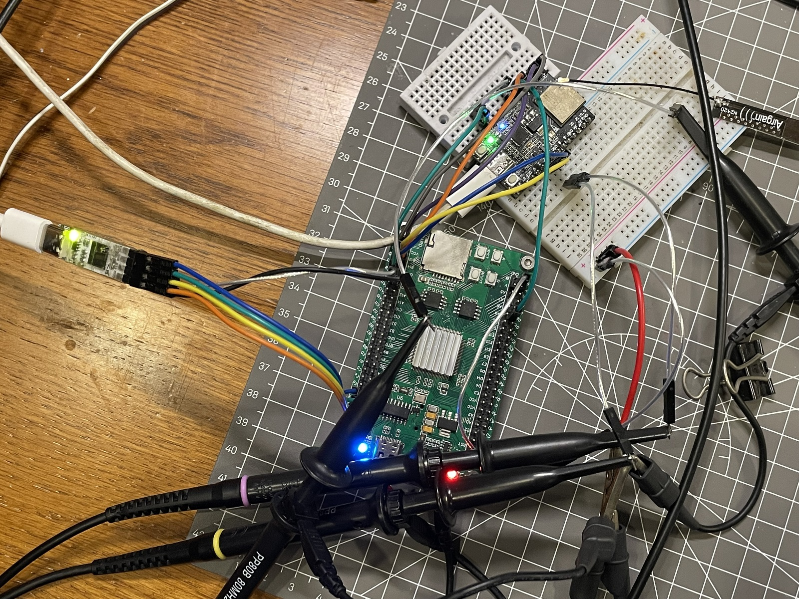
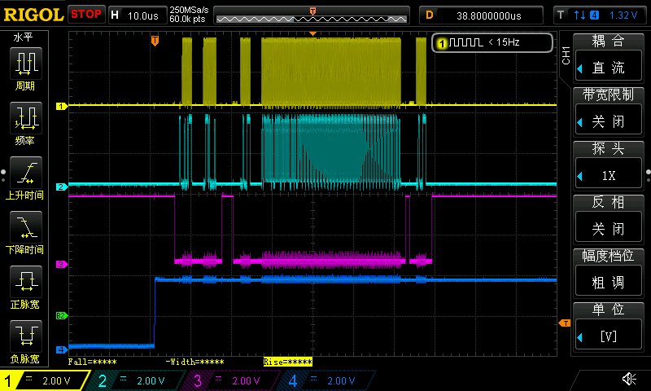
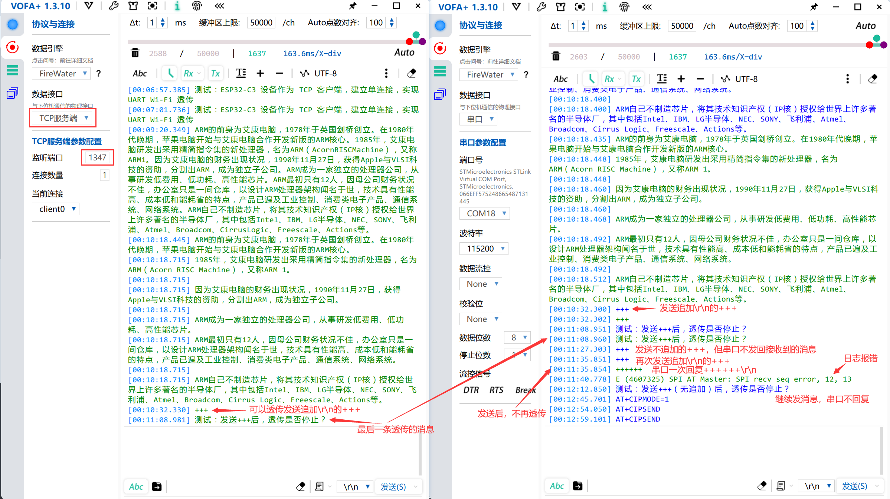
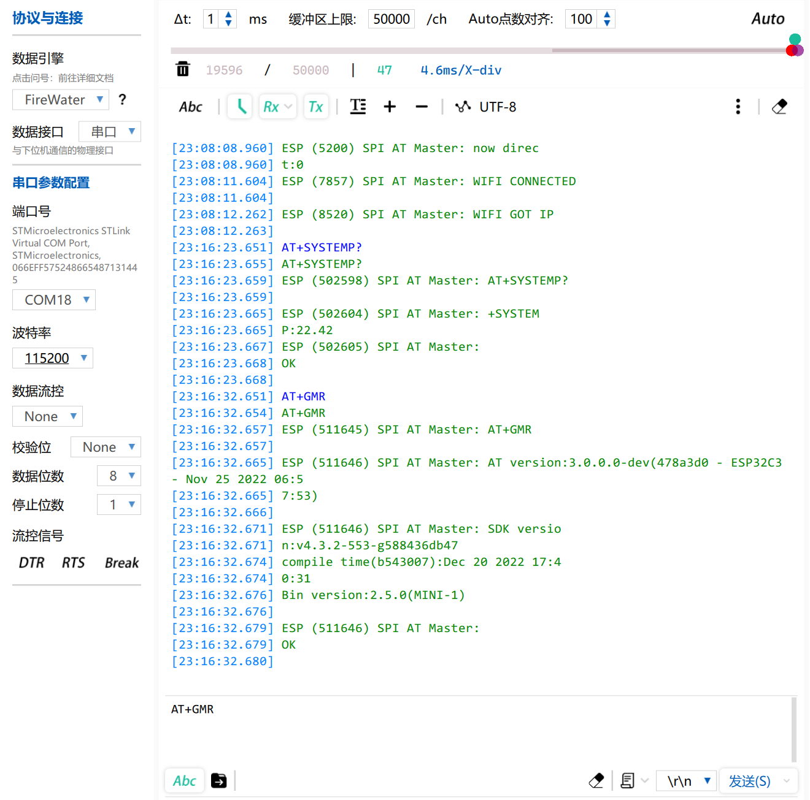
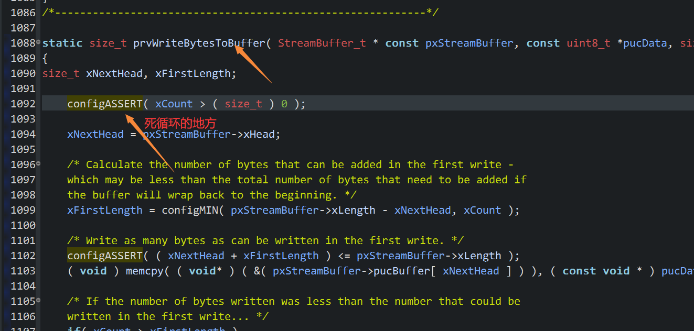
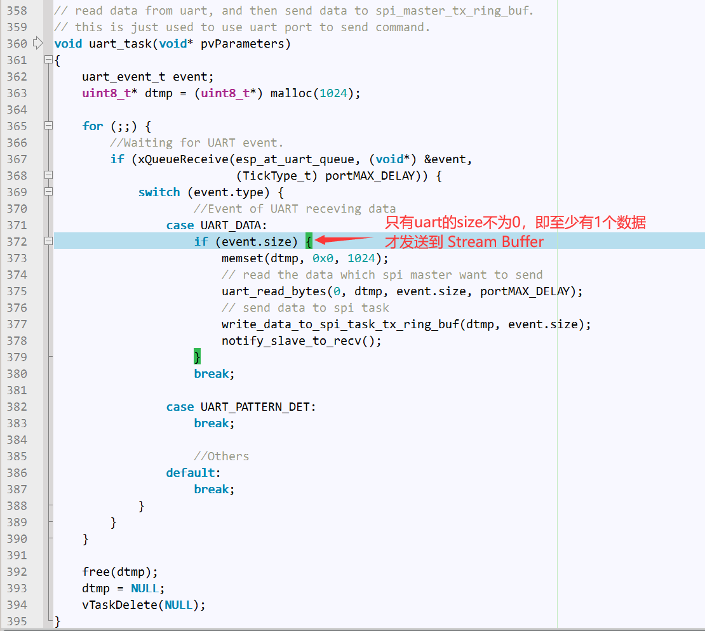

## ESP-AT | ESP32-C3 | 标准SPI 

## 2022/11/26

开坑

## 2022/12/21

> 关键功能测试OK

### 电路连接

使用 [ESP32-C3_SPI_AT指南 ](https://docs.espressif.com/projects/esp-at/zh_CN/release-v2.4.0.0/esp32c3/Compile_and_Develop/How_to_implement_SPI_AT.html)默认的连接方式



### 关于代码

UART驱动部分：使用[H750VBT6_usart_rx_idle_line_irq_ringbuff_tx_04](https://github.com/oldgerman/workspace_H7/tree/master/H750VBT6_usart_rx_idle_line_irq_ringbuff_tx_04)工程的实现

SPI驱动部分：将安富莱 bsp_spi_bus驱动的部分代码使用C++封装为FRTOS_SPIBase类，目前仅支持标准SPI，然后通过FRTOS_SPICmd类，实现SPI 命令序列，FRTOS_SPIDev_ESP32_C3_AT类继承FRTOS_SPICmd类，实现spi_device_polling_transmit()函数，即可与乐鑫SPI AT的 master端的ESP32示例代码对接（路径：`esp-at/examples/at_spi_master/spi/esp32_c_series/main/app_main.c`），然后修改一下，整合到主程序中

FreeRTOS：一共4个任务：UART和SPI分别对应两个阻塞式的高优先级任务，LED轮询任务（闪烁红色LED指示系统正在运行），空闲任务

### 测试：发送gkjhkljkhjhkggggggggggggggggggggggggggggg

**总波形：**

由上到下，SPI_CLK、SPI_MOSI、SPI_CS（软件CS）、HANDSHAKE引脚



这段波形根据 spi_trans_control_task()函数调用 ESP-AT的SPI传输报文T函数 的顺序，分为以下三个部分：

**第1部分波形：**

Master接收到HANDSHAKE高电平中断后，执行query_slave_data_trans_info()

对应通信报文：“Master 检测到握手线上有 slave 发出的信号后，需要发送一条消息查询 slave 进入接收数据的工作模式，还是进入到发送数据的工作模式”

.png)

**第2部分波形：**

由 at_spi_master_send_data() 发送数据

对应通信报文：“Master 向 slave 发送数据”

发送数据.png)

**第3部分波形：**

at_spi_master_send_data()发送结束传输指令

对应通信报文：“Master 向 slave 发送数据结束后，需要发送一条通知消息来结束本次传输”

发送结束的0x7指令.png)

### 测试：SPI转发串口发的复位命令，重启模块

串口录屏路径：`Images/测试：SPI转发串口发的复位命令，重启模块OK.mp4`

波形：SPI(CLK，MOSI，CS)和HANDSHAKE引脚的波形，从上到下

和handshake的波形.png)

### 测试：ESP-AT SPI 建立TCP客户端UART透传（SPI转发串口发的所有数据）

设置教程：[ESP32-C3 设备作为 TCP 客户端，建立单连接，实现 UART Wi-Fi 透传](https://docs.espressif.com/projects/esp-at/zh_CN/release-v2.4.0.0/esp32c3/AT_Command_Examples/TCP-IP_AT_Examples.html#id16)

初步测时是成功的，发送单独的+++帧退出透传还有BUG，待实现的解决思路：在usart任务中实现指令解析，丢弃+++后的\r\n



## 2022/12/27

将乐鑫ESP AT SPI Master端的所有代码封装进 FRTOS_SPIDev_ESP_AT 类

### 避免报错 “SPI AT Master: SPI send seq error ” 的方法

这个原因是ESP32-C3的ESP-AT程序的SPI包的帧计数器 与 H750运行的ESP-AT Master端的SPI包的帧计数器不一致，原因是调试时没有让ESP32-C3硬件复位重置帧计数器，现在已加入H750的GPIO控制ESP32-C3的复位引脚，在运行程序前先等待5秒ESP32-C3复位后初始化，然后再发送AT指令，其实这边是可以强制改变Master端的包的，但乐鑫原版代码是抛出这个错误：

```
[01:50:38.002] AT+GMR
[01:50:38.005] AT+GMR
[01:50:38.009] ESP (4310) SPI AT Master: SPI send seq error, d, 1
```

### 避免警告 ISO C++ forbids converting a string constant to 'char*' 的方法

在frtos_spi_esp_at.cpp文件中调用了osThreadStaticDef这个宏函数

```C++
void FRTOS_SPIDev_ESP_AT::init(FRTOS_SPICmd *frtos_spi_cmd,
......

	osThreadStaticDef(
				esp_at_spi_task,
				thread,
				Priority,
				0,
				TaskStackSize,
				TaskBuffer,
				&TaskControlBlock);
......
}
```

编译时就报这个警告

```c
../User/Bsp/frtos_spi_esp_at.cpp: In static member function 'static void ns_frtos_spi_esp_at::FRTOS_SPIDev_ESP_AT::init(ns_frtos_spi::FRTOS_SPICmd*, uint8_t*, uint8_t*, GPIO_TypeDef*, uint16_t, osPriority)':
../User/Bsp/frtos_spi_esp_at.cpp:410:22: warning: ISO C++ forbids converting a string constant to 'char*' [-Wwrite-strings]
  410 |     &TaskControlBlock);
      |                      ^
../Middlewares/Third_Party/FreeRTOS/Source/CMSIS_RTOS/cmsis_os.h:420:4: note: in definition of macro 'osThreadStaticDef'
  420 | { #name, (thread), (priority), (instances), (stacksz), (buffer), (control) }
      |    ^~~~
```

osThreadStaticDef这个宏涉及到的代码在`cmsis_os.h`：可以看到使用 # 宏将第一个参数 esp_at_spi_task 替换为任务名，并转换为字符串指针给osThreadDef_t的name成员，但这个name成员是一个 char*，出现了字符串常量转化为指针变量的情况，继而触发了g++编译器警告

```c
#define osThreadStaticDef(name, thread, priority, instances, stacksz, buffer, control)  \
const osThreadDef_t os_thread_def_##name = \
{ #name, (thread), (priority), (instances), (stacksz), (buffer), (control) }

/// Thread Definition structure contains startup information of a thread.
/// \note CAN BE CHANGED: \b os_thread_def is implementation specific in every CMSIS-RTOS.
typedef struct os_thread_def  {
  char            *name;        ///< Thread name
  os_pthread             pthread;      ///< start address of thread function
  osPriority             tpriority;    ///< initial thread priority
  uint32_t               instances;    ///< maximum number of instances of that thread function
  uint32_t               stacksize;    ///< stack size requirements in bytes; 0 is default stack size
#if( configSUPPORT_STATIC_ALLOCATION == 1 )
  uint32_t               *buffer;      ///< stack buffer for static allocation; NULL for dynamic allocation
  osStaticThreadDef_t    *controlblock;     ///< control block to hold thread's data for static allocation; NULL for dynamic allocation
#endif
} osThreadDef_t;
```

main.c中也是这么用的，但没警告，推测是C++编译器开了这个警告才显示，解决方法简单粗暴，给name成员加上const就行：

```c
typedef struct os_thread_def  {
  const char            *name;        ///< Thread name
......
} osThreadDef_t;
```

### 测试

当前程序 SPI data DMA收发AT指令正常



### IRAM_ATTR 宏实现

[使用RTT Studio指定特殊函数加载到RAM的方法](https://blog.csdn.net/whj123999/article/details/119977388?spm=1001.2014.3001.5501)

对workspace_H7 的 H750VBT6_esp-at_01 工程 `frtos_spi_conf.h`中的 IRAM_ATTR 宏进行实现，它是 esp-idf 中将函数编译到IRAM运行的宏，常在对时间敏感的函数前加上，例如实时性要求很I高的中断回调函数

对于STM32CubeIDE环境下的H750程序，对实现 IRAM_ATTR 的最佳目标RAM，自然联想到使用H7的 ITCMRAM，实操如下：

在链接脚本中加入：新的section段、新定义的2个全局变量（方便后续在汇编当中把函数从 ROM 拷贝到 RAM）

```c
  /* Place code in ITCMRAM */
  /* Ref: https://blog.csdn.net/whj123999/article/details/119977388?spm=1001.2014.3001.5501 */
  /* Ref: UM2609 2.5.7.2 */
  .RAM_CODE :
  {
    . = ALIGN(4);
    __itcm_start = .;
    *(.ITCM)
    . = ALIGN(4);
    __itcm_end = .;
   } > ITCMRAM AT>FLASH
   __itcm_rom_start = LOADADDR(.RAM_CODE);
   __itcm_size = SIZEOF(.RAM_CODE);
```

在 `frtos_spi_conf.h`中定义 IRAM_ATTR 宏：

```c
#define IRAM_ATTR	__attribute__((section(".RAM_CODE")))	// 时间关键程序从FLASH拷贝到ITCMRAM中执行
```

在启动文件 `startup_stm32h750vbtx.s` 中的如下位置加入汇编代码：

```assembly
......
Reset_Handler:
  ldr   sp, =_estack      /* set stack pointer */
  
/* Call the clock system initialization function.*/
  bl  SystemInit
......
```

加入后：

```assembly
......
Reset_Handler:
  ldr   sp, =_estack      /* set stack pointer */

/** @def assembly code group 
  * @brief  whj123999博主的文章"使用RTT Studio指定特殊函数加载到RAM的方法" 需要增加的 GCC 启动汇编代码
  * @link   https://blog.csdn.net/whj123999/article/details/119977388?spm=1001.2014.3001.5501
  * @{
  *
  */
  ldr r0 ,=__itcm_rom_start  	/* 加载 放在了 ROM 当中，需要加载到 ITCM 中数据的起始地址到 R0 */
  ldr r1 ,=__itcm_start 		/* 加载 ITCM 第一个函数的起始放置位置到 R1 */
  ldr r2 ,=__itcm_size 			/* 加载 ITCM 的大小到 R2 */
  add r2 , r1, r2  				/* R1 加 R2 的值 放到 R2 */

1:
  cmp r2, r1  					/* 比较 R1 与 R2 */
  beq 2f 						/* 如果上面的比较之后是相等的 则跳转到标签 2  */
  ldr r3 ,[r0],#4 				/*  将 R0 寄存器里面存放的地址处的代码，写入到 R3 寄存器里面。然后 R0 + 4 */
  str r3 ,[r1],#4 				/* 将R3中的数据写入以R1为地址的存储器中，然后 R1 + 4*/
  b 1b 							/* 调回到标签 1，循环拷贝 */
2:
/**
  * @}
  *
  */

/* Call the clock system initialization function.*/
  bl  SystemInit
......
```

然后编译下载就行，程序正常运行

在 Buid Analyzer 中，可以看到`frtos_spi_esp_at.cpp`中的`void IRAM_ATTR FRTOS_SPIDev_ESP_AT::thread(const void *arg)`与`void IRAM_ATTR FRTOS_SPIDev_ESP_AT::gpio_handshake_isr_handler()`两个带有` IRAM_ATTR`宏的函数在FLASH中的 `.ITCM`段 和 ITCMRAM中的`.TCM`段 各有一份：

.png)

.png)

### 待优化的地方

transfer函数以下部分增加可选：在RTOS下的信号量或者消息阻塞，在 HAL_SPI_XXXCallback()中调用从中断中释放信号量的API，while + osDelay()的实现不够优雅

```c
while (wTransferState == TRANSFER_STATE_WAIT) {
	osDelay(10);
	// 若非RTOS，等待期间只能处理中断
}
```

然后是 占用和释放 SPI 总线也增加一个 RTOS 下可选的操作

```c
void FRTOS_SPIBase::baseEnter(void)
{
	g_spi_busy = 1;
}

void FRTOS_SPIBase::baseExit(void)
{
	g_spi_busy = 0;
}
```

## 2022/12/29

### 添加 H750VBT6_esp-at_02 示例工程，乐鑫示例代码没有加到class里

### 修复BUG：发送数据卡死在 prvWriteBytestoBuffer 的 configASSERT

死循环位置：原因是 xCount = 0



configASSERT()宏函数定义：

```c
#define configASSERT( x ) if ((x) == 0) {taskDISABLE_INTERRUPTS(); for( ;; );}
```

prvWriteBytesToBuffer()被 prvWriteMessageToBuffer() 调用

prvWriteMessageToBuffer() 被 xStreamBufferSend() 调用

 xStreamBufferSend() 被 write_data_to_spi_task_tx_ring_buf() 调用

write_data_to_spi_task_tx_ring_buf() 被 FreeRTOS任务函数 uart_thread() 调用

修改前：uint16_t类型的变量 nBytes 可能变为 0，经以上函数调用顺序导致   prvWriteBytestoBuffer 的 configASSERT 的 xCount = 0，从而进入死循环

```c
void uart_thread(){
......
	while (1) {
		xResult = xQueueReceive(usart_rx_dma_queue_id, &d, portMAX_DELAY);
		if (xResult == pdPASS) {
			usart_rx_check();
			(void)d;
			uint16_t nBytes = lwrb_get_full(&usart_rx_rb);
			if(nBytes){
	    		memset(usart_thread_rx_to_tx, 0x0, UART_RING_BUF_SIZE);
			}
            if (lwrb_read(&usart_rx_rb, &usart_thread_rx_to_tx, nBytes) == nBytes) {
                lwrb_write(&usart_tx_rb, &usart_thread_rx_to_tx, nBytes);
                write_data_to_spi_task_tx_ring_buf(usart_thread_rx_to_tx, nBytes);	//被调用点
                notify_slave_to_recv();
                usart_start_tx_dma_transfer();
            }
		}
	}
}
```

修改后：

```c
void uart_thread(){
......
	while (1) {
		xResult = xQueueReceive(usart_rx_dma_queue_id, &d, portMAX_DELAY);
		if (xResult == pdPASS) {
			usart_rx_check();
			(void)d;
			uint16_t nBytes = lwrb_get_full(&usart_rx_rb);
			if(nBytes){
	    		memset(usart_thread_rx_to_tx, 0x0, UART_RING_BUF_SIZE);
				if (lwrb_read(&usart_rx_rb, &usart_thread_rx_to_tx, nBytes) == nBytes) {
					lwrb_write(&usart_tx_rb, &usart_thread_rx_to_tx, nBytes);
					write_data_to_spi_task_tx_ring_buf(usart_thread_rx_to_tx, nBytes);	//被调用点
					notify_slave_to_recv();
					usart_start_tx_dma_transfer();
				}
			}
		}
	}
}
```

与乐鑫示例代码一样，一定要避免缓冲区读取长度为0的情况发送到StreamBuffer：



### 测试

本节所有测试视频是在frtos_conf.h 的  RTOS_EN = 1，帧数据包的data部分使用 HAL_SPI_TransmitReceive_DMA 发送，使用了 SPIBase的spiMutex，且 baseTransferExt()函数内等待标记时调用了osDelay(1); 使用H750VBT6_esp-at_02 示例工程进行的

路径：

```
- Images\ESP32-C3 设备作为 TCP 客户端，建立单连接，实现 UART Wi-Fi 透传.mp4
- Images\ESP32-C3 设备作为 TCP 客户端，建立单连接，实现 UART Wi-Fi 透传_10ms循环发送测试.mp4
- Images\ESP32-C3 设备作为 TCP 客户端，建立单连接，实现 UART Wi-Fi 透传_1ms循环发送测试.mp4
```

