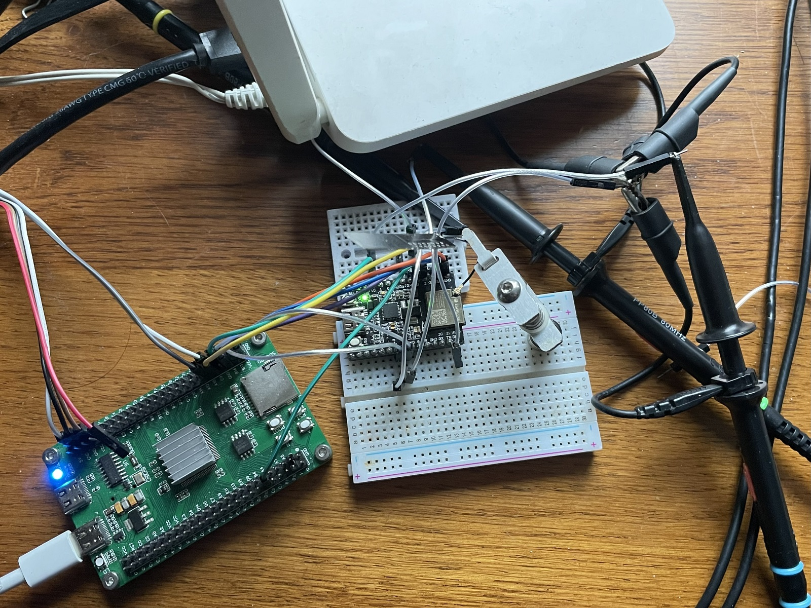
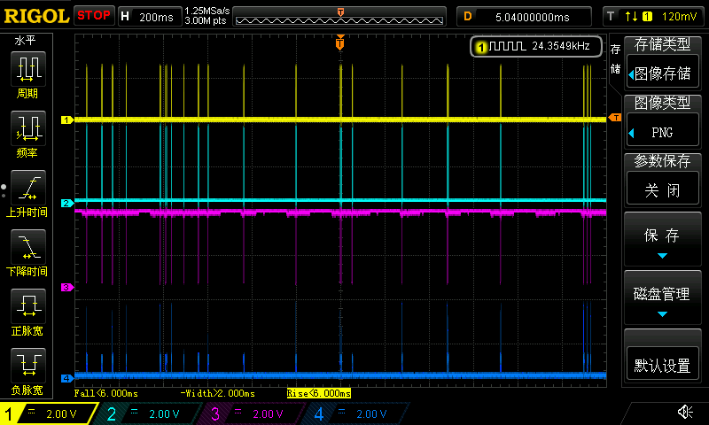
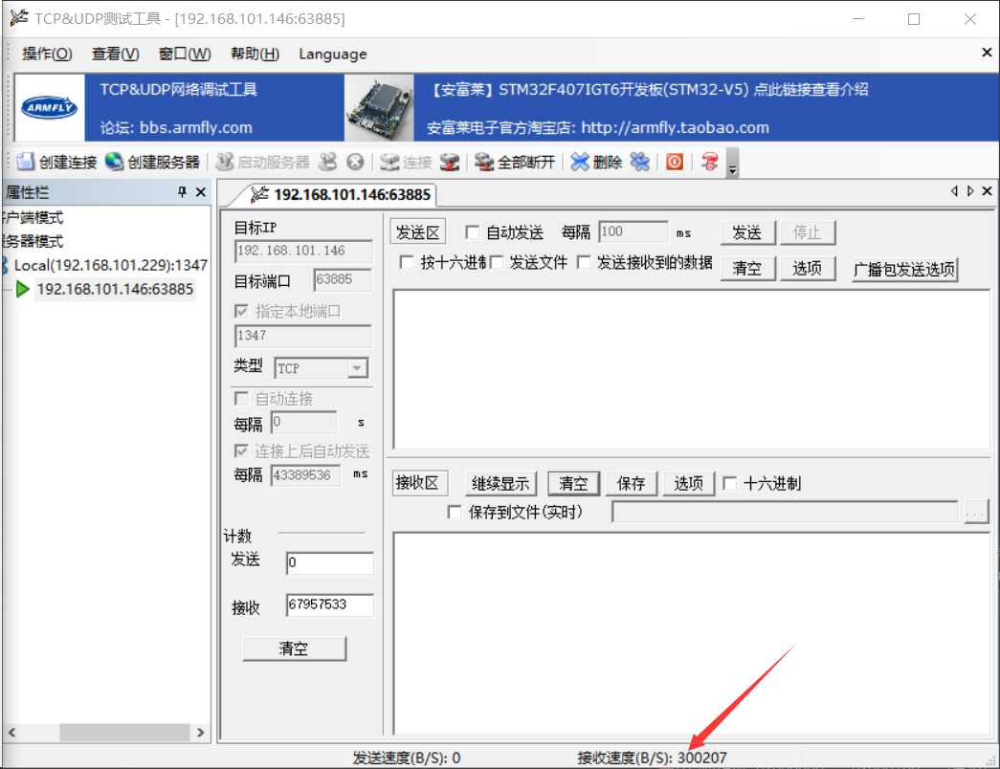
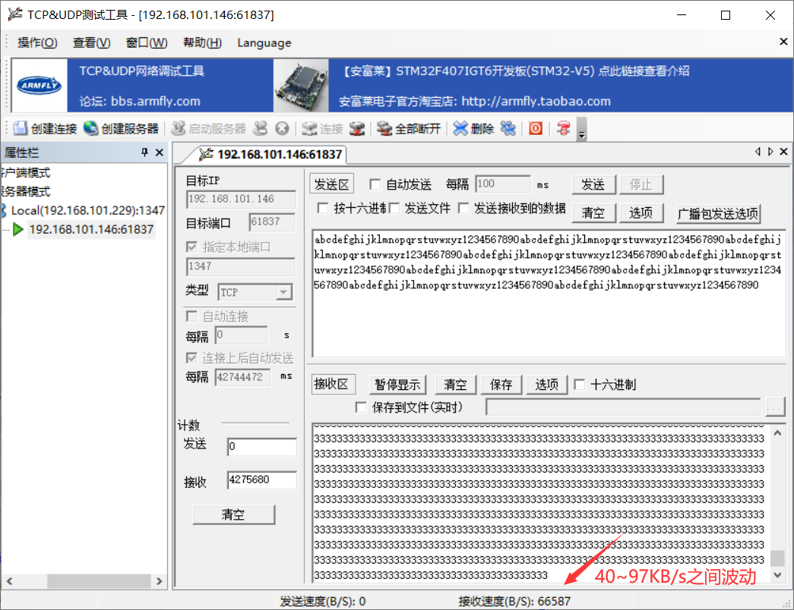
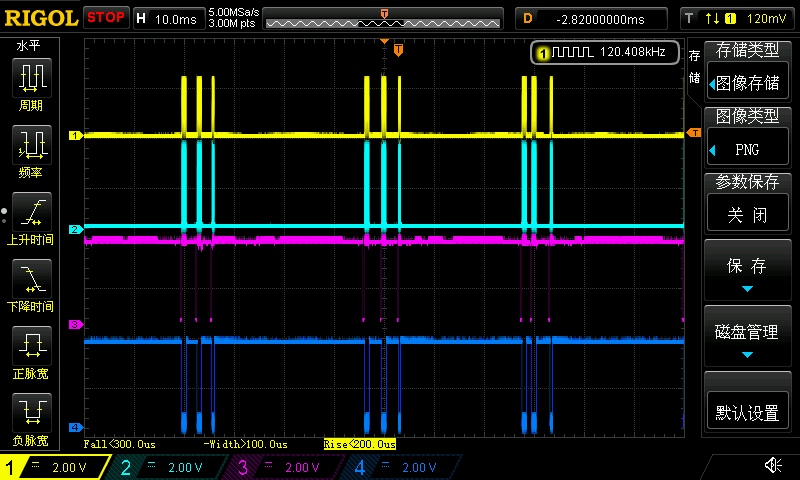
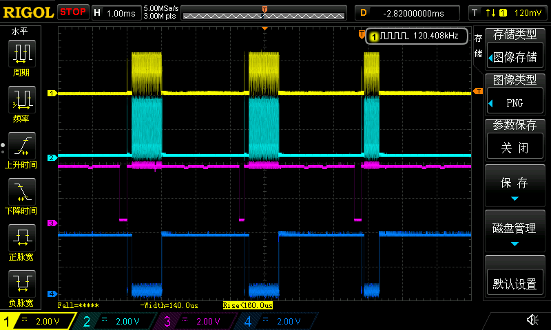
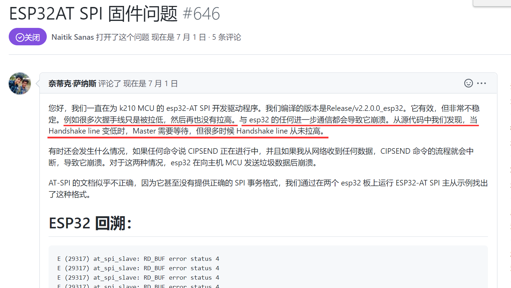
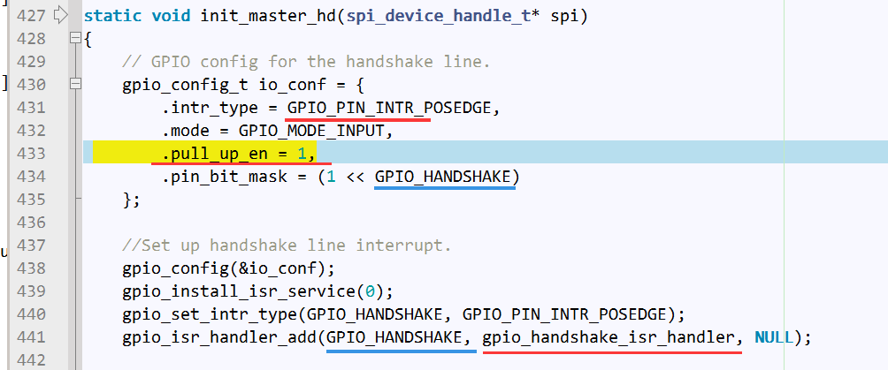
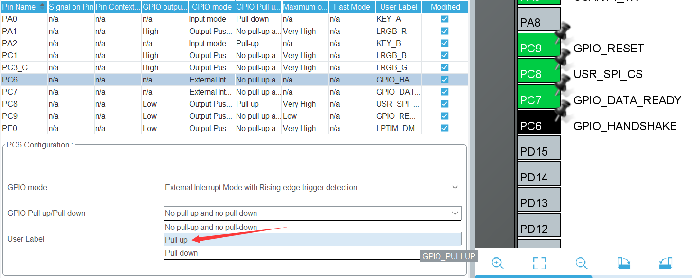

## H750VBT6_esp-at_02 

## 传输10MB数据测试

### 关于

- SPI 采用 TRANSMIT_MODE_POLL 和 RECEIVE_MODE_POLL 模式，不使用中断或DMA，CLK 40MHz

- 使用 [issue：ESP32-C3 SPI 慢速传输 #662](https://github.com/espressif/esp-at/issues/662) 中**[Jacques-zhao](https://github.com/Jacques-zhao)**的方式测试

  > 

- 我的模块是自己焊接的IPEX天线，信号质量应该有亿点点问题，esp32-C3天线到路由器天线5cm到50cm距离的变化对传输速率影响很大

  > 
  
- 电脑端使用的TCP服务端测速工具：[安富莱_TCPUDPDbg_TCP_UDP_网络调试工具](https://www.armbbs.cn/forum.php?mod=viewthread&tid=1568&fromuid=58)

### 测试命令与ESP32-C3的响应

```c
ESP (50934) SPI AT Master: WIFI DISCONNECT

ESP (51165) SPI AT Master: WIFI CONNECTED

ESP (52422) SPI AT Master: WIFI GOT IP

ESP (52422) SPI AT Master: 
OK

ESP (52952) SPI AT Master: AT+CIPSTA?

ESP (52952) SPI AT Master: +CIPSTA:ip:"192.168.101.146"

ESP (52953) SPI AT Master: +CIPSTA:gateway:"192.168.101.1"

ESP (52953) SPI AT Master: +CIPSTA:netmask:"255.255.255.0"

ESP (52953) SPI AT Master: 
OK

ESP (54983) SPI AT Master: AT+CIPSTART="TCP","192.168.101.229",1347

ESP (55039) SPI AT Master: CONNECT

ESP (55040) SPI AT Master: 
OK

ESP (57007) SPI AT Master: AT+CIPMODE=1

ESP (57008) SPI AT Master: 
OK

ESP (59028) SPI AT Master: AT+CIPSEND

ESP (59029) SPI AT Master: 
OK

>
```

### 与天线距离50cm

```
Start test send data
Send done, send count: 10240000, time: 163348 ms
Start test send data
Send done, send count: 10240000, time: 157414 ms
Start test send data
Send done, send count: 10240000, time: 139154 ms
Start test send data
Send done, send count: 10240000, time: 148259 ms
```

才60KB/s左右（0.47Mbps），比 #662 的测试750KB/s慢了10倍左右

看看波形：

| 2.4秒才20次？                                                | 放大看看，紫色线是 HANDSHAKE信号，可见透传下，还是需要HANDSHAKE |
| ------------------------------------------------------------ | :----------------------------------------------------------- |
|  |  |
| 继续放大                                                     | 继续放大                                                     |
|  |  |

继续放大，由于SPI CLK是40MHz，我示波器每通道只有50MHz，所以波形显示比较奇怪，但可以看到，WIFI TCP 透传下cmd段还是发送了的：说明透传模式下，Master还是要等Slave的产生HANDSHAKE上升沿信号，然后Master向Slave查询可发送的包大小，具体可以看 `debug状态下发送1024000字节数据时，send_opt和recv_opt数据变化.mp4`


### Time Base优先级为 0 

发现Time Base优先级我配置是15，而esp-at sdio里STM32示例配置优先级是0


改为0后，速率有提升

```
Start test send data
Send done, send count: 10240000, time: 97387 ms
Start test send data
Send done, send count: 10240000, time: 113591 ms
Start test send data
Send done, send count: 10240000, time: 102918 ms
```

### 不同距离对速率影响

感觉我焊接的IPEX天线的问题有点大，最高到293KB/s，最低才73KB/s

```c
Start test send data
Send done, send count: 10240000, time: 105004 ms		//间隔 50cm
Start test send data
Send done, send count: 10240000, time: 139261 ms		//间隔 50cm
Start test send data
Send done, send count: 10240000, time: 127974 ms		//间隔 50cm
Start test send data
Send done, send count: 10240000, time: 93751 ms			//间隔 50cm
Start test send data
Send done, send count: 10240000, time: 35590 ms			//间隔 5cm
Start test send data
Send done, send count: 10240000, time: 35048 ms			//间隔 5cm
Start test send data
Send done, send count: 10240000, time: 34934 ms			//间隔 5cm
Start test send data		
Send done, send count: 10240000, time: 34987 ms			//间隔 5cm
```

| 与wifi天线距离5cm，最高可以飙到 293KB/s                    | 与wifi天线距离50cm就很慢了                                   |
| ---------------------------------------------------------- | ------------------------------------------------------------ |
| c |  |

与wifi天线距离5cm，可以看到发送频率明显变高：

|  |  |
| ------------------------------------------------------------ | ------------------------------------------------------------ |
|  |  |

## HANDSHAKE引脚

我遇到一个很奇怪的问题，当我连接示波器探头到 SCK MOSI时，SPI发数据后从机才会响应，断开示波器探头后，就日志会报错 Unkown Direct: 255，此时debug看recv_opt结构体数据异常，direct = 255、seq_num = 255、transmit_len = 65535，同样的问题在issue里也有：




### 需要内部上拉



