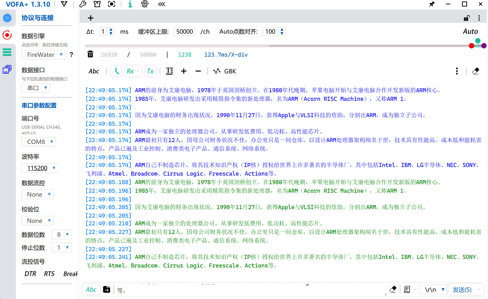

## LL库、H750VBT6、USART、DMA、收不定长数据、空闲线路中断、环形缓冲区、发送数据

## 概述

工程名称：H750VBT6_usart_rx_idle_line_irq_ringbuff_tx_01

BUG： 使用CubeMX自动生成的SystemClock_Config()函数，就只能接收到最后一个字符，只能发回接收数据的最后一个字符

将 [MaJerle/stm32-usart-uart-dma-rx-tx](https://github.com/MaJerle/stm32-usart-uart-dma-rx-tx) 仓库路径的 [usart_rx_idle_line_irq_ringbuff_tx_H7](http://stm32-usart-uart-dma-rx-tx/projects/usart_rx_idle_line_irq_ringbuff_tx_H7/ )示例 改到 H750VBT6 上运行

根据 MaJerle 介绍：

- DMA用于接收数据和传回数据
- 使用环形缓冲区在将数据发送回之前将数据从 DMA 缓冲区复制到应用程序

### UART 空闲线路检测 + DMA HT&TC 中断	（P：优势，C：缺陷）

- 应用程序通过空闲线路检测或 DMA TC/HT 事件获得通知
- 应用程序只有在收到 3 个中断中的任何一个时才必须处理数据
- P：应用程序不需要轮询新的变化
- P：应用程序接收事件中断
- P：应用程序可以进入低功耗模式以延长电池寿命（如果使用电池供电）
- C：在中断中读取（处理）数据。代码努力尽快执行中断例程
- C：长时间中断执行可能会破坏应用程序中的其他兼容性

*传入数据的处理来自 2 个中断向量，因此重要的是它们不会相互抢占。将两者设置为相同的抢占优先级！*

> 意思是代码中对DMA的Stream0、Stream1、USART全局中断的优先级设为相同

## 关于缓冲区

注意USART外设只能用DMA1或DMA2，由于总线结构，DMA1与DMA2无法访问 DTCM RAM，所以这些缓冲区只能选其他 RAM

注意本示例代码没有开MPU和Cache，如果应用到MPU，那么这些缓冲区的内存范围要被设置为 NO Cache ，以被MPU保护，否则会出现数据不一致的问题

根据 MaJerle 以下代码，有三个缓冲区：

DMA不定长收缓冲区：`uint8_t usart_rx_dma_buffer[64];`

RX DMA环形缓冲区：`uint8_t usart_rx_rb_data[128];`

TX DMA环形缓冲区：`uint8_t usart_tx_rb_data[128];`

```c
/**
 * \brief           USART RX buffer for DMA to transfer every received byte RX
 * \note            Contains raw data that are about to be processed by different events
 *
 * Special use case for STM32H7 series.
 * Default memory configuration in STM32H7 may put variables to DTCM RAM,
 * part of memory that is super fast, however DMA has no access to it.
 *
 * For this specific example, all variables are by default
 * configured in D1 RAM. This is configured in linker script
 */
uint8_t
usart_rx_dma_buffer[64];

/**
 * \brief           Ring buffer instance for TX data
 */
lwrb_t
usart_rx_rb;

/**
 * \brief           Ring buffer data array for RX DMA
 */
uint8_t
usart_rx_rb_data[128];

/**
 * \brief           Ring buffer instance for TX data
 */
lwrb_t
usart_tx_rb;

/**
 * \brief           Ring buffer data array for TX DMA
 */
uint8_t
usart_tx_rb_data[128];
```

## 测试

### 亿点点问题

网络上常见的UART+DMA+空闲中断不定长数据收的例子大多是用HAL库 stm32h7_hal_usart_ex.c 中实现的：

```c
HAL_StatusTypeDef HAL_UARTEx_ReceiveToIdle_DMA(UART_HandleTypeDef *huart, uint8_t *pData, uint16_t Size);
void HAL_UARTEx_RxEventCallback(UART_HandleTypeDef *huart, uint16_t Size)
```

其中HAL_UARTEx_ReceiveToIdle_DMA()有个问题，就是第三个参数SIZE需要比应用的不定长收数据的最大长度要多，否则会有问题

硬汉论坛[yangskyhigh](https://www.armbbs.cn/home.php?mod=space&uid=10234)分享的解决这个问题的实现方法： [STM32H743/750系统中使用串口DMA和超时中断接收任意长度数据](https://www.armbbs.cn/forum.php?mod=viewthread&tid=97172)

> 配合**超时中断**可实现灵活接收数据，网上流传的方法一般是把DMA设置为常规模式，**其缺点是一旦一次性要接收的数据超过DMA缓冲区大小，就无法正确处理**。我们可以将DMA**设置为循环模式，再结合超时中断**，可以解决接收数据超过DMA缓冲区大小的问题

但这个代码要修改stm32h7xx_it.c 的串口中断服务函数`USART1_IRQHandler()` 为自己实现的函数，我觉得有失偏颇

然后我找到 MaJerle  用LL库实现的，打包一条龙，本工程先保持LL库跑起来

上一节说过，三个缓冲区大小分别是 64Byte、128Byte、128Byte

### 测试：发1000+个无空格、换行符的混合字符过去

> ARM的前身为艾康电脑，1978年于英国剑桥创立。在1980年代晚期，苹果电脑开始与艾康电脑合作开发新版的ARM核心。1985年，艾康电脑研发出采用精简指令集的新处理器，名为ARM（AcornRISCMachine），又称ARM1。因为艾康电脑的财务出现状况，1990年11月27日，获得Apple与VLSI科技的资助，分割出ARM，成为独立子公司。ARM成为一家独立的处理器公司，从事研发低费用、低功耗、高性能芯片。ARM最初只有12人，因母公司财务状况不佳，办公室只是一间仓库，以设计ARM处理器架构闻名于世，技术具有性能高、成本低和能耗省的特点，产品已遍及工业控制、消费类电子产品、通信系统、网络系统。ARM自己不制造芯片，将其技术知识产权（IP核）授权给世界上许多著名的半导体厂，其中包括Intel、IBM、LG半导体、NEC、SONY、飞利浦、Atmel、Broadcom、CirrusLogic、Freescale、Actions等。

一次USART传输就回返所有数据


### 测试：发1000+个带有换行符的混合字符过去

> ARM的前身为艾康电脑，1978年于英国剑桥创立。在1980年代晚期，苹果电脑开始与艾康电脑合作开发新版的ARM核心。
> 1985年，艾康电脑研发出采用精简指令集的新处理器，名为ARM（Acorn RISC Machine），又称ARM 1。
>
> 因为艾康电脑的财务出现状况，1990年11月27日，获得Apple与VLSI科技的资助，分割出ARM，成为独立子公司。
>
> ARM成为一家独立的处理器公司，从事研发低费用、低功耗、高性能芯片。
> ARM最初只有12人，因母公司财务状况不佳，办公室只是一间仓库，以设计ARM处理器架构闻名于世，技术具有性能高、成本低和能耗省的特点，产品已遍及工业控制、消费类电子产品、通信系统、网络系统。
>
> ARM自己不制造芯片，将其技术知识产权（IP核）授权给世界上许多著名的半导体厂，其中包括Intel、IBM、LG半导体、NEC、SONY、飞利浦、Atmel、Broadcom、Cirrus Logic、Freescale、Actions等。

多次USART传输回反数据，分行分段



## BUG

### CubeMX自动生成的   SystemClock_Config() 导致  64byte RX DMA缓冲区只能收到最后一个字符

64byte RX DMA缓冲区只能收到最后一个字符，且DMA确实是比USART的时钟要先初始化的（所以排除这个问题：[STM32 UART DMA 接收数据 只能接收到串口数据的最后一个字节](https://blog.csdn.net/qs521/article/details/108468002)），然后注释掉SystemClock_Config()，再编译，就没这个问题了，但这个问题没解决，LL库我几乎没接触过不知道怎么改，先摆在这里

## 
