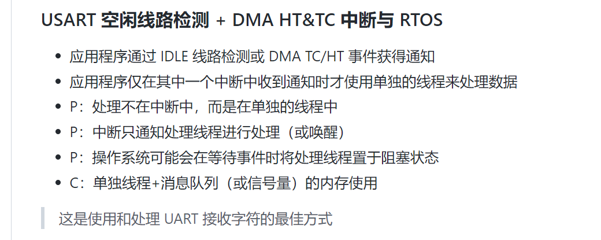

## FreeRTOS、任务通知、HAL库、H750VBT6、USART、DMA、收不定长数据、空闲线路中断、环形缓冲区、发送数据

## 简介

工程名称：H750VBT6_usart_rx_idle_line_irq_ringbuff_tx_04

- 完全使用HAL库API，无需修改stm32h7xx_it.c中的IRQHandler函数

- 开启MPU，开启Cache，但 MPU 将 SRAM1、SRAM2、SRAM3 共计288KB（128KB、128KB、64KB）划分为一个内存区（地址0x30000000开始），不开启Cache，示例程序三个UART用到的缓冲区指定编译到这个不开Cache的内存区，以保持程序正常运行

- 最佳实践 [任务通知 - 掌握FreeRTOS™ 实时内核](https://freertoskernel.asicfans.com/ren-wu-tong-zhi) —— 外围设备驱动程序中使用的任务通知：UART示例

## MaJerle 认为的 最佳实践

不带RTOS的 代码由 MaJerle 在 [stm32-usart-uart-dma-rx-tx](https://github.com/MaJerle/stm32-usart-uart-dma-rx-tx) 仓库中实现，其中 README 有以下描述：

USART 空闲线路检测 + DMA HT&TC 中断与 RTOS 是使用和处理UART接收字符的最佳方式（ RX TX 环形缓冲区，IDLE一个缓冲区），但仓库无示例代码



## usart_rx_idle_line_irq_rtos_L4_multi_instance

[stm32-usart-uart-dma-rx-tx/projects/usart_rx_idle_line_irq_rtos_L4_multi_instance/Src/main.c](https://github.com/MaJerle/stm32-usart-uart-dma-rx-tx/blob/main/projects/usart_rx_idle_line_irq_rtos_L4_multi_instance/Src/main.c)

UART + RX + IDLE + RTOS + Queue  + 多实例（UART1 + UART2，但仅使用一个任务管理） 的示例


## 乐鑫ESP-AT SPI Master端的代码

就是等待IDLE事件使UART线程置于阻塞的实现方式 ，不愧是大厂代码：

主函数：

```c
// 路径：esp-at\examples\at_spi_master\spi\esp32_c_series\main
void app_main()
{
    init_master_hd(&handle);

    // init UART
    uart_driver_install(
    		0, 					// UART 端口号
    		2048, 				// UART RX 环形缓冲区大小
			8192, 				// UART TX 环形缓冲区大小
			10, 				// UART 事件队列大小/深度
			&esp_at_uart_queue,	 // UART 事件队列句柄（输出参数）
			1					// 用于分配中断的标志
	);

    xTaskCreate(uart_task, "uTask", 2048, NULL, 4, NULL);								 //UART 任务

    xTaskCreate(spi_trans_control_task, "spi_trans_control_task", 1024 * 2, NULL, 8, NULL);	//SPI 任务
}
```

uart 任务：

```c
// 从 uart 读取数据，然后将数据发送到 spi_master_tx_ring_buf。
// 该函数仅用于使用 uart 端口发送命令。
// read data from uart, and then send data to spi_master_tx_ring_buf.
// this is just used to use uart port to send command.
void uart_task(void* pvParameters)
{
//    uart_event_t event;
    uint8_t* dtmp = (uint8_t*) malloc(1024);	//创建1024bytes

    for (;;) {
        //Waiting for UART event.(使用队列事件阻塞uart任务)
        if (xQueueReceive(esp_at_uart_queue, (void*) &event,
                          (TickType_t) portMAX_DELAY)) {
            switch (event.type) {
                    //Event of UART receving data
                case UART_DATA:
                    if (event.size) {	//如果size不为0
                    	/**
                    	 * 拷贝UART缓冲区数据到1024bytes的dtmp，使用流缓冲API发给SPI task
                    	 */
                        memset(dtmp, 0x0, 1024);
                        // read the data which spi master want to send
                        uart_read_bytes(0, dtmp, event.size, portMAX_DELAY);
                        // send data to spi task
                        write_data_to_spi_task_tx_ring_buf(dtmp, event.size);	//使用了 xStreamBufferSend() 进行任务间通信
                        notify_slave_to_recv();
                    }
                    break;

                case UART_PATTERN_DET:	//UART模式检测
                    break;

                    //Others
                default:
                    break;
            }
        }
    }

    /* 《掌握FreeRTOS实时内核》 --> 任务管理 --> 任务函数 
     * 如果任务实现突破上述循环，则必须在到达其实现功能结束之前删除该任务。 传递给 vTaskDelete() 
     * API 函数的 NULL 参数指示要删除的任务是调用（当前）任务。
    */
    // 理论上不会突破上述循环
    free(dtmp);					// 释放临时搬运数据用的动态内存
    dtmp = NULL;				// dtmp设为 空指针
    vTaskDelete(NULL);			// 删除了此任务
}
```

但 ESP-IDF 我没有仔细了解过其硬件驱动的编写，好在有这个示例，那我就从MaJerle改成HAL库的工程 按照这个依葫芦画瓢~

## 外围设备驱动程序中使用的任务通知：UART示例

> 然后 就是来自 《161204_Mastering_the_FreeRTOS_Real_Time_Kernel-A_Hands-On_Tutorial_Guide》中文版 《掌握FreeRTOS实时内核》的 [外围设备驱动程序中使用的任务通知：UART示例 的参考](https://freertoskernel.asicfans.com/ren-wu-tong-zhi#wai-wei-she-bei-qu-dong-cheng-xu-zhong-shi-yong-de-ren-wu-tong-zhi-uart-shi-li)，我复制到本节：

外设驱动程序库提供了在硬件接口上执行常用操作的函数。通常提供此类库的外设示例包括通用异步接收器和发射器(UARTs)、串行外设接口(SPI)端口、模拟到数字转换器(adc)和以太网端口。这些库通常提供的函数示例包括初始化外设、向外设发送数据和从外设接收数据的函数。

外围设备上的一些操作需要较长的时间才能完成。这类操作的例子包括高精度ADC转换，以及在UART上传输大数据包。在这些情况下，驱动程序库函数可以实现轮询反复读取外设的状态寄存器，以确定操作何时完成。然而，以这种方式轮询几乎总是浪费时间，因为它利用了处理器100%的时间，而没有执行有效的处理。在多任务系统中，这种浪费尤其昂贵，在该系统中，**轮询外围设备的任务可能会阻止执行具有生产性处理的低优先级任务**。

为了避免浪费处理时间的可能性，**高效的RTOS感知设备驱动程序应该是中断驱动的，并为启动长时间操作的任务提供在阻塞状态下等待操作完成的选项。这样，低优先级任务可以在执行长时间操作的任务处于阻塞状态时执行**，并且没有任务会使用处理时间，除非它们能够有效地使用处理时间。

RTOS驱动程序库通常**使用二进制信号量将任务置于阻塞状态**。清单154中所示的伪代码演示了该技术，它提供了在UART端口上传输数据的支持RTOS的库函数的概要。在清单154中：

- xUART是描述UART外围设备并保存状态信息的结构。该结构的`xTxSemaphore`成员是`semaphhorehandle_t`类型的变量。它假设信号量已经被创建。
- `xUART_Send()`函数不包含任何互斥逻辑。如果有多个任务要使用`xUART_Send()`函数，那么应用程序编写人员必须在应用程序本身中管理互斥。例如，任务可能需要在调用`xUART_Send()`之前获取互斥锁。
- `xSemaphoreTake()` API函数用于在启动UART传输之后将调用任务置于阻塞状态。
- `xSemaphoreGiveFromISR()` API函数用于在传输完成后将任务从阻塞状态中删除，此时UART外设的传输端中断服务例程执行。

```c
/*驱动程序库函数，用于向UART发送数据。*/
BaseType_t xUART_Send(xUART *pxUARTInstance, uint8_t *pucDataSource, size_t uxLength)
{
BaseType_t xReturn;
    
    /*通过尝试在没有超时的情况下获取信号量，确保UART的传输信号量不可用。*/
    xSemaphoreTake(pxUARTInstance->xTxSemaphore, 0);
    
    /* Start the transmission. */
    UART_low_level_send(pxUARTInstance, pucDataSource, uxLength);

    /*阻塞信号灯以等待传输完成。如果获得信号量，那么xReturn将设置为pdPASS。如果信号量take操作超时，	 那么xReturn将设置为pdFAIL。注意，如果中断发生在被调用的UART_low_level_send()和被调用的xSemaphoreTake()之间，那么事件将被锁存在二进制信号量中，对xSemaphoreTake()的调用将立即返回。*/
    xReturn = xSemaphoreTake(pxUARTInstance->xTxSemaphore, pxUARTInstance->xTxTimeout);

    return xReturn;
}
/*-----------------------------------------------------------*/

/*UART传输结束中断的服务例程，在最后一个字节发送到UART后执行。 */
void xUART_TransmitEndISR(xUART *pxUARTInstance)
{
BaseType_t xHigherPriorityTaskWoken = pdFALSE;
    
    /* 清除中断。 */
    UART_low_level_interrupt_clear(pxUARTInstance);

    /* 发送Tx信号量以指示传输结束。如果任务在等待信号量时被阻塞，则该任务将从阻塞状态中删除。*/
    xSemaphoreGiveFromISR(pxUARTInstance->xTxSemaphore, &xHigherPriorityTaskWoken);
    portYIELD_FROM_ISR(xHigherPriorityTaskWoken);
}
```

清单154。演示如何在驱动程序库传输函数中使用二进制信号量的伪代码

清单154中演示的技术是完全可行的，确实是常见的做法，但它有一些缺点：

- 库使用多个信号量，这增加了内存占用。
- 信号量只有在创建之后才能使用，所以使用信号量的库只有在显式初始化之后才能使用。
- 信号量是适用于广泛用例的通用对象；它们包括允许任意数量的任务在阻塞状态下等待信号量变为可用的逻辑，以及在信号量变为可用时选择（以确定性方式）从阻塞状态中移除哪个任务的逻辑。执行该逻辑需要有限的时间，在清单154所示的场景中，处理开销是不必要的，在该场景中，在任何给定时间都不能有多个任务等待信号量。

清单155演示了如何使用任务通知代替二进制信号量来避免这些缺点。

> 注意:如果库使用任务通知，那么库的文档必须清楚地说明调用库函数可以更改调用任务的通知状态和通知值。

在清单155中：

- `xUART`结构的`xTxSemaphore`成员已被`xTaskToNotify`成员替换。`xTaskToNotify`是TaskHandle_t类型的变量，用于保存等待UART操作完成的任务的句柄。
- `xTaskGetCurrentTaskHandle() `FreeRTOS API函数用于获取运行状态任务的句柄。
- 库不创建任何FreeRTOS对象，因此不会引起内存开销，也不需要显式初始化。
- 任务通知将直接发送到等待UART操作完成的任务，因此不会执行不必要的逻辑。

`xTaskToNotify`结构的`xTaskToNotify`成员可以从任务和中断服务程序中访问，需要考虑处理器将如何更新它的值：

- 如果`xTaskToNotify`通过一个内存写操作更新，那么它可以在临界区外更新，如清单155所示。如果`xTaskToNotify`是一个32位变量(TaskHandle_t是一个32位类型)，并且运行FreeRTOS的处理器是一个32位处理器，就会出现这种情况。
- 如果更新`xTaskToNotify`需要一个以上的内存写入操作，则`xTaskToNotify`只能从关键部分中更新，否则中断服务例程可能会在`xTaskToNotify`处于不一致状态时访问`xTaskToNotify`。如果`xTaskToNotify`是32位变量，并且FreeRTOS运行的处理器是16位处理器，则会出现这种情况，因为它需要两个16位内存写入操作来更新所有32位。

在FreeRTOS实现内部，TaskHandle_t是一个指针，所以`sizeof(TaskHandle_t)`总是等于`sizeof(void *)`。

```c
/*驱动程序库函数，用于向UART发送数据。*/
BaseType_t xUART_Send(xUART *pxUARTInstance, uint8_t *pucDataSource, size_t uxLength)
{
BaseType_t xReturn;
    
    /*保存调用此函数的任务的句柄。这本书的正文包含了关于以下行是否需要受关键部分保护的注释。*/
    pxUARTInstance->xTaskToNotify = xTaskGetCurrentTaskHandle();

    /*通过调用ulTaskNotifyTake()，将xClearCountOnExit参数设置为pdTRUE，并将阻塞时间设置为0（不阻塞），确保调用任务尚未挂起通知。*/
    ulTaskNotifyTake(pdTRUE, 0);
    
    /*启动变速器。*/
    UART_low_level_send(pxUARTInstance, pucDataSource, uxLength);
    
    /*阻塞，直到通知传输完成。如果收到通知，则xReturn将设置为1，因为ISR已将此任务的通知值增加为1（pdTRUE）。如果操作超时，则xReturn将为0（pdFALSE），因为此任务的通知值在上面清除为0后不会更		改。请注意，如果ISR在对UART_low_level_send()的调用和对ulTaskNotifyTake()的调用之间执行，则事件将锁定在任务的通知值中，对ulTaskNotifyTake()的调用将立即返回。*/
    xReturn = (BaseType_t)ulTaskNotifyTake(pdTRUE, pxUARTInstance->xTxTimeout);
    
    return xReturn;
}
/*-----------------------------------------------------------*/

/*最后一个字节发送到UART后执行的ISR。*/
void xUART_TransmitEndISR(xUART *pxUARTInstance)
{
BaseType_t xHigherPriorityTaskWoken = pdFALSE;
    
    /*除非有任务等待通知，否则不应执行此函数。使用断言测试此条件。严格来说，此步骤不是必需的，但有助于调试。第11.2节介绍了configASSERT()。*/
    configASSERT(pxUARTInstance->xTaskToNotify != NULL);

    /*清除中断。*/
    UART_low_level_interrupt_clear(pxUARTInstance);
    
    /*直接向名为xUART_Send()任务发送通知。如果任务在等待通知时被阻止，则该任务将从阻止状态中删除。*/
    vTaskNotifyGiveFromISR(pxUARTInstance->xTaskToNotify, &xHigherPriorityTaskWoken);

    /*现在没有任务等待通知。将xUART结构的xTaskToNotify成员设置回NULL。此步骤并非绝对必要，但有助于调试。*/
    pxUARTInstance->xTaskToNotify = NULL;
    portYIELD_FROM_ISR(xHigherPriorityTaskWoken);
}
```

清单155. 演示如何在驱动程序库传输函数中使用任务通知的伪代码

任务通知还可以替换接收函数中的信号量，如伪代码清单156所示，它提供了一个RTOS感知库函数的概要，该库函数在UART端口上接收数据。参见清单156：

- `xUART_Receive()`函数不包含任何互斥逻辑。如果有多个任务要使用`xUART_Receive()`函数，那么应用程序编写器必须管理应用程序本身中的互斥。例如，在调用`xUART_Receive()`之前，可能需要一个任务来获取互斥体。
- UART的接收中断服务程序将UART接收到的字符放到RAM缓冲区中。函数的作用是:从RAM缓冲区返回字符。
- `xUART_Receive() uxWantedBytes`参数用于指定要接收的字符数。如果RAM缓冲区尚未包含请求的数字字符，则调用任务将处于阻止状态，以等待通知缓冲区中的字符数已增加。`while()`循环用于重复此序列，直到接收缓冲区包含请求的字符数，或者发生超时。
- 调用任务可能多次进入阻塞状态。因此，将块时间调整为考虑自调用`xUART_Receive()`以来已经经过的时间。这些调整确保在`xUART_ Receive()`内花费的总时间不会超过由xUART结构的`xRxTimeout`成员指定的块时间。块时间是使用`FreeRTOS VTaskSetTimeOutState()`和`xTaskCheckForTimeOut()`辅助函数调整的。

```c
/*用于从UART接收数据的驱动程序库函数。*/
size_t xUART_Receive(xUART *pxUARTInstance, uint8_t *pucBuffer, size_t uxWantedBytes)
{
size_t uxReceived = 0;
TickType_t xTicksToWait;
TimeOut_t xTimeOut;
    
    /*记录输入此功能的时间。*/
    vTaskSetTimeOutState(&xTimeOut);
    
    /*xTicksToWait是超时值-它最初设置为此UART实例的最大接收超时。*/
    xTicksToWait = pxUARTInstance->xRxTimeout;
    
    /*保存调用此函数的任务的句柄。这本书的正文包含了关于以下行是否需要受关键部分保护的注释。*/
    pxUARTInstance->xTaskToNotify = xTaskGetCurrentTaskHandle();
    
    /*循环，直到缓冲区包含所需的字节数，或者发生超时。*/
    while (UART_bytes_in_rx_buffer(pxUARTInstance) < uxWantedBytes)
    {
        /*查找超时，调整xTicksToWait以说明到目前为止在该函数中花费的时间。*/
        if (xTaskCheckForTimeOut(&xTimeOut, &xTicksToWait) != pdFALSE)
        {
            /*在所需字节数可用之前超时，请退出循环。*/
            break;
        }
        
        /*接收缓冲区尚未包含所需的字节数。等待通知接收中断服务例程已将更多数据放入缓冲区的xTicksToWait ticks的最大值。调用此函数时，调用任务是否已挂起通知并不重要，如果已挂起，则只需围绕此循环进行一次额外的循环。*/
        ulTaskNotifyTake(pdTRUE, xTicksToWait);
    }
    
    /*没有任务等待接收通知，因此将xTaskToNotify设置回NULL。这本书的正文包含了关于以下行是否需要受关	 键部分保护的注释。*/
    pxUARTInstance->xTaskToNotify = NULL;
    
    /*尝试将uxWantedBytes从接收缓冲区读取到pucBuffer中。返回读取的实际字节数（可能小于uxWantedBytes）。*/
    uxReceived = UART_read_from_receive_buffer(pxUARTInstance, pucBuffer, uxWantedBytes);
    
    return uxReceived;
}
/*-----------------------------------------------------------*/

/*UART接收中断的中断服务程序。*/
void xUART_ReceiveISR(xUART *pxUARTInstance)
{
BaseType_t xHigherPriorityTaskWoken = pdFALSE;
    
    /*将接收到的数据复制到此UART的接收缓冲区并清除中断。*/
    UART_low_level_receive(pxUARTInstance);
    
    /*如果任务正在等待新数据的通知，请立即通知它。*/
    if (pxUARTInstance->xTaskToNotify != NULL)
    {
        vTaskNotifyGiveFromISR(pxUARTInstance->xTaskToNotify, &xHigherPriorityTaskWoken);
        portYIELD_FROM_ISR(xHigherPriorityTaskWoken);
    }
}
```

清单156. 演示如何在驱动程序库接收函数中使用任务通知的伪代码


## 测试

