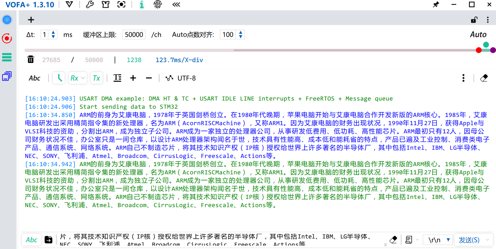
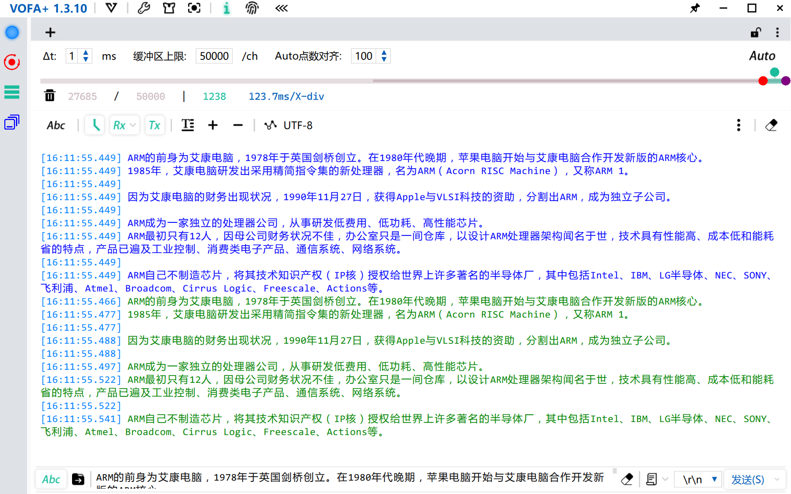
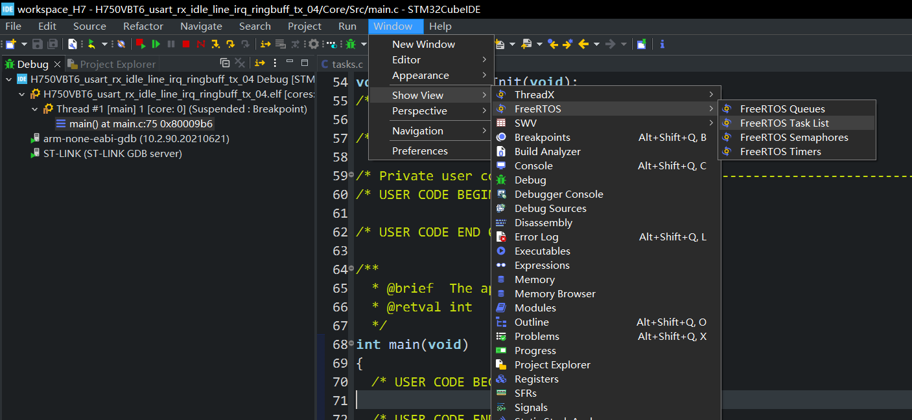
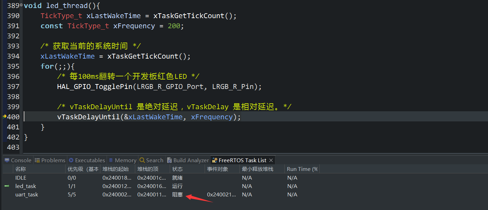
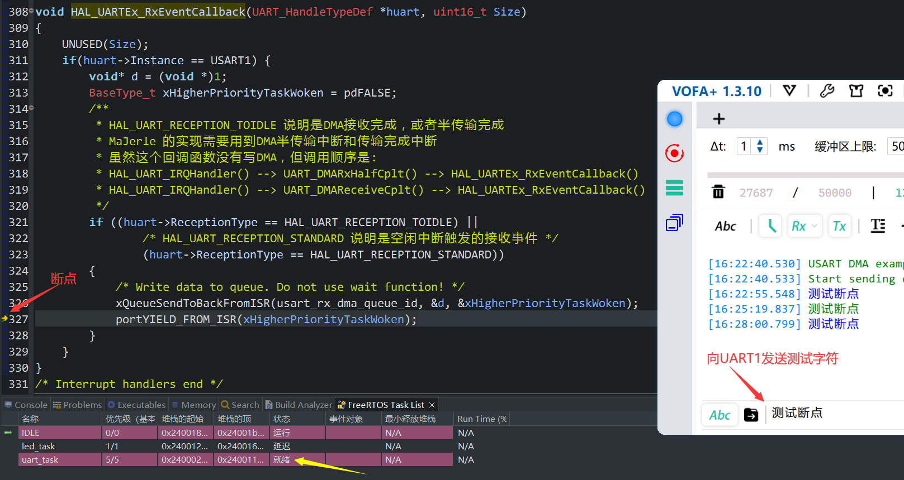
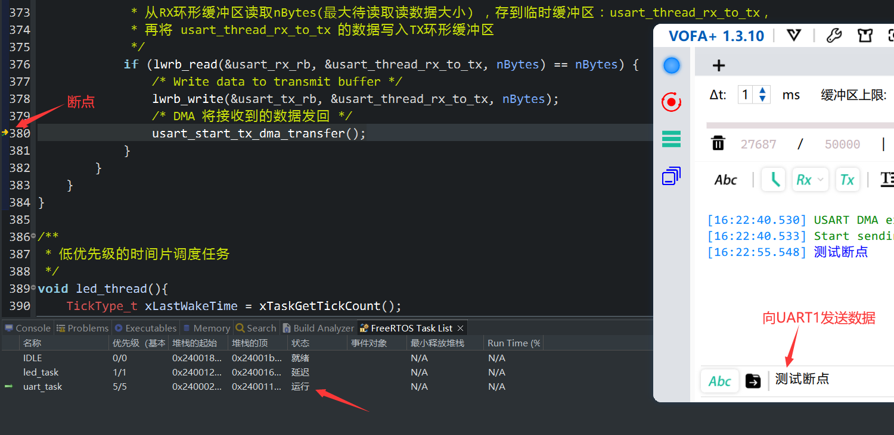
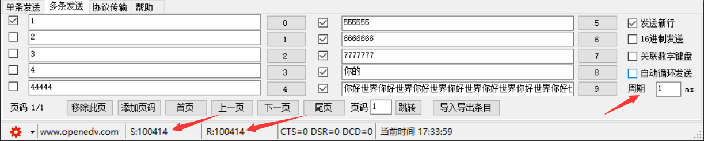

## H750VBT6、HAL库、USART、DMA、空闲线路中断、不定长数据收发、环形缓冲区、FreeRTOS消息队列阻塞式驱动

## 简介

工程名称：H750VBT6_usart_rx_idle_line_irq_ringbuff_tx_04

- 完全使用HAL库API，无需修改stm32h7xx_it.c中的IRQHandler函数

- 开启MPU，开启Cache，但 MPU 将 SRAM1、SRAM2、SRAM3 共计288KB（128KB、128KB、64KB）划分为一个内存区（地址0x30000000开始），不开启Cache，示例程序三个UART用到的缓冲区指定编译到这个不开Cache的内存区，以保持程序正常运行，设置细节可以参考[H750VBT6_usart_rx_idle_line_irq_ringbuff_tx_03/README.md](https://github.com/oldgerman/workspace_H7/tree/master/H750VBT6_usart_rx_idle_line_irq_ringbuff_tx_03/README.md)

- Demo功能：将USART1接收到的不定长数据发回，支持一次发多条数据逐一发回，收发的数据可以大于缓冲区大小

- FreeRTOS任务：

  > UART：占用一个高优先级后台任务（阻塞式），当`HAL_UARTEx_RxEventCallback()`发送消息就解除阻塞
  >
  > LED：占用一个低优先级时间片轮调任务，每100ms翻转开发板红色LED
  >
  > IDLE：FreeRTOS空闲任务

## "USART最佳实践"

MaJerle 的仓库 [stm32-usart-uart-dma-rx-tx](https://github.com/MaJerle/stm32-usart-uart-dma-rx-tx) ，其中 README 有以下描述：

USART 空闲线路检测 + DMA HT&TC 中断与 RTOS 是使用和处理UART接收字符的最佳方式（ RX TX 环形缓冲区，IDLE一个缓冲区）：


然鹅仓库有F4、L4的CMSIS-RTOS不定长收的+LL库的代码，但是没有H7+HAL+FreeRTOS的，所以我从以下两个示例修改得到本仓库示例：

- [usart_rx_idle_line_irq_ringbuff_tx_H7](https://github.com/MaJerle/stm32-usart-uart-dma-rx-tx/blob/main/projects/usart_rx_idle_line_irq_ringbuff_tx_H7/Src/main.c)
- [usart_rx_idle_line_irq_rtos_F4](https://github.com/MaJerle/stm32-usart-uart-dma-rx-tx/blob/main/projects/usart_rx_idle_line_irq_rtos_F4/Src/main.c)

另外还有一个：usart_rx_idle_line_irq_rtos_L4_multi_instance

[stm32-usart-uart-dma-rx-tx/projects/usart_rx_idle_line_irq_rtos_L4_multi_instance/Src/main.c](https://github.com/MaJerle/stm32-usart-uart-dma-rx-tx/blob/main/projects/usart_rx_idle_line_irq_rtos_L4_multi_instance/Src/main.c)

MaJerle实现的 UART多实例（UART1 + UART2，但仅使用一个任务管理） + RX + IDLE + RTOS + Queue  +  的示例

感觉很牛逼，先Mark在这里，以后用要是用到多UART再回来研究一番，改到H7上

## 乐鑫ESP-AT SPI Master端的代码

> [esp-at\examples\at_spi_master\spi\esp32_c_series\main\app_main.c](https://github.com/espressif/esp-at/blob/master/examples/at_spi_master/spi/esp32_c_series/main/app_main.c)

UART任务阻塞式 +消息队列，不愧是大厂的驱动代码：

主函数：

```c

void app_main()
{
    init_master_hd(&handle);

    // init UART
    uart_driver_install(
    		0, 					// UART 端口号
    		2048, 				// UART RX 环形缓冲区大小
			8192, 				// UART TX 环形缓冲区大小
			10, 				// UART 事件队列大小/深度
			&esp_at_uart_queue,	 // UART 事件队列句柄（输出参数）
			1					// 用于分配中断的标志
	);

    xTaskCreate(uart_task, "uTask", 2048, NULL, 4, NULL);								 //UART 任务

    xTaskCreate(spi_trans_control_task, "spi_trans_control_task", 1024 * 2, NULL, 8, NULL);	//SPI 任务
}
```

uart 任务：

```c
// 从 uart 读取数据，然后将数据发送到 spi_master_tx_ring_buf。
// 该函数仅用于使用 uart 端口发送命令。
// read data from uart, and then send data to spi_master_tx_ring_buf.
// this is just used to use uart port to send command.
void uart_task(void* pvParameters)
{
//    uart_event_t event;
    uint8_t* dtmp = (uint8_t*) malloc(1024);	//创建1024bytes

    for (;;) {
        //Waiting for UART event.(使用队列事件阻塞uart任务)
        if (xQueueReceive(esp_at_uart_queue, (void*) &event,
                          (TickType_t) portMAX_DELAY)) {
            switch (event.type) {
                    //Event of UART receving data
                case UART_DATA:
                    if (event.size) {	//如果size不为0
                    	/**
                    	 * 拷贝UART缓冲区数据到1024bytes的dtmp，使用流缓冲API发给SPI task
                    	 */
                        memset(dtmp, 0x0, 1024);
                        // read the data which spi master want to send
                        uart_read_bytes(0, dtmp, event.size, portMAX_DELAY);
                        // send data to spi task
                        write_data_to_spi_task_tx_ring_buf(dtmp, event.size);	//使用了 xStreamBufferSend() 进行任务间通信
                        notify_slave_to_recv();
                    }
                    break;

                case UART_PATTERN_DET:	//UART模式检测
                    break;

                    //Others
                default:
                    break;
            }
        }
    }

    /* 《掌握FreeRTOS实时内核》 --> 任务管理 --> 任务函数 
     * 如果任务实现突破上述循环，则必须在到达其实现功能结束之前删除该任务。 传递给 vTaskDelete() 
     * API 函数的 NULL 参数指示要删除的任务是调用（当前）任务。
    */
    // 理论上不会突破上述循环
    free(dtmp);					// 释放临时搬运数据用的动态内存
    dtmp = NULL;				// dtmp设为 空指针
    vTaskDelete(NULL);			// 删除了此任务
}
```

这个示例[使用了ESP-IDF的uart驱动](https://github.com/espressif/esp-idf/blob/master/components/driver/uart.c)， 本来想看看有啥还可以参考的，但看了一下直接劝退，写代码的工程师在大气层

好在这个示例的`dtmp`缓冲区给了一点思路，遂加了一个 `usart_thread_rx_to_tx`缓冲区，作为从UART RX环形缓冲区 向 TX环形缓冲区 发数据的临时缓冲区

## 测试

### 测试：发1000+个无空格、换行符的混合字符过去

一次就传回所有数据



### 测试：发1000+个带有换行符的混合字符过去

多次传回数据，分行分段



### 测试：RTOS任务的状态

**STM32CubeIDE显示FreeRTOS_Task_List**

进入Debug模式在main函数的起始断点停住后，Window --> Show View --> FreeRTOS --> Task List



**断点放在led_task任务函数内**：

程序运行一段时间后，在此处打断点，程序运行到断点处停止

任务状态：IDLE就绪，led_thred运行，uart_task阻塞



**断点放在中断回调函数HAL_UARTEx_RxEventCallback()内**：

从串口向UART1发送字符，程序运行到断点处停止

任务状态：IDLE就绪，led_task延迟，uart_task运行

uart_task从阻塞态进入到就绪态



**断点放在uart_task任务函数内**：

从串口向UART1发送字符，程序运行到断点处停止

任务状态：IDLE就绪，led_task延迟，uart_task运行

uart_task从就绪态进入到运行态



### 测试：压力测试


