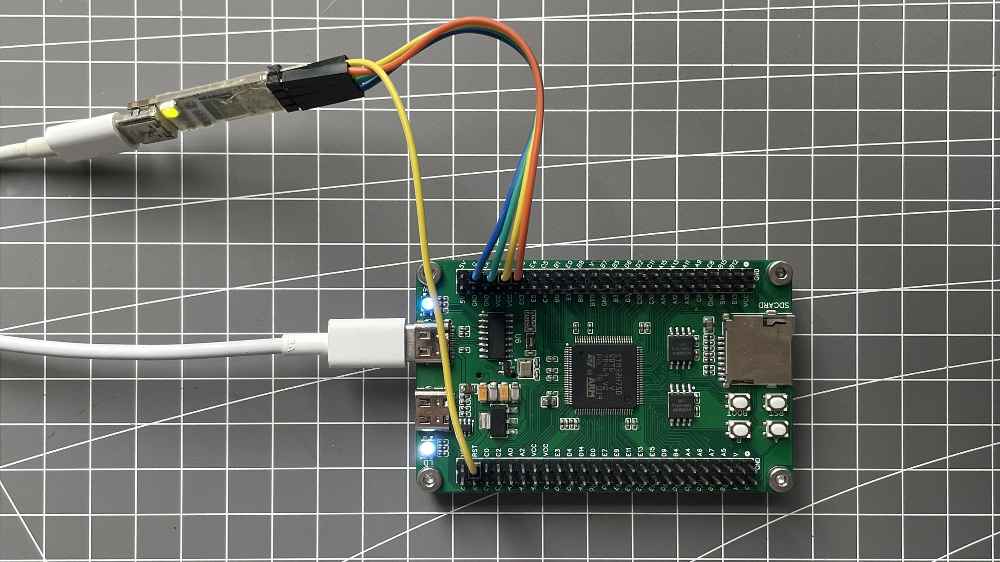

## 关于

> 备份学习[安富莱v7教程](https://www.armbbs.cn/forum.php?mod=viewthread&tid=86980)的代码，开发环境使用[STM32CubeIDE](https://www.st.com/en/development-tools/stm32cubeide.html)（版本v1.7.0或更高）

### 使用的开发板

DIY的[micespring](https://oshwhub.com/micespring)设计的[STM32H750VB/H7B0VB核心板](https://oshwhub.com/micespring/stm32h750vb-CoreBoard_copy)，STM32H750VBT6，W25Q64JV两片，调试器是自制的ST-LINK v2.1

### 代码偏好

- 能交给CubeMX配置的尽量用CubeMX

- 涉及直接寄存器操作的尽量改用HAL API（前提是在不严重影响执行速度的情况）

### 实际测试

若有时间整理，相应工程的根目录README.md文件中有测试记录
