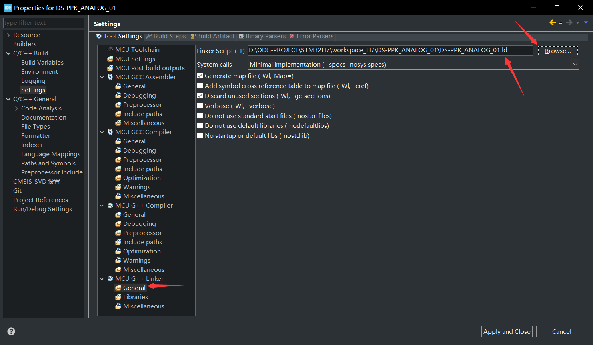

## 关于

> 备份学习[安富莱教程](https://www.armbbs.cn/forum.php?mod=viewthread&tid=86980)的代码，夹带一些私货
>
> - 开发环境：STM32CubeIDE v1.11.2 + STM32CubeMX v6.6
>
> - 包版本：STM32CubeH7 V1.11.0 / 04-Nov-2022

### 使用的开发板

DIY的[micespring](https://oshwhub.com/micespring)设计的[STM32H750VB/H7B0VB核心板](https://oshwhub.com/micespring/stm32h750vb-CoreBoard_copy)，STM32H750VBT6，W25Q64JV两片，还有另一块 DS-PPK 验证板

_我设计的DS-PPK_V1.0(右).jpeg)

### 代码偏好

- 能交给CubeMX配置的尽量用CubeMX

- 涉及直接寄存器操作的尽量改用HAL API（前提是在不严重影响执行速度的情况）

### git 仅 clone 本仓库的某些文件夹

```bash
git init workspace_H7 && cd workspace_H7

git config core.sparsecheckout true

echo '文件夹路径1' >> .git/info/sparse-checkout
echo '文件夹路径2' >> .git/info/sparse-checkout
echo '文件夹路径3' >> .git/info/sparse-checkout
...

git remote add origin https://github.com/oldgerman/workspace_H7.git

git pull origin master
```

### 实际测试

若有时间整理，相应工程的目录README.md文件中有测试记录

### 编译问题

#### 链接文件找不到

本工程下载到本地时，需要放在 `D:\ODG-PROJECT\STM32H7\workspace_H7`路径内即可正常编译，否则链接阶段会报错找不到xxx.elf文件，原因是 CubeIDE 工程在建立时 生成的 .cproject 文件内 `.cpp.linker.option.script` 链接文件的路径默认是绝对路径：例如 DS-PPK_ANALOG_01 工程的 .cproject 文件中有以下两个ld文件的绝对路径，分别对应debug和release：

```html
...
<option id="com.st.stm32cube.ide.mcu.gnu.managedbuild.tool.cpp.linker.option.script.359157360" name="Linker Script (-T)" superClass="com.st.stm32cube.ide.mcu.gnu.managedbuild.tool.cpp.linker.option.script" useByScannerDiscovery="false" value="D:\ODG-PROJECT\STM32H7\workspace_H7\DS-PPK_ANALOG_01\DS-PPK_ANALOG_01.ld" valueType="string"/>
...
<option id="com.st.stm32cube.ide.mcu.gnu.managedbuild.tool.cpp.linker.option.script.2059971267" name="Linker Script (-T)" superClass="com.st.stm32cube.ide.mcu.gnu.managedbuild.tool.cpp.linker.option.script" useByScannerDiscovery="false" value="D:\ODG-PROJECT\STM32H7\workspace_H7\DS-PPK_ANALOG_01\DS-PPK_ANALOG_01.ld" valueType="string"/>
...		
```

可以右键工程首选项里更改链接文件的路径，`D:\ODG-PROJECT\STM32H7\workspace_H7\DS-PPK_ANALOG_01\DS-PPK_ANALOG_01.ld` 



改为 `../DS-PPK_ANALOG_01.ld` 即可在任意目录下编译成功，修改后 .cproject文件意料之中变成这样：

```html
...
<option id="com.st.stm32cube.ide.mcu.gnu.managedbuild.tool.cpp.linker.option.script.359157360" name="Linker Script (-T)" superClass="com.st.stm32cube.ide.mcu.gnu.managedbuild.tool.cpp.linker.option.script" useByScannerDiscovery="false" value="../DS-PPK_ANALOG_01.ld" valueType="string"/>
...
<option id="com.st.stm32cube.ide.mcu.gnu.managedbuild.tool.cpp.linker.option.script.2059971267" name="Linker Script (-T)" superClass="com.st.stm32cube.ide.mcu.gnu.managedbuild.tool.cpp.linker.option.script" useByScannerDiscovery="false" value="../DS-PPK_ANALOG_01.ld" valueType="string"/>
...
```

接着，编译测试：

```c
16:06:10 **** Incremental Build of configuration Debug for project DS-PPK_ANALOG_01 ****
make -j28 all 
arm-none-eabi-g++ -o "DS-PPK_ANALOG_01.elf" @"objects.list"   -mcpu=cortex-m7 -T"../DS-PPK_ANALOG_01.ld" --specs=nosys.specs -Wl,-Map="DS-PPK_ANALOG_01.map" -Wl,--gc-sections -static --specs=nano.specs -mfpu=fpv5-d16 -mfloat-abi=hard -mthumb -u _printf_float -u _scanf_float -Wl,--start-group -lc -lm -lstdc++ -lsupc++ -Wl,--end-group
Finished building target: DS-PPK_ANALOG_01.elf
 
arm-none-eabi-size   DS-PPK_ANALOG_01.elf 
arm-none-eabi-objdump -h -S  DS-PPK_ANALOG_01.elf  > "DS-PPK_ANALOG_01.list"
arm-none-eabi-objcopy  -O ihex  DS-PPK_ANALOG_01.elf  "DS-PPK_ANALOG_01.hex"
   text	   data	    bss	    dec	    hex	filename
 126164	    912	  21144	 148220	  242fc	DS-PPK_ANALOG_01.elf
Finished building: default.size.stdout
 
Finished building: DS-PPK_ANALOG_01.hex
 
Finished building: DS-PPK_ANALOG_01.list
 

16:06:15 Build Finished. 0 errors, 0 warnings. (took 4s.676ms)
```

正常编译，此乃神坑，之前配置为绝对路径的工程暂时不改了

